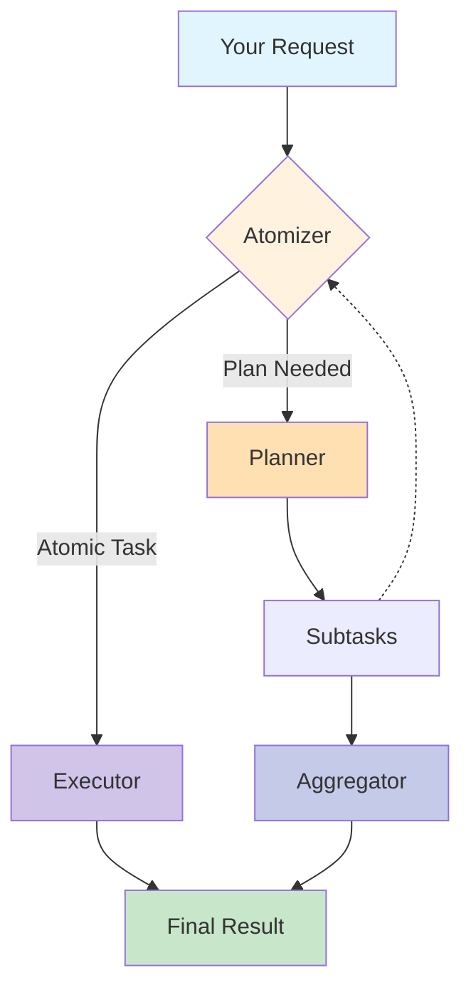

<file_map>
/Users/chen/Documents/GitHub/ROMA
├── config
│   ├── defaults
│   │   └── config.yaml *
│   ├── examples
│   │   ├── advanced
│   │   │   ├── custom_prompts.yaml *
│   │   │   └── task_aware_mapping.yaml *
│   │   ├── prompts
│   │   │   ├── aggregator_instruction.jinja *
│   │   │   ├── atomizer_instruction.jinja *
│   │   │   ├── executor_instruction.jinja *
│   │   │   ├── planner_instruction.jinja2 *
│   │   │   └── verifier_instruction.jinja
│   │   ├── basic
│   │   │   ├── minimal.yaml
│   │   │   └── multi_toolkit.yaml
│   │   ├── crypto
│   │   │   └── crypto_agent.yaml
│   │   ├── mcp
│   │   │   ├── common_servers.yaml
│   │   │   ├── http_public_server.yaml
│   │   │   ├── multi_server.yaml
│   │   │   └── stdio_local_server.yaml
│   │   └── README.md
│   ├── profiles
│   │   ├── corebench
│   │   │   └── easy.yaml
│   │   ├── swe_bench
│   │   │   ├── codex.yaml
│   │   │   ├── default.yaml
│   │   │   ├── gemini.yaml
│   │   │   └── sonnet.yaml
│   │   ├── tb2
│   │   │   ├── default.yaml
│   │   │   ├── subprocess_v2.yaml
│   │   │   ├── subprocess_v2_codex.yaml
│   │   │   └── subprocess_v2_gemini.yaml
│   │   ├── crypto_agent.yaml
│   │   ├── general.yaml
│   │   └── test.yaml
│   └── README.md *
├── prompt_optimization
│   ├── prompts
│   │   ├── seed_prompts
│   │   │   ├── aggregator_seed.py * +
│   │   │   ├── atomizer_seed.py * +
│   │   │   ├── executor_retrieve_seed.py * +
│   │   │   ├── executor_seed.py * +
│   │   │   ├── planner_seed.py * +
│   │   │   ├── __init__.py +
│   │   │   ├── executor_code_seed.py +
│   │   │   ├── executor_swebench_seed.py +
│   │   │   ├── executor_tb2_seed.py +
│   │   │   ├── executor_think_seed.py +
│   │   │   ├── executor_write_seed.py +
│   │   │   ├── planner_swebench_seed.py +
│   │   │   └── verifier_seed.py +
│   │   ├── grader_prompts
│   │   │   ├── __init__.py +
│   │   │   ├── component_grader_prompt.py +
│   │   │   └── search_grader_prompt.py +
│   │   └── __init__.py +
│   ├── experiment_cli
│   │   ├── configs
│   │   │   ├── balanced.yaml
│   │   │   ├── custom_lms.yaml
│   │   │   ├── quick_test.yaml
│   │   │   └── thorough.yaml
│   │   ├── README.md
│   │   ├── __init__.py +
│   │   └── run_experiment.py +
│   ├── metrics
│   │   ├── __init__.py +
│   │   ├── metric_with_feedback.py +
│   │   ├── number_metric.py +
│   │   └── search_metric.py +
│   ├── README.md *
│   ├── component_selectors.py * +
│   ├── config.py * +
│   ├── optimizer.py * +
│   ├── solver_setup.py * +
│   ├── __init__.py +
│   ├── dataset_loaders.py +
│   ├── example_async.py +
│   ├── judge.py +
│   └── run_optimization.py +
├── src
│   └── roma_dspy
│       ├── config
│       │   ├── schemas
│       │   │   ├── agent_mapping.py * +
│       │   │   ├── agents.py * +
│       │   │   ├── root.py * +
│       │   │   ├── toolkit.py * +
│       │   │   ├── __init__.py +
│       │   │   ├── base.py +
│       │   │   ├── logging.py +
│       │   │   ├── observability.py +
│       │   │   ├── resilience.py +
│       │   │   └── storage.py +
│       │   ├── manager.py * +
│       │   ├── __init__.py +
│       │   └── utils.py +
│       ├── core
│       │   ├── context
│       │   │   ├── manager.py * +
│       │   │   ├── models.py * +
│       │   │   ├── __init__.py +
│       │   │   └── execution_context.py +
│       │   ├── engine
│       │   │   ├── runtime.py * +
│       │   │   ├── solve.py * +
│       │   │   ├── __init__.py +
│       │   │   ├── dag.py +
│       │   │   ├── event_loop.py +
│       │   │   ├── events.py +
│       │   │   └── scheduler.py +
│       │   ├── factory
│       │   │   ├── agent_factory.py * +
│       │   │   └── __init__.py +
│       │   ├── modules
│       │   │   ├── aggregator.py * +
│       │   │   ├── atomizer.py * +
│       │   │   ├── base_module.py * +
│       │   │   ├── executor.py * +
│       │   │   ├── planner.py * +
│       │   │   ├── recursive_solver.py * +
│       │   │   ├── __init__.py +
│       │   │   └── verifier.py +
│       │   ├── registry
│       │   │   ├── agent_registry.py * +
│       │   │   └── __init__.py +
│       │   ├── signatures
│       │   │   ├── base_models
│       │   │   │   ├── subtask.py * +
│       │   │   │   └── task_node.py * +
│       │   │   ├── signatures.py * +
│       │   │   └── __init__.py +
│       │   ├── utils
│       │   │   ├── demo_loader.py * +
│       │   │   ├── instruction_loader.py * +
│       │   │   ├── __init__.py +
│       │   │   └── trace_formatter.py +
│       │   ├── artifacts
│       │   │   ├── __init__.py +
│       │   │   ├── artifact_builder.py +
│       │   │   ├── artifact_registry.py +
│       │   │   ├── filesystem_scanner.py +
│       │   │   ├── query_service.py +
│       │   │   └── text_parser.py +
│       │   ├── observability
│       │   │   ├── __init__.py +
│       │   │   ├── execution_manager.py +
│       │   │   ├── mlflow_client.py +
│       │   │   ├── mlflow_manager.py +
│       │   │   ├── span_manager.py +
│       │   │   └── tool_span_callback.py +
│       │   ├── predictors
│       │   │   ├── __init__.py +
│       │   │   └── code_act_patch.py +
│       │   ├── services
│       │   │   ├── __init__.py +
│       │   │   └── execution_data_service.py +
│       │   ├── storage
│       │   │   ├── alembic
│       │   │   │   ├── versions
│       │   │   │   │   ├── 001_initial_schema.py +
│       │   │   │   │   ├── 002_add_event_traces.py +
│       │   │   │   │   ├── 003_add_dag_snapshot_to_executions.py +
│       │   │   │   │   ├── 004_add_toolkit_metrics_tables.py +
│       │   │   │   │   ├── 005_deprecate_dag_snapshot.py +
│       │   │   │   │   ├── 006_add_experiment_name_and_fix_profile.py +
│       │   │   │   │   ├── 01f9e9f52585_rename_metadata_to_context_metadata.py +
│       │   │   │   │   └── d956340fc66c_add_missing_columns_to_traces_and_.py +
│       │   │   │   ├── README
│       │   │   │   ├── env.py +
│       │   │   │   └── script.py.mako
│       │   │   ├── __init__.py +
│       │   │   ├── file_storage.py +
│       │   │   ├── models.py +
│       │   │   └── postgres_storage.py +
│       │   └── __init__.py +
│       ├── tools
│       │   ├── base
│       │   │   ├── base.py * +
│       │   │   ├── manager.py * +
│       │   │   └── __init__.py +
│       │   ├── core
│       │   │   ├── file.py * +
│       │   │   ├── __init__.py +
│       │   │   ├── artifact_toolkit.py +
│       │   │   ├── calculator.py +
│       │   │   └── e2b.py +
│       │   ├── mcp
│       │   │   ├── toolkit.py * +
│       │   │   ├── __init__.py +
│       │   │   ├── exceptions.py
│       │   │   └── stdio_client_fixed.py +
│       │   ├── crypto
│       │   │   ├── arkham
│       │   │   │   ├── __init__.py +
│       │   │   │   ├── client.py +
│       │   │   │   ├── toolkit.py +
│       │   │   │   └── types.py +
│       │   │   ├── binance
│       │   │   │   ├── README.md
│       │   │   │   ├── __init__.py +
│       │   │   │   ├── client.py +
│       │   │   │   ├── toolkit.py +
│       │   │   │   └── types.py +
│       │   │   ├── coingecko
│       │   │   │   ├── __init__.py +
│       │   │   │   ├── client.py +
│       │   │   │   ├── toolkit.py +
│       │   │   │   └── types.py +
│       │   │   ├── coinglass
│       │   │   │   ├── __init__.py +
│       │   │   │   ├── client.py +
│       │   │   │   ├── toolkit.py +
│       │   │   │   └── types.py +
│       │   │   ├── defillama
│       │   │   │   ├── __init__.py +
│       │   │   │   ├── client.py +
│       │   │   │   ├── toolkit.py +
│       │   │   │   └── types.py +
│       │   │   └── __init__.py +
│       │   ├── metrics
│       │   │   ├── __init__.py +
│       │   │   ├── artifact_detector.py +
│       │   │   ├── decorators.py +
│       │   │   └── models.py +
│       │   ├── terminal
│       │   │   ├── __init__.py +
│       │   │   ├── subprocess_toolkit.py +
│       │   │   ├── tmux_session.py +
│       │   │   └── toolkit.py +
│       │   ├── utils
│       │   │   ├── __init__.py +
│       │   │   ├── http_client.py +
│       │   │   ├── statistics.py +
│       │   │   └── storage.py +
│       │   ├── value_objects
│       │   │   ├── crypto
│       │   │   │   ├── __init__.py +
│       │   │   │   ├── chains.py +
│       │   │   │   ├── common.py +
│       │   │   │   ├── currencies.py +
│       │   │   │   ├── intervals.py +
│       │   │   │   └── trading.py +
│       │   │   └── __init__.py +
│       │   ├── web_search
│       │   │   ├── __init__.py +
│       │   │   ├── serper.py +
│       │   │   └── toolkit.py +
│       │   └── __init__.py +
│       ├── types
│       │   ├── adapter_type.py * +
│       │   ├── agent_type.py * +
│       │   ├── node_type.py * +
│       │   ├── prediction_strategy.py * +
│       │   ├── task_status.py * +
│       │   ├── task_type.py * +
│       │   ├── __init__.py +
│       │   ├── artifact_injection.py +
│       │   ├── artifact_models.py +
│       │   ├── artifact_types.py +
│       │   ├── checkpoint_models.py +
│       │   ├── checkpoint_types.py +
│       │   ├── compensation_types.py +
│       │   ├── edge_type.py +
│       │   ├── error_types.py +
│       │   ├── execution_event_type.py +
│       │   ├── execution_status.py +
│       │   ├── media_type.py +
│       │   ├── module_result.py +
│       │   ├── resilience_models.py +
│       │   └── resilience_types.py +
│       ├── agents
│       │   ├── benchmarks
│       │   │   ├── harbor
│       │   │   │   ├── __init__.py +
│       │   │   │   ├── install-roma.sh.j2
│       │   │   │   └── roma_harbor_agent.py +
│       │   │   ├── terminal_bench_2
│       │   │   │   ├── __init__.py
│       │   │   │   ├── install-roma.sh.j2
│       │   │   │   └── roma_harbor_agent.py +
│       │   │   └── __init__.py
│       │   └── __init__.py
│       ├── api
│       │   ├── routers
│       │   │   ├── __init__.py
│       │   │   ├── checkpoints.py +
│       │   │   ├── executions.py +
│       │   │   ├── health.py +
│       │   │   ├── metrics.py +
│       │   │   └── traces.py +
│       │   ├── __init__.py +
│       │   ├── dependencies.py +
│       │   ├── execution_service.py +
│       │   ├── helpers.py +
│       │   ├── main.py +
│       │   ├── middleware.py +
│       │   └── schemas.py +
│       ├── resilience
│       │   ├── __init__.py +
│       │   ├── checkpoint_manager.py +
│       │   ├── circuit_breaker.py +
│       │   ├── decorators.py +
│       │   └── retry_policy.py +
│       ├── tui
│       │   ├── core
│       │   │   ├── __init__.py +
│       │   │   ├── client.py +
│       │   │   ├── config.py +
│       │   │   └── state.py +
│       │   ├── rendering
│       │   │   ├── __init__.py +
│       │   │   ├── dag_layout.py +
│       │   │   ├── dag_renderer.py +
│       │   │   ├── formatters.py +
│       │   │   ├── table_renderer.py +
│       │   │   └── tree_renderer.py +
│       │   ├── schemas
│       │   │   ├── export_v1_0_0.json
│       │   │   └── export_v1_1_0.json
│       │   ├── screens
│       │   │   ├── __init__.py +
│       │   │   ├── browser.py +
│       │   │   ├── browser_modal.py +
│       │   │   ├── dag_modal.py +
│       │   │   ├── main.py +
│       │   │   ├── modals.py +
│       │   │   └── welcome.py +
│       │   ├── types
│       │   │   ├── __init__.py +
│       │   │   └── export.py +
│       │   ├── utils
│       │   │   ├── __init__.py +
│       │   │   ├── checksum.py +
│       │   │   ├── clipboard.py +
│       │   │   ├── errors.py +
│       │   │   ├── export.py +
│       │   │   ├── file_loader.py +
│       │   │   ├── helpers.py +
│       │   │   ├── import_service.py +
│       │   │   ├── schema_validator.py +
│       │   │   └── sensitive_redactor.py +
│       │   ├── widgets
│       │   │   ├── __init__.py +
│       │   │   └── tree_table.py +
│       │   ├── __init__.py +
│       │   ├── app.py +
│       │   ├── models.py +
│       │   └── transformer.py +
│       ├── utils
│       │   ├── __init__.py +
│       │   ├── async_executor.py +
│       │   ├── lazy_imports.py +
│       │   └── litellm_patch.py +
│       ├── __init__.py +
│       ├── cli.py +
│       └── logging_config.py +
├── assets
│   ├── FRAMES-full.001.jpeg
│   ├── agent_customization.png
│   ├── project_overview.png
│   ├── roma_logo_simple_visible.txt
│   ├── roma_run.gif
│   ├── seal-0-full.001.jpeg
│   ├── sentient-logo-new-M.png
│   ├── sentient-logo-new.png
│   ├── sentient.svg
│   ├── sentient_logo_text_ascii.txt
│   └── simpleQAFull.001.jpeg
├── docker
│   ├── e2b
│   │   ├── build.sh
│   │   ├── build_dev.py +
│   │   ├── build_prod.py +
│   │   ├── mount_s3.sh
│   │   ├── requirements.txt
│   │   ├── start_jupyter.sh
│   │   ├── template.py +
│   │   └── validate_e2b_setup.py +
│   ├── Dockerfile.mlflow
│   └── init-mlflow-db.sql
├── docs
│   ├── CONFIGURATION.md
│   ├── DEPLOYMENT.md
│   ├── E2B_SETUP.md
│   ├── OBSERVABILITY.md
│   ├── QUICKSTART.md
│   └── TOOLKITS.md
├── notebooks
│   ├── example.ipynb
│   ├── prompt_optimization.ipynb
│   └── trial_run.ipynb
├── prompt-exports
├── tests
│   ├── fixtures
│   │   └── test_fixtures.py +
│   ├── integration
│   │   ├── test_api_endpoints.py +
│   │   ├── test_arkham_integration.py +
│   │   ├── test_cache_checkpoint_synergy.py +
│   │   ├── test_cli_commands.py +
│   │   ├── test_config_to_solver.py +
│   │   ├── test_context_integration.py +
│   │   ├── test_defillama_integration.py +
│   │   ├── test_e2b_integration.py +
│   │   ├── test_e2b_template_validation.py +
│   │   ├── test_e2e_observability.py +
│   │   ├── test_e2e_postgres_persistence.py +
│   │   ├── test_e2e_recovery.py +
│   │   ├── test_e2e_storage.py +
│   │   ├── test_e2e_toolkit_system.py +
│   │   ├── test_e2e_validation.py +
│   │   ├── test_hybrid_checkpoint.py +
│   │   ├── test_logging_integration.py +
│   │   ├── test_pip_install_workflow.py +
│   │   ├── test_postgres_storage.py +
│   │   ├── test_storage_integration.py +
│   │   ├── test_toolkit_integration.py +
│   │   └── test_toolkit_metrics_e2e.py +
│   ├── roma_dspy
│   │   └── tui
│   │       ├── __init__.py
│   │       ├── test_dag_extraction.py +
│   │       ├── test_dag_layout.py +
│   │       ├── test_dag_modal.py +
│   │       ├── test_dag_renderer.py +
│   │       ├── test_logo_assets.py +
│   │       └── test_search.py +
│   ├── tools
│   │   ├── test_binance_e2e.py +
│   │   ├── test_binance_integration.py +
│   │   └── test_coingecko_integration.py +
│   ├── unit
│   │   ├── test_agent_factory.py +
│   │   ├── test_agent_factory_instruction_loading.py +
│   │   ├── test_agent_registry.py +
│   │   ├── test_arkham_toolkit.py +
│   │   ├── test_artifact_context_injection.py +
│   │   ├── test_artifact_description_propagation.py +
│   │   ├── test_artifact_detection.py +
│   │   ├── test_artifact_injection_types.py +
│   │   ├── test_artifact_models.py +
│   │   ├── test_artifact_query_service.py +
│   │   ├── test_artifact_registry.py +
│   │   ├── test_artifact_rich_descriptions.py +
│   │   ├── test_artifact_toolkit_basic.py +
│   │   ├── test_artifact_types.py +
│   │   ├── test_artifact_xml_metadata.py +
│   │   ├── test_batch_artifact_registration.py +
│   │   ├── test_checkpoint_manager.py +
│   │   ├── test_checksum_utility.py +
│   │   ├── test_coinglass_toolkit.py +
│   │   ├── test_context_manager.py +
│   │   ├── test_context_models.py +
│   │   ├── test_context_models_artifacts.py +
│   │   ├── test_dag_serialization.py +
│   │   ├── test_data_handling_fixes.py +
│   │   ├── test_defillama_toolkit.py +
│   │   ├── test_demo_loader.py +
│   │   ├── test_e2b_toolkit.py +
│   │   ├── test_error_filter_integration.py +
│   │   ├── test_error_propagation.py +
│   │   ├── test_error_serialization.py +
│   │   ├── test_execution_service.py +
│   │   ├── test_export_import_security.py +
│   │   ├── test_export_roundtrip.py +
│   │   ├── test_extra_body.py +
│   │   ├── test_filesystem_scanner.py +
│   │   ├── test_inline_signature_parser.py +
│   │   ├── test_instruction_loader.py +
│   │   ├── test_lm_retry_config.py +
│   │   ├── test_logging_config.py +
│   │   ├── test_mcp_initialization_flag.py +
│   │   ├── test_mcp_toolkit.py +
│   │   ├── test_mcp_toolkit_critical_bugs.py +
│   │   ├── test_mcp_toolkit_high_priority_bugs.py +
│   │   ├── test_mcp_toolkit_medium_priority_bugs.py +
│   │   ├── test_mlflow_manager.py +
│   │   ├── test_parallel_execution_fixes.py +
│   │   ├── test_phase2_stability.py +
│   │   ├── test_safe_dict_cycles.py +
│   │   ├── test_schema_validator_v1_1_0.py +
│   │   ├── test_serper_toolkit.py +
│   │   ├── test_span_manager.py +
│   │   ├── test_subprocess_toolkit.py +
│   │   ├── test_table_sorting.py +
│   │   ├── test_text_parser.py +
│   │   ├── test_tool_span_callback.py +
│   │   ├── test_toolkit_cache.py +
│   │   ├── test_toolkit_metrics_decorators.py +
│   │   ├── test_toolkits.py +
│   │   ├── test_tree_table_bugs.py +
│   │   └── test_tree_table_widget.py +
│   ├── validation
│   │   └── test_integration_flow.py +
│   ├── README.md
│   ├── conftest.py +
│   ├── test_cli_integration.py +
│   ├── test_cli_minimal_install.py +
│   ├── test_config.py +
│   ├── test_engine.py +
│   ├── test_enhanced_config_validation.py +
│   ├── test_minimal_e2e_real_install.py +
│   ├── test_minimal_install.py +
│   ├── test_modules.py +
│   ├── test_package_build.py +
│   ├── test_parallel.py +
│   ├── test_sdk_usage.py +
│   └── test_toolkit_injection_bugs.py +
├── README.md *
├── Dockerfile
├── alembic.ini
├── cli
├── docker-compose.yaml
├── failed_exec
├── justfile
├── pyproject.toml
├── pytest.ini
├── setup.sh
└── tui_commands


(* denotes selected files)
(+ denotes code-map available)

File: /Users/chen/Documents/GitHub/ROMA/src/roma_dspy/types/checkpoint_types.py
Imports:
  - from datetime import datetime
  - from enum import Enum
  - from typing import Any, Dict, List, Optional, Set
  - from pathlib import Path
  - from pydantic import BaseModel, Field
---

Enums:
  - CheckpointState
  - RecoveryStrategy
  - CheckpointTrigger
---


File: /Users/chen/Documents/GitHub/ROMA/src/roma_dspy/types/artifact_injection.py
Imports:
  - from enum import Enum
---
Classes:
  - ArtifactInjectionMode
    Methods:
      - L38: def from_string(cls, value: str) -> "ArtifactInjectionMode":

Enums:
  - ArtifactInjectionMode
---


File: /Users/chen/Documents/GitHub/ROMA/src/roma_dspy/core/storage/file_storage.py
Imports:
  - import json
  - import shutil
  - import tempfile
  - from datetime import datetime
  - from pathlib import Path
  - from typing import Any, Optional, Union
  - from uuid import uuid4
  - from loguru import logger
  - from roma_dspy.config.schemas.storage import StorageConfig
  - from datetime import timedelta
---
Classes:
  - FileStorage
    Methods:
      - L80: def __init__(
        self,
        config: StorageConfig,
        execution_id: str,
    ):
      - L145: def _get_subdir_path(self, subdir: str, key: str = "") -> Path:
      - L166: def get_artifacts_path(self, key: str = "") -> Path:
      - L170: def get_temp_path(self, key: str = "") -> Path:
      - L174: def get_results_path(self, key: str = "") -> Path:
      - L178: def get_plots_path(self, key: str = "") -> Path:
      - L182: def get_reports_path(self, key: str = "") -> Path:
      - L186: def get_outputs_path(self, key: str = "") -> Path:
      - L190: def get_logs_path(self, key: str = "") -> Path:
      - L194: def get_full_path(self, key: str) -> Path:
      - L208: def normalize_key(self, key: str) -> str:
      - L226: def generate_key(self, prefix: str = "", suffix: str = "") -> str:
      - L241: async def put(
        self, key: str, data: bytes, metadata: Optional[dict[str, str]] = None
    ) -> str:
      - L289: async def get(self, key: str) -> Optional[bytes]:
      - L314: async def put_text(
        self,
        key: str,
        text: str,
        encoding: str = "utf-8",
        metadata: Optional[dict[str, str]] = None,
    ) -> str:
      - L335: async def get_text(self, key: str, encoding: str = "utf-8") -> Optional[str]:
      - L355: async def put_json(
        self, key: str, obj: Any, metadata: Optional[dict[str, str]] = None
    ) -> str:
      - L371: async def get_json(self, key: str) -> Optional[Any]:
      - L390: async def exists(self, key: str) -> bool:
      - L402: async def get_size(self, key: str) -> Optional[int]:
      - L416: async def delete(self, key: str) -> bool:
      - L439: async def list_keys(self, prefix: str = "") -> list[str]:
      - L483: async def copy_local(self, source_path: Union[str, Path], key: str) -> str:
      - L512: async def move_local(self, source_path: Union[str, Path], key: str) -> str:
      - L543: async def cleanup_temp_files(self, older_than_hours: int = 24) -> int:
      - L575: async def cleanup_execution_temp_files(self) -> int:
      - L604: async def _store_metadata(self, file_path: Path, metadata: dict[str, str]) -> None:
      - L622: async def get_storage_info(self) -> dict[str, Any]:
    Properties:
      - ARTIFACTS_SUBDIR
      - TEMP_SUBDIR
      - RESULTS_SUBDIR
      - PLOTS_SUBDIR
      - REPORTS_SUBDIR
      - OUTPUTS_SUBDIR
      - LOGS_SUBDIR
---


File: /Users/chen/Documents/GitHub/ROMA/src/roma_dspy/core/engine/dag.py
Imports:
  - from typing import Dict, List, Optional, Set, Tuple, Any
  - import networkx as nx
  - from datetime import datetime
  - from uuid import uuid4
  - from loguru import logger
  - from roma_dspy.core.signatures.base_models.task_node import TaskNode
  - from roma_dspy.types import TaskStatus, NodeType
  - from roma_dspy.types.task_status import TaskStatus
---
Classes:
  - TaskDAG
    Methods:
      - L27: def __init__(
        self,
        dag_id: Optional[str] = None,
        parent_dag: Optional["TaskDAG"] = None,
        execution_id: Optional[str] = None,
    ):
      - L54: def add_node(self, task: TaskNode, parent_id: Optional[str] = None) -> TaskNode:
      - L94: def _validate_node_addition(self, task: TaskNode, parent_id: Optional[str]) -> None:
      - L112: def _validate_dag_integrity(self) -> None:
      - L149: def add_edge(
        self, from_task_id: str, to_task_id: str, edge_type: str = "dependency"
    ) -> None:
      - L178: def add_dependencies(self, task_id: str, dependency_ids: List[str]) -> TaskNode:
      - L208: def get_node(self, task_id: str) -> TaskNode:
      - L222: def update_node(self, task: TaskNode) -> None:
      - L236: def get_ready_tasks(self, include_subgraphs: bool = False) -> List[TaskNode]:
      - L263: def iter_ready_nodes(self) -> List[Tuple[TaskNode, "TaskDAG"]]:
      - L280: def _dependencies_satisfied(self, node_id: str) -> bool:
      - L289: def get_execution_order(self) -> List[str]:
      - L301: def create_subgraph(
        self,
        parent_task_id: str,
        subtasks: List[TaskNode],
        dependencies: Optional[Dict[str, List[str]]] = None,
    ) -> "TaskDAG":
      - L380: def get_subgraph(self, subgraph_id: str) -> Optional["TaskDAG"]:
      - L392: def get_all_tasks(self, include_subgraphs: bool = True) -> List[TaskNode]:
      - L410: def get_task_dependencies(self, task_id: str) -> List[TaskNode]:
      - L425: def get_task_children(self, task_id: str) -> List[TaskNode]:
      - L440: def is_dag_complete(self) -> bool:
      - L459: def get_statistics(self) -> Dict[str, Any]:
      - L496: def export_to_dict(self) -> Dict[str, Any]:
      - L538: def from_dict(
        cls, data: Dict[str, Any], execution_id: Optional[str] = None
    ) -> "TaskDAG":
      - L602: async def pop_ready_tasks(self) -> List[TaskNode]:
      - L607: async def mark_completed(
        self, task_id: str, result: Optional[Any] = None
    ) -> TaskNode:
      - L623: async def mark_failed(self, task_id: str, error: Optional[Any] = None) -> TaskNode:
      - L632: async def check_subgraph_complete(
        self, task_id: str
    ) -> Optional[Tuple[TaskNode, "TaskDAG"]]:
      - L656: def find_dag(self, dag_id: str) -> Optional["TaskDAG"]:
      - L669: def find_node(self, task_id: str) -> Tuple[TaskNode, "TaskDAG"]:
      - L683: def get_all_tasks_dict(self) -> Dict[str, TaskNode]:
      - L697: async def reset_task_retry_counter(self, task_id: str) -> TaskNode:
      - L706: async def prepare_task_for_retry(self, task_id: str) -> TaskNode:
      - L714: async def restore_task_result(
        self, task_id: str, result: Any, status: Optional[str] = None
    ) -> TaskNode:
      - L746: def completed_tasks(self) -> List[TaskNode]:
      - L757: def failed_tasks(self) -> List[TaskNode]:
      - L771: def validate_dag(self) -> bool:
      - L785: def get_dag_health_report(self) -> Dict[str, Any]:
      - L854: def repair_dag(self) -> Dict[str, Any]:
      - L910: def get_execution_id(self) -> str:
---


File: /Users/chen/Documents/GitHub/ROMA/src/roma_dspy/types/module_result.py
Imports:
  - from datetime import datetime, timezone
  - from typing import Any, Optional, Dict, List
  - from pydantic import BaseModel, Field
  - from dataclasses import dataclass, field
---
Classes:
  - TokenMetrics
    Methods:
      - L25: def from_usage_dict(
        cls,
        usage: Dict[str, Any],
        model: Optional[str] = None,
        cost: Optional[float] = None,
    ) -> "TokenMetrics":
      - L61: def calculate_cost(
        prompt_tokens: int, completion_tokens: int, model: Optional[str] = None
    ) -> float:
      - L111: def __add__(self, other: "TokenMetrics") -> "TokenMetrics":
    Properties:
      - prompt_tokens
      - completion_tokens
      - total_tokens
      - cost
      - model
  - ModuleResult
    Properties:
      - module_name
      - input
      - output
      - timestamp
      - duration
      - error
      - metadata
      - token_metrics
      - messages
  - Config
    Properties:
      - arbitrary_types_allowed
  - StateTransition
    Properties:
      - from_state
      - to_state
      - timestamp
      - reason
      - metadata
  - NodeMetrics
    Methods:
      - L192: def calculate_total_duration(self) -> float:
    Properties:
      - atomizer_duration
      - planner_duration
      - executor_duration
      - aggregator_duration
      - total_duration
      - retry_count
      - max_retries
      - subtasks_created
      - max_depth_reached
  - ExecutionEvent
    Properties:
      - node_id
      - module_name
      - event_type
      - timestamp
      - duration
      - metadata
  - Config
    Properties:
      - arbitrary_types_allowed
---


File: /Users/chen/Documents/GitHub/ROMA/src/roma_dspy/types/checkpoint_models.py
Imports:
  - from datetime import datetime, timezone
  - from typing import Any, Dict, List, Optional, Set
  - from pathlib import Path
  - from pydantic import BaseModel, Field
  - from roma_dspy.types.checkpoint_types import (
    CheckpointState,
    RecoveryStrategy,
    CheckpointTrigger,
)
---
Classes:
  - CacheStatistics
    Properties:
      - total_calls
      - cache_hits
      - cache_misses
      - hit_rate
      - time_saved_ms
      - cost_saved_usd
  - TaskSnapshot
    Properties:
      - task_id
      - goal
      - status
      - task_type
      - depth
      - retry_count
      - max_retries
      - result
      - error
      - subgraph_id
      - dependencies
      - metadata
  - DAGSnapshot
    Properties:
      - dag_id
      - tasks
      - completed_tasks
      - failed_tasks
      - dependencies
      - subgraphs
      - statistics
  - CheckpointData
    Properties:
      - checkpoint_id
      - execution_id
      - created_at
      - trigger
      - state
      - root_dag
      - current_depth
      - max_depth
      - recovery_strategy
      - failed_task_ids
      - preserved_results
      - solver_config
      - module_states
      - cache_stats
      - tool_invocations
      - file_path
  - Config
    Properties:
      - json_encoders
  - RecoveryPlan
    Properties:
      - checkpoint_id
      - strategy
      - tasks_to_retry
      - tasks_to_preserve
      - restore_dag_state
      - restore_module_states
      - reset_retry_counts
      - apply_backoff
      - metadata
  - CheckpointConfig
    Properties:
      - enabled
      - storage_path
      - auto_checkpoint_triggers
      - max_checkpoints
      - max_age_hours
      - cleanup_interval_minutes
      - default_recovery_strategy
      - preserve_partial_results
      - compress_checkpoints
      - verify_integrity
      - periodic_checkpoints_enabled
      - periodic_interval_seconds
      - min_execution_time_for_periodic
---


File: /Users/chen/Documents/GitHub/ROMA/prompt_optimization/metrics/metric_with_feedback.py
Imports:
  - import inspect
  - from typing import Any, Optional, Union
  - import dspy
  - from prompt_optimization.judge import ComponentJudge
---
Classes:
  - MetricWithFeedback
    Methods:
      - L15: def __init__(
        self,
        judge: ComponentJudge,
        scoring_metric: Optional[Any] = None,
    ) -> None:
      - L24: def forward(
        self,
        example: Any,
        prediction: Any,
        trace: Any = None,
        pred_name: Optional[str] = None,
        pred_trace: Optional[dict] = None,
    ) -> Union[int, dspy.Prediction]:
      - L54: async def aforward(
        self,
        example: Any,
        prediction: Any,
        trace: Any = None,
        pred_name: Optional[str] = None,
        pred_trace: Optional[dict] = None,
    ) -> Union[int, dspy.Prediction]:
---

</file_map>
<file_contents>
File: /Users/chen/Documents/GitHub/ROMA/config/defaults/config.yaml
```yaml
# Optional base configuration for ROMA-DSPy
# This file overrides Pydantic defaults where needed

project: roma-dspy
version: "0.1.0"
environment: ${oc.env:ROMA_ENV,development}

# Override agent defaults where needed
agents:
  # Use Gemini 2.5 Flash for fast agents (atomizer, planner, aggregator, verifier)
  atomizer:
    llm:
      model: google/gemini-2.5-flash
      base_url: https://openrouter.ai/api/v1
      temperature: 0.1

  planner:
    llm:
      model: google/gemini-2.5-flash
      base_url: https://openrouter.ai/api/v1
      temperature: 0.3
    agent_config:
      max_subtasks: 15  # Override default 10

  # Use Claude Sonnet 4.5 for executor (most complex reasoning)
  executor:
    llm:
      model: anthropic/claude-sonnet-4.5
      base_url: https://openrouter.ai/api/v1
      temperature: 0.7
      max_tokens: 4000

  aggregator:
    llm:
      model: google/gemini-2.5-flash
      base_url: https://openrouter.ai/api/v1
      temperature: 0.3

  verifier:
    llm:
      model: google/gemini-2.5-flash
      base_url: https://openrouter.ai/api/v1
      temperature: 0.1

# Runtime configuration overrides
runtime:
  timeout: ${oc.env:ROMA_RUNTIME_TIMEOUT,900}  # 15 minutes - must be >= max agent LLM timeout (600s)
  verbose: ${oc.env:ROMA_VERBOSE,false}
  max_depth: ${oc.env:ROMA_MAX_DEPTH,5}
  enable_logging: ${oc.env:ROMA_ENABLE_LOGGING,false}
  log_level: ${oc.env:ROMA_LOG_LEVEL,INFO}

  # Cache configuration
  cache:
    enabled: ${oc.env:ROMA_CACHE_ENABLED,true}
    enable_disk_cache: ${oc.env:ROMA_CACHE_DISK,true}
    enable_memory_cache: ${oc.env:ROMA_CACHE_MEMORY,true}
    disk_cache_dir: ${oc.env:DSPY_CACHE_DIR,.cache/dspy}
    disk_size_limit_bytes: 30000000000  # 30GB
    memory_max_entries: 1000000

# Resilience configuration overrides
resilience:
  retry_strategy: ${oc.env:ROMA_RETRY_STRATEGY,exponential_backoff}
  max_retries: ${oc.env:ROMA_MAX_RETRIES,3}

  # Checkpoint configuration
  checkpoint:
    enabled: ${oc.env:ROMA_CHECKPOINT_ENABLED,true}
    storage_path: ${oc.env:ROMA_CHECKPOINT_PATH,.checkpoints}
    max_checkpoints: ${oc.env:ROMA_MAX_CHECKPOINTS,10}
    max_age_hours: ${oc.env:ROMA_CHECKPOINT_MAX_AGE_HOURS,24.0}
    compress_checkpoints: ${oc.env:ROMA_CHECKPOINT_COMPRESS,true}
    verify_integrity: ${oc.env:ROMA_CHECKPOINT_VERIFY,true}

# Storage configuration
storage:
  base_path: ${oc.env:STORAGE_BASE_PATH,.tmp/sentient}
  max_file_size: 104857600  # 100MB
  buffer_size: 1048576      # 1MB

  # PostgreSQL persistence
  postgres:
    enabled: ${oc.env:POSTGRES_ENABLED,false}
    connection_url: ${oc.env:DATABASE_URL,postgresql+asyncpg://localhost/roma_dspy}
    pool_size: ${oc.env:POSTGRES_POOL_SIZE,5}
    max_overflow: ${oc.env:POSTGRES_MAX_OVERFLOW,10}
    pool_timeout: ${oc.env:POSTGRES_POOL_TIMEOUT,30.0}
    echo_sql: ${oc.env:SQL_ECHO,false}

# Observability configuration
observability:
  mlflow:
    enabled: ${oc.env:MLFLOW_ENABLED,false}
    tracking_uri: ${oc.env:MLFLOW_TRACKING_URI,http://127.0.0.1:5000}
    experiment_name: ${oc.env:MLFLOW_EXPERIMENT,ROMA-DSPy}
    log_traces: true
    log_traces_from_compile: false  # Disabled by default (expensive)
    log_compiles: true
    log_evals: true

  # Toolkit metrics and traceability
  toolkit_metrics:
    enabled: ${oc.env:TOOLKIT_METRICS_ENABLED,true}
    track_lifecycle: ${oc.env:TOOLKIT_TRACK_LIFECYCLE,true}
    track_invocations: ${oc.env:TOOLKIT_TRACK_INVOCATIONS,true}
    sample_rate: ${oc.env:TOOLKIT_SAMPLE_RATE,1.0}  # 1.0 = 100% sampling
    persist_to_db: ${oc.env:TOOLKIT_PERSIST_DB,true}
    persist_to_mlflow: ${oc.env:TOOLKIT_PERSIST_MLFLOW,false}
    batch_size: ${oc.env:TOOLKIT_BATCH_SIZE,100}
    async_persist: ${oc.env:TOOLKIT_ASYNC_PERSIST,true}

  # Event traces for execution flow tracking
  event_traces:
    enabled: ${oc.env:EVENT_TRACES_ENABLED,true}
    track_execution_events: ${oc.env:EVENT_TRACK_EXECUTION,true}
    track_module_events: ${oc.env:EVENT_TRACK_MODULES,true}
    track_task_lifecycle: ${oc.env:EVENT_TRACK_LIFECYCLE,true}
    track_failures: ${oc.env:EVENT_TRACK_FAILURES,true}
    sample_rate: ${oc.env:EVENT_SAMPLE_RATE,1.0}  # 1.0 = 100% sampling
    persist_to_db: ${oc.env:EVENT_PERSIST_DB,true}
    persist_to_mlflow: ${oc.env:EVENT_PERSIST_MLFLOW,false}
    batch_size: ${oc.env:EVENT_BATCH_SIZE,50}
    async_persist: ${oc.env:EVENT_ASYNC_PERSIST,true}
    include_task_details: ${oc.env:EVENT_INCLUDE_DETAILS,true}
    include_timing: ${oc.env:EVENT_INCLUDE_TIMING,true}
    max_goal_length: ${oc.env:EVENT_MAX_GOAL_LENGTH,200}

# Logging configuration (loguru)
logging:
  level: ${oc.env:LOG_LEVEL,INFO}
  log_dir: ${oc.env:LOG_DIR,null}  # null = console only, set to enable file logging
  console_format: ${oc.env:LOG_CONSOLE_FORMAT,default}  # default, minimal, detailed
  file_format: ${oc.env:LOG_FILE_FORMAT,detailed}  # default, detailed, json
  colorize: ${oc.env:LOG_COLORIZE,true}
  serialize: ${oc.env:LOG_SERIALIZE,false}  # JSON serialization
  rotation: ${oc.env:LOG_ROTATION,100 MB}  # Size-based rotation
  retention: ${oc.env:LOG_RETENTION,30 days}  # Keep logs for 30 days
  compression: ${oc.env:LOG_COMPRESSION,zip}  # Compress rotated logs
  intercept_standard_logging: ${oc.env:LOG_INTERCEPT_STDLIB,true}  # Capture third-party logs
  backtrace: ${oc.env:LOG_BACKTRACE,true}  # Full traceback on errors
  diagnose: ${oc.env:LOG_DIAGNOSE,false}  # Show variable values (disable in prod)
  enqueue: ${oc.env:LOG_ENQUEUE,true}  # Thread-safe logging
```

File: /Users/chen/Documents/GitHub/ROMA/config/README.md
```md
# ROMA-DSPy Configuration System

This directory contains the YAML-based configuration system for ROMA-DSPy, built with OmegaConf for configuration operations and Pydantic for validation.

## Quick Start

```python
from roma_dspy.config import load_config

# Load with defaults
config = load_config()

# Load with profile
config = load_config(profile="lightweight")

# Load with overrides
config = load_config(overrides=["agents.executor.llm.temperature=0.5"])
```

## Configuration Structure

### Base Configuration (`defaults/config.yaml`)
Default settings that override Pydantic defaults:
- Project metadata
- Agent configuration overrides
- Runtime settings
- Resilience parameters

### Profiles (`profiles/*.yaml`)
Delta configurations that overlay specific use cases:
- **lightweight.yaml**: Reduced resource usage, lower token limits
- **tool_enabled.yaml**: Prepared for future tool implementation

## Configuration Schema

### LLM Configuration
```yaml
agents:
  executor:
    llm:
      model: "gpt-4o-mini"
      temperature: 0.7
      max_tokens: 2000
      timeout: 30
      api_key: ${oc.env:OPENAI_API_KEY}  # Environment variable
```

### Agent Configuration
```yaml
agents:
  executor:
    prediction_strategy: "chain_of_thought"
    tools: []
    enabled: true
    agent_config:          # Agent business logic parameters
      max_subtasks: 10
    strategy_config: {}    # Prediction strategy algorithm parameters
```

### Runtime Configuration
```yaml
runtime:
  max_concurrency: 5
  timeout: 30
  verbose: ${oc.env:ROMA_VERBOSE,false}
  cache_dir: ".cache/dspy"
```

### Resilience Configuration
```yaml
resilience:
  max_retries: 3
  retry_delay: 1.0
  circuit_breaker_threshold: 5
  circuit_breaker_timeout: 60
```

## Configuration Resolution Order

Later sources override earlier ones:
1. **Pydantic defaults** (in schema classes)
2. **Base YAML** (`defaults/config.yaml`)
3. **Profile YAML** (`profiles/{profile}.yaml`)
4. **Override strings** (`["key=value"]`)
5. **Environment variables** (`ROMA_*`)

## Environment Variables

### Naming Convention
- Prefix: `ROMA_`
- Nested keys: double underscore `__`
- Example: `ROMA_AGENTS__EXECUTOR__LLM__TEMPERATURE=0.5`

### Common Variables
```bash
# API Keys
export OPENAI_API_KEY="your-key"
export FIREWORKS_API_KEY="your-key"

# Runtime settings
export ROMA_VERBOSE=true
export ROMA_MAX_RETRIES=5
export ROMA_CACHE_DIR="/custom/cache"

# Agent settings
export ROMA_AGENTS__EXECUTOR__LLM__TEMPERATURE=0.3
```

## Profile Usage

### Creating Custom Profiles
Create `profiles/my_profile.yaml`:
```yaml
# My custom profile
agents:
  executor:
    llm:
      temperature: 0.1
    agent_config:
      max_iterations: 20

runtime:
  max_concurrency: 10
```

### Using Profiles
```python
config = load_config(profile="my_profile")
```

## Advanced Features

### OmegaConf Interpolation
```yaml
# Variable interpolation
base_timeout: 30
runtime:
  timeout: ${base_timeout}

# Environment variable with default
cache_dir: ${oc.env:ROMA_CACHE_DIR,.cache/dspy}
```

### Configuration Caching
The ConfigManager automatically caches loaded configurations for performance:
```python
manager = ConfigManager()
config1 = manager.load_config()  # Loads from file
config2 = manager.load_config()  # Uses cache
manager.clear_cache()            # Clears cache
```

### Validation

The system provides two-stage validation:
1. **OmegaConf**: YAML structure and type checking
2. **Pydantic**: Business logic validation

Example validations:
- Temperature must be between 0.0 and 2.0
- max_tokens must be between 1 and 100,000
- Tool-strategy compatibility checking
- Timeout consistency validation

## Module Integration

### BaseModule Integration
```python
from roma_dspy.config import load_config
from roma_dspy.core.modules import Executor

# Load configuration
config = load_config(profile="lightweight")

# Create module with config
executor = Executor(
    signature=MySignature,
    config=config.agents.executor
)
```

### RecursiveSolver Integration
```python
from roma_dspy.core.engine.solve import RecursiveSolver

# Create solver with config
solver = RecursiveSolver(config=config)
result = solver.solve("Complex task")
```

## Configuration Files

- `defaults/config.yaml` - Base configuration overrides
- `profiles/lightweight.yaml` - Minimal resource usage
- `profiles/tool_enabled.yaml` - Tool-ready configuration

## Best Practices

1. **Use profiles** for different deployment environments
2. **Environment variables** for secrets and environment-specific settings
3. **Override strings** for quick testing and experimentation
4. **Base config** for organization-wide defaults
5. **Separate agent_config and strategy_config** for proper parameter isolation

## Troubleshooting

### Common Issues
- **OmegaConf type errors**: Check YAML syntax and avoid Pydantic Field objects
- **Validation errors**: Review Pydantic validators and constraints
- **Missing profiles**: Ensure profile files exist in `profiles/` directory
- **Environment variables**: Use correct naming convention with `ROMA_` prefix

### Debugging
```python
# Enable verbose logging
config = load_config(overrides=["runtime.verbose=true"])

# Check resolved configuration
print(OmegaConf.to_yaml(config))

# Validate specific sections
from roma_dspy.config.schemas import LLMConfig
llm_config = LLMConfig(**config.agents.executor.llm)
```
```

File: /Users/chen/Documents/GitHub/ROMA/prompt_optimization/optimizer.py
```py
"""GEPA optimizer factory for prompt optimization."""

from typing import Optional

import dspy
from dspy import GEPA
from prompt_optimization.config import OptimizationConfig
from prompt_optimization.metrics import MetricWithFeedback
from prompt_optimization.component_selectors import SELECTORS


def create_optimizer(
    config: OptimizationConfig,
    metric: MetricWithFeedback,
    component_selector: Optional[str] = None,
    run_name: Optional[str] = None
) -> GEPA:
    """
    Create configured GEPA optimizer with MLflow support.

    Args:
        config: Optimization configuration
        metric: Metric function (typically MetricWithFeedback)
        component_selector: Override selector from config (optional)

    Returns:
        Configured GEPA optimizer

    Example:
        >>> config = get_default_config()
        >>> judge = ComponentJudge(config.judge_lm)
        >>> metric = MetricWithFeedback(judge)
        >>> optimizer = create_optimizer(config, metric)
    """

    # Initialize reflection LM
    reflection_lm = dspy.LM(
        model=config.reflection_lm.model,
        temperature=config.reflection_lm.temperature,
        max_tokens=config.reflection_lm.max_tokens,
        cache=config.reflection_lm.cache
    )

    # Get selector function
    selector = component_selector or config.component_selector
    selector_fn = SELECTORS.get(selector, SELECTORS["round_robin"])

    # Prepare W&B init kwargs if enabled
    wandb_init_kwargs = None
    if config.use_wandb:
        wandb_init_kwargs = {
            "project": config.wandb_project or "roma-optimization",
            "tags": config.wandb_tags or [],
        }
        if run_name:
            wandb_init_kwargs["name"] = run_name  # Use same run name format as MLflow
        if config.wandb_entity:
            wandb_init_kwargs["entity"] = config.wandb_entity
        if config.wandb_notes:
            wandb_init_kwargs["notes"] = config.wandb_notes

    # Create GEPA optimizer with observability features (MLflow + W&B)
    return GEPA(
        metric=metric,
        component_selector=selector_fn,
        max_metric_calls=config.max_metric_calls,
        num_threads=config.num_threads,
        track_stats=config.track_stats,
        track_best_outputs=config.track_best_outputs,
        log_dir=config.log_dir,
        use_mlflow=config.use_mlflow,
        reflection_minibatch_size=config.reflection_minibatch_size,
        reflection_lm=reflection_lm,
        # W&B observability
        use_wandb=config.use_wandb,
        wandb_api_key=config.wandb_api_key,
        wandb_init_kwargs=wandb_init_kwargs,
    )

```

File: /Users/chen/Documents/GitHub/ROMA/src/roma_dspy/core/engine/solve.py
```py
"""
Recursive solver for hierarchical task decomposition with depth constraints.
"""

import asyncio
import threading
import warnings
from datetime import datetime, UTC
from typing import Callable, Optional, Union, Tuple, Dict, List, TYPE_CHECKING

import dspy
from loguru import logger

from roma_dspy.core.engine import TaskDAG
from roma_dspy.core.engine.event_loop import EventLoopController
from roma_dspy.core.engine.runtime import ModuleRuntime
from roma_dspy.core.registry import AgentRegistry
from roma_dspy.core.factory.agent_factory import AgentFactory
from roma_dspy.core.signatures import TaskNode
from roma_dspy.core.storage import FileStorage
from roma_dspy.core.context import ContextManager, ExecutionContext
from roma_dspy.types import TaskStatus, AgentType, ExecutionEventType
from roma_dspy.types.checkpoint_types import CheckpointTrigger
from roma_dspy.types.checkpoint_models import CheckpointConfig
from roma_dspy.resilience.checkpoint_manager import CheckpointManager
from roma_dspy.config.schemas.root import ROMAConfig
from roma_dspy.core.observability import ObservabilityManager
from roma_dspy.tools.base.manager import ToolkitManager
from roma_dspy.utils.lazy_imports import HAS_PERSISTENCE, HAS_MLFLOW

if TYPE_CHECKING:
    pass

# Suppress DSPy warnings about forward() usage
warnings.filterwarnings("ignore", message="Calling module.forward.*is discouraged")


class RecursiveSolver:
    """
    Implements recursive hierarchical task decomposition algorithm.

    Key features:
    - Maximum recursion depth constraint with forced execution
    - Comprehensive execution tracking for all modules
    - State-based execution flow
    - Nested DAG management for hierarchical decomposition
    - Async and sync execution support
    - Integrated visualization support
    """

    def __init__(
        self,
        config: Optional["ROMAConfig"] = None,
        registry: Optional[AgentRegistry] = None,
        max_depth: Optional[int] = None,
        enable_logging: bool = False,
        enable_checkpoints: bool = True,
        checkpoint_config: Optional[CheckpointConfig] = None,
    ):
        """
        Initialize the recursive solver.

        Args:
            config: ROMAConfig instance with complete configuration
            registry: Pre-configured AgentRegistry (overrides config)
            max_depth: Maximum recursion depth (overrides config)
            enable_logging: Whether to enable debug logging
            enable_checkpoints: Whether to enable checkpointing
            checkpoint_config: Checkpoint configuration (overrides config)
        """
        # Store config for later use (needed for FileStorage creation)
        self.config = config

        # Initialize registry from config or use provided
        if registry is not None:
            self.registry = registry
            self.max_depth = max_depth or 2
        elif config is not None:
            factory = AgentFactory()
            self.registry = AgentRegistry()
            self.registry.initialize_from_config(config, factory)
            self.max_depth = max_depth or config.runtime.max_depth
        else:
            raise ValueError("Either 'config' or 'registry' must be provided")

        # Initialize Postgres storage if enabled and available
        self.postgres_storage = None
        if (
            config
            and config.storage
            and config.storage.postgres
            and config.storage.postgres.enabled
        ):
            if HAS_PERSISTENCE:
                from roma_dspy.core.storage import PostgresStorage

                self.postgres_storage = PostgresStorage(config.storage.postgres)
                logger.info("PostgreSQL persistence enabled")
            else:
                logger.warning(
                    "PostgreSQL persistence requested but dependencies not installed. "
                    "Install with: uv pip install roma-dspy[persistence]"
                )

        # Initialize checkpoint system
        self.checkpoint_enabled = enable_checkpoints
        checkpoint_cfg = checkpoint_config or (
            config.resilience.checkpoint if config else CheckpointConfig()
        )
        self.checkpoint_manager = (
            CheckpointManager(checkpoint_cfg, postgres_storage=self.postgres_storage)
            if enable_checkpoints
            else None
        )

        # Initialize MLflow tracing if enabled and available
        self.mlflow_manager = None
        if (
            config
            and config.observability
            and config.observability.mlflow
            and config.observability.mlflow.enabled
        ):
            if HAS_MLFLOW:
                from roma_dspy.core.observability import MLflowManager

                self.mlflow_manager = MLflowManager(config.observability.mlflow)
                self.mlflow_manager.initialize()
                logger.info("MLflow observability enabled")
            else:
                logger.warning(
                    "MLflow observability requested but dependencies not installed. "
                    "Install with: uv pip install roma-dspy[observability]"
                )

        # Initialize runtime with registry and config
        self.runtime = ModuleRuntime(registry=self.registry, config=config)

        # Initialize observability manager
        from roma_dspy.core.observability import ObservabilityManager

        self.observability = ObservabilityManager(
            postgres_storage=self.postgres_storage,
            mlflow_manager=self.mlflow_manager,
            runtime=self.runtime,
        )

        # Initialize toolkit manager
        self.toolkit_manager = ToolkitManager.get_instance()

        # Configure logging (managed by loguru now)
        # enable_logging controls whether debug logs are shown
        self.enable_logging = enable_logging

        # Note: Loguru configuration is handled in logging_config.py
        # The enable_logging flag is used for checkpoint metadata

        # Configure DSPy cache system
        if config and config.runtime.cache.enabled:
            self._configure_dspy_cache(config.runtime.cache)
        elif not config:
            # Registry mode: use default cache config
            from roma_dspy.config.schemas.base import CacheConfig

            self._configure_dspy_cache(CacheConfig())

        # Thread-safe storage for last_dag (fixes GEPA parallel execution race condition)
        self._local = threading.local()

    @property
    def last_dag(self) -> Optional[TaskDAG]:
        """Get last DAG for current thread (thread-safe)."""
        return getattr(self._local, "last_dag", None)

    @last_dag.setter
    def last_dag(self, value: Optional[TaskDAG]) -> None:
        """Set last DAG for current thread (thread-safe)."""
        self._local.last_dag = value

    def get_total_input_tokens(self) -> int:
        """
        Get total input tokens (prompt tokens) from last execution.

        Aggregates token usage from all task execution histories in the last DAG.
        Returns 0 if no execution has been performed yet.

        Returns:
            Total prompt tokens used across all modules

        Example:
            result = await solver.async_solve("Analyze this data")
            input_tokens = solver.get_total_input_tokens()
            output_tokens = solver.get_total_output_tokens()
            print(f"Used {input_tokens} input + {output_tokens} output tokens")
        """
        total = 0
        if self.last_dag:
            for task in self.last_dag.get_all_tasks(include_subgraphs=True):
                if task.execution_history:
                    for module_result in task.execution_history.values():
                        if module_result.token_metrics:
                            total += module_result.token_metrics.prompt_tokens
        return total

    def get_total_output_tokens(self) -> int:
        """
        Get total output tokens (completion tokens) from last execution.

        Aggregates token usage from all task execution histories in the last DAG.
        Returns 0 if no execution has been performed yet.

        Returns:
            Total completion tokens used across all modules

        Example:
            result = await solver.async_solve("Analyze this data")
            input_tokens = solver.get_total_input_tokens()
            output_tokens = solver.get_total_output_tokens()
            print(f"Used {input_tokens} input + {output_tokens} output tokens")
        """
        total = 0
        if self.last_dag:
            for task in self.last_dag.get_all_tasks(include_subgraphs=True):
                if task.execution_history:
                    for module_result in task.execution_history.values():
                        if module_result.token_metrics:
                            total += module_result.token_metrics.completion_tokens
        return total

    def __getstate__(self):
        """
        Custom pickle serialization to handle unpicklable objects.

        GEPA (and other DSPy optimizers) use multiprocessing which requires
        pickling the solver. We exclude unpicklable objects like threading.local,
        database connections, locks, and singleton managers.

        The config and registry are preserved since they're needed to recreate
        the solver in the new process.
        """
        state = self.__dict__.copy()

        # Remove ALL unpicklable objects
        state.pop("_local", None)  # threading.local
        state.pop("postgres_storage", None)  # Has _ThreadLocalState
        state.pop("checkpoint_manager", None)  # Has _ThreadLocalState
        state.pop("mlflow_manager", None)  # Has module object
        state.pop("observability", None)  # Has _ThreadLocalState
        state.pop("runtime", None)  # Has _thread.lock
        state.pop("toolkit_manager", None)  # Has _thread.lock
        state.pop("registry", None)  # Has _thread.lock

        return state

    def __setstate__(self, state):
        """
        Custom pickle deserialization to restore unpicklable objects.

        After unpickling, we recreate the excluded objects. Since GEPA runs
        in separate processes, each process will have its own instances of
        these objects. This matches the initialization logic in __init__.
        """
        self.__dict__.update(state)

        # Recreate threading.local
        self._local = threading.local()

        # Recreate registry from config
        self.registry = AgentRegistry()
        if self.config:
            factory = AgentFactory()
            self.registry.initialize_from_config(self.config, factory)

        # Recreate PostgresStorage if it was enabled and available
        if (
            self.config
            and self.config.storage
            and self.config.storage.postgres
            and self.config.storage.postgres.enabled
        ):
            if HAS_PERSISTENCE:
                from roma_dspy.core.storage import PostgresStorage

                self.postgres_storage = PostgresStorage(self.config.storage.postgres)
            else:
                logger.warning("PostgreSQL not available - persistence disabled")
                self.postgres_storage = None
        else:
            self.postgres_storage = None

        # Recreate checkpoint system
        checkpoint_cfg = (
            self.config.resilience.checkpoint if self.config else CheckpointConfig()
        )
        self.checkpoint_manager = (
            CheckpointManager(checkpoint_cfg, postgres_storage=self.postgres_storage)
            if self.checkpoint_enabled
            else None
        )

        # Recreate MLflow tracing if enabled and available
        if (
            self.config
            and self.config.observability
            and self.config.observability.mlflow
            and self.config.observability.mlflow.enabled
        ):
            if HAS_MLFLOW:
                from roma_dspy.core.observability import MLflowManager

                self.mlflow_manager = MLflowManager(self.config.observability.mlflow)
                self.mlflow_manager.initialize()
            else:
                logger.warning("MLflow not available - observability disabled")
                self.mlflow_manager = None
        else:
            self.mlflow_manager = None

        # Recreate runtime with registry and config
        self.runtime = ModuleRuntime(registry=self.registry, config=self.config)

        # Recreate observability manager
        self.observability = ObservabilityManager(
            postgres_storage=self.postgres_storage,
            mlflow_manager=self.mlflow_manager,
            runtime=self.runtime,
        )

        # Recreate ToolkitManager (singleton pattern will return same instance in this process)
        self.toolkit_manager = ToolkitManager.get_instance()

    def _configure_dspy_cache(self, cache_config: "CacheConfig") -> None:
        """
        Configure DSPy cache system from ROMA config.

        Args:
            cache_config: CacheConfig instance with cache settings
        """
        import os

        # Expand cache directory (handle ~, env vars)
        cache_dir = os.path.expanduser(cache_config.disk_cache_dir)

        # Ensure directory exists
        os.makedirs(cache_dir, exist_ok=True)

        try:
            dspy.configure_cache(
                enable_disk_cache=cache_config.enable_disk_cache,
                enable_memory_cache=cache_config.enable_memory_cache,
                disk_cache_dir=cache_dir,
                disk_size_limit_bytes=cache_config.disk_size_limit_bytes,
                memory_max_entries=cache_config.memory_max_entries,
            )
            logger.info(
                f"DSPy cache configured: disk={cache_config.enable_disk_cache}, "
                f"memory={cache_config.enable_memory_cache}, dir={cache_dir}"
            )
        except Exception as e:
            logger.warning(f"Failed to configure DSPy cache: {e}")
            # Non-fatal: cache will use defaults

    def _emit_execution_event(
        self,
        event_type: Union[str, ExecutionEventType],
        task_id: Optional[str] = None,
        dag_id: Optional[str] = None,
        event_data: Optional[Dict] = None,
    ) -> None:
        """
        Emit an execution event if event traces are enabled.

        This method checks EventTracesConfig settings before emitting events.
        Events are buffered in ExecutionContext and persisted at execution end.

        Args:
            event_type: Event type (ExecutionEventType enum or string)
            task_id: Optional task identifier
            dag_id: Optional DAG/execution identifier
            event_data: Optional event payload
        """
        # Check if event traces are enabled
        if (
            not self.config
            or not self.config.observability
            or not self.config.observability.event_traces
        ):
            return

        event_config = self.config.observability.event_traces

        if not event_config.enabled:
            return

        # Convert enum to string for filtering
        event_type_str = (
            event_type.value
            if isinstance(event_type, ExecutionEventType)
            else event_type
        )

        # Apply event type filtering
        if (
            event_type_str
            in (
                ExecutionEventType.EXECUTION_START.value,
                ExecutionEventType.EXECUTION_COMPLETE.value,
            )
            and not event_config.track_execution_events
        ):
            return
        if (
            event_type_str
            in (
                ExecutionEventType.ATOMIZE_COMPLETE.value,
                ExecutionEventType.PLAN_COMPLETE.value,
                ExecutionEventType.EXECUTE_COMPLETE.value,
                ExecutionEventType.AGGREGATE_COMPLETE.value,
            )
            and not event_config.track_module_events
        ):
            return
        if (
            event_type_str == ExecutionEventType.EXECUTION_FAILED.value
            and not event_config.track_failures
        ):
            return

        # Apply sampling
        import random

        if (
            event_config.sample_rate < 1.0
            and random.random() > event_config.sample_rate
        ):
            return

        # Get execution context
        ctx = ExecutionContext.get()
        if not ctx:
            return

        # Emit event to context buffer
        ctx.emit_execution_event(
            event_type=event_type_str,
            task_id=task_id,
            dag_id=dag_id,
            event_data=event_data or {},
            priority=0,
        )

    # ==================== Main Entry Points ====================

    def solve(
        self, task: Union[str, TaskNode], dag: Optional[TaskDAG] = None, depth: int = 0
    ) -> TaskNode:
        """
        Synchronously solve a task using recursive decomposition.

        This is a thin synchronous wrapper around async_solve().
        If you're already in an async context, use async_solve() directly.

        Args:
            task: Task goal string or TaskNode
            dag: Optional DAG to track execution
            depth: Current recursion depth

        Returns:
            Completed TaskNode with results
        """
        return asyncio.run(self.async_solve(task, dag, depth))

    async def async_solve(
        self, task: Union[str, TaskNode], dag: Optional[TaskDAG] = None, depth: int = 0
    ) -> TaskNode:
        """
        Asynchronously solve a task using recursive decomposition.

        Args:
            task: Task goal string or TaskNode
            dag: Optional DAG to track execution
            depth: Current recursion depth

        Returns:
            Completed TaskNode with results
        """
        logger.debug(
            f"Starting async_solve for task: {task if isinstance(task, str) else task.goal}"
        )

        # Initialize task and DAG
        task, dag = self._initialize_task_and_dag(task, dag, depth)

        # Setup observability using ObservabilityManager
        await self.observability.setup_execution(
            task, dag, self.config, depth, execution_mode="recursive"
        )

        # Setup toolkits using ToolkitManager
        await self.toolkit_manager.setup_for_execution(dag, self.config, self.registry)

        try:
            # Wrap execution with MLflow tracing
            if self.mlflow_manager and self.mlflow_manager.config.enabled:
                with self.mlflow_manager.trace_execution(
                    execution_id=dag.execution_id,
                    metadata={
                        "max_depth": self.max_depth,
                        "initial_goal": str(task.goal)
                        if isinstance(task, TaskNode)
                        else str(task),
                        "depth": depth,
                    },
                ):
                    result = await self._async_solve_internal(task, dag, depth)

                    # Log final metrics
                    self.mlflow_manager.log_metrics(
                        {
                            "total_tasks": len(dag.get_all_tasks()) if dag else 1,
                            "max_depth_reached": result.depth,
                            "success": 1.0
                            if result.status == TaskStatus.COMPLETED
                            else 0.0,
                        }
                    )

                    # Create final checkpoint before finalization (ensures visualization of completed runs)
                    if self.checkpoint_manager:
                        try:
                            await self.checkpoint_manager.create_checkpoint(
                                checkpoint_id=None,
                                dag=dag,
                                trigger=CheckpointTrigger.EXECUTION_COMPLETE,
                                current_depth=result.depth,
                                max_depth=self.max_depth,
                            )
                            logger.debug("Created final EXECUTION_COMPLETE checkpoint")
                        except Exception as e:
                            logger.warning(f"Failed to create final checkpoint: {e}")

                    # Finalize execution using ObservabilityManager
                    await self.observability.finalize_execution(dag, result)

                    return result
            else:
                result = await self._async_solve_internal(task, dag, depth)

                # Create final checkpoint before finalization (ensures visualization of completed runs)
                if self.checkpoint_manager:
                    try:
                        await self.checkpoint_manager.create_checkpoint(
                            checkpoint_id=None,
                            dag=dag,
                            trigger=CheckpointTrigger.EXECUTION_COMPLETE,
                            current_depth=result.depth,
                            max_depth=self.max_depth,
                        )
                        logger.debug("Created final EXECUTION_COMPLETE checkpoint")
                    except Exception as e:
                        logger.warning(f"Failed to create final checkpoint: {e}")

                # Finalize execution using ObservabilityManager
                await self.observability.finalize_execution(dag, result)

                return result
        finally:
            # Stop periodic checkpoints if running
            if self.checkpoint_manager:
                await self.checkpoint_manager.stop_periodic_checkpoints()

            # Cleanup toolkits BEFORE persisting metrics
            # (cleanup generates toolkit lifecycle events that need to be persisted)
            await self.toolkit_manager.cleanup_execution(dag.execution_id)

            # Auto-persist metrics (including cleanup events) and reset context
            if hasattr(dag, "_exec_context_token"):
                await ExecutionContext.reset_async(
                    dag._exec_context_token, self.postgres_storage
                )

            logger.debug(f"Cleaned up execution for {dag.execution_id}")

    async def _async_solve_internal(
        self, task: TaskNode, dag: TaskDAG, depth: int
    ) -> TaskNode:
        """Internal async solve implementation (separated for MLflow wrapping)."""
        # Emit execution_start event
        start_time = datetime.now(UTC)
        self._emit_execution_event(
            event_type=ExecutionEventType.EXECUTION_START,
            task_id=task.task_id,
            dag_id=dag.execution_id,
            event_data={
                "goal": task.goal[:200] if len(task.goal) > 200 else task.goal,
                "depth": depth,
                "max_depth": self.max_depth,
            },
        )

        # Create initial checkpoint at execution start (ensures visualization even if interrupted)
        checkpoint_id = None
        if self.checkpoint_manager:
            try:
                checkpoint_id = await self.checkpoint_manager.create_checkpoint(
                    checkpoint_id=None,
                    dag=dag,
                    trigger=CheckpointTrigger.EXECUTION_START,
                    current_depth=depth,
                    max_depth=self.max_depth,
                    solver_config={
                        "max_depth": self.max_depth,
                        "enable_logging": self.enable_logging,
                    },
                )
                logger.debug(f"Created initial checkpoint: {checkpoint_id}")

                # Start periodic checkpoints for long-running executions
                await self.checkpoint_manager.start_periodic_checkpoints(
                    dag, self.max_depth
                )
            except Exception as e:
                logger.warning(f"Failed to create initial checkpoint: {e}")

        try:
            # Execute based on current state
            task = await self._async_execute_state_machine(task, dag, checkpoint_id)

            # Emit execution_complete event
            end_time = datetime.now(UTC)
            duration_ms = (end_time - start_time).total_seconds() * 1000
            self._emit_execution_event(
                event_type=ExecutionEventType.EXECUTION_COMPLETE,
                task_id=task.task_id,
                dag_id=dag.execution_id,
                event_data={
                    "status": task.status.value,
                    "duration_ms": duration_ms,
                    "result_preview": task.result[:200]
                    if task.result and len(task.result) > 200
                    else task.result,
                },
            )

            # Logging is now handled by TreeVisualizer when called by user
            logger.debug(f"Completed async_solve with status: {task.status}")
            return task
        except Exception as e:
            # Emit execution_failed event
            end_time = datetime.now(UTC)
            duration_ms = (end_time - start_time).total_seconds() * 1000
            self._emit_execution_event(
                event_type=ExecutionEventType.EXECUTION_FAILED,
                task_id=task.task_id,
                dag_id=dag.execution_id,
                event_data={
                    "error": str(e),
                    "error_type": type(e).__name__,
                    "duration_ms": duration_ms,
                    "depth": task.depth,
                },
            )

            # Enhance error with task hierarchy context
            error_msg = f"Task '{task.task_id}' failed at depth {task.depth}: {str(e)}"
            if task.goal:
                error_msg += f"\nTask goal: {task.goal[:100]}..."

            # Add checkpoint recovery info
            if checkpoint_id and self.checkpoint_manager:
                error_msg += f"\nCheckpoint {checkpoint_id} available for recovery"

            logger.error(error_msg)

            # Re-raise with enhanced context
            # Use RuntimeError instead of trying to reconstruct original exception type
            # (some exception types have custom constructors that don't accept simple string messages)
            enhanced_error = RuntimeError(error_msg)
            enhanced_error.__cause__ = e
            raise enhanced_error from e

    async def async_event_solve(
        self,
        task: Union[str, TaskNode],
        dag: Optional[TaskDAG] = None,
        depth: int = 0,
        priority_fn: Optional[Callable[[TaskNode], int]] = None,
        concurrency: Optional[int] = None,
    ) -> TaskNode:
        """Run the event-driven scheduler to solve the task graph."""
        # Use config's max_concurrency if not explicitly provided
        effective_concurrency = (
            concurrency
            if concurrency is not None
            else self.config.runtime.max_concurrency
        )

        logger.debug(
            "Starting async_event_solve for task: %s (concurrency=%d)",
            task if isinstance(task, str) else task.goal,
            effective_concurrency,
        )

        # Initialize task and DAG
        task, dag = self._initialize_task_and_dag(task, dag, depth)

        # Setup observability using ObservabilityManager
        await self.observability.setup_execution(
            task, dag, self.config, depth, execution_mode="event_driven"
        )

        # Setup toolkits using ToolkitManager
        await self.toolkit_manager.setup_for_execution(dag, self.config, self.registry)

        try:
            # Pass checkpoint manager and postgres_storage to event controller if available
            controller = EventLoopController(
                dag,
                self.runtime,
                priority_fn=priority_fn,
                checkpoint_manager=self.checkpoint_manager,
                postgres_storage=self.postgres_storage,
            )

            # Apply any pending state restorations from previous recovery operations
            if self.checkpoint_manager:
                await controller.apply_pending_restorations()

            # Wrap execution with MLflow tracing
            if self.mlflow_manager and self.mlflow_manager.config.enabled:
                with self.mlflow_manager.trace_execution(
                    execution_id=dag.execution_id,
                    metadata={
                        "max_depth": self.max_depth,
                        "initial_goal": str(task.goal)
                        if isinstance(task, TaskNode)
                        else str(task),
                        "depth": depth,
                        "execution_mode": "event_driven",
                        "concurrency": effective_concurrency,
                    },
                ):
                    await controller.run(max_concurrency=effective_concurrency)

                    updated_task = dag.get_node(task.task_id)

                    # Log final metrics
                    self.mlflow_manager.log_metrics(
                        {
                            "total_tasks": len(dag.get_all_tasks()),
                            "max_depth_reached": updated_task.depth,
                            "success": 1.0
                            if updated_task.status == TaskStatus.COMPLETED
                            else 0.0,
                            "concurrency": effective_concurrency,
                        }
                    )

                    # Create final checkpoint before finalization (ensures visualization of completed runs)
                    if self.checkpoint_manager:
                        try:
                            await self.checkpoint_manager.create_checkpoint(
                                checkpoint_id=None,
                                dag=dag,
                                trigger=CheckpointTrigger.EXECUTION_COMPLETE,
                                current_depth=updated_task.depth,
                                max_depth=self.max_depth,
                            )
                            logger.debug("Created final EXECUTION_COMPLETE checkpoint")
                        except Exception as e:
                            logger.warning(f"Failed to create final checkpoint: {e}")

                    # Finalize execution using ObservabilityManager
                    await self.observability.finalize_execution(dag, updated_task)

                    logger.debug(
                        "Completed async_event_solve with status: %s",
                        updated_task.status,
                    )
                    return updated_task
            else:
                await controller.run(max_concurrency=effective_concurrency)

                updated_task = dag.get_node(task.task_id)

                # Create final checkpoint before finalization (ensures visualization of completed runs)
                if self.checkpoint_manager:
                    try:
                        await self.checkpoint_manager.create_checkpoint(
                            checkpoint_id=None,
                            dag=dag,
                            trigger=CheckpointTrigger.EXECUTION_COMPLETE,
                            current_depth=updated_task.depth,
                            max_depth=self.max_depth,
                        )
                        logger.debug("Created final EXECUTION_COMPLETE checkpoint")
                    except Exception as e:
                        logger.warning(f"Failed to create final checkpoint: {e}")

                # Finalize execution using ObservabilityManager
                await self.observability.finalize_execution(dag, updated_task)

                logger.debug(
                    "Completed async_event_solve with status: %s", updated_task.status
                )
                return updated_task
        finally:
            # Stop periodic checkpoints if running
            if self.checkpoint_manager:
                await self.checkpoint_manager.stop_periodic_checkpoints()

            # Critical cleanup: prevents memory leaks and stale context
            # Cleanup toolkits BEFORE persisting metrics (cleanup generates events)
            await self.toolkit_manager.cleanup_execution(dag.execution_id)

            # Auto-persist metrics and reset execution context
            if hasattr(dag, "_exec_context_token"):
                await ExecutionContext.reset_async(
                    dag._exec_context_token, self.postgres_storage
                )

            logger.debug(f"Cleaned up execution for {dag.execution_id}")

    def event_solve(
        self,
        task: Union[str, TaskNode],
        dag: Optional[TaskDAG] = None,
        depth: int = 0,
        priority_fn: Optional[Callable[[TaskNode], int]] = None,
        concurrency: Optional[int] = None,
    ) -> TaskNode:
        """Synchronous wrapper around the event-driven scheduler.

        Thread-safe: Works correctly when called from DSPy's ParallelExecutor worker threads.
        Ensures proper cleanup of database connections before event loop closes.
        """
        # Use config's max_concurrency if not explicitly provided
        effective_concurrency = (
            concurrency
            if concurrency is not None
            else self.config.runtime.max_concurrency
        )

        try:
            loop = asyncio.get_running_loop()
        except RuntimeError:
            loop = None

        if loop and loop.is_running():
            raise RuntimeError(
                "event_solve() cannot be called from a running event loop"
            )

        # Wrap execution with proper cleanup for worker threads
        async def _run_with_cleanup():
            try:
                result = await self.async_event_solve(
                    task=task,
                    dag=dag,
                    depth=depth,
                    priority_fn=priority_fn,
                    concurrency=effective_concurrency,
                )
                return result
            finally:
                # Critical: Shutdown PostgresStorage before event loop closes
                # This prevents "RuntimeError: Event loop is closed" when cleaning up
                # database connections in DSPy's worker threads
                if self.postgres_storage and self.postgres_storage._local.initialized:
                    try:
                        await self.postgres_storage.shutdown()
                        logger.debug(
                            "PostgresStorage shutdown complete before event loop closure"
                        )
                    except Exception as e:
                        # Non-fatal: log but don't fail the task
                        logger.debug(f"PostgresStorage shutdown error (non-fatal): {e}")

        return asyncio.run(_run_with_cleanup())

    # ==================== Initialization ====================

    def _initialize_task_and_dag(
        self, task: Union[str, TaskNode], dag: Optional[TaskDAG], depth: int
    ) -> Tuple[TaskNode, TaskDAG]:
        """Initialize task node and DAG for execution."""
        # Track whether we're creating a new DAG
        newly_created_dag = dag is None

        # Create DAG if not provided
        if dag is None:
            dag = TaskDAG()
            self.last_dag = dag  # Store for visualization

        # Create new ContextManager for each new DAG to ensure execution isolation
        # Each DAG has unique execution_id and needs isolated FileStorage
        if newly_created_dag or self.runtime.context_manager is None:
            # Validate config availability
            if self.config is None:
                raise ValueError(
                    "Config is required for FileStorage creation. "
                    "Provide config when creating RecursiveSolver."
                )

            # Create FileStorage for this execution
            file_storage = FileStorage(
                config=self.config.storage, execution_id=dag.execution_id
            )

            # Set ExecutionContext for toolkit lifecycle management
            # Store token in DAG for later cleanup
            dag._exec_context_token = ExecutionContext.set(
                execution_id=dag.execution_id, file_storage=file_storage
            )

            # Extract overall objective from task
            overall_objective = task if isinstance(task, str) else task.goal

            # Create and inject ContextManager into runtime
            context_manager = ContextManager(file_storage, overall_objective)
            self.runtime.context_manager = context_manager

            logger.debug(
                f"Initialized context system with execution_id: {dag.execution_id}"
            )

        # Convert string to TaskNode if needed
        if isinstance(task, str):
            task = TaskNode(
                goal=task,
                depth=depth,
                max_depth=self.max_depth,
                execution_id=dag.execution_id,
            )

        # Add to DAG if not already present
        if task.task_id not in dag.graph:
            dag.add_node(task)

        return task, dag

    # ==================== State Machine Execution ====================

    async def _async_execute_state_machine(
        self, task: TaskNode, dag: TaskDAG, checkpoint_id: Optional[str] = None
    ) -> TaskNode:
        """Execute asynchronous state machine for task processing."""
        # Check for forced execution at max depth
        if task.should_force_execute():
            logger.debug(f"Force executing task at max depth: {task.depth}")
            return await self.runtime.force_execute_async(task, dag)

        # Process based on current state
        if task.status == TaskStatus.PENDING:
            logger.debug(f"Async atomizing task: {task.goal[:50]}...")
            task = await self.runtime.atomize_async(task, dag)

        if task.status == TaskStatus.ATOMIZING:
            task = self.runtime.transition_from_atomizing(task, dag)

        if task.status == TaskStatus.PLANNING:
            logger.debug(f"Async planning task: {task.goal[:50]}...")
            task = await self.runtime.plan_async(task, dag)

            # Create checkpoint after planning (expensive operation completed)
            if self.checkpoint_manager and task.status == TaskStatus.PLAN_DONE:
                try:
                    await self.checkpoint_manager.create_checkpoint(
                        checkpoint_id=f"{checkpoint_id}_after_plan"
                        if checkpoint_id
                        else None,
                        dag=dag,
                        trigger=CheckpointTrigger.AFTER_PLANNING,
                        current_depth=task.depth,
                        max_depth=self.max_depth,
                    )
                except Exception as e:
                    logger.warning(f"Failed to create post-planning checkpoint: {e}")

        if task.status == TaskStatus.EXECUTING:
            logger.debug(f"Async executing task: {task.goal[:50]}...")
            task = await self.runtime.execute_async(task, dag)
        elif task.status == TaskStatus.PLAN_DONE:
            # Create checkpoint before aggregation (preserve completed subtasks)
            if self.checkpoint_manager:
                try:
                    await self.checkpoint_manager.create_checkpoint(
                        checkpoint_id=f"{checkpoint_id}_before_agg"
                        if checkpoint_id
                        else None,
                        dag=dag,
                        trigger=CheckpointTrigger.BEFORE_AGGREGATION,
                        current_depth=task.depth,
                        max_depth=self.max_depth,
                    )
                except Exception as e:
                    logger.warning(f"Failed to create pre-aggregation checkpoint: {e}")

            # Pass _async_solve_internal to avoid nested observability setup
            # (observability is already set up at the top level)
            task = await self.runtime.process_subgraph_async(
                task, dag, self._async_solve_internal
            )

        return task

    # ==================== Unified Checkpoint Coordination ====================

    async def create_unified_checkpoint(
        self,
        trigger: CheckpointTrigger,
        dag: Optional[TaskDAG] = None,
        task_context: Optional[TaskNode] = None,
    ) -> Optional[str]:
        """Create a unified checkpoint capturing all system components."""
        if not self.checkpoint_manager:
            logger.debug(
                "Checkpoint manager not available, skipping unified checkpoint"
            )
            return None

        try:
            logger.info(f"Creating unified system checkpoint for trigger: {trigger}")

            # Use provided DAG or create a minimal one
            target_dag = dag or TaskDAG("unified_checkpoint")
            if task_context and dag is None:
                target_dag.add_node(task_context)

            # Collect comprehensive system state
            solver_config = {
                "max_depth": self.max_depth,
                "enable_logging": self.enable_logging,
                "registry_stats": self.registry.get_stats(),
            }

            # Collect runtime state if available
            module_states = {}
            if hasattr(self, "runtime") and self.runtime:
                module_states["runtime"] = {
                    "total_operations": getattr(self.runtime, "_operation_count", 0),
                    "last_activity": "unified_checkpoint_creation",
                }

            # Create the unified checkpoint
            checkpoint_id = await self.checkpoint_manager.create_checkpoint(
                checkpoint_id=None,  # Let manager generate ID
                dag=target_dag,
                trigger=trigger,
                current_depth=task_context.depth if task_context else 0,
                max_depth=self.max_depth,
                solver_config=solver_config,
                module_states=module_states,
            )

            logger.info(f"Created unified checkpoint: {checkpoint_id}")
            return checkpoint_id

        except Exception as e:
            logger.error(f"Failed to create unified checkpoint: {e}")
            return None

    async def restore_from_unified_checkpoint(
        self, checkpoint_id: str, strategy: Optional[str] = None
    ) -> bool:
        """Restore system state from a unified checkpoint."""
        if not self.checkpoint_manager:
            logger.error("Checkpoint manager not available for restoration")
            return False

        try:
            logger.info(f"Restoring system from unified checkpoint: {checkpoint_id}")

            # Load checkpoint
            checkpoint_data = await self.checkpoint_manager.load_checkpoint(
                checkpoint_id
            )

            # Create recovery plan
            from roma_dspy.types.checkpoint_types import RecoveryStrategy

            recovery_strategy = RecoveryStrategy.PARTIAL
            if strategy == "full":
                recovery_strategy = RecoveryStrategy.FULL
            elif strategy == "selective":
                recovery_strategy = RecoveryStrategy.SELECTIVE

            recovery_plan = await self.checkpoint_manager.create_recovery_plan(
                checkpoint_data, strategy=recovery_strategy
            )

            # Enable module state restoration
            recovery_plan.restore_module_states = True

            # Create a temporary DAG for restoration
            temp_dag = TaskDAG("restoration_target")

            # Apply recovery plan
            restored_dag = await self.checkpoint_manager.apply_recovery_plan(
                recovery_plan, temp_dag
            )

            # Wire restored DAG back into solver for subsequent operations
            self.last_dag = restored_dag

            # Restore solver configuration if available
            if checkpoint_data.solver_config:
                solver_config = checkpoint_data.solver_config
                self.max_depth = solver_config.get("max_depth", self.max_depth)

            logger.info(
                f"Successfully restored from unified checkpoint: {checkpoint_id}"
            )
            return True

        except Exception as e:
            logger.error(
                f"Failed to restore from unified checkpoint {checkpoint_id}: {e}"
            )
            return False

    async def list_unified_checkpoints_async(self) -> list:
        """List all available unified checkpoints (async version)."""
        if not self.checkpoint_manager:
            return []

        try:
            return await self.checkpoint_manager.list_checkpoints()
        except Exception as e:
            logger.error(f"Failed to list checkpoints: {e}")
            return []

    def list_unified_checkpoints(self) -> list:
        """List all available unified checkpoints (sync version)."""
        try:
            import asyncio

            # Try to use existing event loop or create new one
            try:
                loop = asyncio.get_running_loop()
                # We're in an async context, can't use run_until_complete
                logger.warning(
                    "list_unified_checkpoints called from async context. Use list_unified_checkpoints_async instead."
                )
                return []
            except RuntimeError:
                # No running loop, safe to create one
                return asyncio.run(self.list_unified_checkpoints_async())
        except Exception as e:
            logger.error(f"Failed to list checkpoints: {e}")
            return []

    async def auto_recover(self, max_attempts: int = 3) -> bool:
        """Simple recovery mechanism that attempts to restore from the latest checkpoint."""
        if not self.checkpoint_manager:
            logger.error("Cannot auto-recover: checkpoint manager not available")
            return False

        try:
            logger.info("Starting auto-recovery process...")

            # Get list of available checkpoints
            checkpoints = await self.checkpoint_manager.list_checkpoints()
            if not checkpoints:
                logger.warning("No checkpoints available for recovery")
                return False

            # Sort by creation time (most recent first)
            checkpoints.sort(key=lambda x: x["created_at"], reverse=True)

            # Try to recover from checkpoints, starting with the most recent
            for attempt, checkpoint in enumerate(checkpoints[:max_attempts], 1):
                checkpoint_id = checkpoint["checkpoint_id"]
                logger.info(
                    f"Recovery attempt {attempt}/{max_attempts}: trying checkpoint {checkpoint_id}"
                )

                try:
                    # Validate checkpoint first
                    is_valid = await self.checkpoint_manager.validate_checkpoint(
                        checkpoint_id
                    )
                    if not is_valid:
                        logger.warning(
                            f"Checkpoint {checkpoint_id} is invalid, skipping"
                        )
                        continue

                    # Attempt restoration
                    success = await self.restore_from_unified_checkpoint(
                        checkpoint_id, strategy="partial"
                    )

                    if success:
                        logger.info(
                            f"Successfully recovered from checkpoint {checkpoint_id}"
                        )
                        return True
                    else:
                        logger.warning(
                            f"Failed to restore from checkpoint {checkpoint_id}"
                        )

                except Exception as e:
                    logger.warning(f"Error during recovery attempt {attempt}: {e}")
                    continue

            logger.error(f"Auto-recovery failed after {max_attempts} attempts")
            return False

        except Exception as e:
            logger.error(f"Auto-recovery process failed: {e}")
            return False

    def get_system_health(self) -> dict:
        """Get overall system health status for recovery decisions."""
        health_status = {
            "checkpoint_system": {
                "enabled": self.checkpoint_manager is not None,
                "available": self.checkpoint_manager.config.enabled
                if self.checkpoint_manager
                else False,
            },
            "registry": self.registry.get_stats(),
            "configuration": {
                "max_depth": self.max_depth,
                "logging_enabled": self.enable_logging,
            },
        }

        # Add checkpoint storage stats if available (without async issues)
        if self.checkpoint_manager:
            try:
                import asyncio

                # Try to use existing event loop or create new one
                try:
                    loop = asyncio.get_running_loop()
                    # We're in an async context, skip storage stats to avoid issues
                    health_status["checkpoint_storage"] = {
                        "note": "Stats unavailable from async context. Use get_system_health_async()"
                    }
                except RuntimeError:
                    # No running loop, safe to create one
                    storage_stats = asyncio.run(
                        self.checkpoint_manager.get_storage_stats()
                    )
                    health_status["checkpoint_storage"] = storage_stats
            except Exception as e:
                health_status["checkpoint_storage"] = {"error": str(e)}

        return health_status

    async def get_system_health_async(self) -> dict:
        """Get overall system health status for recovery decisions (async version)."""
        health_status = {
            "checkpoint_system": {
                "enabled": self.checkpoint_manager is not None,
                "available": self.checkpoint_manager.config.enabled
                if self.checkpoint_manager
                else False,
            },
            "registry": self.registry.get_stats(),
            "configuration": {
                "max_depth": self.max_depth,
                "logging_enabled": self.enable_logging,
            },
        }

        # Add checkpoint storage stats if available
        if self.checkpoint_manager:
            try:
                storage_stats = await self.checkpoint_manager.get_storage_stats()
                health_status["checkpoint_storage"] = storage_stats
            except Exception as e:
                health_status["checkpoint_storage"] = {"error": str(e)}

        return health_status


# ==================== Convenience Functions ====================


def solve(
    task: Union[str, TaskNode],
    max_depth: int = 2,
    config: Optional[ROMAConfig] = None,
    **kwargs,
) -> TaskNode:
    """
    Solve a task using recursive decomposition.

    Args:
        task: Task goal string or TaskNode
        max_depth: Maximum recursion depth
        config: Optional ROMAConfig (creates default if None)
        **kwargs: Additional arguments for RecursiveSolver

    Returns:
        Completed TaskNode with results
    """
    if config is None:
        config = ROMAConfig()  # Uses Pydantic defaults
    solver = RecursiveSolver(config=config, max_depth=max_depth, **kwargs)
    return solver.solve(task)


async def async_solve(
    task: Union[str, TaskNode],
    max_depth: int = 2,
    config: Optional[ROMAConfig] = None,
    **kwargs,
) -> TaskNode:
    """
    Asynchronously solve a task using recursive decomposition.

    Args:
        task: Task goal string or TaskNode
        max_depth: Maximum recursion depth
        config: Optional ROMAConfig (creates default if None)
        **kwargs: Additional arguments for RecursiveSolver

    Returns:
        Completed TaskNode with results
    """
    if config is None:
        config = ROMAConfig()  # Uses Pydantic defaults
    solver = RecursiveSolver(config=config, max_depth=max_depth, **kwargs)
    return await solver.async_solve(task)


def event_solve(
    task: Union[str, TaskNode],
    max_depth: int = 2,
    config: Optional[ROMAConfig] = None,
    priority_fn: Optional[Callable[[TaskNode], int]] = None,
    concurrency: Optional[int] = None,
    **kwargs,
) -> TaskNode:
    """Synchronously solve using the event-driven scheduler.

    Args:
        task: The task to solve
        max_depth: Maximum recursion depth
        config: ROMAConfig instance (defaults to ROMAConfig())
        priority_fn: Optional priority function for task ordering
        concurrency: Number of concurrent tasks (defaults to config.runtime.max_concurrency)
        **kwargs: Additional arguments passed to RecursiveSolver
    """
    if config is None:
        config = ROMAConfig()  # Uses Pydantic defaults

    # Use config's max_concurrency if not explicitly provided
    effective_concurrency = (
        concurrency if concurrency is not None else config.runtime.max_concurrency
    )

    solver = RecursiveSolver(config=config, max_depth=max_depth, **kwargs)
    return solver.event_solve(task, priority_fn=priority_fn, concurrency=effective_concurrency)


async def async_event_solve(
    task: Union[str, TaskNode],
    max_depth: int = 2,
    config: Optional[ROMAConfig] = None,
    priority_fn: Optional[Callable[[TaskNode], int]] = None,
    concurrency: Optional[int] = None,
    **kwargs,
) -> TaskNode:
    """Asynchronously solve using the event-driven scheduler.

    Args:
        task: The task to solve
        max_depth: Maximum recursion depth
        config: ROMAConfig instance (defaults to ROMAConfig())
        priority_fn: Optional priority function for task ordering
        concurrency: Number of concurrent tasks (defaults to config.runtime.max_concurrency)
        **kwargs: Additional arguments passed to RecursiveSolver
    """
    if config is None:
        config = ROMAConfig()  # Uses Pydantic defaults

    # Use config's max_concurrency if not explicitly provided
    effective_concurrency = (
        concurrency if concurrency is not None else config.runtime.max_concurrency
    )

    solver = RecursiveSolver(config=config, max_depth=max_depth, **kwargs)
    return await solver.async_event_solve(
        task,
        priority_fn=priority_fn,
        concurrency=effective_concurrency,
    )

```

File: /Users/chen/Documents/GitHub/ROMA/prompt_optimization/README.md
```md
# Prompt Optimization

Modular toolkit for optimizing ROMA-DSPy prompts using GEPA (Generative Expectation-Maximization Prompt Optimization with Adversarial Examples).

## Structure

```
prompt_optimization/
├── config.py              # Configuration management (dataclasses)
├── datasets.py            # Dataset loaders (AIMO, AIME)
├── solver_setup.py        # Solver factory with instruction constants
├── judge.py              # LLM judge for component evaluation
├── metrics/              # Metric implementations (basic, search, number, feedback)
│   ├── __init__.py
│   ├── base.py
│   ├── metric_with_feedback.py
│   ├── number_metric.py
│   └── search_metric.py
├── selectors.py          # Component selector strategies
├── optimizer.py          # GEPA optimizer factory
└── run_optimization.py   # Main CLI script
```

## Quick Start

### Basic Usage

```bash
# Run with defaults (5 train, 5 val, 15 test)
python -m prompt_optimization.run_optimization

# Customize dataset sizes
python -m prompt_optimization.run_optimization --train-size 10 --val-size 10 --test-size 30

# Use different component selector
python -m prompt_optimization.run_optimization --selector round_robin

# Save optimized program
python -m prompt_optimization.run_optimization --output optimized_solver.json

# Enable verbose logging
python -m prompt_optimization.run_optimization --verbose
```

### Available Selectors

- `planner_only` (default) - Optimize only the planner component
- `atomizer_only` - Optimize only the atomizer component
- `executor_only` - Optimize only the executor component
- `aggregator_only` - Optimize only the aggregator component
- `round_robin` - Cycle through all components

### Programmatic Usage

```python
from prompt_optimization import (
    get_default_config,
    load_aimo_datasets,
    create_solver_module,
    ComponentJudge,
    MetricWithFeedback,
    create_optimizer
)

# Load config
config = get_default_config()
config.train_size = 10
config.max_metric_calls = 20

# Load datasets
train, val, test = load_aimo_datasets(
    train_size=config.train_size,
    val_size=config.val_size,
    test_size=config.test_size
)

# Create solver
solver = create_solver_module(config)

# Create judge and metric
judge = ComponentJudge(config.judge_lm)
# Wrap a scoring metric (defaults to basic integer comparison if omitted)
metric = MetricWithFeedback(judge)

# Create optimizer
optimizer = create_optimizer(config, metric, component_selector="planner_only")

# Alternative: plug in a custom scoring metric (e.g., search accuracy)
# from prompt_optimization.metrics import NumberMetric
# metric = MetricWithFeedback(judge, scoring_metric=NumberMetric())

# Run optimization
optimized = optimizer.compile(solver, trainset=train, valset=val)
```

### Async Usage

Both the judge and metrics support async execution for improved performance:

```python
import asyncio
from prompt_optimization import ComponentJudge, MetricWithFeedback, get_default_config

config = get_default_config()

# Create judge
judge = ComponentJudge(config.judge_lm)

# Sync usage
feedback = judge(
    component_name="planner",
    component_trace={"subtasks": [...], "dependencies_graph": {...}},
    prediction_trace="Full trace..."
)

# Async usage
async def evaluate_async():
    feedback = await judge.__acall__(
        component_name="planner",
        component_trace={"subtasks": [...], "dependencies_graph": {...}},
        prediction_trace="Full trace..."
    )
    return feedback

# Run async
feedback = asyncio.run(evaluate_async())

# Metrics also support async
metric = MetricWithFeedback(judge)

# Async metric evaluation
async def evaluate_metric():
    result = await metric.aforward(
        example=example,
        prediction=prediction,
        pred_name="planner",
        pred_trace=trace
    )
    return result
```

## Configuration

All configuration is centralized in `config.py`. Key parameters:

- **LM Configs**: Model names, temperatures, max tokens for each component
- **Dataset**: Train/val/test sizes, random seed
- **Execution**: Max parallel executions, concurrency limits
- **GEPA**: Max metric calls, num threads, reflection minibatch size
- **Solver**: Max depth, logging settings

## CLI Options

```
usage: run_optimization.py [-h] [--train-size TRAIN_SIZE] [--val-size VAL_SIZE]
                           [--test-size TEST_SIZE] [--max-parallel MAX_PARALLEL]
                           [--concurrency CONCURRENCY] [--max-metric-calls MAX_METRIC_CALLS]
                           [--num-threads NUM_THREADS]
                           [--selector {planner_only,atomizer_only,executor_only,aggregator_only,round_robin}]
                           [--output OUTPUT] [--verbose] [--skip-eval]
```

## Key Features

- ✅ **No global state** - All components properly initialized and passed as dependencies
- ✅ **Uses AsyncParallelExecutor** - Leverages existing async utilities from `roma_dspy.utils`
- ✅ **Async support** - Judge and metrics support both sync (`forward`) and async (`aforward`) execution
- ✅ **Fully configurable** - Dataclass-based configuration with CLI overrides
- ✅ **Modular** - Each component is independently testable and reusable
- ✅ **Type-safe** - Proper typing throughout
- ✅ **Clean CLI** - Runnable as `python -m prompt_optimization.run_optimization`

## Migration from Notebook

The refactoring extracts all logic from `prompt_optimization.ipynb`:

| Notebook Cell | New Location |
|---------------|--------------|
| LM configs | `config.py:LMConfig` |
| Module initialization | `solver_setup.py:create_solver_module()` |
| Instructions | `solver_setup.py` (constants) |
| Dataset loading | `datasets.py:load_aimo_datasets()` |
| Judge setup | `judge.py:ComponentJudge` |
| Metrics | `metrics/__init__.py:basic_metric`, `metrics/metric_with_feedback.py:MetricWithFeedback` |
| Selectors | `selectors.py:*_selector` |
| GEPA optimizer | `optimizer.py:create_optimizer()` |
| Execution | `run_optimization.py:main()` |

```

File: /Users/chen/Documents/GitHub/ROMA/prompt_optimization/solver_setup.py
```py
"""Solver setup that adapts ROMA configs for prompt optimization."""

from typing import Optional

from roma_dspy import RecursiveSolverModule
from roma_dspy.config import load_config
from roma_dspy.core.engine.solve import RecursiveSolver

from prompt_optimization.config import OptimizationConfig, patch_romaconfig


def create_solver_module(
    config: OptimizationConfig,
    *,
    profile: Optional[str] = None,
    mlflow_tracking_uri: Optional[str] = None
) -> RecursiveSolverModule:
    """
    Create a RecursiveSolverModule configured with optimization-specific settings.

    Args:
        config: Prompt optimization configuration.
        profile: Optional ROMA config profile to load before patching.
        mlflow_tracking_uri: Optional MLflow tracking URI for observability.

    Returns:
        RecursiveSolverModule wired to a RecursiveSolver that uses optimization LMs.
    """
    base_config = load_config(profile=profile)
    patched_config = patch_romaconfig(config, base_config, mlflow_tracking_uri)

    solver = RecursiveSolver(
        config=patched_config,
        max_depth=config.max_depth,
        enable_logging=config.enable_logging,
        enable_checkpoints=False,
    )
    return RecursiveSolverModule(solver=solver)

```

File: /Users/chen/Documents/GitHub/ROMA/prompt_optimization/component_selectors.py
```py
"""Component selector functions for GEPA optimization."""

from typing import Any, Dict, List


def planner_only_selector(
    state: Any,
    trajectories: Any,
    subsample_scores: Any,
    candidate_idx: int,
    candidate: Dict[str, Any]
) -> str:
    """
    Selector that only optimizes the planner component.

    This is the most common selector for math problems, as the planner
    is typically the most important component for task decomposition.

    Args:
        state: GEPA optimization state
        trajectories: Optimization trajectories
        subsample_scores: Scores for current subsample
        candidate_idx: Index of current candidate
        candidate: Dict of component names -> prompts

    Returns:
        Component name to optimize
    """
    components = list(candidate.keys())
    if "planner" in components:
        return components[components.index('planner')]
    return components[0]


def atomizer_only_selector(
    state: Any,
    trajectories: Any,
    subsample_scores: Any,
    candidate_idx: int,
    candidate: Dict[str, Any]
) -> str:
    """
    Selector that only optimizes the atomizer component.

    Use this when you want to improve the atomicity detection logic.

    Args:
        state: GEPA optimization state
        trajectories: Optimization trajectories
        subsample_scores: Scores for current subsample
        candidate_idx: Index of current candidate
        candidate: Dict of component names -> prompts

    Returns:
        Component name to optimize
    """
    components = list(candidate.keys())
    if "atomizer" in components:
        return components[components.index('atomizer')]
    return components[0]


def executor_only_selector(
    state: Any,
    trajectories: Any,
    subsample_scores: Any,
    candidate_idx: int,
    candidate: Dict[str, Any]
) -> str:
    """
    Selector that only optimizes the executor component.

    Use this when you want to improve atomic task execution.

    Args:
        state: GEPA optimization state
        trajectories: Optimization trajectories
        subsample_scores: Scores for current subsample
        candidate_idx: Index of current candidate
        candidate: Dict of component names -> prompts

    Returns:
        Component name to optimize
    """
    components = list(candidate.keys())
    if "executor" in components:
        return components[components.index('executor')]
    return components[0]


def aggregator_only_selector(
    state: Any,
    trajectories: Any,
    subsample_scores: Any,
    candidate_idx: int,
    candidate: Dict[str, Any]
) -> str:
    """
    Selector that only optimizes the aggregator component.

    Use this when you want to improve result synthesis.

    Args:
        state: GEPA optimization state
        trajectories: Optimization trajectories
        subsample_scores: Scores for current subsample
        candidate_idx: Index of current candidate
        candidate: Dict of component names -> prompts

    Returns:
        Component name to optimize
    """
    components = list(candidate.keys())
    if "aggregator" in components:
        return components[components.index('aggregator')]
    return components[0]


def round_robin_selector(
    state: Any,
    trajectories: Any,
    subsample_scores: Any,
    candidate_idx: int,
    candidate: Dict[str, Any]
) -> str:
    """
    Selector that cycles through all available components.

    Args mirror other selectors. Falls back to candidate index if state
    does not expose a usable counter.
    """
    components: List[str] = list(candidate.keys())
    if not components:
        raise ValueError("Candidate prompt dictionary is empty")

    # GEPA's state may expose `step` or `iteration`. Fall back to candidate_idx.
    if hasattr(state, "step"):
        idx = getattr(state, "step") % len(components)
    elif isinstance(state, dict) and "step" in state:
        idx = int(state["step"]) % len(components)
    elif hasattr(state, "iteration"):
        idx = getattr(state, "iteration") % len(components)
    else:
        idx = candidate_idx % len(components)

    return components[idx]


# Map string names to selector functions for CLI
SELECTORS = {
    "planner_only": planner_only_selector,
    "atomizer_only": atomizer_only_selector,
    "executor_only": executor_only_selector,
    "aggregator_only": aggregator_only_selector,
    "round_robin": round_robin_selector,
}

```

File: /Users/chen/Documents/GitHub/ROMA/config/examples/advanced/custom_prompts.yaml
```yaml
# Custom Prompts and Demos Example
# Demonstrates loading custom signature instructions and few-shot demos

# Key Concept: Enhance agent performance with optimized prompts

agents:
  atomizer:
    llm:
      model: openrouter/google/gemini-2.5-flash
      temperature: 0.0
      max_tokens: 8000
    # Load custom instruction prompt
    signature_instructions: "prompt_optimization.seed_prompts.atomizer_seed:ATOMIZER_PROMPT"
    # Load few-shot demonstrations
    demos: "prompt_optimization.seed_prompts.atomizer_seed:ATOMIZER_DEMOS"

  planner:
    llm:
      model: openrouter/google/gemini-2.5-flash
      temperature: 0.1
      max_tokens: 32000
    signature_instructions: "prompt_optimization.seed_prompts.planner_seed:PLANNER_PROMPT"
    demos: "prompt_optimization.seed_prompts.planner_seed:PLANNER_DEMOS"

  executor:
    llm:
      model: openrouter/anthropic/claude-sonnet-4.5
      temperature: 0.2
      max_tokens: 32000
    prediction_strategy: react
    signature_instructions: "prompt_optimization.seed_prompts.executor_seed:EXECUTOR_PROMPT"
    demos: "prompt_optimization.seed_prompts.executor_seed:EXECUTOR_DEMOS"
    toolkits:
      - class_name: FileToolkit
        enabled: true
      - class_name: CalculatorToolkit
        enabled: true

  aggregator:
    llm:
      model: openrouter/google/gemini-2.5-flash
      temperature: 0.0
      max_tokens: 32000
    signature_instructions: "prompt_optimization.seed_prompts.aggregator_seed:AGGREGATOR_PROMPT"
    demos: "prompt_optimization.seed_prompts.aggregator_seed:AGGREGATOR_DEMOS"

  verifier:
    llm:
      model: openrouter/google/gemini-2.5-flash
      temperature: 0.0
      max_tokens: 16000
    signature_instructions: "prompt_optimization.seed_prompts.verifier_seed:VERIFIER_PROMPT"
    demos: "prompt_optimization.seed_prompts.verifier_seed:VERIFIER_DEMOS"

runtime:
  max_depth: 6
  enable_logging: true

# Custom Prompts Benefits:
# - Better task classification (atomizer)
# - Smarter task decomposition (planner)
# - More effective execution (executor)
# - Better result synthesis (aggregator)
# - Stronger validation (verifier)

# Prompt Format:
# - signature_instructions: "module.path:VARIABLE_NAME"
# - demos: "module.path:DEMOS_LIST"
# - See prompt_optimization/seed_prompts/ for examples

# Usage:
#   uv run python -m roma_dspy.cli solve "Complex multi-step task" --config config/examples/advanced/custom_prompts.yaml
```

File: /Users/chen/Documents/GitHub/ROMA/src/roma_dspy/core/signatures/signatures.py
```py
import dspy
from typing import Optional, Dict, List, Any
from roma_dspy.core.signatures.base_models.subtask import SubTask
from roma_dspy.types import NodeType


class AtomizerSignature(dspy.Signature):
    """Signature for task atomization."""

    goal: str = dspy.InputField(description="Task to atomize")
    context: Optional[str] = dspy.InputField(
        default=None, description="Execution context (XML)"
    )
    is_atomic: bool = dspy.OutputField(
        description="True if task can be executed directly"
    )
    node_type: NodeType = dspy.OutputField(
        description="Type of node to process (PLAN or EXECUTE)"
    )


class PlannerSignature(dspy.Signature):
    """
    Planner decomposition result.

    Contains the breakdown of a complex task into executable subtasks.
    """

    goal: str = dspy.InputField(
        description="Task that needs to be decomposed into subtasks through planner"
    )
    context: Optional[str] = dspy.InputField(
        default=None, description="Execution context (XML)"
    )
    subtasks: List[SubTask] = dspy.OutputField(
        description="List of generated subtasks from planner"
    )
    dependencies_graph: Optional[Dict[str, List[str]]] = dspy.OutputField(
        default=None,
        description="Task dependency mapping. Keys are subtask indices as strings (e.g., '0', '1'), values are lists of dependency indices as strings. Example: {'1': ['0'], '2': ['0', '1']}",
    )


class ExecutorSignature(dspy.Signature):
    """
    Executor execution result.

    Contains the output of atomic task execution.
    """

    goal: str = dspy.InputField(description="Task that needs to be executed")
    context: Optional[str] = dspy.InputField(
        default=None, description="Execution context (XML)"
    )
    output: str = dspy.OutputField(description="Execution result")
    sources: Optional[List[str]] = dspy.OutputField(
        default_factory=list, description="Information sources used"
    )


class AggregatorSignature(dspy.Signature):
    """
    Aggregator synthesis result.

    Contains the synthesis of multiple subtask results into a cohesive output.
    """

    original_goal: str = dspy.InputField(description="Original goal of the task")
    subtasks_results: List[SubTask] = dspy.InputField(
        description="List of subtask results to synthesize"
    )
    context: Optional[str] = dspy.InputField(
        default=None, description="Execution context (XML)"
    )
    synthesized_result: str = dspy.OutputField(description="Final synthesized output")


class VerifierSignature(dspy.Signature):
    """Signature for validating synthesized results against the goal."""

    goal: str = dspy.InputField(description="Task goal the output should satisfy")
    candidate_output: str = dspy.InputField(
        description="Output produced by previous modules"
    )
    context: Optional[str] = dspy.InputField(
        default=None, description="Execution context (XML)"
    )
    verdict: bool = dspy.OutputField(
        description="True if the candidate output satisfies the goal"
    )
    feedback: Optional[str] = dspy.OutputField(
        default=None, description="Explanation or fixes when the verdict is False"
    )

```

File: /Users/chen/Documents/GitHub/ROMA/prompt_optimization/config.py
```py
"""Configuration management for prompt optimization."""

from copy import deepcopy
from dataclasses import dataclass, field
from pathlib import Path
from typing import Optional

from omegaconf import OmegaConf, DictConfig

from roma_dspy.config.schemas.root import ROMAConfig

from prompt_optimization.prompts import AGGREGATOR_PROMPT, ATOMIZER_PROMPT, PLANNER_PROMPT


@dataclass
class LMConfig:
    """Language model configuration."""
    model: str
    temperature: float = 0.6
    max_tokens: int = 120000
    timeout: int = 120  # Timeout in seconds (default 2 minutes)
    cache: bool = False


@dataclass
class OptimizationConfig:
    """Complete configuration for optimization pipeline."""

    # LM configs
    executor_lm: LMConfig = field(default_factory=lambda: LMConfig("fireworks_ai/accounts/fireworks/models/gpt-oss-120b"))
    atomizer_lm: LMConfig = field(default_factory=lambda: LMConfig("gemini/gemini-2.5-flash"))
    planner_lm: LMConfig = field(default_factory=lambda: LMConfig("gemini/gemini-2.5-flash"))
    aggregator_lm: LMConfig = field(default_factory=lambda: LMConfig("fireworks_ai/accounts/fireworks/models/gpt-oss-120b"))
    judge_lm: LMConfig = field(default_factory=lambda: LMConfig("openrouter/anthropic/claude-sonnet-4.5", temperature=1.0, max_tokens=64000))
    reflection_lm: LMConfig = field(default_factory=lambda: LMConfig("openrouter/anthropic/claude-sonnet-4.5", temperature=1.0, max_tokens=64000))

    # Dataset configs
    train_size: int = 32
    val_size: int = 8
    test_size: int = 8
    dataset_seed: int = 0

    # Execution configs
    max_parallel: int = 4
    concurrency: int = 4

    # GEPA configs
    max_metric_calls: int = 10
    num_threads: int = 4
    reflection_minibatch_size: int = 8
    component_selector: str = "round_robin"

    # GEPA observability
    track_stats: bool = True
    track_best_outputs: bool = True
    log_dir: Optional[str] = "logs/gepa_experiments"
    use_mlflow: bool = True

    # W&B observability (Weights & Biases)
    use_wandb: bool = False
    wandb_project: Optional[str] = "roma-optimization"
    wandb_entity: Optional[str] = None  # W&B team/username
    wandb_api_key: Optional[str] = None  # Set via env var WANDB_API_KEY if None
    wandb_tags: list[str] = field(default_factory=list)  # Tags for W&B runs
    wandb_notes: Optional[str] = None  # Optional notes for W&B run

    # Solver configs
    max_depth: int = 1
    enable_logging: bool = True

    # Output
    output_path: Optional[str] = None

    # Environment
    env_file: Optional[str] = "../../.env"  # Relative to experiment_cli dir or absolute path


def patch_romaconfig(
    opt_config: OptimizationConfig,
    base_config: ROMAConfig,
    mlflow_tracking_uri: Optional[str] = None
) -> ROMAConfig:
    """
    Merge prompt optimization overrides into a ROMAConfig.

    Args:
        opt_config: Optimization settings with LM overrides.
        base_config: Existing ROMA configuration to patch.
        mlflow_tracking_uri: Optional MLflow tracking URI for observability.

    Returns:
        Deep-copied ROMAConfig with optimization-specific overrides applied.
    """
    cfg = deepcopy(base_config)

    def _apply_agent_lm(agent_cfg, lm_cfg: LMConfig, instructions: Optional[str] = None) -> None:
        if agent_cfg is None:
            return
        agent_cfg.llm.model = lm_cfg.model
        agent_cfg.llm.temperature = lm_cfg.temperature
        agent_cfg.llm.max_tokens = lm_cfg.max_tokens
        agent_cfg.llm.timeout = lm_cfg.timeout
        agent_cfg.llm.cache = lm_cfg.cache
        if instructions is not None:
            agent_cfg.signature_instructions = instructions

    _apply_agent_lm(cfg.agents.atomizer, opt_config.atomizer_lm, ATOMIZER_PROMPT)
    _apply_agent_lm(cfg.agents.planner, opt_config.planner_lm, PLANNER_PROMPT)
    _apply_agent_lm(cfg.agents.executor, opt_config.executor_lm)
    _apply_agent_lm(cfg.agents.aggregator, opt_config.aggregator_lm, AGGREGATOR_PROMPT)

    cfg.runtime.max_depth = opt_config.max_depth
    cfg.runtime.enable_logging = opt_config.enable_logging

    # Enable MLflow observability if tracking URI is provided
    if opt_config.use_mlflow and mlflow_tracking_uri:
        cfg.observability.mlflow.enabled = True
        cfg.observability.mlflow.tracking_uri = mlflow_tracking_uri
        cfg.observability.mlflow.log_traces = True
        # Note: Don't enable log_compiles/log_evals - those are for GEPA's autolog

    return cfg


def get_default_config() -> OptimizationConfig:
    """Returns default optimization configuration."""
    return OptimizationConfig()


def load_config_from_yaml(path: str) -> OptimizationConfig:
    """
    Load optimization configuration from YAML file using OmegaConf.

    Args:
        path: Path to YAML configuration file

    Returns:
        OptimizationConfig instance
    """
    # Load YAML with OmegaConf
    cfg = OmegaConf.load(path)

    # Convert to structured config
    structured = OmegaConf.structured(OptimizationConfig)

    # Merge loaded config with structured defaults
    merged = OmegaConf.merge(structured, cfg)

    # Convert to dataclass instance
    return OmegaConf.to_object(merged)


def save_config_to_yaml(config: OptimizationConfig, path: str) -> None:
    """
    Save optimization configuration to YAML file using OmegaConf.

    Args:
        config: OptimizationConfig instance
        path: Path to save YAML file
    """
    Path(path).parent.mkdir(parents=True, exist_ok=True)

    # Convert to OmegaConf DictConfig
    cfg = OmegaConf.structured(config)

    # Save to YAML
    OmegaConf.save(cfg, path)

```

File: /Users/chen/Documents/GitHub/ROMA/config/examples/advanced/task_aware_mapping.yaml
```yaml
# Task-Aware Agent Mapping Example
# Demonstrates task-specific executor configuration

# Key Concept: Different executor configs for different task types
# - RETRIEVE: Fast model with web search
# - CODE_INTERPRET: Powerful model with code execution
# - THINK: Reasoning-focused configuration
# - WRITE: Creative writing configuration

agents:
  # Default agents
  atomizer:
    llm:
      model: openrouter/google/gemini-2.5-flash
      temperature: 0.0
      max_tokens: 8000

  planner:
    llm:
      model: openrouter/google/gemini-2.5-flash
      temperature: 0.1
      max_tokens: 32000

  aggregator:
    llm:
      model: openrouter/google/gemini-2.5-flash
      temperature: 0.0
      max_tokens: 32000

  verifier:
    llm:
      model: openrouter/google/gemini-2.5-flash
      temperature: 0.0
      max_tokens: 16000

  # Default executor (fallback)
  executor:
    llm:
      model: openrouter/anthropic/claude-sonnet-4.5
      temperature: 0.2
      max_tokens: 32000
    prediction_strategy: react
    toolkits:
      - class_name: FileToolkit
        enabled: true

# Task-specific executor configurations
agent_mapping:
  executors:
    # RETRIEVE: Fast retrieval with web search
    RETRIEVE:
      llm:
        model: openrouter/google/gemini-2.5-flash
        temperature: 0.0
        max_tokens: 16000
      prediction_strategy: react
      agent_config:
        max_executions: 6
      toolkits:
        - class_name: MCPToolkit
          enabled: true
          toolkit_config:
            server_name: exa
            server_type: http
            url: https://mcp.exa.ai/mcp
            headers:
              Authorization: Bearer ${oc.env:EXA_API_KEY}
            use_storage: false

    # CODE_INTERPRET: Powerful model with code execution
    CODE_INTERPRET:
      llm:
        model: openrouter/anthropic/claude-sonnet-4.5
        temperature: 0.1
        max_tokens: 32000
      prediction_strategy: react
      agent_config:
        max_executions: 15
      toolkits:
        - class_name: E2BToolkit
          enabled: true
        - class_name: FileToolkit
          enabled: true
        - class_name: CalculatorToolkit
          enabled: true

    # THINK: Deep reasoning
    THINK:
      llm:
        model: openrouter/anthropic/claude-sonnet-4.5
        temperature: 0.2
        max_tokens: 32000
      prediction_strategy: react
      agent_config:
        max_executions: 12

    # WRITE: Creative content generation
    WRITE:
      llm:
        model: openrouter/anthropic/claude-sonnet-4.5
        temperature: 0.3
        max_tokens: 32000
      prediction_strategy: react
      agent_config:
        max_executions: 8
      toolkits:
        - class_name: FileToolkit
          enabled: true

runtime:
  max_depth: 6
  enable_logging: true

# Task-Aware Mapping Benefits:
# - Optimize cost (fast models for simple tasks)
# - Optimize quality (powerful models for complex tasks)
# - Right tools for right tasks
# - Better performance overall

# Usage:
#   uv run python -m roma_dspy.cli solve "Search for Python best practices and write a report" --config config/examples/advanced/task_aware_mapping.yaml
```

File: /Users/chen/Documents/GitHub/ROMA/prompt_optimization/prompts/seed_prompts/planner_seed.py
```py
"""Planner few-shot demos for DSPy.

These examples follow `PlannerSignature`:
- Input: `goal: str`
- Outputs: `subtasks: list[SubTask]`, `dependencies_graph: dict[str, list[str]] | None`

Notes
- SubTask fields used: `goal`, `task_type`, `dependencies`, optional `context_input`.
- Subtask IDs are their 0-based indices as strings ("0", "1", ...).
- `dependencies_graph` mirrors the per-SubTask `dependencies` and is acyclic.
"""

from __future__ import annotations

import dspy
from roma_dspy.core.signatures.base_models.subtask import SubTask
from roma_dspy.types.task_type import TaskType


PLANNER_PROMPT = r"""
# Planner — Instruction Prompt

Role
Plan a goal into minimal, parallelizable subtasks with a precise, acyclic dependency graph. Do not execute; only plan.

Available Tools
If web search tools are available to you, you can use them during planning to:
- Research current events, trends, or market data when planning tasks that require up-to-date information
- Verify task requirements or gather context before decomposing complex goals
- Find relevant documentation, best practices, or domain-specific knowledge to inform your planning
- Improve the quality and accuracy of RETRIEVE task definitions

Output Contract (strict)
- Return only: `subtasks` and `dependencies_graph`. No extra keys, no prose.
- `subtasks`: list[SubTask]. Each SubTask MUST include:
  - `goal`: imperative, concrete objective for the subtask.
  - `task_type`: one of "THINK", "RETRIEVE", "WRITE".
  - `dependencies`: list[str] of subtask IDs it depends on.
  - `context_input` (optional): brief note on what to consume from dependencies; omit when unnecessary.
- `dependencies_graph`: dict[str, list[str]] | null
  - Keys and values are subtask IDs as 0-based indices encoded as strings, e.g., "0", "1".
  - Must be acyclic and consistent with each SubTask's `dependencies`.
  - Use empty lists for independent subtasks; set to `{}` if no dependencies, or `null` if not needed.
- Do not add fields like `id` or `result`. The list index is the subtask ID.

Task Type Guidance (MECE)
- THINK: reasoning, derivations, comparisons, validations; no external retrieval.
- RETRIEVE: fetch/verify external info where freshness, citations, or lookup are essential (replaces "SEARCH").
- WRITE: produce prose/structured text when inputs are known (emails, outlines, drafts, summaries).

Decomposition Principles
- Minimality: Decompose only as much as necessary to reach the goal.
- MECE: Subtasks should not overlap; together they fully cover the goal.
- Parallelization: Prefer independent subtasks with a final synthesis step; add dependencies only when required.
- Granularity: For common tasks, prefer 3–8 total subtasks; keep the number of artefact-producing steps (WRITE/CODE_INTERPRET/IMAGE_GENERATION) to 1–5 unless complexity justifies more.
- Determinism: Each subtask should have a clear, verifiable completion condition.

Dependency Rules
- Use 0-based indices as strings for IDs ("0", "1", ...). The index in `subtasks` is the ID.
- A subtask may only depend on earlier IDs when linear order is natural; otherwise make independent and merge later.
- Keep the graph acyclic; avoid chains longer than necessary.
- Ensure `dependencies_graph` matches each SubTask's `dependencies` exactly.

Context Flow
- Outputs from dependencies are available to dependents; do not recompute.
- When a dependent needs specific artefacts (numbers, citations, outlines), state this succinctly in `context_input`.
- Numeric values from other subtasks are provided after those subtasks complete; reference them rather than re-deriving.

Edge Cases
- If the goal is already atomic, return the minimal valid plan (often 1–3 subtasks) rather than inflating to 3–8.
- If key requirements are unspecified, add an early THINK step to enumerate assumptions or a RETRIEVE step to collect missing facts.

Strict Output Shape
{
  "subtasks": [SubTask, ...],
  "dependencies_graph": {"<id>": ["<id>", ...], ...} | {}
}

Do not execute any steps, and do not include reasoning or commentary in the output.
"""


# Few-shot demos for the Planner
PLANNER_DEMOS = [
    # 1) Minimal, atomic-style goal (single THINK step)
    dspy.Example(
        goal="What is the capital of France?",
        subtasks=[
            SubTask(
                goal="State the capital of France.",
                task_type=TaskType.THINK,
                dependencies=[],
            )
        ],
        dependencies_graph={"0": []},
    ).with_inputs("goal"),

    # 2) Retrieval with formatting (RETRIEVE -> WRITE)
    dspy.Example(
        goal="What is the current price of Bitcoin in USD?",
        subtasks=[
            SubTask(
                goal=(
                    "Fetch the current BTCUSD spot price from a reputable financial source "
                    "with source name and timestamp (prefer primary or leading aggregator)."
                ),
                task_type=TaskType.RETRIEVE,
                dependencies=[],
                context_input="Return price, currency, source, and timestamp.",
            ),
            SubTask(
                goal=(
                    "Format as 'BTCUSD: <price> USD — <source> <timestamp>' ensuring the timestamp is recent."
                ),
                task_type=TaskType.WRITE,
                dependencies=["0"],
                context_input="Use the fetched price, source, and timestamp from 0.",
            ),
        ],
        dependencies_graph={"0": [], "1": ["0"]},
    ).with_inputs("goal"),

    # 3) Two parallel deliverables then bundle (WRITE, WRITE -> WRITE)
    dspy.Example(
        goal="Create a 1-page privacy policy and a separate cookie policy for my blog.",
        subtasks=[
            SubTask(
                goal=(
                    "Draft a clear 1-page privacy policy for a personal blog with headings: "
                    "'Data Collected', 'Use of Data', 'Third-Party Services', 'Data Retention', 'Contact'. "
                    "Neutral tone, plain English, ≤ 450 words."
                ),
                task_type=TaskType.WRITE,
                dependencies=[],
            ),
            SubTask(
                goal=(
                    "Draft a concise cookie policy for the blog covering cookie types, purposes (analytics, preferences), "
                    "opt-out instructions, and update date. Neutral tone, ≤ 450 words."
                ),
                task_type=TaskType.WRITE,
                dependencies=[],
            ),
            SubTask(
                goal=(
                    "Bundle both documents into a single markdown deliverable with H1 headings 'Privacy Policy' and "
                    "'Cookie Policy'. Ensure consistent tone and date stamps."
                ),
                task_type=TaskType.WRITE,
                dependencies=["0", "1"],
                context_input="Use the full texts from 0 and 1; combine into one markdown file with the specified headings.",
            ),
        ],
        dependencies_graph={"0": [], "1": [], "2": ["0", "1"]},
    ).with_inputs("goal"),

    # 4) Dual retrieval then synthesis and finalization (RETRIEVE, RETRIEVE -> THINK -> WRITE)
    dspy.Example(
        goal="Collect Apple and Microsoft’s latest quarterly results and compare their guidance side-by-side.",
        subtasks=[
            SubTask(
                goal=(
                    "Retrieve Apple's most recent quarterly results: revenue, EPS, guidance highlights, and report date "
                    "from primary sources (investor relations, 10-Q/press release) with citations."
                ),
                task_type=TaskType.RETRIEVE,
                dependencies=[],
                context_input="Include figures, date, source name, and URL.",
            ),
            SubTask(
                goal=(
                    "Retrieve Microsoft's most recent quarterly results: revenue, EPS, guidance highlights, and report date "
                    "from primary sources with citations."
                ),
                task_type=TaskType.RETRIEVE,
                dependencies=[],
                context_input="Include figures, date, source name, and URL.",
            ),
            SubTask(
                goal=(
                    "Create a compact table comparing Apple vs. Microsoft: revenue, EPS, YoY %, guidance summary, and "
                    "reporting dates; note fiscal calendar differences and include units."
                ),
                task_type=TaskType.THINK,
                dependencies=["0", "1"],
                context_input="Use the retrieved metrics and citations from 0 and 1.",
            ),
            SubTask(
                goal=(
                    "Wrap the table with a 2–3 sentence summary and list citations underneath."
                ),
                task_type=TaskType.WRITE,
                dependencies=["2"],
                context_input="Insert the table from 2, then add brief summary and citation list.",
            ),
        ],
        dependencies_graph={"0": [], "1": [], "2": ["0", "1"], "3": ["2"]},
    ).with_inputs("goal"),
]


```

File: /Users/chen/Documents/GitHub/ROMA/prompt_optimization/prompts/seed_prompts/executor_retrieve_seed.py
```py
"""RETRIEVE task executor instruction seed prompt for DSPy.

This module provides an optimized instruction prompt and demos specifically
for RETRIEVE tasks - fast data fetching with minimal reasoning.
"""

import dspy

EXECUTOR_RETRIEVE_PROMPT = r"""
# Executor (RETRIEVE) — Instruction Prompt

Role
Execute RETRIEVE tasks efficiently: fetch, extract, and present data from external sources with minimal processing.

Task Characteristics (RETRIEVE)
- Primary goal: Get specific data points quickly (metrics, values, statistics, records)
- Speed priority: Fast retrieval over deep analysis
- Tool-heavy: Requires API calls, database queries, web searches
- Simple output: Direct data presentation without extensive interpretation

Execution Guidelines (RETRIEVE-Specific)
1. Direct tool usage: Immediately use the most appropriate tool for the data request
2. Minimal reasoning: Fetch data without extensive analysis or interpretation
3. Fresh data priority: Always fetch current/real-time data when available
4. Multiple sources: Cross-reference critical data from multiple sources when possible
5. Error recovery: If primary source fails, try alternative sources immediately
6. Format consistency: Present numeric data with proper units and precision
7. Single-pass execution: Complete retrieval in 1-3 tool calls maximum

Output Contract (strict)
- `output` (string): The requested data formatted clearly and concisely
- `sources` (list[str]): Specific tools, APIs, or data sources used for retrieval

Quality Standards (RETRIEVE)
- Speed: Minimize tool calls and iterations - get data directly
- Accuracy: Use official/authoritative sources when available
- Precision: Include exact values with appropriate decimal places and units
- Freshness: Include timestamps or "as of" dates when relevant
- Clarity: Present data in clean, structured format (tables, lists, or prose)
- Source transparency: Always cite where data came from

Common RETRIEVE Patterns
- Single value query: Tool call → extract value → format with units → cite source
- Multi-value query: Tool call → extract multiple fields → tabular format → cite
- Comparison query: Multiple tool calls → side-by-side presentation → cite each
- Historical query: Time-series tool call → specify date range → cite
- Search query: Web/database search → extract relevant results → cite

Error Handling (RETRIEVE-Specific)
- API failures: Try alternative sources before reporting failure
- Rate limits: State limitation clearly, provide partial data if available
- Missing data: Explicitly state "Data not available from [source]"
- Stale data: Include timestamp and warn if data may be outdated
- Ambiguous queries: Ask for clarification or make reasonable assumptions
- Invalid inputs: Suggest corrections or alternatives

Output Format Guidelines
- Single value: "Metric: Value Units (Source, Timestamp)"
- Multiple values: Use bullet lists, tables, or JSON as appropriate
- Comparisons: Side-by-side format with clear labels
- Time series: Include date ranges and data frequency
- Large datasets: Summarize key statistics, offer to save full data
"""

EXECUTOR_RETRIEVE_DEMOS = [
    # Demo 1: Simple API data retrieval (weather)
    dspy.Example(
        goal="What is the current weather in San Francisco?",
        output=(
            "San Francisco, CA Weather:\n"
            "Temperature: 62°F (17°C)\n"
            "Conditions: Partly cloudy\n"
            "Humidity: 68%\n"
            "Wind: 12 mph NW\n"
            "UV Index: 5 (Moderate)\n"
            "Data as of: 2025-10-20 14:30 PDT"
        ),
        sources=["Weather API - /current/San Francisco"]
    ).with_inputs("goal"),

    # Demo 2: Simple data point retrieval (crypto)
    dspy.Example(
        goal="Get the current price of Bitcoin in USD",
        output=(
            "Bitcoin (BTC) price: $43,521.37 USD\n"
            "24h change: +2.34%\n"
            "Market cap: $852.4B\n"
            "Data as of: 2025-10-20 14:32 UTC"
        ),
        sources=["CoinGecko API - /coins/bitcoin"]
    ).with_inputs("goal"),

    # Demo 3: Database query result
    dspy.Example(
        goal="How many active users registered in the last 30 days?",
        output=(
            "User Registration Statistics (Last 30 days):\n\n"
            "Total new registrations: 1,247 users\n"
            "Active users (1+ login): 892 users (71.5%)\n"
            "Daily average: 41.6 registrations/day\n"
            "Peak day: Oct 15 (87 registrations)\n\n"
            "Breakdown by source:\n"
            "- Organic: 623 (49.9%)\n"
            "- Referral: 387 (31.0%)\n"
            "- Paid ads: 237 (19.1%)\n\n"
            "Query executed: 2025-10-20 14:35 UTC"
        ),
        sources=["PostgreSQL - users table, analytics_events table"]
    ).with_inputs("goal"),

    # Demo 4: Multi-item comparison (crypto)
    dspy.Example(
        goal="Compare the prices of Bitcoin, Ethereum, and Solana",
        output=(
            "Price Comparison (2025-10-20 14:35 UTC):\n\n"
            "1. Bitcoin (BTC)\n"
            "   Price: $43,521.37\n"
            "   24h Change: +2.34%\n"
            "   Market Cap: $852.4B (#1)\n\n"
            "2. Ethereum (ETH)\n"
            "   Price: $2,287.56\n"
            "   24h Change: +1.87%\n"
            "   Market Cap: $275.1B (#2)\n\n"
            "3. Solana (SOL)\n"
            "   Price: $98.42\n"
            "   24h Change: +5.12%\n"
            "   Market Cap: $45.3B (#5)"
        ),
        sources=["CoinGecko API - /coins/markets"]
    ).with_inputs("goal"),

    # Demo 3: DeFi protocol TVL
    dspy.Example(
        goal="Get the total value locked (TVL) in Uniswap protocol",
        output=(
            "Uniswap TVL: $3.847 billion (as of 2025-10-20)\n\n"
            "Chain breakdown:\n"
            "- Ethereum: $2.145B (55.8%)\n"
            "- Polygon: $0.892B (23.2%)\n"
            "- Arbitrum: $0.534B (13.9%)\n"
            "- Optimism: $0.276B (7.1%)\n\n"
            "24h change: +1.2%\n"
            "Rank: #4 by TVL (all protocols)"
        ),
        sources=["DefiLlama API - /protocol/uniswap"]
    ).with_inputs("goal"),

    # Demo 4: Trading volume query
    dspy.Example(
        goal="What is the 24-hour trading volume for BTC/USDT on Binance?",
        output=(
            "BTC/USDT Trading Volume (Binance Spot):\n\n"
            "24h Volume (BTC): 45,823.52 BTC\n"
            "24h Volume (USDT): $1,994,827,431\n"
            "Number of trades: 2,847,392\n\n"
            "Price range (24h):\n"
            "- High: $44,125.00\n"
            "- Low: $42,387.50\n"
            "- Current: $43,521.37\n\n"
            "Data as of: 2025-10-20 14:40 UTC"
        ),
        sources=["Binance API - /api/v3/ticker/24hr"]
    ).with_inputs("goal"),

    # Demo 5: Token holder information
    dspy.Example(
        goal="How many holders does USDC have on Ethereum?",
        output=(
            "USDC (USD Coin) Holder Statistics on Ethereum:\n\n"
            "Total holders: 2,847,392 addresses\n"
            "Total supply: 24.8B USDC\n"
            "Contract: 0xa0b86991c6218b36c1d19d4a2e9eb0ce3606eb48\n\n"
            "Top holder concentration:\n"
            "- Top 10 holders: 42.3% of supply\n"
            "- Top 100 holders: 67.8% of supply\n"
            "- Remaining holders: 32.2% of supply\n\n"
            "Data as of: 2025-10-20 (Ethereum mainnet)"
        ),
        sources=["Arkham Intelligence API - /tokens/ethereum/usdc"]
    ).with_inputs("goal"),

    # Demo 6: Search-based retrieval
    dspy.Example(
        goal="Find the latest news about Ethereum ETF approval",
        output=(
            "Latest Ethereum ETF News (as of 2025-10-20):\n\n"
            "1. SEC Approves 8 Spot Ethereum ETFs (May 23, 2024)\n"
            "   - Approved: BlackRock, Fidelity, Grayscale, Bitwise, VanEck, ARK, Invesco, Franklin\n"
            "   - Trading began: July 23, 2024\n"
            "   - Source: SEC.gov, Bloomberg\n\n"
            "2. Ethereum ETFs See $2.1B Inflows (October 2025)\n"
            "   - Total AUM: $8.4 billion across all ETFs\n"
            "   - BlackRock leads with $3.2B AUM\n"
            "   - Source: Bloomberg ETF Research\n\n"
            "3. Institutional Adoption Growing\n"
            "   - 47% of surveyed institutions plan ETH ETF allocation\n"
            "   - Average allocation: 3-5% of crypto portfolio\n"
            "   - Source: Coinbase Institutional Survey"
        ),
        sources=["Serper News Search - 'Ethereum ETF approval latest'"]
    ).with_inputs("goal"),

    # Demo 7: Error handling - missing data
    dspy.Example(
        goal="Get the price of SHIB token on Solana blockchain",
        output=(
            "Data retrieval issue:\n\n"
            "SHIB (Shiba Inu) is primarily an ERC-20 token on Ethereum, not natively on Solana.\n\n"
            "Available SHIB data:\n"
            "- Ethereum (native): $0.00000842\n"
            "- Wrapped versions may exist on Solana but are not tracked by major APIs\n\n"
            "Recommendation: Please specify if you're looking for:\n"
            "1. SHIB price on Ethereum (native chain)\n"
            "2. A wrapped/bridged version on Solana\n"
            "3. A different token with similar name on Solana"
        ),
        sources=["CoinGecko API - /coins/shiba-inu", "Manual chain verification"]
    ).with_inputs("goal"),

    # Demo 8: Search-based retrieval (research papers)
    dspy.Example(
        goal="Find recent research papers on transformer architecture improvements",
        output=(
            "Recent Transformer Architecture Research (2025):\n\n"
            "1. \"Efficient Transformers with Linear Attention\" (Mar 2025)\n"
            "   Authors: Chen et al., Stanford University\n"
            "   Key finding: 40% faster inference with minimal accuracy loss\n"
            "   Citation: arXiv:2503.12847\n\n"
            "2. \"Sparse Mixture-of-Experts at Scale\" (Feb 2025)\n"
            "   Authors: Zhang et al., Google Research\n"
            "   Key finding: 10x parameter efficiency using dynamic routing\n"
            "   Citation: arXiv:2502.08934\n\n"
            "3. \"Context Length Extension via Sliding Window\" (Jan 2025)\n"
            "   Authors: Kumar et al., Meta AI\n"
            "   Key finding: 1M token context with constant memory\n"
            "   Citation: arXiv:2501.05621"
        ),
        sources=["arXiv Search API - 'transformer architecture 2025'", "Google Scholar"]
    ).with_inputs("goal"),

    # Demo 9: Error handling - ambiguous request
    dspy.Example(
        goal="Get the status of order 12345",
        output=(
            "Data retrieval issue:\n\n"
            "Multiple orders found with ID containing '12345':\n\n"
            "1. Order #ORD-12345-A (Customer: John Smith)\n"
            "   Status: Shipped (tracking: 1Z9XX8420398765432)\n"
            "   Date: 2025-10-15\n\n"
            "2. Order #ORD-12345-B (Customer: Jane Doe)\n"
            "   Status: Processing\n"
            "   Date: 2025-10-19\n\n"
            "Please specify:\n"
            "- Full order ID (e.g., ORD-12345-A), or\n"
            "- Customer name or email, or\n"
            "- Order date range"
        ),
        sources=["Order Management System - orders table"]
    ).with_inputs("goal"),

    # Demo 10: Cross-source verification (crypto)
    dspy.Example(
        goal="Verify the current Bitcoin price from multiple sources",
        output=(
            "Bitcoin Price Verification (2025-10-20 14:45 UTC):\n\n"
            "Source comparison:\n"
            "1. CoinGecko: $43,521.37\n"
            "2. Binance: $43,519.80 (BTC/USDT spot)\n"
            "3. Coinbase: $43,524.15 (BTC/USD)\n\n"
            "Average: $43,521.77\n"
            "Spread: $4.35 (0.01%)\n"
            "Consensus: $43,521 ± $2\n\n"
            "Note: Minor differences are normal due to:\n"
            "- Exchange-specific liquidity\n"
            "- Data refresh timing (±10 seconds)\n"
            "- USD vs USDT pricing\n\n"
            "All sources agree within 0.01% - price is reliable."
        ),
        sources=[
            "CoinGecko API - /coins/bitcoin",
            "Binance API - /ticker/price",
            "Coinbase API - /products/BTC-USD/ticker"
        ]
    ).with_inputs("goal"),
]
```

File: /Users/chen/Documents/GitHub/ROMA/src/roma_dspy/core/engine/runtime.py
```py
"""Runtime helpers for module execution and DAG manipulation."""

from __future__ import annotations

import asyncio
import inspect
import time
from datetime import datetime
from typing import (
    Any,
    Awaitable,
    Callable,
    Dict,
    Iterable,
    List,
    Optional,
    TYPE_CHECKING,
)

import dspy
from loguru import logger

from roma_dspy.core.artifacts.filesystem_scanner import (
    scan_execution_directory,
    auto_register_scanned_files,
)
from roma_dspy.core.artifacts.text_parser import parse_and_register_artifacts
from roma_dspy.core.context import ExecutionContext
from roma_dspy.core.engine.dag import TaskDAG
from roma_dspy.core.observability import get_span_manager
from roma_dspy.core.registry import AgentRegistry
from roma_dspy.core.signatures import SubTask, TaskNode
from roma_dspy.resilience import with_module_resilience, measure_execution_time
from roma_dspy.tools.base.manager import ToolkitManager
from roma_dspy.types import ModuleResult, NodeType, TaskStatus, AgentType, TokenMetrics
from roma_dspy.types.artifact_injection import ArtifactInjectionMode

if TYPE_CHECKING:
    from ..context import ContextManager


SolveFn = Callable[[TaskNode, TaskDAG, int], TaskNode]
AsyncSolveFn = Callable[[TaskNode, TaskDAG, int], Awaitable[TaskNode]]


class ContextStore:
    """Thread-safe storage for task execution contexts with O(1) lookup."""

    def __init__(self) -> None:
        self._store: Dict[str, str] = {}
        self._lock = asyncio.Lock()
        # Map subgraph_id -> {index -> task_id}
        self._index_maps: Dict[str, Dict[int, str]] = {}

        # Execution context for LM tracing
        self._execution_id: Optional[str] = None
        self._postgres_storage: Optional[Any] = None

    def __getstate__(self) -> dict:
        """
        Customize pickling/deepcopy behaviour.

        asyncio.Lock instances hold a thread lock that isn't pickleable. During
        deepcopy(), we drop the lock and recreate it in __setstate__.
        """
        state = self.__dict__.copy()
        state.pop("_lock", None)
        return state

    def __setstate__(self, state: dict) -> None:
        self.__dict__.update(state)
        self._lock = asyncio.Lock()

    async def store_result(self, task_id: str, result: str) -> None:
        """
        Store task result in a thread-safe manner.

        Args:
            task_id: Unique task identifier
            result: Task execution result
        """
        async with self._lock:
            self._store[task_id] = result

    def store_result_sync(self, task_id: str, result: str) -> None:
        """
        Store task result synchronously without async locking.

        WARNING: Not thread-safe. Use only in synchronous execution contexts
        where async locking is not available.

        Args:
            task_id: Unique task identifier
            result: Task execution result
        """
        self._store[task_id] = result

    def get_result(self, task_id: str) -> Optional[str]:
        """
        Retrieve task result with O(1) lookup.

        Args:
            task_id: Unique task identifier

        Returns:
            Task result or None if not found
        """
        return self._store.get(task_id)

    def register_index_mapping(
        self, subgraph_id: str, index: int, task_id: str
    ) -> None:
        """
        Register mapping between subtask index and task_id for a subgraph.

        Args:
            subgraph_id: ID of the subgraph
            index: Integer index of subtask in the list (0-based)
            task_id: Actual task ID
        """
        if subgraph_id not in self._index_maps:
            self._index_maps[subgraph_id] = {}
        self._index_maps[subgraph_id][index] = task_id

    def get_task_id_from_index(self, subgraph_id: str, index: int) -> Optional[str]:
        """
        Get task_id from subtask index within a subgraph.

        Args:
            subgraph_id: ID of the subgraph
            index: Integer index of subtask

        Returns:
            Task ID or None if not found
        """
        return self._index_maps.get(subgraph_id, {}).get(index)

    def set_execution_context(
        self, execution_id: str, postgres_storage: Optional[Any] = None
    ) -> None:
        """Set execution context for LM trace persistence.

        Args:
            execution_id: Unique execution identifier
            postgres_storage: Optional PostgresStorage instance
        """
        self._execution_id = execution_id
        self._postgres_storage = postgres_storage

    def get_execution_context(self) -> tuple[Optional[str], Optional[Any]]:
        """Get execution context for LM tracing.

        Returns:
            Tuple of (execution_id, postgres_storage)
        """
        return self._execution_id, self._postgres_storage

    def get_context_for_dependencies(self, dep_ids: List[str]) -> str:
        """
        Build context string from dependency task results.

        Args:
            dep_ids: List of dependency task IDs

        Returns:
            Formatted context string with all dependency results
        """
        contexts = []
        for dep_id in dep_ids:
            result = self.get_result(dep_id)
            if result:
                contexts.append(f"[Task {dep_id[:8]}]: {result}")
        return "\n\n".join(contexts) if contexts else ""

    def get_context_for_dependency_indices(
        self, subgraph_id: str, dep_indices: List[str]
    ) -> str:
        """
        Build context string from dependency indices within a subgraph.

        Args:
            subgraph_id: ID of the subgraph
            dep_indices: List of string indices (e.g., ['0', '1'])

        Returns:
            Formatted context string with all dependency results
        """
        contexts = []
        index_map = self._index_maps.get(subgraph_id, {})

        for dep_idx_str in dep_indices:
            try:
                dep_idx = int(dep_idx_str)
                task_id = index_map.get(dep_idx)
                if task_id:
                    result = self.get_result(task_id)
                    if result:
                        contexts.append(f"[Subtask {dep_idx}]: {result}")
            except (ValueError, TypeError):
                continue

        return "\n\n".join(contexts) if contexts else ""

    def clear_subgraph(self, task_ids: List[str]) -> None:
        """
        Clear results for specific tasks to free memory.

        Args:
            task_ids: List of task IDs to remove from store
        """
        for task_id in task_ids:
            self._store.pop(task_id, None)

    def get_all_contexts(self) -> Dict[str, str]:
        """
        Get all stored contexts for inspection/debugging.

        Returns:
            Dictionary mapping task_id to result
        """
        return dict(self._store)

    def get_context_summary(self) -> str:
        """
        Get human-readable summary of all stored contexts.

        Returns:
            Formatted string showing all task results
        """
        if not self._store:
            return "No contexts stored yet."

        lines = ["Context Store Summary:", "=" * 80]
        for task_id, result in self._store.items():
            lines.append(f"\nTask ID: {task_id[:8]}...")
            result_str = str(result) if not isinstance(result, str) else result
            lines.append(
                f"Result: {result_str[:200]}{'...' if len(result_str) > 200 else ''}"
            )
            lines.append("-" * 80)
        return "\n".join(lines)

    def get_task_index(self, subgraph_id: str, task_id: str) -> Optional[int]:
        """
        Get the index of a task within its subgraph.

        Args:
            subgraph_id: ID of the subgraph
            task_id: Task ID to look up

        Returns:
            Integer index or None if not found
        """
        index_map = self._index_maps.get(subgraph_id, {})
        for idx, tid in index_map.items():
            if tid == task_id:
                return idx
        return None


class ModuleRuntime:
    """Module orchestration using AgentRegistry for task-aware agent selection."""

    def __init__(
        self,
        registry: AgentRegistry,
        context_manager: Optional["ContextManager"] = None,
        config: Optional[Any] = None,
    ) -> None:
        self.registry = registry
        self.context_store = ContextStore()
        self.context_manager = context_manager  # Set by solver after initialization
        self.config = config  # ROMAConfig for accessing agent configurations

    # ------------------------------------------------------------------
    # Helper: Extract tools data from agent for context building
    # ------------------------------------------------------------------

    async def _get_tools_data_async(self, agent: "BaseModule") -> list[dict]:
        """Extract tool information from agent for context building.

        Returns:
            List of dicts with 'name' and 'description' keys
        """
        if not (hasattr(agent, "_toolkit_configs") and agent._toolkit_configs):
            return []

        ctx = ExecutionContext.get()
        if not (ctx and ctx.file_storage):
            return []

        try:
            manager = ToolkitManager.get_instance()
            tools_dict = await manager.get_tools_for_execution(
                execution_id=ctx.execution_id,
                file_storage=ctx.file_storage,
                toolkit_configs=agent._toolkit_configs,
            )
            return [
                {
                    "name": name,
                    "description": getattr(tool, "__doc__", "No description available"),
                }
                for name, tool in tools_dict.items()
            ]
        except Exception as e:
            logger.warning(f"Failed to load toolkit tools: {e}")
            return []

    def _extract_token_usage(self, result: Any) -> tuple[int, int, int]:
        """Extract token usage from DSPy result.

        Returns:
            Tuple of (prompt_tokens, completion_tokens, total_tokens)
        """
        usage = getattr(result, "get_lm_usage", lambda: None)()
        if not usage or not isinstance(usage, dict):
            return 0, 0, 0

        # Get first model's usage data
        for model_usage in usage.values():
            if isinstance(model_usage, dict):
                prompt = model_usage.get("prompt_tokens", 0)
                completion = model_usage.get("completion_tokens", 0)
                total = model_usage.get("total_tokens", prompt + completion)
                return prompt, completion, total

        return 0, 0, 0

    async def _persist_lm_trace(
        self,
        execution_id: str,
        postgres: Any,
        module: Any,
        result: Any,
        start_time: float,
        task_id: str,
    ) -> None:
        """Persist LM call trace to Postgres with retry logic for FK violations."""
        max_retries = 3
        retry_delay = 0.1

        for attempt in range(max_retries):
            try:
                latency_ms = int((time.time() - start_time) * 1000)
                prompt_tokens, completion_tokens, total_tokens = (
                    self._extract_token_usage(result)
                )

                # Get model configuration
                lm = getattr(module, "lm", None) or getattr(module, "_lm", None)
                model = getattr(lm, "model", "unknown") if lm else "unknown"
                temperature = (
                    getattr(lm, "kwargs", {}).get("temperature") if lm else None
                )
                max_tokens = getattr(lm, "kwargs", {}).get("max_tokens") if lm else None

                # Get cost
                usage = getattr(result, "get_lm_usage", lambda: {})()
                cost_usd = usage.get("cost") if isinstance(usage, dict) else None
                if not cost_usd and hasattr(result, "metrics"):
                    cost_usd = getattr(result.metrics, "cost", None)

                await postgres.save_lm_trace(
                    execution_id=execution_id,
                    task_id=task_id,
                    module_name=module.__class__.__name__.lower(),
                    model=model,
                    prompt_tokens=prompt_tokens,
                    completion_tokens=completion_tokens,
                    total_tokens=total_tokens,
                    cost_usd=cost_usd,
                    temperature=temperature,
                    max_tokens=max_tokens,
                    prediction_strategy=str(
                        getattr(module, "_prediction_strategy", None)
                    ),
                    latency_ms=latency_ms,
                    metadata={"success": True},
                )
                return

            except Exception as e:
                error_str = str(e).lower()
                is_fk_violation = any(
                    k in error_str
                    for k in ("foreign key", "fkey", "violates foreign key constraint")
                )

                if is_fk_violation and attempt < max_retries - 1:
                    logger.warning(
                        f"FK violation on attempt {attempt + 1}/{max_retries}, retrying..."
                    )
                    await asyncio.sleep(retry_delay)
                    retry_delay *= 2
                else:
                    logger.warning(f"Failed to persist LM trace: {e}")
                    return

    async def _execute_agent_with_tracing(
        self,
        agent_type: AgentType,
        task: TaskNode,
        dag: TaskDAG,
        *,
        prepare_module_kwargs: Callable[[TaskNode, Optional[str]], dict],
        process_result: Callable[[TaskNode, Any, float, Any, Any, TaskDAG], TaskNode],
    ) -> TaskNode:
        """Execute agent with MLflow tracing and LM persistence.

        Eliminates ~175 lines of duplicate code by extracting common execution pattern.
        """
        agent = self.registry.get_agent(agent_type, task.task_type)

        # Build context with tools if available
        context = None
        if self.context_manager:
            tools_data = await self._get_tools_data_async(agent)

            # Get artifact injection mode from agent config (default: FULL)
            injection_mode_str = "full"  # Default
            if self.config and hasattr(self.config, "agents") and self.config.agents:
                agent_config = self.config.agents.get_config_for_agent(agent_type)
                if agent_config and hasattr(agent_config, "artifact_injection_mode"):
                    injection_mode_str = agent_config.artifact_injection_mode
            injection_mode = ArtifactInjectionMode.from_string(injection_mode_str)

            # Executor, Planner, Aggregator have specialized async context builders with artifact injection
            if agent_type == AgentType.EXECUTOR:
                context = await self.context_manager.build_executor_context(
                    task, tools_data, self, dag, injection_mode
                )
            elif agent_type == AgentType.PLANNER:
                context = await self.context_manager.build_planner_context(
                    task, tools_data, self, dag, injection_mode
                )
            elif agent_type == AgentType.AGGREGATOR:
                context = await self.context_manager.build_aggregator_context(
                    task, tools_data, self, dag, injection_mode
                )
            else:
                # Atomizer, Verifier use fundamental context only (no artifacts)
                context = self.context_manager.build_basic_context(task, tools_data)

        try:
            start_time = time.time()
            module_kwargs = prepare_module_kwargs(task, context)

            # Preserve existing DSPy callbacks via dspy_context parameter
            existing_callbacks = (
                list(dspy.settings.callbacks)
                if hasattr(dspy.settings, "callbacks")
                else []
            )
            module_kwargs["dspy_context"] = {"callbacks": existing_callbacks}

            # Execute with ROMA span wrapper
            span_manager = get_span_manager()
            with span_manager.create_span(agent_type, task, agent.__class__.__name__):
                (
                    result,
                    duration,
                    token_metrics,
                    messages,
                ) = await self._async_execute_module(agent, **module_kwargs)

            # Persist LM trace
            execution_id, postgres = self.context_store.get_execution_context()
            if postgres and execution_id:
                await self._persist_lm_trace(
                    execution_id, postgres, agent, result, start_time, task.task_id
                )

            # Artifact detection (multi-layer approach):
            # 1. Priority registration: DataStorage.store_parquet (already runs automatically)
            # 2. Tool output detection: track_tool_invocation decorator (already runs automatically)
            # 3. Text parser: Parse LLM output for explicit artifact declarations (MD/JSON/XML)
            # 4. Filesystem scanner: Scan for any remaining files not caught by above layers (fallback)
            await self._run_text_parser(task, result)
            await self._run_filesystem_scanner(task, start_time)

            return process_result(task, result, duration, token_metrics, messages, dag)

        except Exception as e:
            self._enhance_error_context(e, agent_type, task)
            raise

    # ------------------------------------------------------------------
    # Core module execution helpers
    # ------------------------------------------------------------------

    async def atomize_async(self, task: TaskNode, dag: TaskDAG) -> TaskNode:
        task = task.transition_to(TaskStatus.ATOMIZING)

        def prepare_kwargs(t, context):
            # Module.aforward now uses: (goal, *, context=...)
            return {"goal": t.goal, "context": context}

        def process_result(t, result, duration, token_metrics, messages, dag):
            t = self._record_module_result(
                t,
                "atomizer",
                t.goal,
                {"is_atomic": result.is_atomic, "node_type": result.node_type.value},
                duration,
                token_metrics=token_metrics,
                messages=messages,
            )
            t = t.set_node_type(result.node_type)
            dag.update_node(t)
            return t

        return await self._execute_agent_with_tracing(
            AgentType.ATOMIZER,
            task,
            dag,
            prepare_module_kwargs=prepare_kwargs,
            process_result=process_result,
        )

    def transition_from_atomizing(self, task: TaskNode, dag: TaskDAG) -> TaskNode:
        if task.node_type == NodeType.EXECUTE:
            task = task.transition_to(TaskStatus.EXECUTING)
        else:
            task = task.transition_to(TaskStatus.PLANNING)
        dag.update_node(task)
        return task

    async def plan_async(self, task: TaskNode, dag: TaskDAG) -> TaskNode:
        def prepare_kwargs(t, context):
            return {"goal": t.goal, "context": context}

        def process_result(t, result, duration, token_metrics, messages, dag):
            t = self._record_module_result(
                t,
                "planner",
                t.goal,
                {
                    "subtasks": [s.model_dump() for s in result.subtasks],
                    "dependencies": result.dependencies_graph,
                },
                duration,
                token_metrics=token_metrics,
                messages=messages,
            )
            t = self._create_subtask_graph(t, dag, result)
            t = t.transition_to(TaskStatus.PLAN_DONE)
            dag.update_node(t)
            return t

        return await self._execute_agent_with_tracing(
            AgentType.PLANNER,
            task,
            dag,
            prepare_module_kwargs=prepare_kwargs,
            process_result=process_result,
        )

    async def execute_async(self, task: TaskNode, dag: TaskDAG) -> TaskNode:
        # Capture context in closure for use in process_result
        context_captured = None

        def prepare_kwargs(t: TaskNode, context: Optional[str]) -> dict:
            nonlocal context_captured
            context_captured = context
            # FIX: Executor.aforward expects "context" parameter (ExecutorSignature.context)
            return {"goal": t.goal, "context": context}

        def process_result(
            t: TaskNode,
            result: Any,
            duration: float,
            token_metrics: Any,
            messages: Any,
            dag: TaskDAG,
        ) -> TaskNode:
            # Record with context metadata
            metadata = {}
            if context_captured and isinstance(context_captured, str):
                metadata["context_received"] = (
                    context_captured[:200] + "..."
                    if len(context_captured) > 200
                    else context_captured
                )
                if t.dependencies:
                    metadata["dependency_ids"] = list(t.dependencies)
            # Capture sources for provenance tracking
            if hasattr(result, "sources") and result.sources:
                metadata["sources"] = result.sources

            t = self._record_module_result(
                t,
                "executor",
                t.goal,
                result.output,
                duration,
                metadata=metadata,
                token_metrics=token_metrics,
                messages=messages,
            )
            t = t.with_result(result.output)
            dag.update_node(t)
            return t

        task = await self._execute_agent_with_tracing(
            AgentType.EXECUTOR,
            task,
            dag,
            prepare_module_kwargs=prepare_kwargs,
            process_result=process_result,
        )

        # Store result for future dependent tasks
        await self.context_store.store_result(task.task_id, task.result)
        return task

    async def force_execute_async(self, task: TaskNode, dag: TaskDAG) -> TaskNode:
        task = task.set_node_type(NodeType.EXECUTE)
        task = task.transition_to(TaskStatus.EXECUTING)
        dag.update_node(task)

        # Capture context in closure for use in process_result
        context_captured = None

        def prepare_kwargs(t: TaskNode, context: Optional[str]) -> dict:
            nonlocal context_captured
            context_captured = context
            # FIX: Executor.aforward expects "context" parameter (ExecutorSignature.context)
            return {"goal": t.goal, "context": context}

        def process_result(
            t: TaskNode,
            result: Any,
            duration: float,
            token_metrics: Any,
            messages: Any,
            dag: TaskDAG,
        ) -> TaskNode:
            # Record with context metadata (forced execution has additional metadata)
            metadata = {"forced": True, "depth": t.depth}
            if context_captured and isinstance(context_captured, str):
                metadata["context_received"] = (
                    context_captured[:200] + "..."
                    if len(context_captured) > 200
                    else context_captured
                )
                if t.dependencies:
                    metadata["dependency_ids"] = list(t.dependencies)
            # Capture sources for provenance tracking
            if hasattr(result, "sources") and result.sources:
                metadata["sources"] = result.sources

            t = self._record_module_result(
                t,
                "executor",
                t.goal,
                result.output,
                duration,
                metadata=metadata,
                token_metrics=token_metrics,
                messages=messages,
            )
            t = t.with_result(result.output)
            dag.update_node(t)
            return t

        task = await self._execute_agent_with_tracing(
            AgentType.EXECUTOR,
            task,
            dag,
            prepare_module_kwargs=prepare_kwargs,
            process_result=process_result,
        )

        # Store result for future dependent tasks
        await self.context_store.store_result(task.task_id, task.result)
        return task

    async def aggregate_async(
        self,
        task: TaskNode,
        subgraph: Optional[TaskDAG],
        dag: TaskDAG,
    ) -> TaskNode:
        if task.status != TaskStatus.PLAN_DONE:
            return task
        task = task.transition_to(TaskStatus.AGGREGATING)

        # Collect subtask results for aggregation
        subtask_results = self._collect_subtask_results(subgraph)

        def prepare_kwargs(t: TaskNode, context: Optional[str]) -> dict:
            return {
                "original_goal": t.goal,
                "subtasks_results": subtask_results,
                "context": context,
            }

        def process_result(
            t: TaskNode,
            result: Any,
            duration: float,
            token_metrics: Any,
            messages: Any,
            dag: TaskDAG,
        ) -> TaskNode:
            t = self._record_module_result(
                t,
                "aggregator",
                {"original_goal": t.goal, "subtask_count": len(subtask_results)},
                result.synthesized_result,
                duration,
                token_metrics=token_metrics,
                messages=messages,
            )
            t = t.with_result(result.synthesized_result)
            dag.update_node(t)
            return t

        return await self._execute_agent_with_tracing(
            AgentType.AGGREGATOR,
            task,
            dag,
            prepare_module_kwargs=prepare_kwargs,
            process_result=process_result,
        )

    # ------------------------------------------------------------------
    # Subgraph helpers
    # ------------------------------------------------------------------

    async def process_subgraph_async(
        self,
        task: TaskNode,
        dag: TaskDAG,
        solve_fn: AsyncSolveFn,
    ) -> TaskNode:
        subgraph = dag.get_subgraph(task.subgraph_id) if task.subgraph_id else None
        if subgraph:
            await self.solve_subgraph_async(subgraph, solve_fn)
            task = await self.aggregate_async(task, subgraph, dag)
        return task

    async def solve_subgraph_async(
        self,
        subgraph: TaskDAG,
        solve_fn: AsyncSolveFn,
    ) -> None:
        pending = set(subgraph.graph.nodes())
        completed: set[str] = set()

        while pending:
            ready = self._get_ready_tasks(subgraph, pending, completed)
            if not ready:
                break

            solved_tasks = await self._execute_tasks_parallel(ready, subgraph, solve_fn)
            for solved_task in solved_tasks:
                subgraph.update_node(solved_task)
                pending.remove(solved_task.task_id)
                completed.add(solved_task.task_id)

    # ------------------------------------------------------------------
    # Internal utilities
    # ------------------------------------------------------------------

    @measure_execution_time
    @with_module_resilience(module_name="module_execution")
    async def _async_execute_module(self, module, *args, **kwargs):
        return await module.aforward(*args, **kwargs)

    async def _run_text_parser(self, task: TaskNode, result: Any) -> None:
        """
        Run text parser to detect explicit artifact declarations in LLM output.

        Parses LLM output for artifact declarations in Markdown, JSON, and XML formats.
        This layer catches explicitly declared artifacts before filesystem scanning.

        Args:
            task: Task node being executed
            result: Module execution result (may contain artifact declarations)
        """
        try:
            # Extract text from result
            text = None
            if hasattr(result, "output") and result.output:
                text = str(result.output)
            elif isinstance(result, str):
                text = result

            if not text:
                return

            # Parse and register artifacts
            execution_id = task.execution_id
            await parse_and_register_artifacts(text, execution_id)

        except Exception as e:
            # Silent failure - don't break execution
            logger.debug(f"Text parser failed for task {task.task_id}: {e}")

    async def _run_filesystem_scanner(self, task: TaskNode, start_time: float) -> None:
        """
        Run filesystem scanner to detect and register artifacts created during execution.

        This is a fallback detection layer that catches files not already registered
        by priority registration (parquet files) or tool output detection.

        Strategy:
        - Always scans only known artifact subdirectories (artifacts/, outputs/, results/, logs/)
        - Never scans entire root to avoid detecting pre-existing codebase files
        - Applies mtime filtering if enabled in config

        Args:
            task: Task node being executed
            start_time: Execution start timestamp for filtering new files
        """
        try:
            # Get execution context
            ctx = ExecutionContext.get()
            if not ctx or not ctx.file_storage:
                return

            # Check if scanner is enabled
            scanner_config = ctx.file_storage.config.filesystem_scanner
            if not scanner_config.enabled:
                logger.debug("Filesystem scanner disabled via config")
                return

            from pathlib import Path

            # Build list of artifact subdirectories to scan
            # ALWAYS scan only known artifact directories (regardless of flat_structure)
            # This prevents detecting pre-existing repository/codebase files
            artifact_subdirs = [
                ctx.file_storage.ARTIFACTS_SUBDIR,  # artifacts/
                ctx.file_storage.OUTPUTS_SUBDIR,  # outputs/
                ctx.file_storage.RESULTS_SUBDIR,  # results/
                ctx.file_storage.LOGS_SUBDIR,  # logs/
            ]

            scan_dirs = []
            for subdir in artifact_subdirs:
                scan_path = Path(ctx.file_storage.root) / subdir
                if scan_path.exists():
                    scan_dirs.append(scan_path)
                else:
                    logger.debug(f"Artifact subdir does not exist, skipping: {scan_path}")

            if not scan_dirs:
                logger.debug(
                    "No artifact subdirectories exist yet - skipping filesystem scan"
                )
                return

            logger.debug(
                f"Filesystem scanner will scan {len(scan_dirs)} artifact subdirectories: {[str(d) for d in scan_dirs]}"
            )

            # Determine timestamp for filtering
            filter_time = None
            if scanner_config.filter_by_mtime:
                filter_time = start_time - scanner_config.mtime_buffer_seconds
                logger.debug(
                    f"Applying mtime filter: files modified after {filter_time} "
                    f"(start_time={start_time}, buffer={scanner_config.mtime_buffer_seconds}s)"
                )
            else:
                logger.debug("Mtime filtering disabled - will include all files")

            # Scan each artifact directory
            found_files = []
            for scan_dir in scan_dirs:
                found_files.extend(scan_execution_directory(scan_dir, filter_time))

            # Auto-register with deduplication
            if found_files:
                execution_id = task.execution_id or ctx.execution_id
                await auto_register_scanned_files(
                    file_paths=[str(f) for f in found_files], execution_id=execution_id
                )
                logger.info(
                    f"Filesystem scanner registered artifacts from {len(scan_dirs)} subdirectories",
                    total_files=len(found_files),
                    subdirs=[d.name for d in scan_dirs],
                )
            else:
                logger.debug("Filesystem scanner found no new files to register")

        except Exception as e:
            # Silent failure - don't break execution
            logger.debug(f"Filesystem scanner failed for task {task.task_id}: {e}")

    def _record_module_result(
        self,
        task: TaskNode,
        module_name: str,
        input_data,
        output_data,
        duration: float,
        metadata: Optional[dict] = None,
        token_metrics: Optional[TokenMetrics] = None,
        messages: Optional[list] = None,
    ) -> TaskNode:
        module_result = ModuleResult(
            module_name=module_name,
            input=input_data,
            output=output_data,
            timestamp=datetime.now(),
            duration=duration,
            metadata=metadata or {},
            token_metrics=token_metrics,
            messages=messages,
        )
        return task.record_module_execution(module_name, module_result)

    def _create_subtask_graph(
        self, task: TaskNode, dag: TaskDAG, planner_result
    ) -> TaskNode:
        subtask_nodes: List[TaskNode] = []

        # Create TaskNodes for each subtask
        for idx, subtask in enumerate(planner_result.subtasks):
            subtask_node = TaskNode(
                goal=subtask.goal,
                task_type=subtask.task_type,  # Propagate task_type for proper retry/backoff policies
                parent_id=task.task_id,
                depth=task.depth + 1,
                max_depth=task.max_depth,
                execution_id=task.execution_id or dag.execution_id,
            )
            subtask_nodes.append(subtask_node)

        # Build index -> task_id mapping before creating subgraph
        index_to_task_id: Dict[str, str] = {}
        for idx, subtask_node in enumerate(subtask_nodes):
            index_to_task_id[str(idx)] = subtask_node.task_id

        # Convert index-based dependencies to task_id-based dependencies
        task_id_dependencies: Optional[Dict[str, List[str]]] = None
        if planner_result.dependencies_graph:
            task_id_dependencies = {}
            for (
                subtask_idx_str,
                dep_indices,
            ) in planner_result.dependencies_graph.items():
                # Validate that subtask_idx is valid
                try:
                    subtask_idx = int(subtask_idx_str)
                    if subtask_idx < 0 or subtask_idx >= len(subtask_nodes):
                        continue  # Skip invalid indices
                except (ValueError, TypeError):
                    continue  # Skip non-integer keys

                # Convert subtask index to task_id
                if subtask_idx_str in index_to_task_id:
                    subtask_task_id = index_to_task_id[subtask_idx_str]
                    # Convert dependency indices to task_ids
                    dep_task_ids = []
                    for dep_idx in dep_indices:
                        # Validate dependency index
                        try:
                            dep_idx_int = int(dep_idx)
                            # Prevent self-dependencies
                            if dep_idx_int == subtask_idx:
                                continue
                            # Validate dependency is within bounds
                            if dep_idx_int < 0 or dep_idx_int >= len(subtask_nodes):
                                continue
                            if dep_idx in index_to_task_id:
                                dep_task_ids.append(index_to_task_id[dep_idx])
                        except (ValueError, TypeError):
                            continue

                    if dep_task_ids:
                        task_id_dependencies[subtask_task_id] = dep_task_ids

        # Create the subgraph with converted dependencies
        dag.create_subgraph(task.task_id, subtask_nodes, task_id_dependencies)

        # Get the updated task with subgraph_id from DAG
        updated_task = dag.get_node(task.task_id)
        subgraph_id = updated_task.subgraph_id

        # Register index -> task_id mappings in the context store
        if subgraph_id:
            for idx, subtask_node in enumerate(subtask_nodes):
                self.context_store.register_index_mapping(
                    subgraph_id, idx, subtask_node.task_id
                )

        # Update metrics while preserving all other fields (including execution_history)
        # Use the original task parameter which has execution_history, but get subgraph_id from DAG
        updated_metrics = task.metrics.model_copy()
        updated_metrics.subtasks_created = len(subtask_nodes)
        return task.model_copy(
            update={"metrics": updated_metrics, "subgraph_id": subgraph_id}
        )

    def _collect_subtask_results(self, subgraph: Optional[TaskDAG]) -> List[SubTask]:
        collected: List[SubTask] = []
        if subgraph:
            for node in subgraph.get_all_tasks(include_subgraphs=False):
                # Retrieve context that was used for this task
                context_input = None
                if node.dependencies:
                    dep_ids = list(node.dependencies)
                    context_input = self.context_store.get_context_for_dependencies(
                        dep_ids
                    )

                collected.append(
                    SubTask(
                        goal=node.goal,
                        task_type=node.task_type,
                        dependencies=[],
                        result=str(node.result) if node.result else "",
                        context_input=context_input,
                    )
                )
        return collected

    def _get_ready_tasks(
        self,
        subgraph: TaskDAG,
        pending: set[str],
        completed: set[str],
    ) -> List[TaskNode]:
        ready: List[TaskNode] = []
        for task_id in pending:
            task = subgraph.get_node(task_id)
            dependencies = subgraph.get_task_dependencies(task_id)
            if all(dep.task_id in completed for dep in dependencies):
                ready.append(task)
        return ready

    async def _execute_tasks_parallel(
        self,
        tasks: Iterable[TaskNode],
        subgraph: TaskDAG,
        solve_fn: AsyncSolveFn,
    ) -> List[TaskNode]:
        coros = []
        for task in tasks:
            if task.status in (TaskStatus.PENDING, TaskStatus.READY):
                coros.append(solve_fn(task, subgraph, task.depth))
        return await asyncio.gather(*coros) if coros else []

    def _enhance_error_context(
        self, error: Exception, agent_type: AgentType, task: Optional[TaskNode]
    ) -> None:
        """Enhance error with agent and task context for better debugging."""
        task_id = task.task_id if task is not None else "unknown"
        error_msg = (
            f"[{agent_type.value.upper()}] Task '{task_id}' failed: {str(error)}"
        )
        if hasattr(error, "args") and error.args:
            error.args = (error_msg,) + error.args[1:]
        else:
            error.args = (error_msg,)

```

File: /Users/chen/Documents/GitHub/ROMA/src/roma_dspy/core/signatures/base_models/subtask.py
```py
from pydantic import BaseModel, Field
from typing import List, Optional
from roma_dspy.types import TaskType


class SubTask(BaseModel):
    """
    Individual subtask in a decomposition plan.
    """

    goal: str = Field(..., min_length=1, description="Precise subtask objective")
    task_type: TaskType = Field(..., description="Type of subtask")
    dependencies: List[str] = Field(
        default_factory=list, description="List of subtask IDs this depends on"
    )
    result: Optional[str] = Field(
        default=None, description="Result of subtask execution (for aggregation)"
    )
    context_input: Optional[str] = Field(
        default=None, description="Context from dependent tasks (left-to-right flow)"
    )

```

File: /Users/chen/Documents/GitHub/ROMA/src/roma_dspy/core/signatures/base_models/task_node.py
```py
from pydantic import BaseModel, Field, ConfigDict, model_validator
from typing import Optional, Dict, Any, FrozenSet, List
from roma_dspy.types import (
    TaskType,
    NodeType,
    TaskStatus,
    ModuleResult,
    StateTransition,
    NodeMetrics,
    TokenMetrics,
)
from datetime import datetime, timezone
from uuid import uuid4


class TaskNode(BaseModel):
    """
    Immutable task node representing a unit of work in ROMA's execution graph.

    Key principles:
    - Completely immutable (frozen=True) for thread safety
    - State transitions return new instances
    - Typed relationships using frozensets

    Lifecycle:
    1. Created with PENDING status
    2. Atomizer determines PLAN or EXECUTE node_type
    3. State transitions through READY → EXECUTING → COMPLETED/FAILED
    4. Parent nodes AGGREGATE results from children
    """

    # Enforce true immutability at Pydantic level
    model_config = ConfigDict(
        frozen=True,  # Prevents all direct attribute assignment
        validate_assignment=False,  # Not needed with frozen
        arbitrary_types_allowed=True,  # Allow custom types
        extra="forbid",  # Reject unknown fields to catch errors early
    )

    # Identity and structure
    task_id: str = Field(
        default_factory=lambda: str(uuid4()), description="Unique task identifier"
    )

    def model_copy(
        self, *, update: Optional[Dict[str, Any]] = None, deep: bool = False
    ) -> "TaskNode":
        """
        Override model_copy to preserve task_id (which has default_factory that would regenerate it).

        CRITICAL BUG FIX: task_id has default_factory=uuid4, so Pydantic regenerates it
        unless explicitly included in the update dict. This caused "Task X not in DAG" errors
        when subtasks were created with model_copy calls.

        Args:
            update: Dict of fields to update
            deep: Whether to perform deep copy (passed to parent)

        Returns:
            New TaskNode instance with task_id preserved
        """
        from loguru import logger

        if update is None:
            update = {}

        # Always preserve task_id unless explicitly overridden
        if "task_id" not in update:
            logger.debug(
                f"[TaskNode.model_copy] Preserving task_id: {self.task_id[:8]}..."
            )
            update["task_id"] = self.task_id
        else:
            logger.debug(
                f"[TaskNode.model_copy] task_id explicitly set in update: {update['task_id'][:8]}..."
            )

        return super().model_copy(update=update, deep=deep)

    parent_id: Optional[str] = Field(default=None, description="Parent task ID")
    goal: str = Field(default="", min_length=1, description="Task objective")
    execution_id: str = Field(
        ..., description="Required unique identifier for execution run isolation"
    )

    # Recursion depth tracking
    depth: int = Field(default=0, description="Current recursion depth")
    max_depth: int = Field(default=2, description="Maximum allowed recursion depth")

    # MECE classification and atomizer decision
    task_type: TaskType = Field(
        default=TaskType.THINK, description="MECE task classification"
    )
    node_type: Optional[NodeType] = Field(
        default=None, description="Atomizer decision: PLAN or EXECUTE"
    )

    # State management
    status: TaskStatus = Field(
        default=TaskStatus.PENDING, description="Current task status"
    )

    # Execution results
    result: Optional[Any] = Field(default=None, description="Task execution result")
    error: Optional[str] = Field(
        default=None, description="Error message if task failed"
    )
    metadata: Optional[Dict[str, Any]] = Field(
        default_factory=dict, description="Task metadata"
    )

    # Immutable relationships
    dependencies: FrozenSet[str] = Field(
        default_factory=frozenset, description="Task dependencies"
    )
    children: FrozenSet[str] = Field(
        default_factory=frozenset, description="Child tasks"
    )

    # Comprehensive tracking
    execution_history: Dict[str, ModuleResult] = Field(
        default_factory=dict, description="Complete history of module executions"
    )
    state_transitions: List[StateTransition] = Field(
        default_factory=list, description="State transition history"
    )
    metrics: NodeMetrics = Field(
        default_factory=NodeMetrics, description="Performance and execution metrics"
    )

    # Subgraph reference for planning nodes
    subgraph_id: Optional[str] = Field(
        default=None, description="ID of subgraph for PLAN nodes"
    )

    # Timestamps
    created_at: datetime = Field(default_factory=lambda: datetime.now(timezone.utc))
    started_at: Optional[datetime] = Field(default=None)
    completed_at: Optional[datetime] = Field(default=None)

    # Version for optimistic locking
    version: int = Field(default=0)

    def transition_to(self, status: TaskStatus, **updates: Any) -> "TaskNode":
        """
        Create new instance with status transition and optional updates.

        Args:
            status: Target status to transition to
            **updates: Additional field updates

        Returns:
            New TaskNode instance with updated status

        Raises:
            ValueError: If status transition is invalid
        """
        if not self.status.can_transition_to_status(status):
            raise ValueError(
                f"Invalid transition from {self.status} to {status}. "
                f"Valid transitions: {self.status.can_transition_to}"
            )

        # Record state transition
        transition = StateTransition(
            from_state=self.status.value,
            to_state=status.value,
            timestamp=datetime.now(timezone.utc),
            metadata=updates.get("transition_metadata", {}),
        )

        new_transitions = list(self.state_transitions)
        new_transitions.append(transition)

        # Auto-update timestamps based on status
        timestamp_updates = {}
        if status == TaskStatus.EXECUTING and not self.started_at:
            timestamp_updates["started_at"] = datetime.now(timezone.utc)
        elif status.is_terminal and not self.completed_at:
            timestamp_updates["completed_at"] = datetime.now(timezone.utc)

        # Increment version for optimistic locking
        all_updates = {
            "status": status,
            "state_transitions": new_transitions,
            "version": self.version + 1,
            **timestamp_updates,
            **updates,
        }

        return self.model_copy(update=all_updates)

    def with_result(
        self, result: Any, metadata: Optional[Dict[str, Any]] = None
    ) -> "TaskNode":
        """
        Create new instance with successful completion.

        Args:
            result: The execution result
            metadata: Optional metadata to merge

        Returns:
            New TaskNode instance with COMPLETED status and result
        """
        updates: Dict[str, Any] = {"result": result}
        if metadata:
            updates["metadata"] = {**self.metadata, **metadata}

        return self.transition_to(TaskStatus.COMPLETED, **updates)

    def restore_state(
        self,
        result: Any = None,
        status: TaskStatus = None,
        error: str = None,
        **updates,
    ) -> "TaskNode":
        """
        Create new instance with restored state, bypassing transition validation.
        Used for checkpoint restoration where normal state transitions don't apply.

        Args:
            result: The execution result to restore
            status: The status to restore
            error: The error message to restore
            **updates: Additional field updates

        Returns:
            New TaskNode instance with restored state
        """
        restore_updates: Dict[str, Any] = {"version": self.version + 1, **updates}

        # Set timestamps based on restored status
        if status is not None:
            if status == TaskStatus.COMPLETED and not self.completed_at:
                restore_updates["completed_at"] = datetime.now(timezone.utc)
            if status == TaskStatus.EXECUTING and not self.started_at:
                restore_updates["started_at"] = datetime.now(timezone.utc)

            # Add transition entry for auditability
            from roma_dspy.types.module_result import StateTransition

            transition = StateTransition(
                from_state=self.status.value,
                to_state=status.value,
                timestamp=datetime.now(timezone.utc),
                metadata={"restored": True, "checkpoint_recovery": True},
            )
            new_transitions = list(self.state_transitions)
            new_transitions.append(transition)
            restore_updates["state_transitions"] = new_transitions

        if result is not None:
            restore_updates["result"] = result
        if status is not None:
            restore_updates["status"] = status
        if error is not None:
            restore_updates["error"] = error

        return self.model_copy(update=restore_updates)

    def add_child(self, child_id: str) -> "TaskNode":
        """
        Create new instance with additional child.

        Args:
            child_id: ID of child task to add

        Returns:
            New TaskNode instance with child added
        """
        if child_id in self.children:
            return self  # No change needed

        return self.model_copy(
            update={
                "children": self.children | {child_id},
            }
        )

    def remove_child(self, child_id: str) -> "TaskNode":
        """
        Create new instance with child removed.

        Args:
            child_id: ID of child task to remove

        Returns:
            New TaskNode instance with child removed
        """
        if child_id not in self.children:
            return self  # No change needed

        return self.model_copy(
            update={
                "children": self.children - {child_id},
            }
        )

    def add_dependency(self, dependency_id: str) -> "TaskNode":
        """
        Create new instance with additional dependency.

        Args:
            dependency_id: ID of dependency task to add

        Returns:
            New TaskNode instance with dependency added
        """
        if dependency_id in self.dependencies:
            return self  # No change needed

        return self.model_copy(
            update={
                "dependencies": self.dependencies | {dependency_id},
            }
        )

    def remove_dependency(self, dependency_id: str) -> "TaskNode":
        """
        Create new instance with dependency removed.

        Args:
            dependency_id: ID of dependency task to remove

        Returns:
            New TaskNode instance with dependency removed
        """
        if dependency_id not in self.dependencies:
            return self  # No change needed

        return self.model_copy(
            update={
                "dependencies": self.dependencies - {dependency_id},
            }
        )

    def update_metadata(self, **metadata: Any) -> "TaskNode":
        """
        Create new instance with updated metadata.

        Args:
            **metadata: Metadata fields to update

        Returns:
            New TaskNode instance with merged metadata
        """
        return self.model_copy(
            update={
                "metadata": {**self.metadata, **metadata},
                "version": self.version + 1,
            }
        )

    def set_node_type(self, node_type: NodeType) -> "TaskNode":
        """
        Create new instance with node type set (typically by atomizer).

        Args:
            node_type: NodeType determined by atomizer

        Returns:
            New TaskNode instance with node_type set

        Raises:
            ValueError: If node_type conflicts with task_type constraints
        """
        # All task types can be either PLAN or EXECUTE based on atomizer decision
        # No special constraints - the atomizer handles complexity evaluation

        return self.model_copy(
            update={"node_type": node_type, "version": self.version + 1}
        )

    # Properties for convenience
    @property
    def is_atomic(self) -> bool:
        """Check if task is atomic (EXECUTE node_type)."""
        return self.node_type == NodeType.EXECUTE

    @property
    def is_composite(self) -> bool:
        """Check if task needs decomposition (PLAN node_type)."""
        return self.node_type == NodeType.PLAN

    @property
    def is_root(self) -> bool:
        """Check if this is a root task (no parent)."""
        return self.parent_id is None

    @property
    def is_leaf(self) -> bool:
        """Check if this is a leaf task (no children)."""
        return len(self.children) == 0

    @property
    def has_dependencies(self) -> bool:
        """Check if task has dependencies."""
        return len(self.dependencies) > 0

    @property
    def execution_duration(self) -> Optional[float]:
        """
        Calculate execution duration in seconds if available.

        Returns:
            Duration in seconds, or None if not completed
        """
        if self.started_at and self.completed_at:
            return (self.completed_at - self.started_at).total_seconds()
        return None

    @property
    def retry_count(self) -> int:
        """Get current retry count from metrics."""
        return self.metrics.retry_count

    @property
    def max_retries(self) -> int:
        """Get maximum retries from metrics."""
        return self.metrics.max_retries

    @property
    def can_retry(self) -> bool:
        """Check if task can be retried."""
        return self.retry_count < self.max_retries

    @property
    def retry_exhausted(self) -> bool:
        """Check if all retries have been exhausted."""
        return self.retry_count >= self.max_retries

    def increment_retry(self) -> "TaskNode":
        """
        Create new instance with incremented retry count.

        Returns:
            New TaskNode instance with incremented retry count

        Raises:
            ValueError: If maximum retries already reached
        """
        if self.retry_exhausted:
            raise ValueError(f"Maximum retries ({self.max_retries}) already reached")

        new_metrics = self.metrics.model_copy(
            update={"retry_count": self.metrics.retry_count + 1}
        )

        return self.model_copy(
            update={
                "metrics": new_metrics,
            }
        )

    def record_module_execution(
        self, module_name: str, result: ModuleResult
    ) -> "TaskNode":
        """
        Record module execution result in history.

        Args:
            module_name: Name of the module (atomizer, planner, executor, aggregator)
            result: Module execution result

        Returns:
            New TaskNode instance with updated execution history
        """
        new_history = dict(self.execution_history)
        new_history[module_name] = result

        # Update metrics based on module
        new_metrics = self.metrics.model_copy()
        if module_name == "atomizer":
            new_metrics.atomizer_duration = result.duration
        elif module_name == "planner":
            new_metrics.planner_duration = result.duration
        elif module_name == "executor":
            new_metrics.executor_duration = result.duration
        elif module_name == "aggregator":
            new_metrics.aggregator_duration = result.duration

        new_metrics.total_duration = new_metrics.calculate_total_duration()

        return self.model_copy(
            update={
                "execution_history": new_history,
                "metrics": new_metrics,
                "version": self.version + 1,
            }
        )

    def should_force_execute(self) -> bool:
        """
        Check if task should be forced to execute due to max depth.

        Returns:
            True if at or beyond max depth, False otherwise
        """
        return self.depth >= self.max_depth

    def with_incremented_depth(self, parent_depth: int) -> "TaskNode":
        """
        Create new instance with depth set based on parent.

        Args:
            parent_depth: Depth of parent node

        Returns:
            New TaskNode instance with updated depth
        """
        return self.model_copy(
            update={"depth": parent_depth + 1, "version": self.version + 1}
        )

    def set_subgraph(self, subgraph_id: str) -> "TaskNode":
        """
        Set subgraph ID for planning nodes.

        Args:
            subgraph_id: ID of the subgraph

        Returns:
            New TaskNode instance with subgraph ID set
        """
        return self.model_copy(
            update={"subgraph_id": subgraph_id, "version": self.version + 1}
        )

    def get_node_metrics(self) -> TokenMetrics:
        """
        Get token metrics for ONLY this node (not including subtasks).

        Returns:
            TokenMetrics object with aggregated metrics for this node
        """
        total_metrics = TokenMetrics()

        for module_result in self.execution_history.values():
            if module_result.token_metrics:
                total_metrics = total_metrics + module_result.token_metrics

        return total_metrics

    def get_tree_metrics(self, dag: Optional["TaskDAG"] = None) -> TokenMetrics:
        """
        Get token metrics for this node and ALL its subtasks recursively.

        Args:
            dag: The DAG containing the task relationships

        Returns:
            TokenMetrics object with aggregated metrics for entire tree
        """
        # Start with this node's metrics
        total_metrics = self.get_node_metrics()

        # If we have a DAG and subgraph, add metrics from all subtasks
        if dag and self.subgraph_id:
            subgraph = dag.get_subgraph(self.subgraph_id)
            if subgraph:
                for child_task in subgraph.get_all_tasks(include_subgraphs=True):
                    child_metrics = child_task.get_tree_metrics(subgraph)
                    total_metrics = total_metrics + child_metrics

        return total_metrics

    def get_node_summary(self) -> Dict[str, Any]:
        """
        Get summary of this node's execution with token metrics.

        Returns:
            Dictionary containing node execution details
        """
        node_metrics = self.get_node_metrics()

        return {
            "task_id": self.task_id[:8],
            "goal": self.goal,
            "depth": self.depth,
            "status": self.status.value,
            "node_type": self.node_type.value if self.node_type else None,
            "modules_executed": list(self.execution_history.keys()),
            "token_metrics": {
                "prompt_tokens": node_metrics.prompt_tokens,
                "completion_tokens": node_metrics.completion_tokens,
                "total_tokens": node_metrics.total_tokens,
                "cost": f"${node_metrics.cost:.6f}",
            },
            "duration": self.execution_duration,
            "children_count": len(self.children),
        }

    def log_node_completion(self) -> str:
        """
        Generate a formatted log string for node completion.

        Returns:
            Formatted string showing node execution details
        """
        lines = []
        lines.append(f"\n{'=' * 80}")
        lines.append(f"📋 Node Completed: {self.goal}")
        lines.append(f"{'=' * 80}")

        # Module breakdown
        if self.execution_history:
            lines.append("\nModule Execution Details:")
            lines.append("-" * 80)
            lines.append(
                f"{'Module':<12} | {'Tokens (P/C/T)':<20} | {'Cost':<10} | {'Duration':<8} | {'Input/Output Preview'}"
            )
            lines.append("-" * 80)

            total_metrics = TokenMetrics()

            for module_name, result in self.execution_history.items():
                # Get token metrics
                metrics = result.token_metrics or TokenMetrics()
                total_metrics = total_metrics + metrics

                # Format tokens
                token_str = f"{metrics.prompt_tokens}/{metrics.completion_tokens}/{metrics.total_tokens}"

                # Format cost
                cost_str = f"${metrics.cost:.6f}"

                # Format duration
                duration_str = f"{result.duration:.2f}s"

                # Get input/output preview
                input_str = str(result.input)[:30] if result.input else ""
                output_str = str(result.output)[:30] if result.output else ""

                lines.append(
                    f"{module_name:<12} | {token_str:<20} | {cost_str:<10} | {duration_str:<8} | "
                    f"IN: {input_str}... OUT: {output_str}..."
                )

            lines.append("-" * 80)
            lines.append(
                f"{'Node Total':<12} | "
                f"{total_metrics.prompt_tokens}/{total_metrics.completion_tokens}/{total_metrics.total_tokens:<20} | "
                f"${total_metrics.cost:.6f}"
            )

        lines.append(f"{'=' * 80}\n")
        return "\n".join(lines)

    def get_execution_summary(self) -> Dict[str, Any]:
        """
        Get comprehensive execution summary.

        Returns:
            Dictionary containing all execution details
        """
        return {
            "task_id": self.task_id,
            "goal": self.goal,
            "depth": self.depth,
            "status": self.status.value,
            "node_type": self.node_type.value if self.node_type else None,
            "execution_history": {
                name: {
                    "input": str(result.input)[:100],
                    "output": str(result.output)[:100],
                    "duration": result.duration,
                    "error": result.error,
                }
                for name, result in self.execution_history.items()
            },
            "metrics": self.metrics.model_dump(),
            "state_transitions": [
                {
                    "from": t.from_state,
                    "to": t.to_state,
                    "timestamp": t.timestamp.isoformat(),
                }
                for t in self.state_transitions
            ],
            "children": list(self.children),
            "dependencies": list(self.dependencies),
        }

    def __str__(self) -> str:
        """Human-readable string representation."""
        node_type_str = f"({self.node_type.value})" if self.node_type else ""
        depth_str = f"[D{self.depth}]" if self.depth > 0 else ""
        return f"TaskNode{depth_str}[{self.task_id[:8]}]{node_type_str}: {self.goal[:50]}..."

    def pretty_print(
        self, show_result: bool = True, show_execution: bool = True, indent: int = 0
    ) -> str:
        """
        Generate a pretty-printed representation of the task node.

        Args:
            show_result: Whether to show the result content
            show_execution: Whether to show execution history details
            indent: Current indentation level

        Returns:
            Formatted string representation
        """
        lines = []
        prefix = "  " * indent

        # Header with task info
        lines.append(f"{prefix}{'=' * 60}")
        lines.append(f"{prefix}📋 TASK NODE")
        lines.append(f"{prefix}{'=' * 60}")

        # Basic info
        lines.append(f"{prefix}ID:        {self.task_id[:8]}...")
        lines.append(f"{prefix}Goal:      {self.goal}")  # Show full goal
        lines.append(f"{prefix}Depth:     {self.depth}/{self.max_depth}")

        # Status and type
        status_emoji = {
            "PENDING": "⏳",
            "ATOMIZING": "🔍",
            "PLANNING": "📝",
            "PLAN_DONE": "✅",
            "READY": "🟢",
            "EXECUTING": "⚙️",
            "AGGREGATING": "🔄",
            "COMPLETED": "✨",
            "FAILED": "❌",
            "NEEDS_REPLAN": "🔁",
        }.get(self.status.value, "❓")

        lines.append(f"{prefix}Status:    {status_emoji} {self.status.value}")

        if self.node_type:
            node_emoji = "📝" if self.node_type == NodeType.PLAN else "⚡"
            lines.append(f"{prefix}Node Type: {node_emoji} {self.node_type.value}")

        if self.task_type:
            lines.append(f"{prefix}Task Type: {self.task_type.value}")

        # Subgraph info
        if self.subgraph_id:
            lines.append(f"{prefix}Subgraph:  {self.subgraph_id[:20]}...")

        # Execution history
        if show_execution and self.execution_history:
            lines.append(f"{prefix}")
            lines.append(f"{prefix}📊 EXECUTION HISTORY:")
            lines.append(f"{prefix}{'-' * 40}")

            for module_name, result in self.execution_history.items():
                module_emoji = {
                    "atomizer": "🔍",
                    "planner": "📝",
                    "executor": "⚡",
                    "aggregator": "🔄",
                }.get(module_name, "📦")

                lines.append(f"{prefix}  {module_emoji} {module_name.upper()}")
                lines.append(f"{prefix}     Duration: {result.duration:.2f}s")

                if result.error:
                    lines.append(f"{prefix}     ❌ Error: {result.error}")
                else:
                    # Show output preview
                    output_str = str(result.output)
                    if len(output_str) > 100:
                        output_str = output_str[:100] + "..."
                    lines.append(f"{prefix}     Output: {output_str}")

        # Metrics
        if self.metrics and (
            self.metrics.total_duration or self.metrics.subtasks_created
        ):
            lines.append(f"{prefix}")
            lines.append(f"{prefix}📈 METRICS:")
            lines.append(f"{prefix}{'-' * 40}")
            if self.metrics.total_duration:
                lines.append(
                    f"{prefix}  Total Duration: {self.metrics.total_duration:.2f}s"
                )
            if self.metrics.subtasks_created:
                lines.append(
                    f"{prefix}  Subtasks Created: {self.metrics.subtasks_created}"
                )
            if self.metrics.retry_count:
                lines.append(f"{prefix}  Retries: {self.metrics.retry_count}")

        # Result
        if show_result and self.result:
            lines.append(f"{prefix}")
            lines.append(f"{prefix}📄 RESULT:")
            lines.append(f"{prefix}{'-' * 40}")
            result_str = str(self.result)

            # Format result based on length
            if len(result_str) <= 200:
                lines.append(f"{prefix}  {result_str}")
            else:
                # Show first and last parts for long results
                lines.append(f"{prefix}  {result_str[:150]}...")
                lines.append(
                    f"{prefix}  ... [truncated {len(result_str) - 200} chars] ..."
                )
                lines.append(f"{prefix}  ...{result_str[-50:]}")

        # State transitions summary
        if self.state_transitions:
            lines.append(f"{prefix}")
            lines.append(f"{prefix}🔄 STATE TRANSITIONS: {len(self.state_transitions)}")
            last_transition = self.state_transitions[-1]
            lines.append(
                f"{prefix}  Last: {last_transition.from_state} → {last_transition.to_state}"
            )

        lines.append(f"{prefix}{'=' * 60}")

        return "\n".join(lines)

    def print_tree(
        self,
        dag: Optional["TaskDAG"] = None,
        indent: int = 0,
        visited: Optional[set] = None,
    ) -> str:
        """
        Print the task tree structure with this node as root.

        Args:
            dag: The DAG containing the task relationships
            indent: Current indentation level
            visited: Set of visited task IDs to avoid cycles

        Returns:
            Tree representation as string
        """
        if visited is None:
            visited = set()

        if self.task_id in visited:
            return f"{'  ' * indent}↺ {self.task_id[:8]}... (circular reference)"

        visited.add(self.task_id)

        lines = []
        prefix = "  " * indent

        # Current node
        status_emoji = {
            "COMPLETED": "✅",
            "FAILED": "❌",
            "EXECUTING": "⚙️",
            "PENDING": "⏳",
            "PLANNING": "📝",
            "PLAN_DONE": "✔️",
        }.get(self.status.value, "❓")

        node_type_str = f"[{self.node_type.value}]" if self.node_type else ""
        lines.append(
            f"{prefix}{status_emoji} {self.goal} {node_type_str}"
        )  # Show full goal

        # If we have a DAG and subgraph, show children
        if dag and self.subgraph_id:
            subgraph = dag.get_subgraph(self.subgraph_id)
            if subgraph:
                for child_task in subgraph.get_all_tasks(include_subgraphs=False):
                    child_lines = child_task.print_tree(subgraph, indent + 1, visited)
                    if child_lines:
                        lines.append(child_lines)

        return "\n".join(lines)

    def get_execution_id(self) -> Optional[str]:
        """
        Get the execution ID for this task.

        Returns:
            Execution ID string or None if not set
        """
        return self.execution_id

```

File: /Users/chen/Documents/GitHub/ROMA/src/roma_dspy/core/context/manager.py
```py
"""
Context Manager for building execution context for ROMA-DSPy agents.

The ContextManager is responsible for:
1. Building Pydantic context models from runtime state
2. Composing fundamental + agent-specific context
3. Serializing to XML strings for DSPy signatures
4. Injecting artifacts into context based on injection mode

It follows the Single Responsibility Principle: one job is context orchestration.
"""

from datetime import datetime, UTC
from typing import List, Optional, TYPE_CHECKING
from roma_dspy.core.context.models import (
    TemporalContext,
    FileSystemContext,
    RecursionContext,
    ToolsContext,
    ToolInfo,
    FundamentalContext,
    ExecutorSpecificContext,
    PlannerSpecificContext,
    AggregatorSpecificContext,
    DependencyResult,
    ParentResult,
    SiblingResult,
)
from roma_dspy.core.artifacts.query_service import ArtifactQueryService
from roma_dspy.core.context.execution_context import ExecutionContext
from roma_dspy.types import TaskStatus
from roma_dspy.types.artifact_injection import ArtifactInjectionMode

if TYPE_CHECKING:
    from ..engine.runtime import ModuleRuntime
    from ..engine.dag import TaskDAG
    from ..signatures.base_models.task_node import TaskNode
    from ..storage import FileStorage


class ContextManager:
    """
    Central context manager that orchestrates context building for all agents.

    Design principles:
    - Uses Pydantic models for type safety and validation
    - Separates data (models) from building logic (this class)
    - Returns XML strings ready for DSPy signatures
    - Follows DRY: shared components built once, composed differently per agent

    Usage:
        manager = ContextManager(file_storage, overall_objective)
        context_xml = manager.build_executor_context(task, tools_data, runtime, dag)
        # Pass context_xml to executor signature
    """

    def __init__(self, file_storage: "FileStorage", overall_objective: str):
        """
        Initialize context manager.

        Args:
            file_storage: FileStorage instance for this execution (provides paths and execution_id)
            overall_objective: Root goal of execution (helps agents align with bigger picture)
        """
        self.file_storage = file_storage
        self.overall_objective = overall_objective
        self._artifact_query_service = ArtifactQueryService()

    # ==================== Component Builders (Private) ====================

    def _build_temporal(self) -> TemporalContext:
        """Build temporal context with current date/time."""
        now = datetime.now(UTC)
        return TemporalContext(
            current_date=now.strftime("%Y-%m-%d"),
            current_year=now.year,
            current_timestamp=now.isoformat(),
        )

    def _build_file_system(self) -> FileSystemContext:
        """Build file system context from FileStorage instance."""
        return FileSystemContext.from_file_storage(self.file_storage)

    def _build_recursion(self, task: "TaskNode") -> RecursionContext:
        """Build recursion context from task's depth information."""
        return RecursionContext(
            current_depth=task.depth,
            max_depth=task.max_depth,
            at_limit=task.depth >= task.max_depth,
        )

    def _build_tools(self, tools_data: List[dict]) -> ToolsContext:
        """Build tools context from tools data."""
        tools = [
            ToolInfo(name=t["name"], description=t["description"]) for t in tools_data
        ]
        return ToolsContext(tools=tools)

    def _build_fundamental(
        self,
        task: "TaskNode",
        tools_data: List[dict],
        include_file_system: bool = False,
    ) -> FundamentalContext:
        """Build fundamental context available to all agents."""
        return FundamentalContext(
            overall_objective=self.overall_objective,
            temporal=self._build_temporal(),
            recursion=self._build_recursion(task),
            tools=self._build_tools(tools_data),
            file_system=self._build_file_system() if include_file_system else None,
        )

    async def _query_artifacts_for_context(
        self,
        task_ids: List[str],
        injection_mode: ArtifactInjectionMode,
        current_task_id: Optional[str] = None,
        dag: Optional["TaskDAG"] = None,
    ) -> List:
        """
        Query artifacts based on injection mode.

        Centralized artifact querying logic usable by any agent type.
        This method is DRY - single source of truth for artifact queries.

        Args:
            task_ids: Task IDs to query artifacts from (dependencies, parent, siblings, etc.)
            injection_mode: Controls which artifacts to retrieve
            current_task_id: Current task ID (needed for SUBTASK mode)
            dag: Task DAG (needed for SUBTASK mode to navigate hierarchy)

        Returns:
            List of ArtifactReference objects for context injection
        """
        if injection_mode == ArtifactInjectionMode.NONE:
            return []

        registry = ExecutionContext.get_artifact_registry()
        if not registry:
            return []

        if injection_mode == ArtifactInjectionMode.DEPENDENCIES:
            if not task_ids:
                return []
            return await self._artifact_query_service.get_artifacts_for_dependencies(
                registry=registry, dependency_task_ids=task_ids, mode=injection_mode
            )
        elif injection_mode == ArtifactInjectionMode.FULL:
            return await self._artifact_query_service.get_all_artifacts(
                registry=registry, mode=injection_mode
            )
        elif injection_mode == ArtifactInjectionMode.SUBTASK:
            if not current_task_id or not dag:
                from loguru import logger

                logger.warning(
                    "SUBTASK mode requires current_task_id and dag parameters, "
                    "falling back to empty list"
                )
                return []
            return await self._artifact_query_service.get_artifacts_for_subtask(
                registry=registry,
                dag=dag,
                current_task_id=current_task_id,
                mode=injection_mode,
            )

        return []

    async def _build_executor_specific(
        self,
        task: "TaskNode",
        runtime: "ModuleRuntime",
        dag: "TaskDAG",
        injection_mode: ArtifactInjectionMode = ArtifactInjectionMode.DEPENDENCIES,
    ) -> ExecutorSpecificContext:
        """
        Build executor-specific context with dependency results and artifacts.

        Args:
            task: Current task node
            runtime: Module runtime for accessing context store
            dag: Task DAG for finding dependency tasks
            injection_mode: Controls which artifacts are injected

        Returns:
            ExecutorSpecificContext with dependency results and artifact references
        """
        dependency_results = []

        if task.dependencies:
            for dep_id in task.dependencies:
                result_str = runtime.context_store.get_result(dep_id)
                if result_str:
                    try:
                        dep_task, _ = dag.find_node(dep_id)
                        dependency_results.append(
                            DependencyResult(goal=dep_task.goal, output=result_str)
                        )
                    except ValueError:
                        pass  # Dependency not found in DAG

        # Query artifacts using centralized method
        available_artifacts = await self._query_artifacts_for_context(
            task_ids=list(task.dependencies) if task.dependencies else [],
            injection_mode=injection_mode,
            current_task_id=task.task_id,
            dag=dag,
        )

        return ExecutorSpecificContext(
            dependency_results=dependency_results,
            available_artifacts=available_artifacts,
        )

    async def _build_planner_specific(
        self,
        task: "TaskNode",
        runtime: "ModuleRuntime",
        dag: "TaskDAG",
        injection_mode: ArtifactInjectionMode = ArtifactInjectionMode.DEPENDENCIES,
    ) -> PlannerSpecificContext:
        """
        Build planner-specific context with parent/sibling results and artifacts.

        Args:
            task: Current task node
            runtime: Module runtime for accessing context store
            dag: Task DAG for finding parent/sibling tasks
            injection_mode: Controls which artifacts are injected

        Returns:
            PlannerSpecificContext with parent/sibling results and artifact references
        """
        parent_results = []
        sibling_results = []

        # Get parent result
        if task.parent_id:
            parent_result = runtime.context_store.get_result(task.parent_id)
            if parent_result:
                # BUG FIX: Use find_node for hierarchical lookup (parent is in parent DAG, not subgraph)
                try:
                    parent_task, _ = dag.find_node(task.parent_id)
                    parent_results.append(
                        ParentResult(goal=parent_task.goal, result=parent_result)
                    )
                except ValueError:
                    from loguru import logger

                    logger.warning(
                        f"[build_planner_context] Parent task {task.parent_id[:8]}... not found in DAG hierarchy"
                    )

        # Get sibling results
        if task.parent_id:
            # BUG FIX: Use find_node for hierarchical lookup (parent is in parent DAG, not subgraph)
            try:
                parent, _ = dag.find_node(task.parent_id)
            except ValueError:
                from loguru import logger

                logger.warning(
                    f"[build_planner_context] Parent task {task.parent_id[:8]}... not found for sibling lookup"
                )
                parent = None
            if parent and parent.subgraph_id:
                subgraph = dag.get_subgraph(parent.subgraph_id)
                for sibling in subgraph.get_all_tasks(include_subgraphs=False):
                    if (
                        sibling.task_id != task.task_id
                        and sibling.status == TaskStatus.COMPLETED
                    ):
                        sib_result = runtime.context_store.get_result(sibling.task_id)
                        if sib_result:
                            sibling_results.append(
                                SiblingResult(goal=sibling.goal, result=sib_result)
                            )

        # Query artifacts from parent using centralized method
        # Note: Siblings don't have task_id in SiblingResult model, so we only query parent
        task_ids = [task.parent_id] if task.parent_id else []
        available_artifacts = await self._query_artifacts_for_context(
            task_ids=task_ids,
            injection_mode=injection_mode,
            current_task_id=task.task_id,
            dag=dag,
        )

        return PlannerSpecificContext(
            parent_results=parent_results,
            sibling_results=sibling_results,
            available_artifacts=available_artifacts,
        )

    async def _build_aggregator_specific(
        self,
        task: "TaskNode",
        runtime: "ModuleRuntime",
        dag: "TaskDAG",
        injection_mode: ArtifactInjectionMode = ArtifactInjectionMode.DEPENDENCIES,
    ) -> AggregatorSpecificContext:
        """
        Build aggregator-specific context with artifacts from subtasks.

        Args:
            task: Current task node (should have subgraph_id for subtasks)
            runtime: Module runtime (not used for aggregator, but kept for signature consistency)
            dag: Task DAG for accessing subgraph
            injection_mode: Controls which artifacts are injected (DEPENDENCIES mode queries all subtasks)

        Returns:
            AggregatorSpecificContext with artifact references from all subtasks
        """
        subtask_ids = []

        # Get all subtask IDs from the subgraph
        if task.subgraph_id:
            subgraph = dag.get_subgraph(task.subgraph_id)
            if subgraph:
                subtask_ids = [
                    t.task_id for t in subgraph.get_all_tasks(include_subgraphs=False)
                ]

        # Query artifacts from all subtasks using centralized method
        available_artifacts = await self._query_artifacts_for_context(
            task_ids=subtask_ids,
            injection_mode=injection_mode,
            current_task_id=task.task_id,
            dag=dag,
        )

        return AggregatorSpecificContext(available_artifacts=available_artifacts)

    # ==================== Generic Builder (DRY) ====================

    def _build_context(
        self,
        task: "TaskNode",
        tools_data: List[dict],
        include_file_system: bool = False,
        specific_context: Optional[str] = None,
    ) -> str:
        """
        Generic context builder - composes fundamental + agent-specific context.

        Args:
            task: Current task node
            tools_data: Available tools information
            include_file_system: Whether to include file system in fundamental context
            specific_context: Optional agent-specific context XML (or None for agents with no specific context)

        Returns:
            Complete XML context string
        """
        fundamental = self._build_fundamental(task, tools_data, include_file_system)

        parts = ["<context>", fundamental.to_xml()]
        if specific_context:
            parts.append(specific_context)
        parts.append("</context>")

        return "\n".join(parts)

    # ==================== Public API: Agent-Specific Builders ====================
    # Executor, Planner, and Aggregator have specialized async builders (they need artifacts)
    # Other agents (Atomizer, Verifier) use build_basic_context (no artifacts needed)

    async def build_planner_context(
        self,
        task: "TaskNode",
        tools_data: List[dict],
        runtime: "ModuleRuntime",
        dag: "TaskDAG",
        injection_mode: ArtifactInjectionMode = ArtifactInjectionMode.DEPENDENCIES,
    ) -> str:
        """
        Build complete context for Planner agent (fundamental + parent/siblings + artifacts).

        Args:
            task: Current task node
            tools_data: Available tools information
            runtime: Module runtime for context access
            dag: Task DAG for parent/sibling lookup
            injection_mode: Controls which artifacts are injected (default: DEPENDENCIES)

        Returns:
            Complete XML context string
        """
        specific = await self._build_planner_specific(
            task, runtime, dag, injection_mode
        )
        return self._build_context(
            task,
            tools_data,
            include_file_system=False,
            specific_context=specific.to_xml(),
        )

    async def build_executor_context(
        self,
        task: "TaskNode",
        tools_data: List[dict],
        runtime: "ModuleRuntime",
        dag: "TaskDAG",
        injection_mode: ArtifactInjectionMode = ArtifactInjectionMode.DEPENDENCIES,
    ) -> str:
        """
        Build complete context for Executor agent (fundamental + file_system + dependencies + artifacts).

        Args:
            task: Current task node
            tools_data: Available tools information
            runtime: Module runtime for context access
            dag: Task DAG for dependency lookup
            injection_mode: Controls which artifacts are injected (default: DEPENDENCIES)

        Returns:
            Complete XML context string
        """
        specific = await self._build_executor_specific(
            task, runtime, dag, injection_mode
        )
        return self._build_context(
            task,
            tools_data,
            include_file_system=True,
            specific_context=specific.to_xml(),
        )

    async def build_aggregator_context(
        self,
        task: "TaskNode",
        tools_data: List[dict],
        runtime: "ModuleRuntime",
        dag: "TaskDAG",
        injection_mode: ArtifactInjectionMode = ArtifactInjectionMode.DEPENDENCIES,
    ) -> str:
        """
        Build complete context for Aggregator agent (fundamental + subtask artifacts).

        Args:
            task: Current task node (should have subgraph_id)
            tools_data: Available tools information
            runtime: Module runtime for context access
            dag: Task DAG for subgraph access
            injection_mode: Controls which artifacts are injected (default: DEPENDENCIES)

        Returns:
            Complete XML context string
        """
        specific = await self._build_aggregator_specific(
            task, runtime, dag, injection_mode
        )
        return self._build_context(
            task,
            tools_data,
            include_file_system=False,
            specific_context=specific.to_xml(),
        )

    def build_basic_context(
        self,
        task: "TaskNode",
        tools_data: List[dict],
    ) -> str:
        """
        Build fundamental context for agents without specific context needs (Atomizer, Verifier).

        Args:
            task: Current task node
            tools_data: Available tools information

        Returns:
            Complete XML context string with only fundamental context
        """
        return self._build_context(
            task, tools_data, include_file_system=False, specific_context=None
        )

```

File: /Users/chen/Documents/GitHub/ROMA/config/examples/prompts/planner_instruction.jinja2
```jinja2
# Planner — Instruction Prompt

Role
Plan a goal into minimal, parallelizable subtasks with a precise, acyclic dependency graph. Do not execute; only plan.

Output Contract (strict)
- Return only: `subtasks` and `dependencies_graph`. No extra keys, no prose.
- `subtasks`: list[SubTask]. Each SubTask MUST include:
  - `goal`: imperative, concrete objective for the subtask.
  - `task_type`: one of "THINK", "RETRIEVE", "WRITE", "CODE_INTERPRET", "IMAGE_GENERATION".
  - `dependencies`: list[str] of subtask IDs it depends on.
  - `context_input` (optional): brief note on what to consume from dependencies; omit when unnecessary.
- `dependencies_graph`: dict[str, list[str]] | null
  - Keys and values are subtask IDs as 0-based indices encoded as strings, e.g., "0", "1".
  - Must be acyclic and consistent with each SubTask's `dependencies`.
  - Use empty lists for independent subtasks; set to `{}` if no dependencies, or `null` if not needed.
- Do not add fields like `id` or `result`. The list index is the subtask ID.

Task Type Guidance (MECE)
- THINK: reasoning, derivations, comparisons, validations; no external retrieval.
- RETRIEVE: fetch/verify external info where freshness, citations, or lookup are essential (multi-source data acquisition).
- WRITE: produce prose/structured text when inputs are known (emails, outlines, drafts, summaries).
- CODE_INTERPRET: execute code, process data, run computations.
- IMAGE_GENERATION: create visual content, diagrams, illustrations.

Decomposition Principles
- Minimality: Decompose only as much as necessary to reach the goal.
- MECE: Subtasks should not overlap; together they fully cover the goal.
- Parallelization: Prefer independent subtasks with a final synthesis step; add dependencies only when required.
- Granularity: For common tasks, prefer 3–8 total subtasks; keep artefact-producing steps to 1–5 unless complexity justifies more.
- Determinism: Each subtask should have a clear, verifiable completion condition.

Dependency Rules
- Use 0-based indices as strings for IDs ("0", "1", ...). The index in `subtasks` is the ID.
- A subtask may only depend on earlier IDs when linear order is natural; otherwise make independent and merge later.
- Keep the graph acyclic; avoid chains longer than necessary.
- Ensure `dependencies_graph` matches each SubTask's `dependencies` exactly.

Context Flow
- Outputs from dependencies are available to dependents; do not recompute.
- When a dependent needs specific artefacts, state this succinctly in `context_input`.
- Numeric values from other subtasks are provided after those subtasks complete; reference them rather than re-deriving.

Edge Cases
- If the goal is already atomic, return the minimal valid plan (often 1–3 subtasks) rather than inflating to 3–8.
- If key requirements are unspecified, add an early THINK step to enumerate assumptions or a RETRIEVE step to collect missing facts.

Strict Output Shape
{
  "subtasks": [SubTask, ...],
  "dependencies_graph": {"<id>": ["<id>", ...], ...} | {}
}

Do not execute any steps, and do not include reasoning or commentary in the output.
```

File: /Users/chen/Documents/GitHub/ROMA/src/roma_dspy/tools/core/file.py
```py
"""File operations toolkit following Agno patterns."""

import json
import os
import glob
from pathlib import Path
from typing import Set

from roma_dspy.tools.base.base import BaseToolkit


class FileToolkit(BaseToolkit):
    """
    File operations toolkit providing file system access to agents.

    Based on Agno FileTools implementation with DSPy integration.
    Provides safe file operations within execution-scoped directories.
    """

    # FileToolkit requires FileStorage for execution isolation
    REQUIRES_FILE_STORAGE: bool = True

    def _setup_dependencies(self) -> None:
        """Setup file toolkit dependencies."""
        # No external dependencies required for basic file operations
        pass

    def _initialize_tools(self) -> None:
        """Initialize file toolkit configuration with strict security validation."""
        # FileStorage is REQUIRED - no fallback
        if not self._file_storage:
            raise ValueError(
                "FileToolkit requires FileStorage to be provided. "
                "FileStorage ensures execution-scoped isolation of file operations."
            )

        # Use the execution-scoped directory from FileStorage
        base_path = self._file_storage.root
        self.log_debug(f"Using execution-scoped directory: {base_path}")

        # Ensure the execution directory exists
        if not base_path.exists():
            base_path.mkdir(parents=True, exist_ok=True)
            self.log_debug(f"Created execution directory: {base_path}")

        self.base_directory = str(base_path)

        # Additional allowed roots for multi-directory access (e.g., SWE-bench uses /testbed)
        # These are explicitly configured, not runtime-determined for security
        additional_roots = self.config.get("additional_allowed_roots", [])
        self.allowed_roots = [Path(base_path).resolve()]

        for root in additional_roots:
            resolved_root = Path(root).expanduser().resolve()
            if resolved_root.exists():
                self.allowed_roots.append(resolved_root)
                self.log_debug(f"Added allowed root: {resolved_root}")

        self.enable_delete = self.config.get("enable_delete", True)
        self.max_file_size = self.config.get(
            "max_file_size", 10 * 1024 * 1024
        )  # 10MB default

    def _is_tool_available(self, tool_name: str) -> bool:
        """Check if a tool should be available based on configuration."""
        # delete_file is only available if enable_delete is True
        if tool_name == "delete_file" and not self.enable_delete:
            return False
        return True

    def _get_full_path(self, file_path: str) -> Path:
        """Get full path with security validation (supports both relative and absolute paths).

        Accepts:
        - Relative paths: resolved relative to base_directory
        - Absolute paths: validated to be within base_directory

        Security checks:
        - Path traversal prevention (..)
        - Null byte detection
        - Base directory containment validation
        """
        # Additional security checks on the input path
        if not file_path or not file_path.strip():
            raise ValueError("File path cannot be empty")

        # Check for null bytes (security issue)
        if "\x00" in file_path:
            raise ValueError(f"File path contains null byte: '{file_path}'")

        # Check for path traversal attempts
        if ".." in file_path:
            raise ValueError(
                f"Invalid file path (path traversal detected): '{file_path}'"
            )

        # Check against all allowed roots
        path_obj = Path(file_path)
        if path_obj.is_absolute():
            # Absolute path: validate it's within any allowed root
            resolved_path = path_obj.resolve()
            allowed = False
            for allowed_root in self.allowed_roots:
                try:
                    resolved_path.relative_to(allowed_root)
                    allowed = True
                    break
                except ValueError:
                    continue

            if not allowed:
                allowed_paths = ", ".join(str(r) for r in self.allowed_roots)
                raise ValueError(
                    f"Access denied: '{file_path}' is outside execution scope. "
                    f"Allowed paths: {allowed_paths}"
                )
            # Return the resolved absolute path
            return resolved_path
        else:
            # Relative path: resolve relative to base directory
            full_path = Path(self.base_directory) / file_path
            resolved_path = full_path.resolve()

            # Ensure the resolved path is within any allowed root (security check)
            allowed = False
            for allowed_root in self.allowed_roots:
                try:
                    resolved_path.relative_to(allowed_root)
                    allowed = True
                    break
                except ValueError:
                    continue

            if not allowed:
                allowed_paths = ", ".join(str(r) for r in self.allowed_roots)
                raise ValueError(
                    f"Access denied: '{file_path}' resolves outside execution scope. "
                    f"Allowed paths: {allowed_paths}"
                )

            return full_path

    def save_file(self, file_path: str, content: str, overwrite: bool = False) -> str:
        """
        Save content to a file with optional overwrite protection.

        Use this tool to write text content to files. The file will be created relative
        to the configured base directory. By default, existing files are protected from
        accidental overwrite unless explicitly allowed.

        Args:
            file_path: Path to the file to save (relative to base directory)
            content: Text content to write to the file
            overwrite: Whether to overwrite existing file (default: False for safety)

        Returns:
            JSON string with success status and absolute file path

        Examples:
            save_file('report.txt', 'Analysis results...') - Save new file
            save_file('data.json', json_data, overwrite=True) - Overwrite existing file
        """
        try:
            full_path = self._get_full_path(file_path)

            # Check if file exists and overwrite is False
            if full_path.exists() and not overwrite:
                error_msg = f"File '{file_path}' already exists and overwrite=False"
                self.log_error(error_msg)
                return json.dumps({"success": False, "error": error_msg})

            # Check content size
            if len(content.encode("utf-8")) > self.max_file_size:
                error_msg = f"Content size exceeds maximum allowed size ({self.max_file_size} bytes)"
                self.log_error(error_msg)
                return json.dumps({"success": False, "error": error_msg})

            # Create parent directory if needed
            full_path.parent.mkdir(parents=True, exist_ok=True)

            # Write file
            full_path.write_text(content, encoding="utf-8")

            success_msg = (
                f"Successfully saved {len(content)} characters to '{file_path}'"
            )
            self.log_debug(success_msg)
            return json.dumps(
                {"success": True, "message": success_msg, "file_path": str(full_path)}
            )

        except Exception as e:
            error_msg = f"Error saving file '{file_path}': {str(e)}"
            self.log_error(error_msg)
            return json.dumps({"success": False, "error": error_msg})

    def read_file(self, file_path: str) -> str:
        """
        Read content from a file with UTF-8 encoding.

        Use this tool to read text content from files. The file path is relative
        to the configured base directory. Returns the full file content as a string
        within a JSON response structure.

        Args:
            file_path: Path to the file to read (relative to base directory)

        Returns:
            JSON string containing file content, absolute file path, and metadata

        Examples:
            read_file('config.yaml') - Read configuration file
            read_file('data/results.json') - Read file from subdirectory
        """
        try:
            full_path = self._get_full_path(file_path)

            if not full_path.exists():
                error_msg = f"File '{file_path}' does not exist"
                self.log_error(error_msg)
                return json.dumps({"success": False, "error": error_msg})

            if not full_path.is_file():
                error_msg = f"'{file_path}' is not a file"
                self.log_error(error_msg)
                return json.dumps({"success": False, "error": error_msg})

            # Check file size
            if full_path.stat().st_size > self.max_file_size:
                error_msg = (
                    f"File '{file_path}' is too large (max: {self.max_file_size} bytes)"
                )
                self.log_error(error_msg)
                return json.dumps({"success": False, "error": error_msg})

            content = full_path.read_text(encoding="utf-8")

            self.log_debug(
                f"Successfully read {len(content)} characters from '{file_path}'"
            )
            return json.dumps(
                {
                    "success": True,
                    "content": content,
                    "file_path": str(full_path),
                    "size": len(content),
                }
            )

        except Exception as e:
            error_msg = f"Error reading file '{file_path}': {str(e)}"
            self.log_error(error_msg)
            return json.dumps({"success": False, "error": error_msg})

    def list_files(self, directory: str = ".") -> str:
        """
        List files and directories in the specified directory.

        Use this tool to explore directory contents and understand file structure.
        Returns detailed information about each item including name, type, and size.
        Results are sorted with directories first, then files, alphabetically.

        Args:
            directory: Directory to list (relative to base directory, default: current directory)

        Returns:
            JSON string with list of files and directories with absolute paths and metadata

        Examples:
            list_files() - List files in current directory
            list_files('data') - List files in data subdirectory
        """
        try:
            full_path = self._get_full_path(directory)

            if not full_path.exists():
                error_msg = f"Directory '{directory}' does not exist"
                self.log_error(error_msg)
                return json.dumps({"success": False, "error": error_msg})

            if not full_path.is_dir():
                error_msg = f"'{directory}' is not a directory"
                self.log_error(error_msg)
                return json.dumps({"success": False, "error": error_msg})

            items = []
            for item in full_path.iterdir():
                items.append(
                    {
                        "name": item.name,
                        "path": str(item),
                        "type": "directory" if item.is_dir() else "file",
                        "size": item.stat().st_size if item.is_file() else None,
                    }
                )

            # Sort by type (directories first) then by name
            items.sort(key=lambda x: (x["type"] != "directory", x["name"]))

            self.log_debug(f"Listed {len(items)} items in directory '{directory}'")
            return json.dumps(
                {
                    "success": True,
                    "directory": directory,
                    "items": items,
                    "count": len(items),
                }
            )

        except Exception as e:
            error_msg = f"Error listing directory '{directory}': {str(e)}"
            self.log_error(error_msg)
            return json.dumps({"success": False, "error": error_msg})

    def search_files(self, pattern: str, directory: str = ".") -> str:
        """
        Find files matching a glob pattern within the specified directory.

        Use this tool to locate files based on patterns. Supports standard glob patterns
        including wildcards (*), single character matches (?), and recursive searches (**).
        Only returns actual files, not directories.

        Args:
            pattern: Glob pattern to match (e.g., '*.txt', '**/*.py', 'data_*.json')
            directory: Directory to search within (relative to base directory, default: current)

        Returns:
            JSON string with list of matching files with absolute paths and details

        Examples:
            search_files('*.txt') - Find all .txt files in current directory
            search_files('**/*.py', 'src') - Recursively find all .py files in src directory
            search_files('report_*.pdf') - Find all PDF files starting with 'report_'
        """
        try:
            search_path = self._get_full_path(directory)

            if not search_path.exists() or not search_path.is_dir():
                error_msg = (
                    f"Directory '{directory}' does not exist or is not a directory"
                )
                self.log_error(error_msg)
                return json.dumps({"success": False, "error": error_msg})

            # Use glob to find matching files
            full_pattern = str(search_path / pattern)
            matching_files = glob.glob(full_pattern, recursive=True)

            # Convert to absolute paths and filter only files
            results = []
            for file_path in matching_files:
                path = Path(file_path)
                if path.is_file():
                    results.append(
                        {
                            "name": path.name,
                            "path": str(path),
                            "size": path.stat().st_size,
                        }
                    )

            # Sort by name
            results.sort(key=lambda x: x["name"])

            self.log_debug(
                f"Found {len(results)} files matching pattern '{pattern}' in '{directory}'"
            )
            return json.dumps(
                {
                    "success": True,
                    "pattern": pattern,
                    "directory": directory,
                    "matches": results,
                    "count": len(results),
                }
            )

        except Exception as e:
            error_msg = f"Error searching files with pattern '{pattern}': {str(e)}"
            self.log_error(error_msg)
            return json.dumps({"success": False, "error": error_msg})

    def create_directory(self, directory_path: str) -> str:
        """
        Create a directory and any necessary parent directories.

        Use this tool to create directory structures for organizing files.
        Will create all parent directories in the path if they don't exist.
        Safe to call on existing directories (won't raise an error).

        Args:
            directory_path: Path of directory to create (relative to base directory)

        Returns:
            JSON string with success status and absolute directory path

        Examples:
            create_directory('logs') - Create a logs directory
            create_directory('data/exports/csv') - Create nested directory structure
        """
        try:
            full_path = self._get_full_path(directory_path)

            full_path.mkdir(parents=True, exist_ok=True)

            success_msg = f"Successfully created directory '{directory_path}'"
            self.log_debug(success_msg)
            return json.dumps(
                {
                    "success": True,
                    "message": success_msg,
                    "directory_path": str(full_path),
                }
            )

        except Exception as e:
            error_msg = f"Error creating directory '{directory_path}': {str(e)}"
            self.log_error(error_msg)
            return json.dumps({"success": False, "error": error_msg})

    def delete_file(self, file_path: str) -> str:
        """
        Delete a file permanently from the file system.

        Use this tool with caution as it permanently removes files. Only available
        if enable_delete is True in the toolkit configuration. Will not delete
        directories - only regular files.

        Args:
            file_path: Path to the file to delete (relative to base directory)

        Returns:
            JSON string with success status and absolute file path

        Examples:
            delete_file('temp.txt') - Delete a temporary file
            delete_file('old_logs/error.log') - Delete file in subdirectory

        Note:
            This operation is irreversible. Ensure the file is no longer needed.
        """
        try:
            full_path = self._get_full_path(file_path)

            if not full_path.exists():
                error_msg = f"File '{file_path}' does not exist"
                self.log_error(error_msg)
                return json.dumps({"success": False, "error": error_msg})

            if not full_path.is_file():
                error_msg = f"'{file_path}' is not a file"
                self.log_error(error_msg)
                return json.dumps({"success": False, "error": error_msg})

            full_path.unlink()

            success_msg = f"Successfully deleted file '{file_path}'"
            self.log_debug(success_msg)
            return json.dumps(
                {"success": True, "message": success_msg, "file_path": str(full_path)}
            )

        except Exception as e:
            error_msg = f"Error deleting file '{file_path}': {str(e)}"
            self.log_error(error_msg)
            return json.dumps({"success": False, "error": error_msg})

```

File: /Users/chen/Documents/GitHub/ROMA/src/roma_dspy/core/modules/atomizer.py
```py
"""Atomizer module for task decomposition."""

from __future__ import annotations

import dspy
from typing import Union, Any, Optional, Mapping, Sequence, Mapping as TMapping

from roma_dspy.core.modules.base_module import BaseModule
from roma_dspy.core.signatures.signatures import AtomizerSignature
from roma_dspy.types import PredictionStrategy


class Atomizer(BaseModule):
    """Decomposes tasks into atomic units."""

    DEFAULT_SIGNATURE = AtomizerSignature
    MANDATORY_TOOLKIT_NAMES = []

    def __init__(
        self,
        prediction_strategy: Union[
            PredictionStrategy, str
        ] = PredictionStrategy.CHAIN_OF_THOUGHT,
        *,
        signature: Any = None,
        config: Optional[Any] = None,
        lm: Optional[dspy.LM] = None,
        model: Optional[str] = None,
        model_config: Optional[Mapping[str, Any]] = None,
        tools: Optional[Union[Sequence[Any], TMapping[str, Any]]] = None,
        **strategy_kwargs: Any,
    ) -> None:
        super().__init__(
            signature=signature if signature is not None else self.DEFAULT_SIGNATURE,
            config=config,
            prediction_strategy=prediction_strategy,
            lm=lm,
            model=model,
            model_config=model_config,
            tools=tools,
            **strategy_kwargs,
        )

    @classmethod
    def from_provider(
        cls,
        prediction_strategy: Union[
            PredictionStrategy, str
        ] = PredictionStrategy.CHAIN_OF_THOUGHT,
        *,
        model: str,
        tools: Optional[Union[Sequence[Any], TMapping[str, Any]]] = None,
        **model_config: Any,
    ) -> "Atomizer":
        return cls(
            prediction_strategy,
            model=model,
            model_config=model_config or None,
            tools=tools,
        )

```

File: /Users/chen/Documents/GitHub/ROMA/src/roma_dspy/core/registry/agent_registry.py
```py
"""Registry for agent instances with task-aware lookup."""

from typing import Optional, Dict, Tuple

from loguru import logger

from roma_dspy.core.modules import BaseModule
from roma_dspy.core.factory.agent_factory import AgentFactory
from roma_dspy.config.schemas.root import ROMAConfig
from roma_dspy.config.schemas.agent_mapping import AgentMappingConfig
from roma_dspy.config.schemas.agents import AgentConfig
from roma_dspy.types import AgentType, TaskType


class AgentRegistry:
    """
    Registry for agent instances with task-aware lookup.

    Storage: {(AgentType, TaskType): BaseModule}
    Lookup: (AgentType, TaskType) with fallback to (AgentType, None)
    """

    def __init__(self):
        # (agent_type, task_type) -> module instance
        self._registry: Dict[Tuple[AgentType, Optional[TaskType]], BaseModule] = {}

        # Statistics
        self._stats = {
            "registrations": 0,
            "lookups": 0,
            "fallbacks": 0,
            "cache_hits": 0,
        }

    def initialize_from_config(
        self, config: ROMAConfig, factory: Optional[AgentFactory] = None
    ) -> None:
        """
        Build entire registry from ROMAConfig.

        Process:
        1. For each agent_type (atomizer, planner, etc.)
        2. For each task_type mapping in agent_mapping
        3. Create agent via factory and register
        4. Register defaults for fallback

        Args:
            config: ROMAConfig with agent_mapping
            factory: AgentFactory instance (creates one if None)
        """
        if factory is None:
            factory = AgentFactory()

        agent_mapping = config.agent_mapping

        # Collect all errors during registration
        all_errors = []

        # Register task-specific agents
        all_errors.extend(
            self._register_agents_for_type(
                AgentType.ATOMIZER,
                agent_mapping.atomizers,
                agent_mapping.default_atomizer,
                factory,
            )
        )

        all_errors.extend(
            self._register_agents_for_type(
                AgentType.PLANNER,
                agent_mapping.planners,
                agent_mapping.default_planner,
                factory,
            )
        )

        all_errors.extend(
            self._register_agents_for_type(
                AgentType.EXECUTOR,
                agent_mapping.executors,
                agent_mapping.default_executor,
                factory,
            )
        )

        all_errors.extend(
            self._register_agents_for_type(
                AgentType.AGGREGATOR,
                agent_mapping.aggregators,
                agent_mapping.default_aggregator,
                factory,
            )
        )

        all_errors.extend(
            self._register_agents_for_type(
                AgentType.VERIFIER,
                agent_mapping.verifiers,
                agent_mapping.default_verifier,
                factory,
            )
        )

        # Report accumulated errors
        if all_errors:
            logger.warning(
                f"Registry initialization had {len(all_errors)} errors:\n"
                + "\n".join(f"  - {e}" for e in all_errors)
            )

        logger.info(
            f"Initialized registry with {len(self._registry)} agents. "
            f"Task-specific: {self._count_task_specific()}, "
            f"Defaults: {self._count_defaults()}"
        )

        # Validate that required default agents exist
        self._validate_required_agents()

    def _register_agents_for_type(
        self,
        agent_type: AgentType,
        task_configs: Dict[str, AgentConfig],
        default_config: Optional[AgentConfig],
        factory: AgentFactory,
    ) -> list[str]:
        """Register all agents for a specific agent type.

        Returns:
            List of error messages encountered during registration
        """
        errors = []

        # Register task-specific agents
        for task_type_str, agent_config in task_configs.items():
            if not agent_config.enabled:
                continue

            try:
                task_type = TaskType.from_string(task_type_str)
                agent = factory.create_agent(agent_type, agent_config, task_type)
                self.register_agent(agent_type, task_type, agent)
            except Exception as e:
                error_msg = f"{agent_type.value}/{task_type_str}: {str(e)}"
                logger.error(f"Failed to create {error_msg}")
                errors.append(error_msg)

        # Register default agent (fallback)
        if default_config and default_config.enabled:
            try:
                agent = factory.create_agent(agent_type, default_config, task_type=None)
                self.register_agent(agent_type, None, agent)
            except Exception as e:
                error_msg = f"default {agent_type.value}: {str(e)}"
                logger.error(f"Failed to create {error_msg}")
                errors.append(error_msg)

        return errors

    def register_agent(
        self, agent_type: AgentType, task_type: Optional[TaskType], module: BaseModule
    ) -> None:
        """
        Register agent in registry.

        Args:
            agent_type: Type of agent
            task_type: Task type (None for default)
            module: Configured module instance
        """
        key = (agent_type, task_type)

        if key in self._registry:
            logger.warning(
                f"Overwriting existing agent: {agent_type.value}, "
                f"task_type={task_type.value if task_type else 'default'}"
            )

        self._registry[key] = module
        self._stats["registrations"] += 1

        # DEBUG: Log instance ID for tracking
        instance_id = getattr(module, "_instance_id", "UNKNOWN")
        logger.debug(
            f"Registered {agent_type.value} instance #{instance_id} "
            f"(task_type={task_type.value if task_type else 'default'})"
        )

    def get_agent(
        self, agent_type: AgentType, task_type: Optional[TaskType] = None
    ) -> BaseModule:
        """
        Get agent with fallback logic.

        Lookup Order:
        1. Exact match: (agent_type, task_type)
        2. Fallback: (agent_type, None)
        3. Raise KeyError if not found

        Args:
            agent_type: Type of agent needed
            task_type: Task type (None for default)

        Returns:
            Configured agent instance

        Raises:
            KeyError: If no agent found for agent_type
        """
        self._stats["lookups"] += 1

        # Try exact match first
        key = (agent_type, task_type)
        if key in self._registry:
            self._stats["cache_hits"] += 1
            instance_id = getattr(self._registry[key], "_instance_id", "UNKNOWN")
            logger.debug(
                f"Registry hit: {agent_type.value} instance #{instance_id}, "
                f"task_type={task_type.value if task_type else 'default'}"
            )
            return self._registry[key]

        # Fall back to default
        default_key = (agent_type, None)
        if default_key in self._registry:
            self._stats["fallbacks"] += 1
            instance_id = getattr(
                self._registry[default_key], "_instance_id", "UNKNOWN"
            )
            logger.debug(
                f"Registry fallback: {agent_type.value} instance #{instance_id}, "
                f"requested={task_type.value if task_type else 'None'}, "
                f"using default"
            )
            return self._registry[default_key]

        # Not found
        raise KeyError(
            f"No agent registered for {agent_type.value} "
            f"(task_type={task_type.value if task_type else 'default'}). "
            f"Available: {list(self._registry.keys())}"
        )

    def iter_agents(self):
        """
        Iterate over all registered agents.

        Yields:
            Tuples of (AgentType, Optional[TaskType], BaseModule).

        Notes:
            - Provides a read-only view of the registry; modifications should still
              go through register_agent().
            - Ordering mirrors the underlying registration order (insertion-ordered dict).
        """
        for (agent_type, task_type), module in self._registry.items():
            yield agent_type, task_type, module

    def has_agent(
        self, agent_type: AgentType, task_type: Optional[TaskType] = None
    ) -> bool:
        """Check if agent exists (with fallback check)."""
        return (agent_type, task_type) in self._registry or (
            agent_type,
            None,
        ) in self._registry

    def _count_task_specific(self) -> int:
        """Count task-specific agents (not defaults)."""
        return sum(1 for _, task_type in self._registry.keys() if task_type is not None)

    def _count_defaults(self) -> int:
        """Count default agents."""
        return sum(1 for _, task_type in self._registry.keys() if task_type is None)

    def _validate_required_agents(self) -> None:
        """Validate that required default agents exist."""
        required = [
            AgentType.ATOMIZER,
            AgentType.PLANNER,
            AgentType.EXECUTOR,
            AgentType.AGGREGATOR,
        ]
        missing = [a for a in required if not self.has_agent(a, None)]
        if missing:
            raise ValueError(
                f"Registry initialization failed. Missing required default agents: "
                f"{[a.value for a in missing]}. Check your configuration and LLM settings."
            )

    def get_stats(self) -> Dict[str, int]:
        """Get registry statistics."""
        return {
            **self._stats,
            "total_agents": len(self._registry),
            "task_specific": self._count_task_specific(),
            "defaults": self._count_defaults(),
        }

    @classmethod
    def from_modules(
        cls,
        atomizer: Optional[BaseModule] = None,
        planner: Optional[BaseModule] = None,
        executor: Optional[BaseModule] = None,
        aggregator: Optional[BaseModule] = None,
        verifier: Optional[BaseModule] = None,
    ) -> "AgentRegistry":
        """
        Create registry from individual modules (legacy support).

        Registers all modules as defaults (task_type=None).
        """
        registry = cls()

        if atomizer:
            registry.register_agent(AgentType.ATOMIZER, None, atomizer)
        if planner:
            registry.register_agent(AgentType.PLANNER, None, planner)
        if executor:
            registry.register_agent(AgentType.EXECUTOR, None, executor)
        if aggregator:
            registry.register_agent(AgentType.AGGREGATOR, None, aggregator)
        if verifier:
            registry.register_agent(AgentType.VERIFIER, None, verifier)

        return registry

```

File: /Users/chen/Documents/GitHub/ROMA/src/roma_dspy/types/prediction_strategy.py
```py
from enum import Enum
from typing import Any, Callable, Dict
import dspy


class PredictionStrategy(str, Enum):
    PREDICT = "Predict"
    CHAIN_OF_THOUGHT = "ChainOfThought"
    PROGRAM_OF_THOUGHT = "ProgramOfThought"
    REACT = "ReAct"
    CODE_ACT = "CodeAct"
    BEST_OF_N = "BestOfN"
    MULTI_CHAIN_COMPARISON = "MultiChainComparison"
    REFINE = "Refine"
    KNN = "KNN"
    PARALLEL = "Parallel"
    MAJORITY = "majority"

    def __str__(self) -> str:
        return self.value

    @classmethod
    def from_string(cls, value: str) -> "PredictionStrategy":
        norm = value.strip()
        # Exact value match (case-insensitive)
        for member in cls:
            if member.value.lower() == norm.lower():
                return member

        aliases: Dict[str, "PredictionStrategy"] = {
            "cot": cls.CHAIN_OF_THOUGHT,
            "chain_of_thought": cls.CHAIN_OF_THOUGHT,
            "react": cls.REACT,
            "code_act": cls.CODE_ACT,
            "best_of_n": cls.BEST_OF_N,
            "mcc": cls.MULTI_CHAIN_COMPARISON,
            "multi_chain_comparison": cls.MULTI_CHAIN_COMPARISON,
            "pot": cls.PROGRAM_OF_THOUGHT,
            "program_of_thought": cls.PROGRAM_OF_THOUGHT,
            "predict": cls.PREDICT,
            "refine": cls.REFINE,
            "knn": cls.KNN,
            "parallel": cls.PARALLEL,
            "majority": cls.MAJORITY,
        }
        key = norm.lower().replace("-", "_").replace(" ", "_")
        if key in aliases:
            return aliases[key]
        raise ValueError(f"Invalid prediction strategy '{value}'")

    def get_callable(self) -> Callable[..., Any]:
        mapping: Dict["PredictionStrategy", Callable[..., Any]] = {
            PredictionStrategy.PREDICT: dspy.Predict,
            PredictionStrategy.CHAIN_OF_THOUGHT: dspy.ChainOfThought,
            PredictionStrategy.PROGRAM_OF_THOUGHT: dspy.ProgramOfThought,
            PredictionStrategy.REACT: dspy.ReAct,
            PredictionStrategy.CODE_ACT: dspy.CodeAct,
            PredictionStrategy.BEST_OF_N: dspy.BestOfN,
            PredictionStrategy.MULTI_CHAIN_COMPARISON: dspy.MultiChainComparison,
            PredictionStrategy.REFINE: dspy.Refine,
            PredictionStrategy.KNN: dspy.KNN,
            PredictionStrategy.PARALLEL: dspy.Parallel,
            PredictionStrategy.MAJORITY: dspy.majority,
        }
        return mapping[self]

    def build(self, signature: Any, **kwargs: Any) -> Any:
        fn = self.get_callable()
        if self is PredictionStrategy.MAJORITY:
            return fn  # majority is a function (aggregator)
        return fn(signature, **kwargs)

```

File: /Users/chen/Documents/GitHub/ROMA/src/roma_dspy/tools/base/base.py
```py
"""Base toolkit class for ROMA-DSPy toolkits."""

from __future__ import annotations

import inspect
from abc import ABC, abstractmethod
from datetime import datetime, timezone
from typing import TYPE_CHECKING, Any, Callable, Dict, List, Optional, Set

from loguru import logger

from roma_dspy.tools.metrics.decorators import track_tool_invocation

if TYPE_CHECKING:
    from roma_dspy.core.storage import FileStorage
    from roma_dspy.tools.utils.storage import DataStorage


class BaseToolkit(ABC):
    """
    Abstract base class for all ROMA-DSPy toolkits.

    Toolkits are collections of related tools that can be added to agents.
    They follow the Agno toolkit pattern with DSPy integration.

    Key features:
    - Class-based tools that can maintain state
    - Selective tool inclusion/exclusion
    - Async support when possible
    - Rich metadata for agent reasoning
    - Configuration-time validation
    """

    # Metadata: Set to True if toolkit requires FileStorage (e.g., FileToolkit)
    # ToolkitManager checks this to ensure FileStorage is provided
    REQUIRES_FILE_STORAGE: bool = False

    # Toolkit type for observability ("builtin" or "mcp")
    # Override in subclasses like MCPToolkit
    TOOLKIT_TYPE: str = "builtin"

    def __init__(
        self,
        enabled: bool = True,
        include_tools: Optional[List[str]] = None,
        exclude_tools: Optional[List[str]] = None,
        file_storage: Optional["FileStorage"] = None,
        **config,
    ):
        """
        Initialize toolkit with configuration.

        Args:
            enabled: Whether this toolkit is enabled
            include_tools: Specific tools to include (None = all available)
            exclude_tools: Tools to exclude from available tools
            file_storage: Optional FileStorage for large data persistence
            **config: Toolkit-specific configuration (may include storage_threshold_kb)
        """
        self.enabled = enabled
        self.include_tools = include_tools or []
        self.exclude_tools = exclude_tools or []
        self.config = config

        self._tools: Dict[str, Callable] = {}

        # Store raw file_storage for toolkits that need direct access (e.g., FileToolkit)
        self._file_storage: Optional["FileStorage"] = file_storage

        # Optional storage initialization
        self._data_storage: Optional["DataStorage"] = None
        if file_storage:
            from roma_dspy.tools.utils.storage import DataStorage

            toolkit_name = self.__class__.__name__.replace("Toolkit", "").lower()
            # Get storage threshold from config, default to 1000KB (1MB)
            storage_threshold_kb = config.get("storage_threshold_kb", 1000)
            self._data_storage = DataStorage(
                file_storage=file_storage,
                toolkit_name=toolkit_name,
                threshold_kb=storage_threshold_kb,
            )

        if self.enabled:
            try:
                self._setup_dependencies()
                self._initialize_tools()
                self._register_all_tools()
                self._validate_tool_selection()
            except Exception as e:
                self.log_error(
                    f"Failed to initialize toolkit {self.__class__.__name__}: {e}"
                )
                raise

    @abstractmethod
    def _setup_dependencies(self) -> None:
        """
        Setup any external dependencies required by this toolkit.

        Should raise appropriate exceptions if dependencies cannot be satisfied.
        This is called during toolkit initialization.
        """
        pass

    @abstractmethod
    def _initialize_tools(self) -> None:
        """
        Initialize toolkit-specific configuration and setup.

        This method should set up the toolkit state but not register tools.
        Tool registration is handled automatically by _register_all_tools().
        """
        pass

    def get_available_tool_names(self) -> Set[str]:
        """
        Get set of all tool names that this toolkit can provide.

        Automatically discovers all public methods (not starting with _) as available tools,
        excluding abstract methods, properties, and BaseToolkit methods.
        Also respects conditional availability based on toolkit configuration.

        Returns:
            Set of tool names that can be enabled/disabled
        """
        tool_names = set()

        # Get all public methods from the class
        for name, method in inspect.getmembers(self, predicate=inspect.ismethod):
            # Skip private/protected methods
            if name.startswith("_"):
                continue

            # Skip BaseToolkit methods (these are infrastructure, not tools)
            if hasattr(BaseToolkit, name):
                continue

            # Skip abstract methods
            if getattr(method, "__isabstractmethod__", False):
                continue

            # Skip properties and other non-callable attributes
            if not callable(method):
                continue

            # Check if tool is conditionally available
            if self._is_tool_available(name):
                tool_names.add(name)

        return tool_names

    def _is_tool_available(self, tool_name: str) -> bool:
        """
        Check if a tool should be available based on configuration.

        Override this method in subclasses to implement conditional tool availability.
        By default, all discovered public methods are available.

        Args:
            tool_name: Name of the tool to check

        Returns:
            True if the tool should be available, False otherwise
        """
        return True

    def _validate_tool_selection(self) -> None:
        """Validate include/exclude tool selection against available tools."""
        available = self.get_available_tool_names()

        # Validate include_tools
        if self.include_tools:
            invalid_includes = set(self.include_tools) - available
            if invalid_includes:
                raise ValueError(
                    f"Invalid tools in include_tools: {invalid_includes}. "
                    f"Available tools: {available}"
                )

        # Validate exclude_tools
        if self.exclude_tools:
            invalid_excludes = set(self.exclude_tools) - available
            if invalid_excludes:
                raise ValueError(
                    f"Invalid tools in exclude_tools: {invalid_excludes}. "
                    f"Available tools: {available}"
                )

    def _register_all_tools(self) -> None:
        """
        Automatically register all available tools based on available tool names.

        This method inspects the toolkit instance for methods matching available tool names
        and registers them as callable tools. DSPy will use the method docstrings for
        agent reasoning.

        Tools are automatically wrapped with invocation tracking to capture:
        - Call duration and timing
        - Input/output sizes
        - Success/failure rates
        - Error details
        """
        available_tools = self.get_available_tool_names()
        toolkit_class = self.__class__.__name__

        for tool_name in available_tools:
            if hasattr(self, tool_name):
                tool_method = getattr(self, tool_name)
                if callable(tool_method):
                    # Wrap tool with invocation tracking
                    wrapped_tool = track_tool_invocation(
                        tool_name=tool_name, toolkit_class=toolkit_class
                    )(tool_method)

                    self._tools[tool_name] = wrapped_tool
                    self.log_debug(
                        f"Registered tool: {tool_name} (with metrics tracking)"
                    )
                else:
                    self.log_warning(f"Tool '{tool_name}' is not callable")
            else:
                self.log_warning(
                    f"Tool method '{tool_name}' not found in {self.__class__.__name__}"
                )

    def _register_tool(
        self,
        name: str,
        func: Callable,
        description: str = "",
        parameters: Optional[Dict[str, Any]] = None,
        examples: Optional[List[str]] = None,
    ) -> None:
        """
        Manually register a tool function (deprecated - use _register_all_tools instead).

        Args:
            name: Tool name
            func: Tool function (sync or async callable)
            description: Tool description for agent reasoning
            parameters: Parameter descriptions
            examples: Usage examples
        """
        # Store the callable directly (DSPy accepts callables)
        self._tools[name] = func

    def get_enabled_tools(self) -> Dict[str, Callable]:
        """
        Get tools that should be enabled based on include/exclude configuration.

        Returns:
            Dictionary of enabled tool name -> callable function
        """
        if not self.enabled:
            return {}

        available = self.get_available_tool_names()

        # Determine which tools to include
        if self.include_tools:
            # Only include specified tools
            enabled = set(self.include_tools) & available
        else:
            # Include all available tools
            enabled = available

        # Remove excluded tools
        if self.exclude_tools:
            enabled = enabled - set(self.exclude_tools)

        # Return only enabled tools
        return {name: func for name, func in self._tools.items() if name in enabled}

    def get_tool_metadata(self, tool_name: str) -> Optional[Dict[str, Any]]:
        """
        Get metadata for a specific tool from its docstring and method signature.

        Args:
            tool_name: Name of the tool

        Returns:
            Tool metadata dictionary or None if tool doesn't exist
        """
        if tool_name not in self._tools:
            return None

        tool_method = self._tools[tool_name]

        # Get the actual function object for bound methods
        # Bound methods wrap the actual function in __func__
        method = (
            tool_method.__func__ if hasattr(tool_method, "__func__") else tool_method
        )

        # Use proper async detection via inspect module
        is_async = inspect.iscoroutinefunction(method)

        return {
            "name": tool_name,
            "description": tool_method.__doc__ or "",
            "async_supported": is_async,
        }

    def get_all_metadata(self) -> Dict[str, Dict[str, Any]]:
        """
        Get metadata for all enabled tools in this toolkit.

        Returns:
            Dictionary mapping tool names to their metadata
        """
        enabled_tools = self.get_enabled_tools()
        return {name: self.get_tool_metadata(name) for name in enabled_tools.keys()}

    # Logging utilities following Agno patterns
    def log_debug(self, message: str) -> None:
        """Log debug message."""
        logger.debug(f"[{self.__class__.__name__}] {message}")

    def log_error(self, message: str) -> None:
        """Log error message."""
        logger.error(f"[{self.__class__.__name__}] {message}")

    def log_warning(self, message: str) -> None:
        """Log warning message."""
        logger.warning(f"[{self.__class__.__name__}] {message}")

    # Response building helpers
    async def _build_success_response(
        self,
        data: Any,
        storage_data_type: Optional[str] = None,
        storage_prefix: Optional[str] = None,
        tool_name: Optional[str] = None,
        **metadata,
    ) -> dict:
        """Build standardized success response with automatic storage.

        If storage is enabled and data exceeds threshold, automatically stores
        data to Parquet and returns file_path instead of inline data.

        Storage Path: artifacts/{toolkit_name}/{data_type}/{filename}
        Example: artifacts/coingecko/market_charts/btc_usd_30d_20250122_143022_a1b2c3d4.parquet

        Args:
            data: Response data
            storage_data_type: Data type for storage folder (e.g., "market_charts", "klines")
                             Used to organize files for LLM browsability
            storage_prefix: Filename prefix if stored (e.g., "btc_usd_30d")
            tool_name: Name of the tool method that generated this response
            **metadata: Additional response metadata

        Returns:
            Standardized response dict with success=True and either:
            - data (inline) if size < threshold
            - file_path (str) if size >= threshold, with message for LLM

        Example:
            ```python
            return await self._build_success_response(
                data=api_response,
                storage_data_type="market_charts",  # Creates: artifacts/coingecko/market_charts/
                storage_prefix=f"{coin_id}_{vs_currency}_{days}d",  # Prefix: btc_usd_30d_
                tool_name="get_coin_market_chart",
                coin_id=coin_id,
                data_points=len(api_response.get("prices", [])),
            )
            # If large: Returns file_path for LLM to use with FileToolkit or E2B
            ```
        """
        # Get toolkit metadata
        toolkit_name = self.__class__.__name__
        toolkit_metadata = {
            "toolkit": toolkit_name,
        }
        if tool_name:
            toolkit_metadata["tool"] = tool_name

        # Add execution_id if storage is enabled
        if self._data_storage:
            toolkit_metadata["execution_id"] = (
                self._data_storage.file_storage.execution_id
            )

        response = {
            "success": True,
            "timestamp": datetime.now(timezone.utc).isoformat(),
            **toolkit_metadata,
            **metadata,
        }

        # Auto-store if enabled + threshold exceeded
        if (
            self._data_storage
            and storage_data_type
            and storage_prefix
            and self._data_storage.should_store(data)
        ):
            path, size_kb = await self._data_storage.store_parquet(
                data=data,
                data_type=storage_data_type,
                prefix=storage_prefix,
            )
            response["file_path"] = str(path)
            response["stored"] = True
            response["size_kb"] = size_kb
            response["message"] = (
                f"Response data ({size_kb:.1f}KB) exceeds threshold and has been "
                f"saved to: {path}. Use this file path to access the data."
            )
        else:
            response["data"] = data

        return response

    def _build_error_response(
        self, error: Exception, tool_name: Optional[str] = None, **context
    ) -> dict:
        """Build standardized error response.

        Args:
            error: Exception that occurred
            tool_name: Name of the tool method that encountered the error
            **context: Additional error context

        Returns:
            Standardized error response dict with success=False

        Example:
            ```python
            except (APIError, ValueError) as e:
                return self._build_error_response(
                    e, tool_name="get_coin_price", coin_id=coin_name_or_id
                )
            ```
        """
        # Get toolkit metadata
        toolkit_name = self.__class__.__name__
        toolkit_metadata = {
            "toolkit": toolkit_name,
        }
        if tool_name:
            toolkit_metadata["tool"] = tool_name

        # Add execution_id if storage is enabled
        if self._data_storage:
            toolkit_metadata["execution_id"] = (
                self._data_storage.file_storage.execution_id
            )

        return {
            "success": False,
            "error": str(error),
            "error_type": error.__class__.__name__,
            "timestamp": datetime.now(timezone.utc).isoformat(),
            **toolkit_metadata,
            **context,
        }

    def __repr__(self) -> str:
        enabled_count = len(self.get_enabled_tools())
        total_count = len(self.get_available_tool_names())
        return f"{self.__class__.__name__}(enabled={self.enabled}, tools={enabled_count}/{total_count})"

```

File: /Users/chen/Documents/GitHub/ROMA/prompt_optimization/prompts/seed_prompts/atomizer_seed.py
```py
"""Atomizer instruction seed prompt for DSPy.

This module provides a generalizable, strict instruction prompt for the
hierarchical task atomizer, plus a small few-shot demo set.
"""

import dspy

ATOMIZER_PROMPT = r"""
# Atomizer — Instruction Prompt

Role
Classify the goal as ATOMIC or NOT and set `node_type`. Do not solve the task.

Available Executors (for atomic tasks only)
- Think, Search, Write

Decision Rules
- Atomic (→ EXECUTE) iff ALL are true:
  1) Single deliverable — exactly one answer/artefact/transformation.
  2) Single executor suffices — exactly one of Think OR Search OR Write can produce the final output in one pass.
  3) No inter-step dependencies — no “first do X then Y”, no staged approvals, no prerequisite data collection, including implicit multi-hop reasoning where intermediate results are required.
  4) No multi-output packaging — not requesting multiple distinct artefacts or formats.
  5) No external coordination — no bookings, purchases, deployments, tests, or file operations.

Notes
- Needing web retrieval or citations does not always force planning; if one Search pass can do it, it’s atomic.

When to choose PLAN (→ PLAN)
- Any multi-step sequencing (outline→draft, generate→evaluate→select, research A & B → compare).
- Multiple deliverables or formats.
- Parallel subtasks to be synthesized.
- Clarification required before executing the goal.
- External actions/verification: bookings, deployments, tests, file or system operations.
- Long procedural projects with dependencies.
 - Implicit multi-hop dependencies — chained lookups or intermediate computations are needed to reach the answer.

Tie-breaker
- If a single executor can reasonably deliver the end result in one pass, choose EXECUTE; otherwise PLAN.

Strict Output Contract
- Return ONLY this JSON object (no prose, no extra keys, no markdown):
{
  "is_atomic": true|false,
  "node_type": "EXECUTE"|"PLAN"
}

Compliance
- Do not design plans, pick executors, or add explanations.
- Do not solve or partially solve the task.
- Output exactly the two fields above, nothing else.
"""


# Few-shot demos for the Atomizer
ATOMIZER_DEMOS = [
    dspy.Example(
        goal="Compute 23 × 47.",
        is_atomic=True,
        node_type="EXECUTE",
    ).with_inputs("goal"),
    dspy.Example(
        goal="What is the current price of Bitcoin in USD?",
        is_atomic=True,
        node_type="EXECUTE",
    ).with_inputs("goal"),
    dspy.Example(
        goal="Translate to Japanese: 'I love ramen.'",
        is_atomic=True,
        node_type="EXECUTE",
    ).with_inputs("goal"),
    dspy.Example(
        goal="Outline a 10-chapter book and then write Chapter 1.",
        is_atomic=False,
        node_type="PLAN",
    ).with_inputs("goal"),
    dspy.Example(
        goal=(
            "Recommend the best laptop for me under $1500—ask me 5 questions first, then decide."
        ),
        is_atomic=False,
        node_type="PLAN",
    ).with_inputs("goal"),
    dspy.Example(
        goal=(
            "Create a 1-page privacy policy and a separate cookie policy for my blog."
        ),
        is_atomic=False,
        node_type="PLAN",
    ).with_inputs("goal"),
]

```

File: /Users/chen/Documents/GitHub/ROMA/src/roma_dspy/core/modules/base_module.py
```py
"""Shared base class for ROMA-DSPy DSPy modules."""

from __future__ import annotations

import asyncio
import dspy
import inspect
import threading
import time
from typing import (
    Union,
    Any,
    Optional,
    Dict,
    Mapping,
    Sequence,
    Mapping as TMapping,
    List,
    TYPE_CHECKING,
)

from loguru import logger

from roma_dspy.types.prediction_strategy import PredictionStrategy
import roma_dspy.core.predictors  # noqa: F401  # Ensure predictor patches run
from roma_dspy.types.adapter_type import AdapterType
from roma_dspy.resilience import with_module_resilience
from roma_dspy.tools.base.manager import ToolkitManager

if TYPE_CHECKING:
    from roma_dspy.config.schemas.agents import AgentConfig
    from roma_dspy.config.schemas.toolkit import ToolkitConfig


class BaseModule(dspy.Module):
    """
    Common functionality for ROMA DSPy modules:
    - Per-instance LM configuration via dspy.context (thread/async-safe).
    - Accept an existing dspy.LM or build one from (model + config).
    - Build a predictor from a PredictionStrategy for a given signature.
    - Sync and async entrypoints (forward / aforward) with optional tools, context and per-call kwargs.
    """

    # Class-level declarations (override in subclasses)
    MANDATORY_TOOLKIT_NAMES: List[str] = []

    # Default adapter configuration for legacy mode (override in subclasses if needed)
    # Example: Set JSON adapter for a specific agent: DEFAULT_ADAPTER_TYPE = AdapterType.JSON
    DEFAULT_ADAPTER_TYPE: AdapterType = AdapterType.CHAT
    DEFAULT_USE_NATIVE_FUNCTION_CALLING: bool = False

    # Class-level counter for instance IDs (thread-safe)
    _instance_counter = 0
    _instance_counter_lock = threading.Lock()

    def __call__(self, *args, **kwargs):
        """Delegate to forward method for compatibility with runtime calls."""
        return self.forward(*args, **kwargs)

    def __init__(
        self,
        *,
        signature: Any,
        config: Optional["AgentConfig"] = None,
        prediction_strategy: Union[
            PredictionStrategy, str
        ] = PredictionStrategy.CHAIN_OF_THOUGHT,
        lm: Optional[dspy.LM] = None,
        model: Optional[str] = None,
        model_config: Optional[Mapping[str, Any]] = None,
        tools: Optional[Union[Sequence[Any], TMapping[str, Any]]] = None,
        config_demos: Optional[List[Any]] = None,
        context_defaults: Optional[Dict[str, Any]] = None,
        **strategy_kwargs: Any,
    ) -> None:
        super().__init__()

        # Assign unique instance ID for debugging (thread-safe)
        with BaseModule._instance_counter_lock:
            BaseModule._instance_counter += 1
            self._instance_id = BaseModule._instance_counter

        # Lock for lazy predictor initialization (thread-safe)
        self._lazy_init_lock = threading.Lock()

        self.signature = signature

        # Store config demos (for few-shot prompting)
        self._config_demos: List[Any] = list(config_demos or [])

        # If config is provided, use it to set up the module
        if config is not None:
            self._init_from_config(config, strategy_kwargs)
        else:
            self._init_from_parameters(
                prediction_strategy,
                lm,
                model,
                model_config,
                tools,
                context_defaults,
                strategy_kwargs,
            )

    def _init_from_config(
        self, config: "AgentConfig", strategy_kwargs: Dict[str, Any]
    ) -> None:
        """Initialize module from AgentConfig."""
        # Use config values
        prediction_strategy = PredictionStrategy.from_string(config.prediction_strategy)

        # Store toolkit configs for execution-scoped initialization
        self._toolkit_configs = getattr(config, "toolkits", [])
        self._tools: Dict[str, Any] = {}  # Will be populated per-execution

        # Build LM from config
        llm_config = config.llm
        lm_kwargs = {
            "temperature": llm_config.temperature,
            "max_tokens": llm_config.max_tokens,
            "timeout": llm_config.timeout,
            "num_retries": llm_config.num_retries,
            "cache": llm_config.cache,
        }
        if llm_config.api_key:
            lm_kwargs["api_key"] = llm_config.api_key
        if llm_config.base_url:
            lm_kwargs["base_url"] = llm_config.base_url
        if llm_config.rollout_id is not None:
            lm_kwargs["rollout_id"] = llm_config.rollout_id
        if llm_config.extra_body:
            lm_kwargs["extra_body"] = llm_config.extra_body

        # Create adapter from config
        adapter = llm_config.adapter_type.create_adapter(
            use_native_function_calling=llm_config.use_native_function_calling
        )
        logger.debug(
            f"Created {llm_config.adapter_type.value.upper()}Adapter with "
            f"native_function_calling={llm_config.use_native_function_calling}"
        )

        self._lm = dspy.LM(llm_config.model, **lm_kwargs)
        logger.info(
            f"[LM Config] {self.__class__.__name__}: model={llm_config.model}, "
            f"timeout={llm_config.timeout}s, max_tokens={llm_config.max_tokens}"
        )
        self._adapter = adapter  # Store for per-call configuration

        # Build predictor
        build_kwargs = dict(strategy_kwargs)

        # Only pass strategy-specific parameters to the prediction strategy
        build_kwargs.update(config.strategy_config)

        # For ReAct/CodeAct strategies with toolkit configs, defer predictor creation
        # These strategies need tools at construction time (for Literal type in signature)
        # But toolkit-based tools are only available at execution time (need ExecutionContext)
        # Solution: Build predictor lazily on first aforward() call
        if (
            prediction_strategy
            in (PredictionStrategy.REACT, PredictionStrategy.CODE_ACT)
            and len(self._toolkit_configs) > 0
        ):
            # Store config for lazy initialization
            self._lazy_init_needed = True
            self._prediction_strategy = prediction_strategy
            self._build_kwargs = build_kwargs
            self._predictor = None
        else:
            # Build predictor immediately for non-tool strategies or legacy tool mode
            if prediction_strategy in (
                PredictionStrategy.REACT,
                PredictionStrategy.CODE_ACT,
            ):
                # DSPy ReAct expects tools as a list, not dict
                # When iterating "for t in tools", dict gives keys (strings), not values (callables)
                # Convert dict values to list for predictor initialization
                tools_dict = self._tools or {}
                build_kwargs.setdefault(
                    "tools", list(tools_dict.values()) if tools_dict else []
                )

            # Build predictor (adapter will be set at runtime via context)
            self._predictor = prediction_strategy.build(self.signature, **build_kwargs)

            self._lazy_init_needed = False
            self._prediction_strategy = None
            self._build_kwargs = None

        # Store agent-specific configuration for use by agent logic
        self._agent_config = config.agent_config

        # Context defaults
        self._context_defaults: Dict[str, Any] = {}

    def _init_from_parameters(
        self,
        prediction_strategy: Union[PredictionStrategy, str],
        lm: Optional[dspy.LM],
        model: Optional[str],
        model_config: Optional[Mapping[str, Any]],
        tools: Optional[Union[Sequence[Any], TMapping[str, Any]]],
        context_defaults: Optional[Dict[str, Any]],
        strategy_kwargs: Dict[str, Any],
    ) -> None:
        """Initialize module from individual parameters (legacy mode)."""
        if isinstance(prediction_strategy, str):
            prediction_strategy = PredictionStrategy.from_string(prediction_strategy)

        self._toolkit_configs = []  # No toolkit configs in legacy mode
        self._tools: Dict[str, Any] = self._normalize_tools(tools)

        build_kwargs = dict(strategy_kwargs)
        if (
            prediction_strategy
            in (PredictionStrategy.REACT, PredictionStrategy.CODE_ACT)
            and self._tools
        ):
            # DSPy ReAct expects tools as a list, not dict
            # When iterating "for t in tools", dict gives keys (strings), not values (callables)
            # Convert dict values to list for predictor initialization
            build_kwargs.setdefault("tools", list(self._tools.values()))

        # Build predictor (adapter will be set at runtime via context)
        self._predictor = prediction_strategy.build(self.signature, **build_kwargs)

        # Patch finish tool for ReAct/CodeAct strategies (prevents LLM from passing output params)
        if prediction_strategy in (
            PredictionStrategy.REACT,
            PredictionStrategy.CODE_ACT,
        ):
            self._patch_finish_tool()

        # Initialize lazy init state (used in _update_predictor_tools)
        self._lazy_init_needed = False
        self._prediction_strategy = None
        self._build_kwargs = None

        if lm is not None and model is not None:
            logger.warning(
                "Both 'lm' and 'model' parameters provided to BaseModule. "
                "Using 'lm' instance and ignoring 'model' parameter."
            )

        if lm is None:
            if model is None:
                raise ValueError(
                    "Either provide an existing lm=dspy.LM(...) or a model='provider/model' to build one."
                )
            lm_kwargs = dict(model_config or {})
            lm = dspy.LM(model, **lm_kwargs)

        self._lm: dspy.LM = lm
        self._context_defaults: Dict[str, Any] = dict(context_defaults or {})
        self._agent_config: Dict[str, Any] = {}  # No agent config in legacy mode

        # Set default adapter for legacy mode (uses class-level configuration)
        # When using config mode, adapter is set in _init_from_config from llm_config.adapter_type
        self._adapter = self.DEFAULT_ADAPTER_TYPE.create_adapter(
            use_native_function_calling=self.DEFAULT_USE_NATIVE_FUNCTION_CALLING
        )
        logger.debug(
            f"Legacy mode: Created {self.DEFAULT_ADAPTER_TYPE.value.upper()}Adapter with "
            f"native_function_calling={self.DEFAULT_USE_NATIVE_FUNCTION_CALLING}"
        )

    # ---------- Public API ----------

    def forward(
        self,
        goal: str,
        *,
        context: Optional[str] = None,
        tools: Optional[Union[Sequence[Any], TMapping[str, Any]]] = None,
        demos: Optional[List[Any]] = None,
        config: Optional[Dict[str, Any]] = None,
        dspy_context: Optional[Dict[str, Any]] = None,
        call_params: Optional[Dict[str, Any]] = None,
        **call_kwargs: Any,
    ):
        """
        Synchronous forward pass.

        Note: For toolkit-based modules, sync forward will have empty tools.
        Use async version for full toolkit support:
            result = await module.aforward(goal, **kwargs)

        Args:
            goal: The main task input (matches signature field name).
            context: XML string passed to signature's context field (agent instructions).
            tools: Optional tools (dspy.Tool objects) to use for this call.
            demos: Optional few-shot demos (dspy.Example objects) to use for this call.
                   These are merged with config demos (config demos first, then runtime demos).
                   Pass None or omit to use only config demos. Pass [] to use config demos only.
                   Note: Currently no way to clear config demos at runtime.
            config: Optional per-call LM overrides.
            dspy_context: Dict passed into dspy.context(...) for this call (DSPy runtime config like callbacks).
            call_params: Extra kwargs to pass to predictor call (strategy-specific).
            **call_kwargs: Additional kwargs merged into call_params for convenience.
        """
        # Sync forward: toolkit-based modules have empty tools (graceful degradation)
        runtime_tools = self._merge_tools(self._tools, tools)

        # Prepare demos (merge config + runtime demos)
        merged_demos = self._prepare_demos(demos)

        # Build context kwargs (merge defaults and per-call), ensure an LM is set
        ctx = dict(self._context_defaults)
        if dspy_context:
            ctx.update(dspy_context)
        ctx.setdefault("lm", self._lm)
        # Add adapter to context if available (always override to ensure correct adapter is used)
        if hasattr(self, "_adapter") and self._adapter is not None:
            ctx["adapter"] = self._adapter
            logger.debug(
                f"Setting adapter in context: {type(self._adapter).__name__} "
                f"(native_fc={getattr(self._adapter, 'use_native_function_calling', 'N/A')})"
            )

        # Prepare predictor-call kwargs (merge call_params + call_kwargs)
        extra = dict(call_params or {})
        if call_kwargs:
            extra.update(call_kwargs)
        if config is not None:
            extra["config"] = config
        if runtime_tools:
            extra["tools"] = runtime_tools
        if merged_demos:
            extra["demos"] = merged_demos
        if context is not None:
            extra["context"] = context

        # Filter extras to what the predictor's forward accepts (avoid TypeError)
        target_method = getattr(self._predictor, "forward", None)
        filtered = self._filter_kwargs(target_method, extra)

        # Debug: Log context contents before passing to DSPy
        logger.debug(
            f"DSPy context keys: {list(ctx.keys())}, adapter={type(ctx.get('adapter')).__name__ if 'adapter' in ctx else 'None'}"
        )

        with dspy.context(**ctx):
            return self._execute_predictor(goal, filtered)

    async def aforward(
        self,
        goal: str,
        *,
        context: Optional[str] = None,
        tools: Optional[Union[Sequence[Any], TMapping[str, Any]]] = None,
        demos: Optional[List[Any]] = None,
        config: Optional[Dict[str, Any]] = None,
        dspy_context: Optional[Dict[str, Any]] = None,
        call_params: Optional[Dict[str, Any]] = None,
        **call_kwargs: Any,
    ):
        """
        Async version of forward(...). Uses acall(...) when available, filtering kwargs
        based on aforward(...) if present, otherwise forward(...).

        Args:
            goal: The main task input (matches signature field name).
            context: XML string passed to signature's context field (agent instructions).
            tools: Optional tools (dspy.Tool objects) to use for this call.
            demos: Optional few-shot demos (dspy.Example objects) to use for this call.
                   These are merged with config demos (config demos first, then runtime demos).
                   Pass None or omit to use only config demos. Pass [] to use config demos only.
                   Note: Currently no way to clear config demos at runtime.
            config: Optional per-call LM overrides.
            dspy_context: Dict passed into dspy.context(...) for this call (DSPy runtime config like callbacks).
            call_params: Extra kwargs to pass to predictor call (strategy-specific).
            **call_kwargs: Additional kwargs merged into call_params for convenience.
        """
        # Get execution-scoped tools from ExecutionContext
        execution_tools = await self._get_execution_tools()
        runtime_tools = self._merge_tools(execution_tools, tools)

        # Update predictor's internal tools (for ReAct/CodeAct that don't accept tools as parameters)
        self._update_predictor_tools(runtime_tools)

        # Prepare demos (merge config + runtime demos)
        merged_demos = self._prepare_demos(demos)

        ctx = dict(self._context_defaults)
        if dspy_context:
            ctx.update(dspy_context)
        ctx.setdefault("lm", self._lm)
        # Add adapter to context if available (always override to ensure correct adapter is used)
        if hasattr(self, "_adapter") and self._adapter is not None:
            ctx["adapter"] = self._adapter
            logger.debug(
                f"Setting adapter in context: {type(self._adapter).__name__} "
                f"(native_fc={getattr(self._adapter, 'use_native_function_calling', 'N/A')})"
            )

        extra = dict(call_params or {})
        if call_kwargs:
            extra.update(call_kwargs)
        if config is not None:
            extra["config"] = config
        if runtime_tools:
            extra["tools"] = runtime_tools
        if merged_demos:
            extra["demos"] = merged_demos
        if context is not None:
            extra["context"] = context

        # Choose method to derive accepted kwargs
        method_for_filter = getattr(self._predictor, "aforward", None) or getattr(
            self._predictor, "forward", None
        )
        filtered = self._filter_kwargs(method_for_filter, extra)

        with dspy.context(**ctx):
            return await self._execute_predictor_async(
                goal, filtered, method_for_filter
            )

    def get_model_config(self, *, redact_secrets: bool = True) -> Dict[str, Any]:
        """
        Return LM configuration from the underlying BaseLM/dspy.LM instance.
        Fields: model, model_type, cache, kwargs (e.g., temperature, max_tokens, provider-specific args).
        """
        lm = self._lm
        cfg: Dict[str, Any] = {}

        model = getattr(lm, "model", None)
        if model is not None:
            cfg["model"] = model

        model_type = getattr(lm, "model_type", None)
        if model_type is not None:
            cfg["model_type"] = model_type

        cache = getattr(lm, "cache", None)
        if cache is not None:
            cfg["cache"] = cache

        kwargs = getattr(lm, "kwargs", None)
        if isinstance(kwargs, dict):
            safe_kwargs = dict(kwargs)
            if redact_secrets:
                for k in list(safe_kwargs.keys()):
                    if any(
                        s in k.lower() for s in ("key", "token", "secret", "password")
                    ):
                        safe_kwargs[k] = "****"
            cfg["kwargs"] = safe_kwargs
        else:
            cfg["kwargs"] = {}

        return cfg

    # ---------- Conveniences ----------

    @property
    def lm(self) -> dspy.LM:
        return self._lm

    def replace_lm(self, lm: dspy.LM) -> "BaseModule":
        self._lm = lm
        return self

    @property
    def tools(self) -> Dict[str, Any]:
        return dict(self._tools)

    @property
    def agent_config(self) -> Dict[str, Any]:
        """Get agent-specific configuration parameters."""
        return getattr(self, "_agent_config", {})

    def set_tools(
        self, tools: Optional[Union[Sequence[Any], TMapping[str, Any]]]
    ) -> "BaseModule":
        self._tools = self._normalize_tools(tools)
        return self

    def add_tools(self, *tools: Any) -> "BaseModule":
        for t in tools:
            tool_name = getattr(t, "__name__", f"tool_{len(self._tools)}")
            if tool_name not in self._tools:
                self._tools[tool_name] = t
        return self

    def clear_tools(self) -> "BaseModule":
        self._tools.clear()
        return self

    # ---------- Internals ----------

    @staticmethod
    def _normalize_tools(
        tools: Optional[Union[Sequence[Any], TMapping[str, Any]]],
    ) -> Dict[str, Any]:
        """Normalize tools to dict format to preserve tool names."""
        if tools is None:
            return {}
        if isinstance(tools, dict):
            return dict(tools)
        if isinstance(tools, (list, tuple)):
            # Convert list to dict using function names as keys
            result = {}
            for idx, tool in enumerate(tools):
                tool_name = getattr(tool, "__name__", f"tool_{idx}")
                result[tool_name] = tool
            return result
        raise TypeError(
            "tools must be a sequence of dspy.Tool or a mapping name->dspy.Tool"
        )

    def _get_mandatory_toolkit_configs(self) -> List["ToolkitConfig"]:
        """
        Get mandatory toolkits from class declaration.

        Returns:
            List of ToolkitConfig objects for mandatory toolkits
        """
        from roma_dspy.config.schemas.toolkit import ToolkitConfig

        return [
            ToolkitConfig(class_name=name, enabled=True, mandatory=True)
            for name in self.__class__.MANDATORY_TOOLKIT_NAMES
        ]

    async def _get_execution_tools(self) -> Dict[str, Any]:
        """
        Get tools for current execution from ExecutionContext.

        This method retrieves toolkit-based tools from the ToolkitManager
        using the execution-scoped FileStorage from ExecutionContext.

        If no ExecutionContext is set (e.g., in tests or legacy mode),
        falls back to empty dict.

        Returns:
            Dict of tool name -> tool function
        """
        # Import here to avoid circular dependency
        from roma_dspy.core.context import ExecutionContext

        # Get mandatory toolkits from class declaration
        mandatory_configs = self._get_mandatory_toolkit_configs()

        # Merge with user configs (mandatory first, then user toolkits)
        all_configs = mandatory_configs + list(self._toolkit_configs or [])

        # If we have toolkit configs, get tools from ToolkitManager
        if all_configs:
            ctx = ExecutionContext.get()
            if ctx:
                manager = ToolkitManager.get_instance()
                tools_dict = await manager.get_tools_for_execution(
                    execution_id=ctx.execution_id,
                    file_storage=ctx.file_storage,
                    toolkit_configs=all_configs,
                    # No longer need agent_type parameter - toolkits already merged!
                )
                # get_tools_for_execution now returns a dict directly
                return tools_dict

        # Fallback to existing tools (for legacy mode or when no context)
        return dict(self._tools)

    @staticmethod
    def _merge_tools(
        default_tools: Dict[str, Any],
        runtime_tools: Optional[Union[Sequence[Any], TMapping[str, Any]]],
    ) -> Dict[str, Any]:
        """Merge default and runtime tools as dicts."""
        if runtime_tools is None:
            return dict(default_tools)
        merged = dict(default_tools)
        to_add = BaseModule._normalize_tools(runtime_tools)
        merged.update(to_add)
        return merged

    def _prepare_demos(self, runtime_demos: Optional[List[Any]] = None) -> List[Any]:
        """
        Merge config demos and runtime demos.

        Config demos are provided at module initialization (from YAML config),
        runtime demos are provided at forward() call time.

        Merging strategy: config demos first, then runtime demos (concatenation).

        Args:
            runtime_demos: Optional demos provided at runtime via forward() method

        Returns:
            List of dspy.Example objects (config + runtime)
        """
        if runtime_demos is None:
            return list(self._config_demos)
        # Concatenate: config demos + runtime demos
        return list(self._config_demos) + list(runtime_demos)

    def _update_predictor_tools(self, runtime_tools: Dict[str, Any]) -> None:
        """
        Update predictor's internal tools dynamically.

        Handles two cases:
        1. Lazy initialization: If predictor was deferred (ReAct/CodeAct with toolkits),
           build it now with runtime tools
        2. Dynamic update: If predictor already exists, update its internal tools dict

        Args:
            runtime_tools: Dict of tool name -> tool function to update predictor with
        """
        if not runtime_tools:
            return

        # Case 1: Lazy initialization - build predictor with tools (thread-safe with double-checked locking)
        if self._lazy_init_needed and self._predictor is None:
            with self._lazy_init_lock:
                # Double-check: another thread might have initialized while we waited for the lock
                if self._lazy_init_needed and self._predictor is None:
                    build_kwargs = dict(self._build_kwargs)
                    # DSPy ReAct/CodeAct expect tools as a list of callables, not a dict
                    # Pass list of tool functions (values), not dict keys
                    build_kwargs["tools"] = list(runtime_tools.values())

                    # Build predictor (adapter will be set at runtime via context in forward/aforward)
                    self._predictor = self._prediction_strategy.build(
                        self.signature, **build_kwargs
                    )

                    logger.debug(
                        f"Initialized {self._prediction_strategy.value} predictor with {len(runtime_tools)} custom tools + finish tool"
                    )
                    # Patch finish tool to accept kwargs (prevents LLM from passing output params)
                    self._patch_finish_tool()
                    # Clear lazy init state
                    self._lazy_init_needed = False
                    self._prediction_strategy = None
                    self._build_kwargs = None
            return

        # Case 2: Dynamic update - update existing predictor's tools
        if not hasattr(self._predictor, "tools"):
            return

        from dspy.adapters.types.tool import Tool

        # Convert our dict of tools to DSPy Tool objects
        predictor_tools = {}
        for name, func in runtime_tools.items():
            if not isinstance(func, Tool):
                predictor_tools[name] = Tool(func)
            else:
                predictor_tools[name] = func

        # Preserve any existing predictor-specific tools (like ReAct's 'finish' tool)
        preserved_count = 0
        if isinstance(self._predictor.tools, dict):
            for name, tool in self._predictor.tools.items():
                if name not in predictor_tools:
                    predictor_tools[name] = tool
                    preserved_count += 1

        if preserved_count > 0:
            logger.debug(f"Preserved {preserved_count} built-in tools (e.g., finish)")

        self._predictor.tools = predictor_tools

        # Patch finish tool to accept kwargs
        self._patch_finish_tool()

    def _patch_finish_tool(self) -> None:
        """
        Patch the finish tool to accept arbitrary keyword arguments.

        DSPy's ReAct creates a finish tool with lambda: "Completed." (no parameters),
        but LLMs sometimes misinterpret the finish tool description and try to pass
        output field values as arguments, e.g. finish(output="result").

        Root cause: The finish tool description says "signals that all information for
        producing the outputs, i.e. `output`, are now available". LLMs interpret this
        as needing to pass the output value to finish().

        Setting has_kwargs=True alone doesn't work - we must replace the lambda function
        with one that actually accepts **kwargs.

        See: https://github.com/stanfordnlp/dspy/issues/7909
        """
        if not hasattr(self._predictor, "tools") or not isinstance(
            self._predictor.tools, dict
        ):
            return

        finish_tool = self._predictor.tools.get("finish")
        if finish_tool is None:
            return

        # Replace the finish tool's function with one that accepts and ignores **kwargs
        if hasattr(finish_tool, "func"):
            finish_tool.func = lambda **kwargs: "Completed."

            # Re-parse to update has_kwargs automatically (DSPy 3.0+)
            if hasattr(finish_tool, "_parse_function"):
                finish_tool._parse_function(
                    finish_tool.func,
                    finish_tool.arg_desc if hasattr(finish_tool, "arg_desc") else None,
                )
                logger.debug(
                    f"Patched finish tool to accept **kwargs (has_kwargs={finish_tool.has_kwargs})"
                )
            else:
                # Fallback for older DSPy versions
                if hasattr(finish_tool, "has_kwargs"):
                    finish_tool.has_kwargs = True
                logger.debug("Patched finish tool func and set has_kwargs=True")
        else:
            logger.debug("Finish tool doesn't have func attribute (unexpected)")

    @staticmethod
    def _get_allowed_kwargs(func: Optional[Any]) -> Optional[set]:
        if func is None:
            return None
        try:
            sig = inspect.signature(func)
        except (TypeError, ValueError):
            return None
        has_var_kw = any(
            p.kind == inspect.Parameter.VAR_KEYWORD for p in sig.parameters.values()
        )
        if has_var_kw:
            return None  # accepts any kwargs
        allowed = set(
            name
            for name, p in sig.parameters.items()
            if name != "self"
            and p.kind
            in (inspect.Parameter.POSITIONAL_OR_KEYWORD, inspect.Parameter.KEYWORD_ONLY)
        )
        return allowed

    @staticmethod
    def _filter_kwargs(func: Optional[Any], kwargs: Dict[str, Any]) -> Dict[str, Any]:
        allowed = BaseModule._get_allowed_kwargs(func)
        if allowed is None:
            return dict(kwargs)
        return {k: v for k, v in kwargs.items() if k in allowed}

    # ---------- Resilient Predictor Execution ----------

    @with_module_resilience(module_name="base_predictor")
    def _execute_predictor(self, goal: str, filtered: Dict[str, Any]):
        """Execute predictor with resilience protection."""
        return self._predictor(goal=goal, **filtered)

    @with_module_resilience(module_name="base_predictor")
    async def _execute_predictor_async(
        self, goal: str, filtered: Dict[str, Any], method_for_filter: Optional[Any]
    ):
        """Execute predictor asynchronously with resilience protection."""
        predictor = getattr(self, "_predictor", None)
        acall = getattr(predictor, "acall", None)
        if (
            acall is not None
            and method_for_filter is not None
            and hasattr(predictor, "aforward")
            and self._predictor_supports_async(predictor)
        ):
            return await predictor.acall(goal=goal, **filtered)

        logger.debug(
            "Predictor %s does not support async; executing via thread fallback",
            type(predictor).__name__,
        )
        return await asyncio.to_thread(predictor, goal=goal, **filtered)

    @staticmethod
    def _predictor_supports_async(predictor: Any) -> bool:
        if predictor is None:
            return False
        if predictor.__class__.__name__ == "CodeAct" and not hasattr(
            predictor, "react"
        ):
            return False
        return True

    @classmethod
    def with_settings_resilience(
        cls,
        *,
        signature: Any,
        prediction_strategy: Union[
            PredictionStrategy, str
        ] = PredictionStrategy.CHAIN_OF_THOUGHT,
        **kwargs,
    ):
        """Create BaseModule with resilience configuration from global settings."""
        # Settings are now available through the resilience decorators
        # The decorators will use the global circuit breaker and retry policies
        return cls(
            signature=signature, prediction_strategy=prediction_strategy, **kwargs
        )

```

File: /Users/chen/Documents/GitHub/ROMA/prompt_optimization/prompts/seed_prompts/aggregator_seed.py
```py
"""Aggregator instruction seed prompt for DSPy.

This module provides a strict, generalizable instruction prompt for the
aggregator along with few-shot demos demonstrating synthesis patterns.
"""

AGGREGATOR_PROMPT = r"""
# Aggregator — Instruction Prompt

Role
Synthesize child subtask results into a single, high-quality answer that directly satisfies the original goal. Do not re-plan or re-execute subtasks.

Inputs
- `original_goal` (string): the parent goal to satisfy.
- `subtasks_results` (List[SubTask]): completed child outputs. Each SubTask may include `goal`, `task_type`, `dependencies`, `result`, and optional `context_input`.

Output Contract (strict)
- Return only: `synthesized_result` (string). No extra keys, no markdown fences, no commentary.

Synthesis Principles
- Goal alignment: Answer precisely what `original_goal` asks for (scope, units, format).
- Evidence-driven: Use only provided child `result` content; do not invent facts.
- Fidelity: Preserve key details, numbers, and constraints surfaced by child results.
- Dependency-aware: Respect implicit ordering from dependencies; later synthesis may rely on earlier computations.
- Concision with completeness: Be as brief as possible while fully satisfying the goal.

Consistency & Math Rules
- If percentages are "of previous step," apply compounding; otherwise treat as of the original baseline unless explicitly stated.
- Keep arithmetic consistent across child results; do not re-derive if a definitive figure is provided.
- Resolve conflicts by preferring:
  1) More precise/explicit computations over vague statements;
  2) Later synthesis steps that consolidate earlier ones;
  3) Results that explicitly reference required constraints of the goal.
- If conflicts remain, note the discrepancy succinctly and choose the most consistent figure with the goal.

Formatting Guidelines
- Match any format implied by `original_goal` (bullets, table, or a short paragraph). If no format is specified, provide a clear paragraph.
- Include units, rounding, and labeling exactly as requested; round at the end.
- If child results contain citations or source notes, retain them compactly at the end.

Edge Cases
- Missing or partial child results: produce the best faithful synthesis from available content; state critical gaps only if needed to make the answer usable.
- Redundant or overlapping child results: deduplicate and merge.
- Contradictions: follow the conflict resolution rules above.

Strict Output Shape
{
  "synthesized_result": "<final answer string>"
}

Do not include planning steps, tool calls, or execution traces. Return only the final synthesized answer.
"""


# Note: Aggregator demos are intentionally minimal as synthesis is highly goal-dependent.
# The instruction prompt above provides comprehensive guidance for all synthesis scenarios.
AGGREGATOR_DEMOS = []


```

File: /Users/chen/Documents/GitHub/ROMA/config/examples/prompts/atomizer_instruction.jinja
```jinja
# Atomizer — Instruction Prompt

Role
Classify the goal as ATOMIC or NOT and set `node_type`. Do not solve the task.

Available Executors (for atomic tasks only)
- Think, Search, Write

Decision Rules
- Atomic (→ EXECUTE) iff ALL are true:
  1) Single deliverable — exactly one answer/artefact/transformation.
  2) Single executor suffices — exactly one of Think OR Search OR Write can produce the final output in one pass.
  3) No inter-step dependencies — no "first do X then Y", no staged approvals, no prerequisite data collection.
  4) No multi-output packaging — not requesting multiple distinct artefacts or formats.
  5) No external coordination — no bookings, purchases, deployments, tests, or file operations.

Notes
- Needing web retrieval or citations does not always force planning; if one Search pass can do it, it's atomic.

When to choose PLAN (→ PLAN)
- Any multi-step sequencing (outline→draft, generate→evaluate→select, research A & B → compare).
- Multiple deliverables or formats.
- Parallel subtasks to be synthesized.
- Clarification required before executing the goal.
- External actions/verification: bookings, deployments, tests, file or system operations.
- Long procedural projects with dependencies.

Tie-breaker
- If a single executor can reasonably deliver the end result in one pass, choose EXECUTE; otherwise PLAN.

Strict Output Contract
- Return ONLY this JSON object (no prose, no extra keys, no markdown):
{
  "is_atomic": true|false,
  "node_type": "EXECUTE"|"PLAN"
}

Compliance
- Do not design plans, pick executors, or add explanations.
- Do not solve or partially solve the task.
- Output exactly the two fields above, nothing else.
```

File: /Users/chen/Documents/GitHub/ROMA/src/roma_dspy/core/context/models.py
```py
"""
Context models for ROMA-DSPy agent execution.

This module defines Pydantic models for building execution context that is passed to
all DSPy agents. Each model has extensive Field documentation to make the system
self-documenting and maintainable.

The context system follows a hierarchical structure:
1. FundamentalContext: Shared by all agents
2. Agent-specific contexts: Additional context for specific agent types

All models provide `to_xml()` methods for serialization to XML format optimized for LLM comprehension.
"""

from pydantic import BaseModel, Field
from datetime import datetime
from typing import List, Optional
from pathlib import Path

from roma_dspy.types.artifact_models import ArtifactReference


# ==================== Fundamental Context Components ====================


class TemporalContext(BaseModel):
    """
    Temporal information for date-aware and time-sensitive reasoning.

    This context helps agents understand the current time frame for tasks like:
    - Analyzing time-series data
    - Making time-relative decisions (e.g., "recent", "last month")
    - Scheduling or temporal planning
    - Date-sensitive retrieval or filtering

    Example use cases:
    - "Analyze Bitcoin price trends in the last 7 days" (needs current_date)
    - "What's the current year's best performing tokens?" (needs current_year)
    - "Schedule task execution for next week" (needs current_timestamp)
    """

    current_date: str = Field(
        ...,
        description="Current date in YYYY-MM-DD format for date-aware operations",
        examples=["2025-10-05"],
    )
    current_year: int = Field(
        ...,
        description="Current year for year-relative comparisons and filtering",
        examples=[2025],
    )
    current_timestamp: str = Field(
        ...,
        description="ISO 8601 timestamp with timezone for precise temporal operations",
        examples=["2025-10-05T14:30:22.123456+00:00"],
    )

    def to_xml(self) -> str:
        """Serialize to XML format for LLM consumption."""
        return f"""<temporal>
  <current_date>{self.current_date}</current_date>
  <current_year>{self.current_year}</current_year>
  <current_timestamp>{self.current_timestamp}</current_timestamp>
</temporal>"""


class FileSystemContext(BaseModel):
    """
    File system paths and storage information for file operations.

    This context provides agents with complete knowledge of where to store and retrieve files
    within the execution-scoped storage system. All paths are scoped to the execution_id
    to ensure isolation between different executions.

    Example use cases:
    - "Save analysis results to a file" → artifacts_path
    - "Load previously cached data" → base_directory
    - "Generate report and write to outputs/" → reports_path or outputs_path
    - "Create temporary processing files" → temp_path
    - "Save plots from analysis" → plots_path

    Path hierarchy:
        {base_path}/executions/{execution_id}/
        ├── artifacts/      # General artifacts
        ├── temp/           # Temporary files
        ├── results/        # Execution results
        │   ├── plots/      # Plot outputs
        │   └── reports/    # Report outputs
        ├── outputs/        # Agent outputs
        └── logs/           # Execution logs
    """

    execution_id: str = Field(
        ...,
        description="Unique identifier for this execution run, used for storage isolation",
        examples=["20251005_143022_abc12345"],
    )
    base_directory: str = Field(
        ...,
        description="Root directory for all execution-scoped files ({base_path}/executions/{execution_id})",
        examples=["/opt/sentient/executions/20251005_143022_abc12345"],
    )
    artifacts_path: str = Field(
        ...,
        description="Path for general artifacts (Parquet files, CSV exports, etc.)",
        examples=["/opt/sentient/executions/20251005_143022_abc12345/artifacts"],
    )
    temp_path: str = Field(
        ...,
        description="Path for temporary files (auto-cleaned after execution)",
        examples=["/opt/sentient/executions/20251005_143022_abc12345/temp"],
    )
    results_path: str = Field(
        ...,
        description="Path for execution results",
        examples=["/opt/sentient/executions/20251005_143022_abc12345/results"],
    )
    plots_path: str = Field(
        ...,
        description="Path for plot outputs (charts, visualizations)",
        examples=["/opt/sentient/executions/20251005_143022_abc12345/results/plots"],
    )
    reports_path: str = Field(
        ...,
        description="Path for report outputs (analysis summaries, findings)",
        examples=["/opt/sentient/executions/20251005_143022_abc12345/results/reports"],
    )
    outputs_path: str = Field(
        ...,
        description="Path for general agent outputs",
        examples=["/opt/sentient/executions/20251005_143022_abc12345/outputs"],
    )
    logs_path: str = Field(
        ...,
        description="Path for execution logs",
        examples=["/opt/sentient/executions/20251005_143022_abc12345/logs"],
    )
    flat_structure: bool = Field(
        default=False,
        description="Whether flat structure mode is enabled (files saved directly to base_directory)",
    )

    @classmethod
    def from_file_storage(cls, file_storage: "FileStorage") -> "FileSystemContext":
        """Create FileSystemContext from FileStorage instance.

        Args:
            file_storage: FileStorage instance for this execution

        Returns:
            FileSystemContext with all paths populated
        """
        return cls(
            execution_id=file_storage.execution_id,
            base_directory=str(file_storage.root),
            artifacts_path=str(file_storage.get_artifacts_path()),
            temp_path=str(file_storage.get_temp_path()),
            results_path=str(file_storage.get_results_path()),
            plots_path=str(file_storage.get_plots_path()),
            reports_path=str(file_storage.get_reports_path()),
            outputs_path=str(file_storage.get_outputs_path()),
            logs_path=str(file_storage.get_logs_path()),
            flat_structure=file_storage.config.flat_structure,
        )

    def to_xml(self) -> str:
        """Serialize to XML format with all paths for agent use."""
        if self.flat_structure:
            # Simplified XML for flat structure mode (Terminal-Bench integration)
            return f"""<file_system execution_id="{self.execution_id}">
  <base_directory>{self.base_directory}</base_directory>
  <usage_notes>
    <note>FLAT STRUCTURE MODE: All files are saved directly to {self.base_directory}/</note>
    <note>Do NOT create subdirectories like artifacts/, temp/, etc. - use base_directory directly</note>
    <note>Example: Save file.py to {self.base_directory}/file.py (NOT {self.base_directory}/artifacts/file.py)</note>
    <note>All paths are absolute and ready to use in shell commands and generated code</note>
  </usage_notes>
</file_system>"""
        else:
            # Full execution-scoped structure with subdirectories
            return f"""<file_system execution_id="{self.execution_id}">
  <base_directory>{self.base_directory}</base_directory>
  <paths>
    <artifacts>{self.artifacts_path}</artifacts>
    <temp>{self.temp_path}</temp>
    <results>{self.results_path}</results>
    <plots>{self.plots_path}</plots>
    <reports>{self.reports_path}</reports>
    <outputs>{self.outputs_path}</outputs>
    <logs>{self.logs_path}</logs>
  </paths>
  <usage_notes>
    <note>CRITICAL: ALWAYS save generated files (CSV, Parquet, plots, reports) to the provided paths above. DO NOT use /tmp/ or other temporary directories.</note>
    <note>All paths are absolute and ready to use in generated code</note>
    <note>Paths are automatically created and isolated by execution_id</note>
    <note>Use artifacts_path for storing large data files (Parquet, CSV)</note>
    <note>Use temp_path for intermediate processing files</note>
    <note>Use plots_path for visualization outputs</note>
    <note>Use reports_path for analysis reports</note>
    <note>E2B Sandbox: All files are already available at these paths - no download or file transfer operations needed. Directly access files using provided paths.</note>
  </usage_notes>
</file_system>"""


class RecursionContext(BaseModel):
    """
    Recursion depth tracking for task decomposition control.

    This context helps agents understand their position in the task decomposition hierarchy
    and whether they should continue decomposing or execute directly. Critical for preventing
    infinite recursion and ensuring tasks bottom out.

    Example use cases:
    - Atomizer deciding whether task is atomic or needs decomposition
    - Planner understanding decomposition limits
    - Agents adjusting complexity based on remaining depth

    at_limit=True signals that task MUST be executed directly, no further decomposition.
    """

    current_depth: int = Field(
        ...,
        description="Current recursion depth (0 = root task)",
        examples=[0, 1, 2],
        ge=0,
    )
    max_depth: int = Field(
        ...,
        description="Maximum allowed recursion depth before forced execution",
        examples=[2, 3, 5],
        gt=0,
    )
    at_limit: bool = Field(
        ...,
        description="True if at max depth - task MUST be executed directly, no decomposition",
    )

    def to_xml(self) -> str:
        """Serialize to XML format with clear limit semantics."""
        return f"""<recursion>
  <current_depth>{self.current_depth}</current_depth>
  <max_depth>{self.max_depth}</max_depth>
  <at_limit>{str(self.at_limit).lower()}</at_limit>
</recursion>"""


class ToolInfo(BaseModel):
    """
    Information about a single available tool.

    Tools are functions or methods that agents can invoke to perform specific actions
    like API calls, computations, or data transformations.
    """

    name: str = Field(
        ...,
        description="Tool name/identifier",
        examples=["search_web", "calculate", "get_token_price"],
    )
    description: str = Field(..., description="What the tool does and when to use it")


class ToolsContext(BaseModel):
    """
    Available tools and capabilities for this agent.

    This context informs agents about what tools they have access to for task execution.
    Different agent configurations may have different toolkits (e.g., search tools, calculation
    tools, API tools).

    Example use cases:
    - Executor choosing which tool to use for a task
    - Agent planning tool usage strategy
    - Understanding capabilities for task feasibility assessment

    Empty tools list means the agent operates in pure reasoning mode without external tools.
    """

    tools: List[ToolInfo] = Field(
        default_factory=list, description="List of available tools with descriptions"
    )

    def to_xml(self) -> str:
        """Serialize to XML format with tool catalog."""
        if not self.tools:
            return "<available_tools>No tools available</available_tools>"

        xml_parts = ["<available_tools>"]
        for tool in self.tools:
            xml_parts.append(f'  <tool name="{tool.name}">')
            xml_parts.append(
                f"    <description>{self._escape_xml(tool.description)}</description>"
            )
            xml_parts.append(f"  </tool>")
        xml_parts.append("</available_tools>")
        return "\n".join(xml_parts)

    @staticmethod
    def _escape_xml(text: str) -> str:
        """Escape XML special characters to prevent parsing errors."""
        return (
            text.replace("&", "&amp;")
            .replace("<", "&lt;")
            .replace(">", "&gt;")
            .replace('"', "&quot;")
            .replace("'", "&apos;")
        )


class FundamentalContext(BaseModel):
    """
    Fundamental context shared by all agents in an execution.

    This is the base context that every agent receives, regardless of type. It provides
    essential information about the execution environment, available capabilities, and
    the overall objective being pursued.

    Components:
    - overall_objective: The root goal this execution is trying to achieve
    - temporal: Date/time information for temporal reasoning
    - recursion: Depth tracking for decomposition control
    - tools: Available tools/capabilities
    - file_system: File storage paths (optional, only for agents that need file operations)

    This context is constructed once per agent invocation and passed as XML to the
    agent's DSPy signature.
    """

    overall_objective: str = Field(
        ...,
        description="The root goal of this execution, for alignment and context",
        examples=["Analyze Bitcoin market trends and generate investment report"],
    )
    temporal: TemporalContext = Field(
        ..., description="Current date/time for temporal reasoning"
    )
    recursion: RecursionContext = Field(
        ..., description="Recursion depth tracking for decomposition control"
    )
    # tools: ToolsContext = Field(
    #     ...,
    #     description="Available tools and capabilities"
    # )
    file_system: Optional[FileSystemContext] = Field(
        default=None,
        description="File storage context (only included for agents that perform file operations)",
    )

    def to_xml(self) -> str:
        """Serialize to hierarchical XML format optimized for LLM comprehension."""
        xml_parts = [
            "<fundamental_context>",
            f"  <overall_objective>{self._escape_xml(self.overall_objective)}</overall_objective>",
            "  " + self.temporal.to_xml().replace("\n", "\n  "),
            "  " + self.recursion.to_xml().replace("\n", "\n  "),
            # DISABLED: Tools now handled by DSPy natively to avoid duplication
            # '  ' + self.tools.to_xml().replace('\n', '\n  '),
        ]

        if self.file_system:
            xml_parts.append("  " + self.file_system.to_xml().replace("\n", "\n  "))

        xml_parts.append("</fundamental_context>")
        return "\n".join(xml_parts)

    @staticmethod
    def _escape_xml(text: str) -> str:
        """Escape XML special characters to prevent parsing errors."""
        return (
            text.replace("&", "&amp;")
            .replace("<", "&lt;")
            .replace(">", "&gt;")
            .replace('"', "&quot;")
            .replace("'", "&apos;")
        )


# ==================== Agent-Specific Context Components ====================


class DependencyResult(BaseModel):
    """
    Result from a dependency task that the current task builds upon.

    Dependencies represent tasks that must complete before the current task can execute.
    Their results provide input data or context that the current task uses.

    Example:
    - Task A: "Fetch Bitcoin price data" → produces price data
    - Task B: "Analyze Bitcoin trends" (depends on A) → uses price data from A
    """

    goal: str = Field(
        ...,
        description="What the dependency task was trying to achieve",
        examples=["Fetch Bitcoin price data for last 30 days"],
    )
    output: str = Field(
        ...,
        description="The result produced by the dependency task",
        examples=["Price data: $65,432.10 on 2025-10-05, ..."],
    )


class ExecutorSpecificContext(BaseModel):
    """
    Context specific to Executor agents for atomic task execution.

    Executors perform actual work (API calls, computations, tool usage). They often
    depend on results from previous tasks. This context provides those dependency results
    and any artifacts created by dependencies so the executor can build upon prior work.

    Example use case:
    - Current task: "Analyze the price data"
    - Dependency: "Fetch price data" (already completed)
    - This context provides:
      1. Text result from dependency
      2. Artifacts created by dependency (e.g., price_data.parquet)

    Empty dependency_results and available_artifacts means this is an independent task.
    """

    dependency_results: List[DependencyResult] = Field(
        default_factory=list,
        description="Results from tasks this task depends on, provided as input context",
    )
    available_artifacts: List[ArtifactReference] = Field(
        default_factory=list,
        description="Artifacts created by dependency tasks, available for use in this task",
    )

    def to_xml(self) -> str:
        """Serialize dependency results and artifacts to XML for executor consumption."""
        if not self.dependency_results and not self.available_artifacts:
            return "<executor_specific>No dependencies or artifacts</executor_specific>"

        xml_parts = ["<executor_specific>"]

        # Dependency results section
        if self.dependency_results:
            xml_parts.append("  <dependency_results>")
            for dep in self.dependency_results:
                xml_parts.append("    <dependency>")
                xml_parts.append(f"      <goal>{self._escape_xml(dep.goal)}</goal>")
                xml_parts.append(
                    f"      <output>{self._escape_xml(dep.output)}</output>"
                )
                xml_parts.append("    </dependency>")
            xml_parts.append("  </dependency_results>")

        # Available artifacts section
        if self.available_artifacts:
            xml_parts.append("  <available_artifacts>")
            for artifact in self.available_artifacts:
                xml_parts.append(f"    {artifact.to_xml_element()}")
            xml_parts.append("  </available_artifacts>")

        xml_parts.append("</executor_specific>")
        return "\n".join(xml_parts)

    @staticmethod
    def _escape_xml(text: str) -> str:
        """Escape XML special characters."""
        return FundamentalContext._escape_xml(text)


class ParentResult(BaseModel):
    """
    Result from the parent task in the decomposition hierarchy.

    Parent tasks are decomposed into subtasks. The parent's planning and context
    can guide how subtasks should be approached.
    """

    goal: str = Field(..., description="Parent task's goal")
    result: str = Field(..., description="Parent task's result or planning output")


class SiblingResult(BaseModel):
    """
    Result from a sibling task (another subtask of the same parent).

    Siblings are tasks at the same level of decomposition. Their results can help
    coordinate work and avoid duplication.
    """

    goal: str = Field(..., description="Sibling task's goal")
    result: str = Field(..., description="Sibling task's result")


class PlannerSpecificContext(BaseModel):
    """
    Context specific to Planner agents for task decomposition.

    Planners break complex tasks into subtasks. They benefit from understanding:
    - Parent task context: What larger goal are we decomposing?
    - Sibling results: What work has already been done at this level?
    - Available artifacts: What data/outputs exist from parent/sibling tasks?

    This helps planners:
    - Maintain consistency with parent's intent
    - Avoid duplicating work done by siblings
    - Coordinate subtask planning across the decomposition tree
    - Understand what artifacts are available for subtasks to use

    Example use case:
    - Parent: "Analyze crypto market" decomposed into 3 subtasks
    - Subtask 1 & 2 already completed, created data artifacts
    - Subtask 3's planner sees siblings' results and artifacts to avoid duplication
    """

    parent_results: List[ParentResult] = Field(
        default_factory=list,
        description="Results from parent task(s) for context and alignment",
    )
    sibling_results: List[SiblingResult] = Field(
        default_factory=list,
        description="Results from sibling tasks for coordination and avoiding duplication",
    )
    available_artifacts: List[ArtifactReference] = Field(
        default_factory=list,
        description="Artifacts created by parent/sibling tasks, visible for planning decisions",
    )

    def to_xml(self) -> str:
        """Serialize parent, sibling context, and artifacts to XML."""
        xml_parts = ["<planner_specific>"]

        # Parent results
        if self.parent_results:
            xml_parts.append("  <parent_results>")
            for parent in self.parent_results:
                xml_parts.append("    <parent>")
                xml_parts.append(f"      <goal>{self._escape_xml(parent.goal)}</goal>")
                xml_parts.append(
                    f"      <result>{self._escape_xml(parent.result)}</result>"
                )
                xml_parts.append("    </parent>")
            xml_parts.append("  </parent_results>")

        # Sibling results
        if self.sibling_results:
            xml_parts.append("  <sibling_results>")
            for sibling in self.sibling_results:
                xml_parts.append("    <sibling>")
                xml_parts.append(f"      <goal>{self._escape_xml(sibling.goal)}</goal>")
                xml_parts.append(
                    f"      <result>{self._escape_xml(sibling.result)}</result>"
                )
                xml_parts.append("    </sibling>")
            xml_parts.append("  </sibling_results>")

        # Available artifacts
        if self.available_artifacts:
            xml_parts.append("  <available_artifacts>")
            for artifact in self.available_artifacts:
                xml_parts.append(f"    {artifact.to_xml_element()}")
            xml_parts.append("  </available_artifacts>")

        xml_parts.append("</planner_specific>")
        return "\n".join(xml_parts)

    @staticmethod
    def _escape_xml(text: str) -> str:
        """Escape XML special characters."""
        return FundamentalContext._escape_xml(text)


class AggregatorSpecificContext(BaseModel):
    """
    Context specific to Aggregator agents for synthesizing subtask results.

    Aggregators combine multiple subtask results into a cohesive output. They need to see:
    - Available artifacts: Data/outputs created by subtasks during execution

    This enables aggregators to:
    - Reference artifacts created by subtasks in their synthesis
    - Include artifact metadata in final outputs
    - Create comprehensive reports that link to generated data/plots

    Example use case:
    - Parent task: "Analyze crypto market" decomposed into 3 subtasks
    - Subtask 1: "Fetch price data" → creates price_data.parquet
    - Subtask 2: "Analyze trends" → creates trend_analysis.md
    - Subtask 3: "Generate plot" → creates price_chart.png
    - Aggregator sees all 3 artifacts to create comprehensive final report
    """

    available_artifacts: List[ArtifactReference] = Field(
        default_factory=list,
        description="Artifacts created by subtasks, available for synthesis",
    )

    def to_xml(self) -> str:
        """Serialize artifacts to XML for aggregator consumption."""
        if not self.available_artifacts:
            return (
                "<aggregator_specific>No artifacts from subtasks</aggregator_specific>"
            )

        xml_parts = ["<aggregator_specific>"]
        xml_parts.append("  <available_artifacts>")
        for artifact in self.available_artifacts:
            xml_parts.append(f"    {artifact.to_xml_element()}")
        xml_parts.append("  </available_artifacts>")
        xml_parts.append("</aggregator_specific>")
        return "\n".join(xml_parts)

    @staticmethod
    def _escape_xml(text: str) -> str:
        """Escape XML special characters."""
        return FundamentalContext._escape_xml(text)

```

File: /Users/chen/Documents/GitHub/ROMA/config/examples/prompts/executor_instruction.jinja
```jinja
# Executor — Instruction Prompt

Role
Execute atomic tasks directly using available tools and context. Do not plan or decompose further.

Task Execution Guidelines
- Single-pass completion: Complete the entire task in one execution
- Use provided tools when necessary for external data or computation
- Include sources/citations when retrieving information
- Produce the exact deliverable requested (text, data, analysis, etc.)

Available Tools
- Use tools provided in your configuration (e.g., web search, calculator, file access, APIs)
- Tool results should be integrated into your final output
- Cite sources when using external information

Output Requirements
- `output`: The complete result/answer to the goal
- `sources` (optional): List of information sources used (URLs, tool names, etc.)

Quality Standards
- Accuracy: Ensure correctness through verification when possible
- Completeness: Address all aspects of the goal
- Clarity: Present results in a clear, structured format
- Citations: Include sources for factual claims

Error Handling
- If tools fail, explain the failure and provide best-effort output
- If the goal cannot be completed, state why clearly
- Do not partially complete tasks—either finish or explain blocking issues

Output Format
Return a structured response with:
- output: The completed task result
- sources: List of sources used (if applicable)
```

File: /Users/chen/Documents/GitHub/ROMA/README.md
```md
<div align="center">
    
    <h1>ROMA: Recursive Open Meta-Agents</h1>
</div>

<p align="center">
  <strong>Building hierarchical high-performance multi-agent systems made easy! (Beta) </strong>
</p>

<p align="center">
<a href="https://trendshift.io/repositories/14848" target="_blank"></a>
</p>

<p align="center">
  <a href="https://sentient.xyz/" target="_blank" style="margin: 2px;">
    
  </a>
  <a href="https://github.com/sentient-agi" target="_blank" style="margin: 2px;">
    
  </a>
  <a href="https://huggingface.co/Sentientagi" target="_blank" style="margin: 2px;">
    
  </a>
</div>

<div align="center" style="line-height: 1;">
  <a href="https://discord.gg/sentientfoundation" target="_blank" style="margin: 2px;">
    
  </a>
  <a href="https://x.com/SentientAGI" target="_blank" style="margin: 2px;">
    
  </a>
</p>
<p align="center">
  <a href="https://www.sentient.xyz/blog/recursive-open-meta-agent">Technical Blog</a> •
  <a href="https://arxiv.org/abs/2602.01848">Paper</a> •
  <a href="https://www.sentient.xyz/">Build Agents for $$$</a>
</p>


</div>

## 📑 Table of Contents
- [🧠 Conceptual Overview](#-conceptual-overview)
- [📦 Installation & Setup](#-installation--setup)
- [⚡ Quickstart: End-to-End Workflow](#-quickstart-end-to-end-workflow)
- [⚙️ Configuration & Storage](#-configuration--storage)
- [🧰 Toolkits](#-toolkits)
- [🌐 REST API & CLI](#-rest-api--cli)
- [🏗️ Core Building Block: `BaseModule`](#-core-building-block-basemodule)
- [📚 Module Reference](#-module-reference)
  - [⚛️ Atomizer](#-atomizer)
  - [📋 Planner](#-planner)
  - [⚙️ Executor](#-executor)
  - [🔀 Aggregator](#-aggregator)
  - [✅ Verifier](#-verifier)
- [🎯 Advanced Patterns](#-advanced-patterns)
- [🧪 Testing](#-testing)
- [💡 Troubleshooting & Tips](#-troubleshooting--tips)
- [📖 Glossary](#-glossary)

---

## 🎯 What is ROMA?

<div align="center">
    
</div>
<br>

**ROMA** is a **meta-agent framework** that uses recursive hierarchical structures to solve complex problems. By breaking down tasks into parallelizable components, ROMA enables agents to tackle sophisticated reasoning challenges while maintaining transparency that makes context-engineering and iteration straightforward. The framework offers **parallel problem solving** where agents work simultaneously on different parts of complex tasks, **transparent development** with a clear structure for easy debugging, and **proven performance** demonstrated through our search agent's strong benchmark results. We've shown the framework's effectiveness, but this is just the beginning. As an **open-source and extensible** platform, ROMA is designed for community-driven development, allowing you to build and customize agents for your specific needs while benefiting from the collective improvements of the community.

## 🏗️ How It Works


**ROMA** framework processes tasks through a recursive **plan–execute loop**:

```python
def solve(task):
    if is_atomic(task):                 # Step 1: Atomizer
        return execute(task)            # Step 2: Executor
    else:
        subtasks = plan(task)           # Step 2: Planner
        results = []
        for subtask in subtasks:
            results.append(solve(subtask))  # Recursive call
        return aggregate(results)       # Step 3: Aggregator

# Entry point:
answer = solve(initial_request)
```
1. **Atomizer** – Decides whether a request is **atomic** (directly executable) or requires **planning**.  
2. **Planner** – If planning is needed, the task is broken into smaller **subtasks**. Each subtask is fed back into the **Atomizer**, making the process recursive.  
3. **Executors** – Handle atomic tasks. Executors can be **LLMs, APIs, or even other agents** — as long as they implement an `agent.execute()` interface.  
4. **Aggregator** – Collects and integrates results from subtasks. Importantly, the Aggregator produces the **answer to the original parent task**, not just raw child outputs.  


#### 📐 Information Flow  
- **Top-down:** Tasks are decomposed into subtasks recursively.  
- **Bottom-up:** Subtask results are aggregated upwards into solutions for parent tasks.  
- **Left-to-right:** If a subtask depends on the output of a previous one, it waits until that subtask completes before execution.  

This structure makes the system flexible, recursive, and dependency-aware — capable of decomposing complex problems into smaller steps while ensuring results are integrated coherently. 

<details>
<summary>Click to view the system flow diagram</summary>



</details><br>

## 🚀 Quick Start

### Fastest Way: Minimal Installation (Recommended for Evaluation)

Get started in **under 30 seconds** with no infrastructure required:

```bash
# Install with uv (10-100x faster)
uv pip install roma-dspy

# Or with pip
pip install roma-dspy

# Set your OpenRouter API key (default uses Claude Sonnet 4.5 + Gemini 2.5 Flash)
export OPENROUTER_API_KEY="sk-or-v1-..."

# Start solving tasks immediately
python -c "from roma_dspy.core.engine.solve import solve; print(solve('What is 2+2?'))"
```

> **Note**: The default configuration uses OpenRouter with Claude Sonnet 4.5 (executor) and Gemini 2.5 Flash (other agents). You can also use OpenAI directly by setting `OPENAI_API_KEY` and customizing the config.

**What you get:**
- ✅ Core agent framework (Atomizer, Planner, Executor, Aggregator, Verifier)
- ✅ All DSPy prediction strategies (CoT, ReAct, CodeAct, etc.)
- ✅ File storage (no database required)
- ✅ Built-in toolkits (Calculator, File operations)
- ✅ Works with any LLM provider (OpenRouter, OpenAI, Anthropic, etc.)

**No Docker, no database, no setup - just install and go!**

### Production Setup: Full Features with Docker

For production use with persistence, observability, and API server:

```bash
# One-command setup (builds Docker, starts services)
just setup

# Or with specific profile
just setup crypto_agent

# Verify services running
curl http://localhost:8000/health

# Solve tasks via API
just solve "What is the capital of France?"
```

**Additional features with Docker:**
- 📊 PostgreSQL persistence (execution history, checkpoints)
- 📈 MLflow observability (experiment tracking, visualization)
- 🌐 REST API server (FastAPI with interactive docs)
- 📦 S3-compatible storage (MinIO)
- 🔧 E2B code execution sandboxes
- 🎨 Interactive TUI visualization

**Services Available:**
- 🚀 **REST API**: http://localhost:8000/docs
- 🗄️ **PostgreSQL**: Automatic persistence
- 📦 **MinIO**: S3-compatible storage (http://localhost:9001)
- 📊 **MLflow**: http://localhost:5000 (with `docker-up-full`)

See [Quick Start Guide](docs/QUICKSTART.md) and [Deployment Guide](docs/DEPLOYMENT.md) for details.

---

## 🧠 Conceptual Overview
ROMA's module layer wraps canonical DSPy patterns into purpose-built components that reflect the lifecycle of complex task execution:

1. **Atomizer** decides whether a request can be handled directly or needs decomposition.
2. **Planner** breaks non-atomic goals into an ordered graph of subtasks.
3. **Executor** resolves individual subtasks, optionally routing through function/tool calls.
4. **Aggregator** synthesizes subtask outputs back into a coherent answer.
5. **Verifier** (optional) inspects the aggregate output against the original goal before delivering.

Every module shares the same ergonomics: instantiate it with a language model (LM) or provider string, choose a prediction strategy, then call `.forward()` (or `.aforward()` for async) with the task-specific fields.

All modules ultimately delegate to DSPy signatures defined in `roma_dspy.core.signatures`. This keeps interfaces stable even as the internals evolve.

## 📦 Installation & Setup

### Option 1: Minimal Installation (Fastest - Recommended for Evaluation)

**Perfect for:** Evaluating ROMA, development, testing, quick prototyping

**Install in under 30 seconds:**

```bash
# With uv (recommended - 10-100x faster)
uv pip install roma-dspy

# Or with pip
pip install roma-dspy
```

**Set your API key:**
```bash
export OPENROUTER_API_KEY="sk-or-v1-..."  # Recommended
# OR
export OPENAI_API_KEY="sk-..."
export ANTHROPIC_API_KEY="sk-ant-..."
```

**Start using immediately:**
```python
from roma_dspy.core.engine.solve import solve

# Solve any task
result = solve("What is the capital of France?")
print(result)
```

**What's included:**
- ✅ All core modules (Atomizer, Planner, Executor, Aggregator, Verifier)
- ✅ All DSPy prediction strategies
- ✅ File-based storage (no database needed)
- ✅ Core toolkits (Calculator, File operations)
- ✅ Works with any LLM provider

**What's NOT included (install separately if needed):**
- PostgreSQL persistence → `uv pip install roma-dspy[persistence]`
- MLflow observability → `uv pip install roma-dspy[observability]`
- E2B code execution → `uv pip install roma-dspy[e2b]`
- REST API server → `uv pip install roma-dspy[api]`
- S3 storage → `uv pip install roma-dspy[s3]`
- All features → `uv pip install roma-dspy[all]`

---

### Option 2: Full Installation with Docker (Production)

**Perfect for:** Production deployment, teams, full observability

**Prerequisites:**
- Docker & Docker Compose
- Python 3.12+ (for local development)
- [Just](https://github.com/casey/just) command runner (optional, recommended)

**One-command setup:**
```bash
# Interactive setup (prompts for E2B, S3, etc.)
just setup

# Or with specific profile
just setup crypto_agent
```

**Manual Docker start:**
```bash
just docker-up       # Basic (PostgreSQL + MinIO + API)
just docker-up-full  # With MLflow observability
```

**Environment variables** (auto-configured by `just setup`):
```bash
# LLM Provider (required)
OPENROUTER_API_KEY=...     # Recommended
# OR
OPENAI_API_KEY=...
ANTHROPIC_API_KEY=...

# Optional: Advanced features
E2B_API_KEY=...           # Code execution
COINGECKO_API_KEY=...     # Crypto toolkit
```

**Additional Docker features:**
- 📊 PostgreSQL (execution history, checkpoints)
- 📈 MLflow (experiment tracking, metrics)
- 🌐 REST API (FastAPI with docs)
- 📦 MinIO (S3-compatible storage)
- 🎨 TUI visualization

---

### Option 3: Development Installation

**For contributing or extending ROMA:**

```bash
# Clone repository
git clone https://github.com/sentient-agi/roma.git
cd roma

# Install with dev tools (includes pytest, ruff, mypy)
uv pip install -e ".[dev]"

# Run tests
just test

# Format code
just format

# Type check
just typecheck
```

---

### Comparison: Which Installation is Right for You?

| Feature | Minimal (`pip install roma-dspy`) | Docker (`just setup`) |
|---------|----------------------------------|----------------------|
| Installation time | **< 30 seconds** | ~5-10 minutes |
| Infrastructure required | **None** | Docker |
| Core agent framework | ✅ | ✅ |
| File storage | ✅ | ✅ |
| PostgreSQL persistence | ❌ (install `[persistence]`) | ✅ |
| MLflow observability | ❌ (install `[observability]`) | ✅ |
| REST API | ❌ (install `[api]`) | ✅ |
| Best for | Evaluation, development | Production, teams |

## ⚡ Quickstart: End-to-End Workflow
The following example mirrors a typical orchestration loop. It uses three different providers to showcase how easily each module can work with distinct models and strategies.

```python
import dspy
from roma_dspy import Aggregator, Atomizer, Executor, Planner, Verifier, SubTask
from roma_dspy.types import TaskType

# Optional tool that the Executor may call
def get_weather(city: str) -> str:
    """Return a canned weather report for the city."""
    return f"The weather in {city} is sunny."

# Executor geared toward ReAct with a Fireworks model
executor_lm = dspy.LM(
    "fireworks_ai/accounts/fireworks/models/kimi-k2-instruct-0905",
    temperature=0.7,
    cache=True,
)
executor = Executor(
    lm=executor_lm,
    prediction_strategy="react",
    tools=[get_weather],
    context_defaults={"track_usage": True},
)

# Atomizer decides when to branch into planning
atomizer = Atomizer(
    lm=dspy.LM("openrouter/google/gemini-2.5-flash", temperature=0.6, cache=False),
    prediction_strategy="cot",
    context_defaults={"track_usage": True},
)

# Planner produces executable subtasks for non-atomic goals
planner = Planner(
    lm=dspy.LM("openrouter/openai/gpt-4o-mini", temperature=0.85, cache=True),
    prediction_strategy="cot",
    context_defaults={"track_usage": True},
)

aggregator = Aggregator(
    lm=dspy.LM("openrouter/openai/gpt-4o-mini", temperature=0.65),
    prediction_strategy="cot",
)

verifier = Verifier(
    lm=dspy.LM("openrouter/openai/gpt-4o-mini", temperature=0.0),
)

def run_pipeline(goal: str) -> str:
    atomized = atomizer.forward(goal)
    if atomized.is_atomic or atomized.node_type.is_execute:
        execution = executor.forward(goal)
        candidate = execution.output
    else:
        plan = planner.forward(goal)
        results = []
        for idx, subtask in enumerate(plan.subtasks, start=1):
            execution = executor.forward(subtask.goal)
            results.append(
                SubTask(
                    goal=subtask.goal,
                    task_type=subtask.task_type,
                    dependencies=subtask.dependencies,
                )
            )
        aggregated = aggregator.forward(goal, results)
        candidate = aggregated.synthesized_result

    verdict = verifier.forward(goal, candidate)
    if verdict.verdict:
        return candidate
    return f"Verifier flagged the output: {verdict.feedback or 'no feedback returned'}"

print(run_pipeline("Plan a weekend in Barcelona and include a packing list."))
```

Highlights:
- Different modules can run on different LMs and temperatures.
- Tools are provided either at construction or per-call.
- `context_defaults` ensures each `.forward()` call enters a proper `dspy.context()` with the module's LM.

---

## ⚙️ Configuration & Storage

ROMA-DSPy uses **OmegaConf** for layered configuration with **Pydantic** validation, and provides **execution-scoped storage** for complete task isolation.

### Quick Configuration Example

```python
from roma_dspy.config import load_config

# Load with profile and overrides
config = load_config(
    profile="crypto_agent",
    overrides=["agents.executor.llm.temperature=0.3"]
)
```

**Available Profiles**: `general`, `crypto_agent` (list with `just list-profiles`)

**See**: [Configuration Guide](docs/CONFIGURATION.md) for complete documentation on profiles, agent configuration, LLM settings, toolkit configuration, and task-aware agent mapping.

### Storage

Storage is automatic and execution-scoped - each task gets an isolated directory. Large toolkit responses (>100KB) are automatically stored as Parquet files.

```python
from roma_dspy.core.engine.solve import solve

# Storage created automatically at: {base_path}/executions/{execution_id}/
result = solve("Analyze blockchain transactions")
```

**Features**: Execution isolation, S3-compatible, automatic Parquet storage, Docker-managed

**See**: [Deployment Guide](docs/DEPLOYMENT.md) for production storage configuration including S3 integration.

---

## 🧰 Toolkits

ROMA-DSPy includes 9 built-in toolkits that extend agent capabilities:

**Core**: FileToolkit, CalculatorToolkit, E2BToolkit (code execution)
**Crypto**: CoinGeckoToolkit, BinanceToolkit, DefiLlamaToolkit, ArkhamToolkit
**Search**: SerperToolkit (web search)
**Universal**: MCPToolkit (connect to any [MCP server](https://github.com/wong2/awesome-mcp-servers))

### Quick Configuration

```yaml
agents:
  executor:
    toolkits:
      - class_name: "FileToolkit"
        enabled: true
      - class_name: "E2BToolkit"
        enabled: true
        toolkit_config:
          timeout: 600
```

**See**: [Toolkits Reference](docs/TOOLKITS.md) for complete toolkit documentation including all tools, configuration options, MCP integration, and custom toolkit development.

---

## 🌐 REST API & CLI

ROMA-DSPy provides both a REST API and CLI for production use.

### REST API

FastAPI server with interactive documentation:

```bash
# Starts automatically with Docker
just docker-up

# API Documentation: http://localhost:8000/docs
# Health check: http://localhost:8000/health
```

**Endpoints**: Execution management, checkpoints, visualization, metrics

### CLI

```bash
# Local task execution
roma-dspy solve "Your task" --profile general

# Server management
roma-dspy server start
roma-dspy server health

# Execution management
roma-dspy exec create "Task"
roma-dspy exec status <id> --watch

# Interactive TUI visualization (requires MLflow for best results)
just viz <execution_id>

# Full help
roma-dspy --help
```

**See**: API documentation at `/docs` endpoint for complete OpenAPI specification and interactive testing.

---

## 🏗️ Core Building Block: `BaseModule`
All modules inherit from `BaseModule`, located at `roma_dspy/core/modules/base_module.py`. It standardizes:
- signature binding via DSPy prediction strategies,
- LM instantiation and context management,
- tool normalization and merging,
- sync/async entrypoints with safe keyword filtering.

### Context & LM Management
When you instantiate a module, you can either provide an existing `dspy.LM` or let the module build one from a provider string (`model`) and optional keyword arguments (`model_config`).

```python
from roma_dspy import Executor

executor = Executor(
    model="openrouter/openai/gpt-4o-mini",
    model_config={"temperature": 0.5, "cache": True},
)
```

Internally, `BaseModule` ensures that every `.forward()` call wraps the predictor invocation in:

```python
with dspy.context(lm=self._lm, **context_defaults):
    ...
```

You can inspect the effective LM configuration via `get_model_config()` to confirm provider, cache settings, or sanitized kwargs.

### Working with Tools
Tools can be supplied as a list, tuple, or mapping of callables accepted by DSPy’s ReAct/CodeAct strategies.

```python
executor = Executor(tools=[get_weather])
executor.forward("What is the weather in Amman?", tools=[another_function])
```

`BaseModule` automatically deduplicates tools based on object identity and merges constructor defaults with per-call overrides.

### Prediction Strategies
ROMA exposes DSPy's strategies through the `PredictionStrategy` enum (`roma_dspy/types/prediction_strategy.py`). Use either the enum or a case-insensitive string alias:

```python
from roma_dspy.types import PredictionStrategy

planner = Planner(prediction_strategy=PredictionStrategy.CHAIN_OF_THOUGHT)
executor = Executor(prediction_strategy="react")
```

Available options include `Predict`, `ChainOfThought`, `ReAct`, `CodeAct`, `BestOfN`, `Refine`, `Parallel`, `majority`, and more. Strategies that require tools (`ReAct`, `CodeAct`) automatically receive any tools you pass to the module.

### Async Execution
Every module offers an `aforward()` method. When the underlying DSPy predictor supports async (`acall`/`aforward`), ROMA dispatches asynchronously; otherwise, it gracefully falls back to the sync implementation while preserving awaitability.

```python
result = await executor.aforward("Download the latest sales report")
```

## 📚 Module Reference

### ⚛️ Atomizer
**Location**: `roma_dspy/core/modules/atomizer.py`

**Purpose**: Decide whether a goal is atomic or needs planning.

**Constructor**:
```python
Atomizer(
    prediction_strategy: Union[PredictionStrategy, str] = "ChainOfThought",
    *,
    lm: Optional[dspy.LM] = None,
    model: Optional[str] = None,
    model_config: Optional[Mapping[str, Any]] = None,
    tools: Optional[Sequence|Mapping] = None,
    **strategy_kwargs,
)
```

**Inputs** (`AtomizerSignature`):
- `goal: str`

**Outputs** (`AtomizerResponse`):
- `is_atomic: bool` — whether the task can run directly.
- `node_type: NodeType` — `PLAN` or `EXECUTE` hint for downstream routing.

**Usage**:
```python
atomized = atomizer.forward("Curate a 5-day Tokyo itinerary with restaurant reservations")
if atomized.is_atomic:
    ...  # send directly to Executor
else:
    ...  # hand off to Planner
```

The Atomizer is strategy-agnostic but typically uses `ChainOfThought` or `Predict`. You can pass hints (e.g., `max_tokens`) via `call_params`:

```python
atomizer.forward(
    "Summarize this PDF",
    call_params={"max_tokens": 200},
)
```

### 📋 Planner
**Location**: `roma_dspy/core/modules/planner.py`

**Purpose**: Break a goal into ordered subtasks with optional dependency graph.

**Constructor**: identical pattern as the Atomizer.

**Inputs** (`PlannerSignature`):
- `goal: str`

**Outputs** (`PlannerResult`):
- `subtasks: List[SubTask]` — each has `goal`, `task_type`, and `dependencies`.
- `dependencies_graph: Optional[Dict[str, List[str]]]` — explicit adjacency mapping when returned by the LM.

**Usage**:
```python
plan = planner.forward("Launch a B2B webinar in 6 weeks")
for subtask in plan.subtasks:
    print(subtask.goal, subtask.task_type)
```

`SubTask.task_type` is a `TaskType` enum that follows the ROMA MECE framework (Retrieve, Write, Think, Code Interpret, Image Generation).

### ⚙️ Executor
**Location**: `roma_dspy/core/modules/executor.py`

**Purpose**: Resolve atomic goals, optionally calling tools/functions through DSPy's ReAct, CodeAct, or similar strategies.

**Constructor**: same pattern; the most common strategies are `ReAct`, `CodeAct`, or `ChainOfThought`.

**Inputs** (`ExecutorSignature`):
- `goal: str`

**Outputs** (`ExecutorResult`):
- `output: str | Any`
- `sources: Optional[List[str]]` — provenance or citations.

**Usage**:
```python
execution = executor.forward(
    "Compile a packing list for a 3-day ski trip",
    config={"temperature": 0.4},  # per-call LM override
)
print(execution.output)
```

To expose tools only for certain calls:

```python
execution = executor.forward(
    "What is the weather in Paris?",
    tools=[get_weather],
)
```

### 🔀 Aggregator
**Location**: `roma_dspy/core/modules/aggregator.py`

**Purpose**: Combine multiple subtask results into a final narrative or decision.

**Constructor**: identical pattern.

**Inputs** (`AggregatorResult` signature):
- `original_goal: str`
- `subtasks_results: List[SubTask]` — usually the planner’s proposals augmented with execution outputs.

**Outputs** (`AggregatorResult` base model):
- `synthesized_result: str`

**Usage**:
```python
aggregated = aggregator.forward(
    original_goal="Plan a data migration",
    subtasks_results=[
        SubTask(goal="Inventory current databases", task_type=TaskType.RETRIEVE),
        SubTask(goal="Draft migration timeline", task_type=TaskType.WRITE),
    ],
)
print(aggregated.synthesized_result)
```

Because it inherits `BaseModule`, you can still attach tools (e.g., a knowledge-base retrieval function) if your aggregation strategy requires external calls.

### ✅ Verifier
**Location**: `roma_dspy/core/modules/verifier.py`

**Purpose**: Validate that the synthesized output satisfies the original goal.

**Inputs** (`VerifierSignature`):
- `goal: str`
- `candidate_output: str`

**Outputs**:
- `verdict: bool`
- `feedback: Optional[str]`

**Usage**:
```python
verdict = verifier.forward(
    goal="Draft a GDPR-compliant privacy policy",
    candidate_output=aggregated.synthesized_result,
)
if not verdict.verdict:
    print("Needs revision:", verdict.feedback)
```

## 🎯 Advanced Patterns

### Swapping Models at Runtime
Use `replace_lm()` to reuse the same module with a different LM (useful for A/B testing or fallbacks).

```python
fast_executor = executor.replace_lm(dspy.LM("openrouter/anthropic/claude-3-haiku"))
```

### Per-Call Overrides
You can alter LM behavior or provide extra parameters without rebuilding the module.

```python
executor.forward(
    "Summarize the meeting notes",
    config={"temperature": 0.1, "max_tokens": 300},
    context={"stop": ["Observation:"]},
)
```

`call_params` (or keyword arguments) are filtered to match the DSPy predictor’s accepted kwargs, preventing accidental errors.

### Tool-Only Execution
If you want deterministic tool routing, you can set a dummy LM (or a very low-temperature model) and pass pure Python callables.

```python
from roma_dspy import Executor

executor = Executor(
    prediction_strategy="code_act",
    lm=dspy.LM("openrouter/openai/gpt-4o-mini", temperature=0.0),
    tools={"get_weather": get_weather, "lookup_user": lookup_user},
)
```

ROMA will ensure both constructor and per-call tools are available to the strategy.

## 🧪 Testing

```bash
# Run all tests
just test

# Run specific tests
pytest tests/unit/ -v
pytest tests/integration/ -v
```

**See**: `justfile` for all available test commands.

## 💡 Troubleshooting & Tips
- **`ValueError: Either provide an existing lm`** — supply `lm=` or `model=` when constructing the module.
- **`Invalid prediction strategy`** — check spelling; strings are case-insensitive but must match a known alias.
- **Caching** — pass `cache=True` on your LM or set it in `model_config` to reutilize previous completions.
- **Async contexts** — when mixing sync and async calls, ensure your event loop is running (e.g., use `asyncio.run`).
- **Tool duplicates** — tools are deduplicated by identity; create distinct functions if you need variations.

## 📖 Glossary

### Core Concepts
- **DSPy**: Stanford's declarative framework for prompting, planning, and tool integration.
- **Prediction Strategy**: The DSPy class/function that powers reasoning (CoT, ReAct, etc.).
- **SubTask**: Pydantic model describing a decomposed unit of work (`goal`, `task_type`, `dependencies`).
- **NodeType**: Whether the Atomizer chose to `PLAN` or `EXECUTE`.
- **TaskType**: MECE classification for subtasks (`RETRIEVE`, `WRITE`, `THINK`, `CODE_INTERPRET`, `IMAGE_GENERATION`).
- **Context Defaults**: Keyword arguments provided to `dspy.context(...)` on every call.

### Configuration & Storage
- **FileStorage**: Execution-scoped storage manager providing isolated directories per task execution.
- **DataStorage**: Automatic Parquet storage system for large toolkit responses (threshold-based).
- **Execution ID**: Unique identifier for each task execution, used for storage isolation.
- **Base Path**: Root directory for all storage operations (local path or S3 bucket).
- **Profile**: Named configuration preset (e.g., `general`, `crypto_agent`).
- **Configuration Override**: Runtime value that supersedes profile/default settings.

### Toolkits
- **BaseToolkit**: Abstract base class for all toolkits providing storage integration and tool registration.
- **REQUIRES_FILE_STORAGE**: Metadata flag indicating a toolkit requires FileStorage (e.g., FileToolkit).
- **Toolkit Config**: Toolkit-specific settings like API keys, timeouts, and thresholds.
- **Tool Selection**: Include/exclude lists to filter which tools from a toolkit are available.
- **Storage Threshold**: Size limit (KB) above which responses are stored in Parquet format.

### Architecture
- **Execution-Scoped Isolation**: Pattern where each execution gets unique storage directory.
- **Parquet Integration**: Automatic columnar storage for large structured data.
- **S3 Compatibility**: Ability to use S3-compatible storage via Docker volume mounts.
- **Tool Registration**: Automatic discovery and registration of toolkit methods as callable tools.

---

Happy building! If you extend or customize a module, keep the signatures aligned so your higher-level orchestration remains stable.

**Additional Resources:**
- [Quick Start Guide](docs/QUICKSTART.md) - Get started in under 10 minutes
- [Configuration Guide](docs/CONFIGURATION.md) - Complete configuration reference
- [Toolkits Reference](docs/TOOLKITS.md) - All built-in and custom toolkits
- [Deployment Guide](docs/DEPLOYMENT.md) - Production deployment with Docker
- [E2B Setup](docs/E2B_SETUP.md) - Code execution toolkit setup
- [Observability](docs/OBSERVABILITY.md) - MLflow tracking and monitoring
- [Configuration System](config/README.md) - Configuration profiles and examples


## 📊 Benchmarks

We evaluate our simple implementation of a search system using ROMA, called ROMA-Search across three benchmarks: **SEAL-0**, **FRAMES**, and **SimpleQA**.  
Below are the performance graphs for each benchmark.

### [SEAL-0](https://huggingface.co/datasets/vtllms/sealqa)
SealQA is a new challenging benchmark for evaluating Search-Augmented Language models on fact-seeking questions where web search yields conflicting, noisy, or unhelpful results.  


---

### [FRAMES](https://huggingface.co/datasets/google/frames-benchmark)
<details>
<summary>View full results</summary>

A comprehensive evaluation dataset designed to test the capabilities of Retrieval-Augmented Generation (RAG) systems across factuality, retrieval accuracy, and reasoning.  


</details>

---

### [SimpleQA](https://openai.com/index/introducing-simpleqa/)
<details>
<summary>View full results</summary>

Factuality benchmark that measures the ability for language models to answer short, fact-seeking questions.  


</details>

## 🧩 Foundations & Lineage

While ROMA introduces a practical, open-source framework for hierarchical task execution, it is directly built upon two foundational research contributions introduced in [WriteHERE](https://arxiv.org/abs/2503.08275):

- **Heterogeneous Recursive Planning** — The overall architecture of ROMA follows the framework first introduced in prior work on *heterogeneous recursive planning*, where complex tasks are recursively decomposed into a graph of subtasks, each assigned a distinct cognitive type.  

- **Type Specification in Decomposition** — ROMA’s “Three Universal Operations” (THINK 🤔, WRITE ✍️, SEARCH 🔍) generalize the *type specification in decomposition* hypothesis, which identified reasoning, composition, and retrieval as the three fundamental cognitive types.  

These contributions are described in detail in the WriteHERE repository and paper. By explicitly adopting and extending this foundation, ROMA provides a **generalizable scaffold, agent system, versatility, and extensibility** that builds upon these insights and makes them usable for builders across domains. 

## 🙏 Acknowledgments

This framework would not have been possible if it wasn't for these amazing open-source contributions!
- Inspired by the hierarchical planning approach described in ["Beyond Outlining: Heterogeneous Recursive Planning"](https://arxiv.org/abs/2503.08275) by Xiong et al.
- [Pydantic](https://github.com/pydantic/pydantic) - Data validation using Python type annotations
- [DSPy]([https://dspy.ai/)) - Framework for programming AI agents
- [E2B](https://github.com/e2b-dev/e2b) - Cloud runtime for AI agents

## 📚 Citation

If you use the ROMA repo in your research, please cite:

```bibtex
@misc{alzubi2026romarecursiveopenmetaagent,
      title={ROMA: Recursive Open Meta-Agent Framework for Long-Horizon Multi-Agent Systems}, 
      author={Salaheddin Alzu'bi and Baran Nama and Arda Kaz and Anushri Eswaran and Weiyuan Chen and Sarvesh Khetan and Rishab Bala and Tu Vu and Sewoong Oh},
      year={2026},
      eprint={2602.01848},
      archivePrefix={arXiv},
      primaryClass={cs.AI},
      url={https://arxiv.org/abs/2602.01848}, 
}
```

## 🌟 Star History

<div align="center">

[](https://www.star-history.com/#sentient-agi/roma&Date)

</div>

## 📄 License

This project is licensed under the Apache 2.0 License - see the [LICENSE](LICENSE) file for details.

```

File: /Users/chen/Documents/GitHub/ROMA/src/roma_dspy/core/factory/agent_factory.py
```py
"""Factory for creating agent instances with signature fallback."""

from typing import Type, Optional, Dict, List, Any
import itertools
import dspy

from loguru import logger

from roma_dspy.core.modules import (
    Atomizer,
    Planner,
    Executor,
    Aggregator,
    Verifier,
    BaseModule,
)
from roma_dspy.core.signatures import (
    AtomizerSignature,
    PlannerSignature,
    ExecutorSignature,
    AggregatorSignature,
    VerifierSignature,
)
from roma_dspy.core.utils import InstructionLoader
from roma_dspy.config.schemas.agents import AgentConfig
from roma_dspy.types import AgentType, TaskType


class AgentFactory:
    """
    Factory for creating agent instances with signature fallback.

    Key Features:
    1. Default signatures for each agent type
    2. Inline signature parsing from config
    3. Graceful fallback on parsing errors
    4. Validation and error reporting
    """

    # Default signature mapping (includes Verifier)
    DEFAULT_SIGNATURES: Dict[AgentType, Type[dspy.Signature]] = {
        AgentType.ATOMIZER: AtomizerSignature,
        AgentType.PLANNER: PlannerSignature,
        AgentType.EXECUTOR: ExecutorSignature,
        AgentType.AGGREGATOR: AggregatorSignature,
        AgentType.VERIFIER: VerifierSignature,
    }

    # Module class mapping (includes Verifier)
    MODULE_CLASSES: Dict[AgentType, Type[BaseModule]] = {
        AgentType.ATOMIZER: Atomizer,
        AgentType.PLANNER: Planner,
        AgentType.EXECUTOR: Executor,
        AgentType.AGGREGATOR: Aggregator,
        AgentType.VERIFIER: Verifier,
    }

    _signature_counter = itertools.count()

    def create_agent(
        self,
        agent_type: AgentType,
        agent_config: AgentConfig,
        task_type: Optional[TaskType] = None,
    ) -> BaseModule:
        """
        Create agent instance with signature resolution.

        Signature Resolution Order:
        1. Try agent_config.signature (inline override)
        2. Fall back to default signature for agent_type
        3. On parsing error, log warning and use default

        Args:
            agent_type: Type of agent (ATOMIZER, PLANNER, EXECUTOR, AGGREGATOR, VERIFIER)
            agent_config: Configuration with optional signature override
            task_type: Task type for logging/debugging

        Returns:
            Configured agent instance

        Raises:
            ValueError: If agent_type is invalid or config is malformed
        """
        if agent_type not in self.MODULE_CLASSES:
            raise ValueError(f"Unknown agent type: {agent_type}")

        # Resolve signature with fallback
        signature = self._resolve_signature(agent_type, agent_config, task_type)

        # Load demos from config (if provided)
        config_demos = self._load_demos(
            agent_type, getattr(agent_config, "demos", None)
        )

        # Get module class
        module_class = self.MODULE_CLASSES[agent_type]

        # Create instance with resolved signature and demos
        instance = module_class(
            signature=signature, config=agent_config, config_demos=config_demos
        )

        logger.info(
            f"Created {agent_type.value} agent "
            f"(task_type={task_type.value if task_type else 'default'}, "
            f"signature={'custom' if agent_config.signature else 'default'}, "
            f"demos={len(config_demos)})"
        )

        return instance

    def _resolve_signature(
        self,
        agent_type: AgentType,
        agent_config: AgentConfig,
        task_type: Optional[TaskType],
    ) -> Type[dspy.Signature]:
        """
        Resolve signature with robust fallback mechanism.

        Instruction Loading:
        - Supports inline strings, Jinja files (.jinja/.jinja2), and Python modules (module:VAR)
        - On load error, falls back to no instructions with warning

        Behavior:
        - Only signature_instructions: Keep codebase signature + inject instructions
        - Only signature: Override codebase signature with no instructions
        - Both: Override codebase signature + inject instructions
        - Neither: Use codebase signature with no instructions

        Returns:
            dspy.Signature class (either parsed or default)
        """
        default_signature = self.DEFAULT_SIGNATURES[agent_type]

        # Load signature instructions from any source (inline/file/module)
        loaded_instructions = self._load_instructions(
            agent_type, agent_config.signature_instructions
        )

        # No custom signature - use codebase signature with loaded instructions
        if not agent_config.signature:
            signature = self._clone_signature(default_signature, loaded_instructions)
            logger.debug(
                f"Using codebase signature for {agent_type.value}"
                f"{' with custom instructions' if loaded_instructions else ''}"
            )
            return signature

        # Custom signature - override codebase signature (with optional instructions)
        try:
            custom_signature = self._parse_inline_signature(
                agent_config.signature, loaded_instructions
            )

            logger.info(
                f"Using custom signature for {agent_type.value}: "
                f"{agent_config.signature}"
                f"{' with custom instructions' if loaded_instructions else ''}"
            )

            return custom_signature

        except Exception as e:
            # Parsing failed - fall back to default with warning
            logger.warning(
                f"Failed to parse inline signature for {agent_type.value} "
                f"(task_type={task_type}): {agent_config.signature}. "
                f"Error: {e}. Falling back to default signature."
            )

            return default_signature

    def _load_instructions(
        self, agent_type: AgentType, instructions: Optional[str]
    ) -> Optional[str]:
        """
        Load signature instructions from any source.

        Supports:
        1. Inline strings (passthrough)
        2. Jinja template files (.jinja, .jinja2)
        3. Python module variables (module.path:VARIABLE)

        Args:
            agent_type: Agent type for logging
            instructions: Instruction string (inline, file path, or module path)

        Returns:
            Loaded instruction text or None
        """
        if not instructions:
            return None

        try:
            loader = InstructionLoader()
            loaded = loader.load(instructions)
            logger.debug(
                f"Loaded signature instructions for {agent_type.value} "
                f"from: {instructions}"
            )
            return loaded

        except Exception as e:
            logger.warning(
                f"Failed to load signature instructions for {agent_type.value} "
                f"from '{instructions}': {e}. "
                f"Proceeding without custom instructions."
            )
            return None

    def _load_demos(
        self, agent_type: AgentType, demos_path: Optional[str]
    ) -> List[Any]:
        """
        Load few-shot demos from Python module variable.

        Supports:
        - Python module variables (module.path:VARIABLE)
          Example: "prompt_optimization.seed_prompts.executor_seed:EXECUTOR_DEMOS"

        Args:
            agent_type: Agent type for logging
            demos_path: Demos path in format "module.path:VARIABLE"

        Returns:
            List of dspy.Example objects (or empty list on error)
        """
        if not demos_path:
            return []

        try:
            from roma_dspy.core.utils.demo_loader import DemoLoader

            loader = DemoLoader()
            loaded_demos = loader.load(demos_path)
            logger.debug(
                f"Loaded {len(loaded_demos)} demos for {agent_type.value} "
                f"from: {demos_path}"
            )
            return loaded_demos

        except Exception as e:
            logger.warning(
                f"Failed to load demos for {agent_type.value} "
                f"from '{demos_path}': {e}. "
                f"Proceeding without demos."
            )
            return []

    @staticmethod
    def _parse_inline_signature(
        signature_str: str, instructions: Optional[str] = None
    ) -> Type[dspy.Signature]:
        """
        Parse DSPy inline signature string.

        Formats supported:
        - "input -> output"
        - "input: type -> output: type"
        - "field1, field2: type -> output1, output2: type"

        Args:
            signature_str: Inline signature string
            instructions: Optional instructions for the signature

        Returns:
            dspy.Signature class

        Raises:
            ValueError: If signature_str is malformed

        Examples:
            >>> _parse_inline_signature("goal -> is_atomic: bool")
            >>> _parse_inline_signature(
            ...     "goal: str -> output: str, sources: list[str]",
            ...     instructions="Execute task with tools"
            ... )
        """
        if not signature_str or "->" not in signature_str:
            raise ValueError(
                f"Invalid signature format: '{signature_str}'. Must contain '->'"
            )

        # Clean signature string
        signature_str = signature_str.strip()

        # DSPy.Signature can be created from string directly
        if instructions:
            signature = dspy.Signature(signature_str, instructions=instructions)
        else:
            signature = dspy.Signature(signature_str)

        return signature

    @classmethod
    def get_default_signature(cls, agent_type: AgentType) -> Type[dspy.Signature]:
        """Get default signature for agent type (utility method)."""
        return cls.DEFAULT_SIGNATURES[agent_type]

    @classmethod
    def _clone_signature(
        cls, base_signature: Type[dspy.Signature], instructions: Optional[str]
    ) -> Type[dspy.Signature]:
        """
        Create a unique Signature subclass so each agent can mutate instructions independently.
        """
        attrs: Dict[str, object] = {"__module__": base_signature.__module__}
        if instructions:
            attrs["__doc__"] = instructions
        name = f"{base_signature.__name__}Instance{next(cls._signature_counter)}"
        return type(name, (base_signature,), attrs)

```

File: /Users/chen/Documents/GitHub/ROMA/src/roma_dspy/core/modules/aggregator.py
```py
"""Aggregator module for result synthesis."""

from __future__ import annotations

import dspy
from typing import Union, Any, Optional, Dict, Mapping, Sequence, Mapping as TMapping

from roma_dspy.core.modules.base_module import BaseModule
from roma_dspy.core.signatures.base_models.subtask import SubTask
from roma_dspy.core.signatures.signatures import AggregatorSignature
from roma_dspy.types import PredictionStrategy


class Aggregator(BaseModule):
    """Aggregates results from subtasks."""

    DEFAULT_SIGNATURE = AggregatorSignature
    MANDATORY_TOOLKIT_NAMES = ["ArtifactToolkit"]

    def __init__(
        self,
        prediction_strategy: Union[
            PredictionStrategy, str
        ] = PredictionStrategy.CHAIN_OF_THOUGHT,
        *,
        signature: Any = None,
        config: Optional[Any] = None,
        lm: Optional[dspy.LM] = None,
        model: Optional[str] = None,
        model_config: Optional[Mapping[str, Any]] = None,
        tools: Optional[Union[Sequence[Any], TMapping[str, Any]]] = None,
        **strategy_kwargs: Any,
    ) -> None:
        super().__init__(
            signature=signature if signature is not None else self.DEFAULT_SIGNATURE,
            config=config,
            prediction_strategy=prediction_strategy,
            lm=lm,
            model=model,
            model_config=model_config,
            tools=tools,
            **strategy_kwargs,
        )

    def forward(
        self,
        original_goal: str,
        subtasks_results: Sequence[SubTask],
        *,
        context: Optional[str] = None,
        tools: Optional[Union[Sequence[Any], TMapping[str, Any]]] = None,
        config: Optional[Dict[str, Any]] = None,
        dspy_context: Optional[Dict[str, Any]] = None,
        call_params: Optional[Dict[str, Any]] = None,
        **call_kwargs: Any,
    ):
        """
        Args:
            original_goal: Original task goal.
            subtasks_results: List of subtask results to aggregate.
            context: XML string passed to signature's context field (agent instructions).
            tools: Optional tools for this call.
            config: Optional per-call LM overrides.
            dspy_context: Dict passed into dspy.context(...) for this call (DSPy runtime config like callbacks).
            call_params: Extra kwargs to pass to predictor call.
            **call_kwargs: Additional kwargs merged into call_params.
        """
        runtime_tools = self._merge_tools(self._tools, tools)

        ctx = dict(self._context_defaults)
        if dspy_context:
            ctx.update(dspy_context)
        ctx.setdefault("lm", self._lm)

        extra = dict(call_params or {})
        if call_kwargs:
            extra.update(call_kwargs)
        if config is not None:
            extra["config"] = config
        if runtime_tools:
            extra["tools"] = runtime_tools
        if context is not None:
            extra["context"] = context

        target_method = getattr(self._predictor, "forward", None)
        filtered = self._filter_kwargs(target_method, extra)

        with dspy.context(**ctx):
            return self._predictor(
                original_goal=original_goal,
                subtasks_results=list(subtasks_results),
                **filtered,
            )

    async def aforward(
        self,
        original_goal: str,
        subtasks_results: Sequence[SubTask],
        *,
        context: Optional[str] = None,
        tools: Optional[Union[Sequence[Any], TMapping[str, Any]]] = None,
        config: Optional[Dict[str, Any]] = None,
        dspy_context: Optional[Dict[str, Any]] = None,
        call_params: Optional[Dict[str, Any]] = None,
        **call_kwargs: Any,
    ):
        """Aggregate results - returns raw DSPy Prediction with get_lm_usage()."""
        # BUG FIX: Get execution-scoped tools from ExecutionContext (for toolkit-based agents)
        execution_tools = await self._get_execution_tools()
        runtime_tools = self._merge_tools(execution_tools, tools)

        # Update predictor's internal tools (for ReAct/CodeAct that don't accept tools as parameters)
        self._update_predictor_tools(runtime_tools)

        ctx = dict(self._context_defaults)
        if dspy_context:
            ctx.update(dspy_context)
        ctx.setdefault("lm", self._lm)

        extra = dict(call_params or {})
        if call_kwargs:
            extra.update(call_kwargs)
        if config is not None:
            extra["config"] = config
        if runtime_tools:
            extra["tools"] = runtime_tools
        if context is not None:
            extra["context"] = context

        method_for_filter = getattr(self._predictor, "aforward", None) or getattr(
            self._predictor, "forward", None
        )
        filtered = self._filter_kwargs(method_for_filter, extra)

        # Return raw DSPy prediction (has get_lm_usage() method)
        with dspy.context(**ctx):
            acall = getattr(self._predictor, "acall", None)
            payload = dict(
                original_goal=original_goal, subtasks_results=list(subtasks_results)
            )
            if acall is not None and hasattr(self._predictor, "aforward"):
                return await acall(**payload, **filtered)
            if acall is not None:
                return await acall(**payload, **filtered)
            return self._predictor(**payload, **filtered)

    @classmethod
    def from_provider(
        cls,
        prediction_strategy: Union[
            PredictionStrategy, str
        ] = PredictionStrategy.CHAIN_OF_THOUGHT,
        *,
        model: str,
        tools: Optional[Union[Sequence[Any], TMapping[str, Any]]] = None,
        **model_config: Any,
    ) -> "Aggregator":
        return cls(
            prediction_strategy,
            model=model,
            model_config=model_config or None,
            tools=tools,
        )

```

File: /Users/chen/Documents/GitHub/ROMA/config/examples/prompts/aggregator_instruction.jinja
```jinja
# Aggregator — Instruction Prompt

Role
Synthesize multiple subtask results into a coherent, unified output that satisfies the original goal.

Input
- original_goal: The top-level objective that was decomposed
- subtasks_results: List of completed subtasks with their outputs
- context: Additional execution context (if available)

Synthesis Guidelines
1. Completeness: Ensure all subtask results contribute to the final output
2. Coherence: Create a unified narrative or structure (not just concatenation)
3. Goal alignment: Verify the synthesis addresses the original_goal fully
4. Quality: Polish the output for clarity, consistency, and professionalism

Synthesis Strategies
- Hierarchical: Organize results by importance or logical structure
- Narrative: Weave results into a flowing story or explanation
- Comparative: Present results with analysis and comparison
- Structured: Use clear sections, headings, and formatting

Output Requirements
- synthesized_result: The unified, polished final output
- Should be self-contained and directly answer the original_goal
- Preserve important details, citations, and sources from subtasks
- Remove redundancy while maintaining completeness

Quality Checklist
- Does the output fully satisfy the original_goal?
- Is it coherent and well-structured?
- Are all important subtask results integrated?
- Is redundancy eliminated while preserving key information?
- Are sources and citations properly maintained?

Do NOT
- Simply concatenate subtask outputs
- Add information not derived from subtasks
- Omit important findings from subtasks
- Change the factual content of subtask results
```

File: /Users/chen/Documents/GitHub/ROMA/src/roma_dspy/core/modules/recursive_solver.py
```py
"""Thin DSPy module wrapper around the RecursiveSolver orchestration engine."""

from __future__ import annotations

import copy
from typing import Optional, Callable, List, Tuple, Any

import dspy

from roma_dspy.core.engine.solve import RecursiveSolver
from roma_dspy.core.engine.dag import TaskDAG
from roma_dspy.core.signatures import TaskNode
from roma_dspy.core.utils.trace_formatter import format_solver_trace
from roma_dspy.types import AgentType, TaskType
from loguru import logger


class RecursiveSolverModule(dspy.Module):
    """Expose RecursiveSolver through a DSPy module interface.

    This is a thin wrapper: it accepts a pre-configured `RecursiveSolver` and
    delegates execution to it. Attributes and methods not found on the module
    are proxied to the underlying solver for convenience.
    """

    def __init__(self, *, solver: RecursiveSolver) -> None:
        super().__init__()
        self._solver = solver
        self._last_solver: Optional[RecursiveSolver] = (
            None  # Snapshot from most recent run
        )

        # Expose solver's core attributes (these actually exist on RecursiveSolver)
        self.runtime = solver.runtime
        self.max_depth = solver.max_depth
        self.registry = (
            solver.registry
        )  # For accessing agents via registry.get_agent(AgentType, TaskType)

    def forward(
        self,
        goal: str,
        *,
        dag: Optional[TaskDAG] = None,
        depth: int = 0,
        priority_fn: Optional[Callable[[TaskNode], int]] = None,
        concurrency: Optional[int] = None,
    ) -> dspy.Prediction:
        solver_instance = self._spawn_solver()

        # Use runtime config's max_concurrency if not explicitly provided
        effective_concurrency = (
            concurrency
            if concurrency is not None
            else self._solver.config.runtime.max_concurrency
        )

        completed_task = solver_instance.event_solve(
            task=goal,
            dag=dag,
            depth=depth,
            priority_fn=priority_fn,
            concurrency=effective_concurrency,
        )

        # Format trace using lightweight formatter
        trace = format_solver_trace(self._solver)

        return dspy.Prediction(
            goal=goal,
            completed_task=completed_task,
            status=completed_task.status,
            result_text=str(completed_task.result)
            if completed_task.result is not None
            else None,
            output_trace=trace,
        )

    def named_predictors(self) -> List[Tuple[str, Any]]:
        """
        Surface all predictors exposed by the recursive solver's agents.

        GEPA inspects DSPy modules via named_predictors(); exposing the agents'
        predictors here allows the optimizer to mutate individual instructions.
        """
        predictors = list(super().named_predictors())

        if not hasattr(self._solver, "registry"):
            return predictors

        seen_ids = {id(pred) for _, pred in predictors}

        for agent_type, task_type, module in self._solver.registry.iter_agents():
            if not hasattr(module, "named_predictors"):
                continue

            agent_predictors = module.named_predictors()
            if not agent_predictors:
                logger.debug(
                    "Agent %s (task=%s) has no named predictors (type=%s)",
                    getattr(agent_type, "value", agent_type),
                    getattr(task_type, "value", task_type)
                    if task_type is not None
                    else "default",
                    type(module).__name__,
                )
                continue

            agent_label = (
                agent_type.value.lower()
                if isinstance(agent_type, AgentType)
                else str(agent_type).lower()
            )
            task_label = (
                task_type.value.lower()
                if isinstance(task_type, TaskType)
                else ("default" if task_type is None else str(task_type).lower())
            )

            for predictor_name, predictor in agent_predictors:
                if predictor is None:
                    logger.debug(
                        "Skipping None predictor from agent %s (task=%s)",
                        getattr(agent_type, "value", agent_type),
                        getattr(task_type, "value", task_type)
                        if task_type is not None
                        else "default",
                    )
                    continue

                predictor_id = id(predictor)
                if predictor_id in seen_ids:
                    continue

                composite_name = f"{agent_label}__{task_label}__{predictor_name}"
                predictors.append((composite_name, predictor))
                seen_ids.add(predictor_id)

        exported_names = [name for name, _ in predictors]
        logger.debug(
            f"RecursiveSolverModule.named_predictors exported {len(exported_names)} predictors: {exported_names}"
        )

        return predictors

    def __deepcopy__(self, memo):
        """
        Custom deep copy for RecursiveSolverModule.

        RecursiveSolver contains non-copyable objects (locks, database connections, singletons).
        Instead of deep copying the solver, we reuse the same instance (shallow copy).
        This is safe because:
        1. RecursiveSolver is thread-safe (fixed with thread-local storage)
        2. Solver config/registry are read-only after initialization
        3. GEPA only needs to copy module parameters (predictors), not infrastructure

        Args:
            memo: Deep copy memo dict

        Returns:
            New RecursiveSolverModule instance sharing the same solver
        """
        # Create new instance without calling __init__
        new_instance = self.__class__.__new__(self.__class__)

        # Register in memo to handle circular references
        memo[id(self)] = new_instance

        # Copy DSPy base attributes (history, callbacks, etc.)
        if hasattr(self, "__dict__"):
            for key, value in self.__dict__.items():
                if key == "_solver":
                    # Shallow copy solver (share same instance - it's thread-safe)
                    setattr(new_instance, key, value)
                elif key in ("runtime", "registry", "max_depth"):
                    # Shallow copy infrastructure attributes (read-only, shared)
                    setattr(new_instance, key, value)
                else:
                    # Deep copy other attributes (history, callbacks, etc.)
                    try:
                        setattr(new_instance, key, copy.deepcopy(value, memo))
                    except Exception:
                        # Fallback to shallow copy if deep copy fails
                        setattr(new_instance, key, value)

        return new_instance

    async def aforward(
        self,
        goal: str,
        *,
        dag: Optional[TaskDAG] = None,
        depth: int = 0,
        priority_fn: Optional[Callable[[TaskNode], int]] = None,
        concurrency: Optional[int] = None,
    ) -> dspy.Prediction:
        solver_instance = self._spawn_solver()

        # Use runtime config's max_concurrency if not explicitly provided
        effective_concurrency = (
            concurrency
            if concurrency is not None
            else self._solver.config.runtime.max_concurrency
        )

        completed_task = await solver_instance.async_event_solve(
            task=goal,
            dag=dag,
            depth=depth,
            priority_fn=priority_fn,
            concurrency=effective_concurrency,
        )

        # Format trace using lightweight formatter
        trace = format_solver_trace(self._solver)

        return dspy.Prediction(
            goal=goal,
            completed_task=completed_task,
            status=completed_task.status,
            result_text=str(completed_task.result)
            if completed_task.result is not None
            else None,
            output_trace=trace,
        )

    def _spawn_solver(self) -> RecursiveSolver:
        """
        Create an isolated solver instance for a single call.

        DSPy optimizers (e.g., GEPA) run multiple rollouts concurrently. The
        underlying RecursiveSolver mutates execution state (overall objective,
        DAG, context), so sharing the same instance across concurrent calls can
        mix traces/goals between rollouts. Deep copying ensures each execution
        has isolated state while preserving any prompt/LM edits applied to the
        template solver.
        """
        return copy.deepcopy(self._solver)

```

File: /Users/chen/Documents/GitHub/ROMA/src/roma_dspy/core/utils/demo_loader.py
```py
"""Demo loader for loading DSPy few-shot examples from Python modules.

This module provides utilities for loading dspy.Example demo lists from:
- Python module variables (e.g., "prompt_optimization.seed_prompts.executor_seed:EXECUTOR_DEMOS")

The loader supports caching for performance and graceful error handling.
"""

import importlib
from functools import lru_cache
from typing import List, Any
from pathlib import Path

from loguru import logger


class DemoLoader:
    """Loader for DSPy few-shot demo lists from Python modules.

    Supports loading demos from:
    - Python module variables: "module.path.to.file:VARIABLE_NAME"
      Example: "prompt_optimization.seed_prompts.executor_seed:EXECUTOR_DEMOS"

    The loader validates that the loaded variable is a list and caches results
    for performance.

    Example:
        ```python
        loader = DemoLoader()

        # Load from Python module
        demos = loader.load("prompt_optimization.seed_prompts.executor_seed:EXECUTOR_DEMOS")
        # Returns: List[dspy.Example]
        ```
    """

    def __init__(self, base_path: Path = Path.cwd()):
        """Initialize the DemoLoader.

        Args:
            base_path: Base directory for resolving relative paths (not currently used,
                      but kept for API consistency with InstructionLoader)
        """
        self.base_path = base_path

    @lru_cache(maxsize=128)
    def load(self, demos_path: str) -> List[Any]:
        """Load demos from a Python module variable.

        Args:
            demos_path: Path to demos in format "module.path:VARIABLE_NAME"
                       Example: "prompt_optimization.seed_prompts.executor_seed:EXECUTOR_DEMOS"

        Returns:
            List of dspy.Example objects (or empty list on error)

        Raises:
            ValueError: If format is invalid (not "module:variable" format)
            ImportError: If module cannot be imported
            AttributeError: If variable doesn't exist in module
            TypeError: If loaded variable is not a list
        """
        if not demos_path or not isinstance(demos_path, str):
            raise ValueError(
                f"demos_path must be a non-empty string, got: {demos_path}"
            )

        # Strip whitespace
        demos_path = demos_path.strip()

        # Must be Python module format
        if ":" not in demos_path:
            raise ValueError(
                f"Invalid demos path format: '{demos_path}'. "
                f"Expected format: 'module.path:VARIABLE_NAME'"
            )

        return self._load_python(demos_path)

    def _load_python(self, module_path: str) -> List[Any]:
        """Load demos from a Python module variable.

        Args:
            module_path: String like "module.path.to.file:VARIABLE_NAME"

        Returns:
            List of dspy.Example objects

        Raises:
            ValueError: If format is invalid
            ImportError: If module cannot be imported
            AttributeError: If variable doesn't exist
            TypeError: If variable is not a list
        """
        if ":" not in module_path:
            raise ValueError(
                f"Python module path must contain ':' separator: {module_path}"
            )

        module_name, var_name = module_path.split(":", 1)

        if not module_name or not var_name:
            raise ValueError(
                f"Invalid module path: '{module_path}'. "
                f"Both module and variable name must be non-empty."
            )

        try:
            # Import the module
            module = importlib.import_module(module_name)
            logger.debug(f"Successfully imported module: {module_name}")
        except ImportError as e:
            logger.error(f"Failed to import module '{module_name}': {e}")
            raise ImportError(f"Cannot import module '{module_name}': {e}") from e

        # Get the variable from the module
        if not hasattr(module, var_name):
            available_attrs = [attr for attr in dir(module) if not attr.startswith("_")]
            raise AttributeError(
                f"Module '{module_name}' has no attribute '{var_name}'. "
                f"Available attributes: {', '.join(available_attrs[:10])}"
            )

        demos = getattr(module, var_name)

        # Validate it's a list
        if not isinstance(demos, list):
            raise TypeError(
                f"Variable '{var_name}' in module '{module_name}' must be a list, "
                f"got {type(demos).__name__}"
            )

        logger.info(f"Loaded {len(demos)} demos from {module_name}:{var_name}")

        # Optionally validate that items are dspy.Example objects
        # (we can't import dspy here to avoid circular deps, so just log a warning)
        if demos and not hasattr(demos[0], "with_inputs"):
            logger.warning(
                f"Loaded demos from {module_path} may not be dspy.Example objects. "
                f"First item type: {type(demos[0]).__name__}"
            )

        return demos

    def clear_cache(self):
        """Clear the LRU cache.

        Useful for testing or when you need to reload demos after they've changed.
        """
        self.load.cache_clear()
        logger.debug("DemoLoader cache cleared")


def load_demos(demos_path: str) -> List[Any]:
    """Convenience function to load demos without instantiating DemoLoader.

    Args:
        demos_path: Path to demos in format "module.path:VARIABLE_NAME"

    Returns:
        List of dspy.Example objects (or empty list on error)

    Example:
        ```python
        from roma_dspy.core.utils.demo_loader import load_demos

        demos = load_demos("prompt_optimization.seed_prompts.executor_seed:EXECUTOR_DEMOS")
        ```
    """
    loader = DemoLoader()
    return loader.load(demos_path)

```

File: /Users/chen/Documents/GitHub/ROMA/src/roma_dspy/core/modules/planner.py
```py
"""Planner module for execution planning."""

from __future__ import annotations

import dspy
from typing import Union, Any, Optional, Mapping, Sequence, Mapping as TMapping

from roma_dspy.core.modules.base_module import BaseModule
from roma_dspy.core.signatures.signatures import PlannerSignature
from roma_dspy.types import PredictionStrategy


class Planner(BaseModule):
    """Plans task execution strategy."""

    DEFAULT_SIGNATURE = PlannerSignature
    MANDATORY_TOOLKIT_NAMES = []

    def __init__(
        self,
        prediction_strategy: Union[
            PredictionStrategy, str
        ] = PredictionStrategy.CHAIN_OF_THOUGHT,
        *,
        signature: Any = None,
        config: Optional[Any] = None,
        lm: Optional[dspy.LM] = None,
        model: Optional[str] = None,
        model_config: Optional[Mapping[str, Any]] = None,
        tools: Optional[Union[Sequence[Any], TMapping[str, Any]]] = None,
        **strategy_kwargs: Any,
    ) -> None:
        super().__init__(
            signature=signature if signature is not None else self.DEFAULT_SIGNATURE,
            config=config,
            prediction_strategy=prediction_strategy,
            lm=lm,
            model=model,
            model_config=model_config,
            tools=tools,
            **strategy_kwargs,
        )

    @classmethod
    def from_provider(
        cls,
        prediction_strategy: Union[
            PredictionStrategy, str
        ] = PredictionStrategy.CHAIN_OF_THOUGHT,
        *,
        model: str,
        tools: Optional[Union[Sequence[Any], TMapping[str, Any]]] = None,
        **model_config: Any,
    ) -> "Planner":
        return cls(
            prediction_strategy,
            model=model,
            model_config=model_config or None,
            tools=tools,
        )

```

File: /Users/chen/Documents/GitHub/ROMA/src/roma_dspy/types/task_type.py
```py
"""
TaskType enumeration for ROMA v2.0

Implements the MECE (Mutually Exclusive, Collectively Exhaustive) framework
for task classification with RETRIEVE replacing SEARCH from v1.

ROMA v2 task types (five total):
- RETRIEVE: External data acquisition from multiple sources
- WRITE: Content generation and synthesis
- THINK: Analysis, reasoning, decision making
- CODE_INTERPRET: Code execution and data processing
- IMAGE_GENERATION: Visual content creation

Note: AGGREGATE is an agent type (Aggregator), not a task type.
"""

from enum import Enum
from typing import Literal


class TaskType(str, Enum):
    """
    MECE task classification for universal task decomposition.
    """

    RETRIEVE = "RETRIEVE"  # Multi-source data acquisition
    WRITE = "WRITE"  # Content generation and synthesis
    THINK = "THINK"  # Analysis, reasoning, decision making
    CODE_INTERPRET = "CODE_INTERPRET"  # Code execution and data processing
    IMAGE_GENERATION = "IMAGE_GENERATION"  # Visual content creation

    def __str__(self) -> str:
        return self.value

    @classmethod
    def from_string(cls, value: str) -> "TaskType":
        """
        Convert string to TaskType.

        Args:
            value: String representation of task type

        Returns:
            TaskType enum value

        Raises:
            ValueError: If value is not a valid task type
        """
        try:
            return cls(value.upper())
        except ValueError:
            valid_types = [t.value for t in cls]
            raise ValueError(f"Invalid task type '{value}'. Valid types: {valid_types}")

    @property
    def is_retrieve(self) -> bool:
        """Check if this is a RETRIEVE task type."""
        return self == TaskType.RETRIEVE

    @property
    def is_write(self) -> bool:
        """Check if this is a WRITE task type."""
        return self == TaskType.WRITE

    @property
    def is_think(self) -> bool:
        """Check if this is a THINK task type."""
        return self == TaskType.THINK

    @property
    def is_code_interpret(self) -> bool:
        """Check if this is a CODE_INTERPRET task type."""
        return self == TaskType.CODE_INTERPRET

    @property
    def is_image_generation(self) -> bool:
        """Check if this is an IMAGE_GENERATION task type."""
        return self == TaskType.IMAGE_GENERATION


# Type hints for use in other modules
TaskTypeLiteral = Literal[
    "RETRIEVE", "WRITE", "THINK", "CODE_INTERPRET", "IMAGE_GENERATION"
]

```

File: /Users/chen/Documents/GitHub/ROMA/src/roma_dspy/config/schemas/toolkit.py
```py
"""Toolkit configuration schemas for ROMA-DSPy."""

from pydantic.dataclasses import dataclass
from pydantic import field_validator, model_validator
from typing import List, Dict, Any, Optional


@dataclass
class ToolkitConfig:
    """Configuration for a single toolkit."""

    class_name: str  # e.g., "FileToolkit", "CalculatorToolkit"
    enabled: bool = True  # Whether this toolkit is enabled
    include_tools: Optional[List[str]] = (
        None  # Specific tools to include (None = all available)
    )
    exclude_tools: Optional[List[str]] = None  # Tools to exclude from available tools
    toolkit_config: Optional[Dict[str, Any]] = (
        None  # Toolkit-specific configuration parameters
    )
    mandatory: bool = False  # Framework-managed toolkit (cannot be disabled by users)

    # BUG FIX D: Sensitive keys that should be redacted in logs
    SENSITIVE_KEYS = {
        "api_key",
        "secret",
        "token",
        "password",
        "credential",
        "access_key",
        "private_key",
        "auth",
        "bearer",
        "key",
        "apikey",
        "api_secret",
        "access_token",
        "refresh_token",
    }

    def __post_init__(self):
        """Initialize defaults after creation."""
        if self.include_tools is None:
            self.include_tools = []
        if self.exclude_tools is None:
            self.exclude_tools = []
        if self.toolkit_config is None:
            self.toolkit_config = {}

    @field_validator("class_name")
    @classmethod
    def validate_class_name(cls, v: str) -> str:
        """Validate class name is not empty."""
        if not v or not v.strip():
            raise ValueError("Toolkit class name cannot be empty")
        return v.strip()

    @model_validator(mode="after")
    def validate_tool_overlap(self):
        """Validate that tools are not both included and excluded."""
        if self.include_tools and self.exclude_tools:
            overlap = set(self.include_tools) & set(self.exclude_tools)
            if overlap:
                raise ValueError(
                    f"Tools cannot be both included and excluded: {overlap}"
                )
        return self

    def safe_dict(self) -> Dict[str, Any]:
        """
        Return configuration dict with sensitive values redacted.

        Use this method when logging configuration to prevent
        credential exposure in log files and streams.

        Handles circular references by detecting cycles using object identity.

        Returns:
            Dict with sensitive keys replaced by '***REDACTED***'

        Example:
            >>> config = ToolkitConfig(
            ...     class_name="APIToolkit",
            ...     toolkit_config={"api_key": "sk-secret123", "timeout": 30}
            ... )
            >>> config.safe_dict()
            {'api_key': '***REDACTED***', 'timeout': 30}
        """
        if not self.toolkit_config:
            return {}

        # BUG FIX: NEW #4 - Start with empty seen set for cycle detection
        return self._redact_dict(self.toolkit_config, seen=set())

    def _redact_dict(self, d: Dict[str, Any], seen: set) -> Dict[str, Any]:
        """
        Recursively redact sensitive keys in nested dicts.

        Args:
            d: Dictionary to redact
            seen: Set of object IDs already visited (prevents cycles)

        Returns:
            New dictionary with sensitive values redacted
        """
        # BUG FIX: NEW #4 - Detect cycles using object identity
        obj_id = id(d)
        if obj_id in seen:
            # Circular reference detected - return placeholder
            return {"__circular_reference__": "***REDACTED***"}

        # Add to seen set (immutable pattern prevents mutation bugs)
        seen = seen | {obj_id}

        redacted = {}
        for key, value in d.items():
            key_lower = key.lower()

            # Check if key contains any sensitive keyword
            if any(sensitive in key_lower for sensitive in self.SENSITIVE_KEYS):
                redacted[key] = "***REDACTED***"
            elif isinstance(value, dict):
                # BUG FIX: NEW #4 - Pass seen set to detect cycles in nested dicts
                redacted[key] = self._redact_dict(value, seen)
            elif isinstance(value, list):
                # BUG FIX: NEW #4 - Pass seen set to detect cycles in list items
                redacted[key] = [
                    self._redact_dict(item, seen) if isinstance(item, dict) else item
                    for item in value
                ]
            else:
                redacted[key] = value

        return redacted

```

File: /Users/chen/Documents/GitHub/ROMA/src/roma_dspy/config/schemas/agents.py
```py
"""Agent configuration schemas for ROMA-DSPy."""

from pydantic.dataclasses import dataclass
from pydantic import field_validator, model_validator
from typing import List, Dict, Any, Optional

from roma_dspy.config.schemas.base import LLMConfig
from roma_dspy.config.schemas.toolkit import ToolkitConfig
from roma_dspy.types import PredictionStrategy, AgentType, TaskType
from roma_dspy.types.artifact_injection import ArtifactInjectionMode
from roma_dspy.tools.base.manager import ToolkitManager


@dataclass
class AgentConfig:
    """Configuration for an individual agent."""

    llm: Optional[LLMConfig] = None
    prediction_strategy: str = "chain_of_thought"
    toolkits: Optional[List[ToolkitConfig]] = None
    agent_type: Optional[AgentType] = None  # Set internally by AgentsConfig
    enabled: bool = True

    # NEW: Agent type and task type classification (using enum types)
    type: Optional[AgentType] = (
        None  # Agent type (ATOMIZER, PLANNER, EXECUTOR, AGGREGATOR, VERIFIER)
    )
    task_type: Optional[TaskType] = (
        None  # Task type (RETRIEVE, WRITE, THINK, CODE_INTERPRET, IMAGE_GENERATION)
    )

    # NEW: Artifact injection mode (controls which artifacts are visible in context)
    artifact_injection_mode: str = "full"  # none, dependencies, subtask, full

    # NEW: Inline signature support (OPTIONAL)
    signature: Optional[str] = (
        None  # e.g., "goal -> is_atomic: bool, node_type: NodeType"
    )
    signature_instructions: Optional[str] = (
        None  # Custom instructions (inline, Jinja file, or Python module)
    )
    demos: Optional[str] = (
        None  # Python module path to demo list (e.g., "module.path:VARIABLE")
    )

    # Separate agent-specific and strategy-specific configurations
    agent_config: Optional[Dict[str, Any]] = None  # Agent business logic parameters
    strategy_config: Optional[Dict[str, Any]] = (
        None  # Prediction strategy algorithm parameters
    )

    def __post_init__(self):
        """Initialize nested configs with defaults if not provided."""
        if self.llm is None:
            self.llm = LLMConfig()
        if self.toolkits is None:
            self.toolkits = []
        if self.agent_config is None:
            self.agent_config = {}
        if self.strategy_config is None:
            self.strategy_config = {}

        # Normalize signature: empty string becomes None
        if self.signature is not None and self.signature.strip() == "":
            object.__setattr__(self, "signature", None)

    @field_validator("type", mode="before")
    @classmethod
    def validate_agent_type(cls, v: Optional[str | AgentType]) -> Optional[AgentType]:
        """Validate and convert agent type to enum."""
        if v is None:
            return None
        if isinstance(v, AgentType):
            return v
        try:
            return AgentType.from_string(v)
        except ValueError:
            available = [agent_type.value for agent_type in AgentType]
            raise ValueError(f"Invalid agent type '{v}'. Available: {available}")

    @field_validator("task_type", mode="before")
    @classmethod
    def validate_task_type(cls, v: Optional[str | TaskType]) -> Optional[TaskType]:
        """Validate and convert task type to enum."""
        if v is None:
            return None
        if isinstance(v, TaskType):
            return v
        try:
            return TaskType.from_string(v)
        except ValueError:
            available = [task_type.value for task_type in TaskType]
            raise ValueError(f"Invalid task type '{v}'. Available: {available}")

    @field_validator("artifact_injection_mode")
    @classmethod
    def validate_artifact_injection_mode(cls, v: str) -> str:
        """Validate artifact injection mode against available modes."""
        try:
            ArtifactInjectionMode.from_string(v)
            return v
        except ValueError:
            available = [mode.value for mode in ArtifactInjectionMode]
            raise ValueError(
                f"Invalid artifact injection mode '{v}'. Available: {available}"
            )

    @field_validator("signature")
    @classmethod
    def validate_signature(cls, v: Optional[str]) -> Optional[str]:
        """Normalize signature string (NO validation - factory handles fallback)."""
        if v is None or v.strip() == "":
            return None  # Empty = use default

        # Just normalize whitespace, don't validate format
        # Let the factory handle invalid signatures with fallback
        return v.strip()

    @field_validator("signature_instructions")
    @classmethod
    def validate_signature_instructions(cls, v: Optional[str]) -> Optional[str]:
        """
        Normalize signature instructions string.

        Supports three formats:
        1. Inline string: Direct instruction text
           Example: "Classify the goal as ATOMIC or NOT"

        2. Jinja template file: Path to .jinja or .jinja2 file
           Example: "config/prompts/atomizer.jinja"

        3. Python module variable: Import variable from module
           Example: "prompt_optimization.seed_prompts.atomizer_seed:ATOMIZER_PROMPT"

        Behavior when combined with signature:
        - Only signature_instructions: Keep codebase signature + inject instructions
        - Only signature: Override codebase signature with no instructions
        - Both: Override codebase signature + inject instructions

        Note: Actual loading/validation happens in AgentFactory for graceful fallback.
        """
        if v is None or v.strip() == "":
            return None

        # Just normalize, don't validate format
        # Let factory handle validation with fallback
        return v.strip()

    @field_validator("demos")
    @classmethod
    def validate_demos(cls, v: Optional[str]) -> Optional[str]:
        """
        Normalize demos path string.

        Supports format:
        - Python module variable: Import variable from module
          Example: "prompt_optimization.seed_prompts.executor_seed:EXECUTOR_DEMOS"

        The variable must be a list of dspy.Example objects.

        Note: Actual loading/validation happens in AgentFactory for graceful fallback.
        """
        if v is None or v.strip() == "":
            return None

        # Basic format check: must contain ':'
        v_stripped = v.strip()
        if ":" not in v_stripped:
            raise ValueError(
                f"Invalid demos path format: '{v_stripped}'. "
                f"Expected format: 'module.path:VARIABLE_NAME'"
            )

        return v_stripped

    @field_validator("prediction_strategy")
    @classmethod
    def validate_strategy(cls, v: str) -> str:
        """Validate prediction strategy against available strategies."""
        try:
            PredictionStrategy.from_string(v)
            return v
        except ValueError:
            available = [strategy.value for strategy in PredictionStrategy]
            raise ValueError(
                f"Invalid prediction strategy '{v}'. Available: {available}"
            )

    @field_validator("toolkits")
    @classmethod
    def validate_toolkits(cls, v: Optional[List[ToolkitConfig]]) -> List[ToolkitConfig]:
        """Validate toolkit configurations."""
        if v is None:
            return []

        manager = ToolkitManager.get_instance()

        for toolkit_config in v:
            try:
                manager.validate_toolkit_config(toolkit_config)
            except Exception as e:
                raise ValueError(f"Invalid toolkit configuration: {e}")

        return v


@dataclass
class AgentsConfig:
    """Configuration for all ROMA agents."""

    atomizer: Optional[AgentConfig] = None
    planner: Optional[AgentConfig] = None
    executor: Optional[AgentConfig] = None
    aggregator: Optional[AgentConfig] = None
    verifier: Optional[AgentConfig] = None

    def __post_init__(self):
        """Initialize agent configs with defaults if not provided."""
        if self.atomizer is None:
            self.atomizer = AgentConfig(
                llm=LLMConfig(temperature=0.1, max_tokens=1000),
                prediction_strategy="chain_of_thought",
                toolkits=[],
                agent_config={"confidence_threshold": 0.8},
                strategy_config={},
                agent_type=AgentType.ATOMIZER,
            )
        else:
            self.atomizer.agent_type = AgentType.ATOMIZER

        if self.planner is None:
            self.planner = AgentConfig(
                llm=LLMConfig(temperature=0.3, max_tokens=3000),
                prediction_strategy="chain_of_thought",
                toolkits=[],
                agent_config={"max_subtasks": 10},
                strategy_config={},
                agent_type=AgentType.PLANNER,
            )
        else:
            self.planner.agent_type = AgentType.PLANNER

        if self.executor is None:
            self.executor = AgentConfig(
                llm=LLMConfig(temperature=0.5),
                prediction_strategy="chain_of_thought",  # Use CoT instead of ReAct for now
                toolkits=[],
                agent_config={"max_executions": 5},
                strategy_config={},
                agent_type=AgentType.EXECUTOR,
            )
        else:
            self.executor.agent_type = AgentType.EXECUTOR

        if self.aggregator is None:
            self.aggregator = AgentConfig(
                llm=LLMConfig(temperature=0.2, max_tokens=4000),
                prediction_strategy="chain_of_thought",
                toolkits=[],
                agent_config={"synthesis_strategy": "hierarchical"},
                strategy_config={},
                agent_type=AgentType.AGGREGATOR,
            )
        else:
            self.aggregator.agent_type = AgentType.AGGREGATOR

        if self.verifier is None:
            self.verifier = AgentConfig(
                llm=LLMConfig(temperature=0.1),
                prediction_strategy="chain_of_thought",
                toolkits=[],
                agent_config={"verification_depth": "moderate"},
                strategy_config={},
                agent_type=AgentType.VERIFIER,
            )
        else:
            self.verifier.agent_type = AgentType.VERIFIER

    def get_config_for_agent(self, agent_type: AgentType) -> Optional[AgentConfig]:
        """
        Get configuration for a specific agent type.

        Args:
            agent_type: The type of agent to get configuration for

        Returns:
            AgentConfig if found, None otherwise
        """
        agent_map = {
            AgentType.ATOMIZER: self.atomizer,
            AgentType.PLANNER: self.planner,
            AgentType.EXECUTOR: self.executor,
            AgentType.AGGREGATOR: self.aggregator,
            AgentType.VERIFIER: self.verifier,
        }
        return agent_map.get(agent_type)

```

File: /Users/chen/Documents/GitHub/ROMA/src/roma_dspy/tools/mcp/toolkit.py
```py
"""MCP (Model Context Protocol) toolkit for ROMA-DSPy.

Enables agents to use tools from external MCP servers via stdio or HTTP.
"""

from __future__ import annotations

import asyncio
import functools
from typing import TYPE_CHECKING, Any, Callable, Dict, List, Optional, Set

import dspy
from dspy.adapters.types.tool import convert_input_schema_to_tool_args
from loguru import logger

from roma_dspy.tools.base.base import BaseToolkit
from roma_dspy.tools.mcp.exceptions import MCPToolError, MCPToolTimeoutError
from roma_dspy.tools.metrics.decorators import track_tool_invocation

try:
    # Use FastMCP client (v2 by jlowin) instead of official MCP SDK
    # Fixes stdio transport issues: https://github.com/modelcontextprotocol/python-sdk/issues/395
    from fastmcp.client import Client
    from fastmcp.client.transports import (
        PythonStdioTransport,
        SSETransport,
        StdioTransport,
        StreamableHttpTransport,
    )

    MCP_AVAILABLE = True
    USING_FASTMCP = True
except ImportError:
    try:
        # Fallback to official MCP SDK (has stdio bugs but might work for HTTP/SSE)
        from mcp.client.session import ClientSession
        from mcp.client.stdio import StdioServerParameters, stdio_client
        from mcp.client.streamable_http import streamablehttp_client
        from mcp.client.sse import sse_client

        MCP_AVAILABLE = True
        USING_FASTMCP = False
    except ImportError:
        MCP_AVAILABLE = False
        USING_FASTMCP = False

# Import MCP error types for better error handling
try:
    from mcp.shared.exceptions import McpError
except ImportError:
    McpError = None

if TYPE_CHECKING:
    from roma_dspy.core.storage import FileStorage


def _convert_mcp_tool_result(call_tool_result) -> str | list:
    """Convert MCP CallToolResult to DSPy-compatible format.

    Handles both FastMCP (is_error) and official MCP SDK (isError) formats.

    Args:
        call_tool_result: MCP CallToolResult object

    Returns:
        Text content as string or list

    Raises:
        RuntimeError: If tool execution failed
    """
    from mcp.types import TextContent

    text_contents: list[TextContent] = []
    non_text_contents = []

    for content in call_tool_result.content:
        if isinstance(content, TextContent):
            text_contents.append(content)
        else:
            non_text_contents.append(content)

    tool_content = [content.text for content in text_contents]
    if len(text_contents) == 1:
        tool_content = tool_content[0]

    # Handle both FastMCP (is_error) and official MCP SDK (isError)
    is_error = getattr(
        call_tool_result, "is_error", getattr(call_tool_result, "isError", False)
    )
    if is_error:
        raise RuntimeError(f"Failed to call MCP tool: {tool_content}")

    return tool_content or non_text_contents


def _convert_mcp_tool_to_dspy(client, tool):
    """Convert MCP tool to DSPy Tool with full schema extraction.

    Compatible with both FastMCP and official MCP SDK.

    Args:
        client: FastMCP Client or official MCP ClientSession
        tool: MCP Tool object with inputSchema

    Returns:
        DSPy Tool object with args, arg_types, arg_desc
    """
    # Extract schema from MCP tool's inputSchema
    args, arg_types, arg_desc = convert_input_schema_to_tool_args(tool.inputSchema)

    # Create async callable that calls MCP client
    async def func(*args_tuple, **kwargs):
        try:
            result = await client.call_tool(tool.name, arguments=kwargs)
            return _convert_mcp_tool_result(result)
        except Exception as e:
            # Handle MCP protocol errors (like JSON parse errors)
            if McpError and isinstance(e, McpError):
                error_msg = str(e)[:500]  # Limit error message size
                raise MCPToolError(
                    f"{tool.name} MCP protocol error: {error_msg}"
                ) from e
            # Re-raise other exceptions
            raise

    # Create Tool with extracted schema
    return dspy.Tool(
        func=func,
        name=tool.name,
        desc=tool.description,
        args=args,
        arg_types=arg_types,
        arg_desc=arg_desc,
    )


class MCPToolkit(BaseToolkit):
    """
    MCP toolkit with DSPy Tool integration and smart data handling.

    Connects to MCP servers and exposes tools as DSPy Tool objects with
    full schema metadata (args, arg_types, arg_desc). This enables:
    - Parameter validation before MCP server calls
    - Better LLM tool selection via schema in prompts
    - Type-safe tool invocation
    - Optional storage for large datasets

    Features:
    - One toolkit per MCP server
    - Automatic tool discovery via MCP protocol
    - Full schema extraction (args, types, descriptions)
    - Optional storage for big data (opt-in via use_storage flag)
    - Raw result passthrough for small data (no overhead)
    - DSPy compatible (returns raw or string, never dict)

    Architecture:
    - FastMCP or official MCP SDK handles connection lifecycle
    - DSPy Tool.from_mcp_tool() extracts schema and wraps execution
    - Storage wrapper (optional) handles large datasets
    - Metrics tracking records all tool invocations

    Configuration Examples:

    Simple tools (no storage):
        ```yaml
        - class_name: MCPToolkit
          toolkit_config:
            server_name: time_tools
            server_type: stdio
            command: python
            args: ["servers/time_server.py"]
            use_storage: false  # Explicit - no wrapping
        ```

    Big data tools (with storage, default threshold):
        ```yaml
        - class_name: MCPToolkit
          toolkit_config:
            server_name: database
            server_type: stdio
            command: python
            args: ["servers/db_server.py"]
            use_storage: true  # Enable wrapping
            # storage_threshold_kb: 100 (default)
        ```

    Big data tools (with storage, custom threshold):
        ```yaml
        - class_name: MCPToolkit
          toolkit_config:
            server_name: analytics
            server_type: stdio
            command: python
            args: ["servers/analytics_server.py"]
            use_storage: true
            storage_threshold_kb: 10  # Aggressive protection
        ```

    Security:
    - MCP servers are external processes
    - Tool results are untrusted
    - Storage wrapper provides size protection
    - File paths are execution-isolated via FileStorage
    """

    # FileStorage is OPTIONAL (only needed if use_storage=True)
    REQUIRES_FILE_STORAGE = False

    # Toolkit type for observability
    TOOLKIT_TYPE: str = "mcp"

    def __init__(
        self,
        server_name: str,
        server_type: str,
        command: Optional[str] = None,
        args: Optional[List[str]] = None,
        env: Optional[Dict[str, str]] = None,
        url: Optional[str] = None,
        headers: Optional[Dict[str, str]] = None,
        transport_type: Optional[str] = None,
        tool_timeout: Optional[float] = None,
        use_storage: bool = False,
        storage_threshold_kb: int = 100,
        enabled: bool = True,
        include_tools: Optional[List[str]] = None,
        exclude_tools: Optional[List[str]] = None,
        file_storage: Optional[FileStorage] = None,
        **config,
    ):
        """Initialize MCP toolkit.

        Args:
            server_name: Unique identifier for this MCP server
            server_type: "stdio" (subprocess) or "http" (network)
            command: Command to spawn stdio server (e.g., "python")
            args: Arguments for stdio server (e.g., ["server.py"])
            env: Environment variables for stdio server
            url: URL for HTTP server (e.g., "http://localhost:3000/mcp")
            headers: HTTP headers (e.g., {"Authorization": "Bearer ..."})
            transport_type: HTTP transport type - "sse" or "streamable" (None = auto-detect)
            tool_timeout: Timeout in seconds for tool execution (None = 300s default)
            use_storage: Enable storage wrapper for big data protection (default: False)
            storage_threshold_kb: Size threshold in KB for storage (default: 100)
            enabled: Whether this toolkit is enabled
            include_tools: Whitelist of tools to enable (None = all)
            exclude_tools: Blacklist of tools to exclude
            file_storage: FileStorage instance (required if use_storage=True)
            **config: Additional config

        Raises:
            ValueError: If parameters are invalid or inconsistent
        """
        # Validate required parameters
        if not server_name:
            raise ValueError("server_name is required")
        if server_type not in ("stdio", "http"):
            raise ValueError(
                f"server_type must be 'stdio' or 'http', got: {server_type}"
            )

        if server_type == "stdio":
            if not command:
                raise ValueError("command is required for stdio server_type")
        elif server_type == "http":
            if not url:
                raise ValueError("url is required for http server_type")

        # BUG FIX #6: Validate transport_type parameter
        if transport_type is not None and transport_type not in ("sse", "streamable"):
            raise ValueError(
                f"transport_type must be 'sse', 'streamable', or None (auto-detect), got: {transport_type}"
            )

        # Validate storage configuration
        if use_storage and not file_storage:
            raise ValueError(
                f"MCPToolkit '{server_name}': use_storage=True requires file_storage. "
                "Provide file_storage instance or set use_storage=False."
            )

        # Warn if threshold set but storage disabled
        if not use_storage and storage_threshold_kb != 100:
            logger.debug(
                f"MCPToolkit '{server_name}': storage_threshold_kb={storage_threshold_kb} "
                f"ignored because use_storage=False"
            )

        # Store MCP server config
        self._server_name = server_name
        self._server_type = server_type
        self._command = command
        self._args = args or []
        self._env = env
        self._url = url
        self._headers = headers
        self._transport_type = (
            transport_type  # BUG FIX #6: Store explicit transport type
        )
        self._tool_timeout = (
            tool_timeout if tool_timeout is not None else 300.0
        )  # BUG FIX #10: 5min default

        # Store storage config
        self._use_storage = use_storage
        self._storage_threshold_kb = storage_threshold_kb if use_storage else None

        # MCP connection state (initialized in _initialize_tools)
        self._context_manager = None
        self._context = None
        self._session = None
        self._mcp_tools: Dict[str, Any] = {}  # tool_name -> DSPy Tool object

        # Enable wrapping only if use_storage is True
        self._enable_wrapping = use_storage

        # BUG FIX: NEW #1 - Track initialization state
        # Manager checks this flag to prevent double initialization
        self._initialized = False

        # Pass storage threshold to BaseToolkit if storage enabled
        if use_storage and "storage_threshold_kb" not in config:
            config["storage_threshold_kb"] = storage_threshold_kb

        # Call parent (will call _setup_dependencies and _initialize_tools)
        super().__init__(
            enabled=enabled,
            include_tools=include_tools,
            exclude_tools=exclude_tools,
            file_storage=file_storage if use_storage else None,
            **config,
        )

    @property
    def class_name(self) -> str:
        """Return server-specific name instead of generic MCPToolkit.

        This allows MLflow/observability to distinguish between different MCP servers.
        Example: mcp_exa, mcp_coingecko, etc.
        """
        return f"mcp_{self._server_name}"

    @property
    def server_name(self) -> str:
        """Expose MCP server name for observability callbacks."""
        return self._server_name

    def _setup_dependencies(self) -> None:
        """Validate MCP dependencies are installed.

        Raises:
            ImportError: If dspy[mcp] dependencies not installed
        """
        if not MCP_AVAILABLE:
            raise ImportError(
                "MCP dependencies missing. "
                "Install with: pip install 'roma-dspy[mcp]' or uv add --optional mcp 'mcp>=1.0.0'"
            )

        try:
            import dspy  # noqa: F401
        except ImportError as e:
            raise ImportError(
                f"DSPy dependency missing: {e}. "
                "Install with: pip install 'roma-dspy[core]'"
            ) from e

    def _initialize_tools(self) -> None:
        """Initialize MCP connection synchronously.

        Uses asyncio.run() to run async initialization from sync context.
        This is called by BaseToolkit.__init__() during toolkit creation.

        Raises:
            RuntimeError: If called from async context
            Exception: If MCP server connection fails
        """
        # Check if already in async context
        try:
            loop = asyncio.get_running_loop()
            # Already in async context - can't use asyncio.run()
            # Toolkit will be manually initialized with await toolkit.initialize()
            logger.debug(
                f"MCPToolkit '{self._server_name}' created in async context, "
                "skipping auto-initialization (will be initialized explicitly)"
            )
            return
        except RuntimeError:
            # Not in async context - safe to proceed with asyncio.run()
            pass

        # Run async initialization
        try:
            asyncio.run(self._async_initialize())

            wrap_status = "with storage" if self._enable_wrapping else "without storage"
            threshold_info = (
                f" (threshold: {self._storage_threshold_kb}KB)"
                if self._enable_wrapping
                else ""
            )
            logger.info(
                f"Initialized MCP server '{self._server_name}' {wrap_status}{threshold_info} "
                f"({len(self._mcp_tools)} tools)"
            )

            # BUG FIX: NEW #1 - Mark as successfully initialized
            self._initialized = True

        except Exception as e:
            self.log_error(
                f"Failed to initialize MCP server '{self._server_name}': {e}"
            )
            raise

    async def initialize(self) -> None:
        """Initialize MCP connection from async context.

        This method allows MCPToolkit to be initialized from async code,
        such as pytest async fixtures. Must be called explicitly when
        toolkit is created in async context.

        Example:
            ```python
            # In async fixture
            toolkit = MCPToolkit(...)  # Deferred init
            await toolkit.initialize()  # Explicit async init
            ```

        Raises:
            Exception: If MCP server connection fails
        """
        # BUG FIX: NEW #1 - Comprehensive initialization guard
        # Check flag first (most reliable indicator)
        if self._initialized:
            logger.debug(f"MCPToolkit '{self._server_name}' already initialized")
            return

        # Fallback: check connection state (handles edge cases where flag might be out of sync)
        if self._session is not None or self._context is not None:
            logger.debug(
                f"MCPToolkit '{self._server_name}' already connected, setting flag"
            )
            self._initialized = True
            return

        try:
            await self._async_initialize()

            wrap_status = "with storage" if self._enable_wrapping else "without storage"
            threshold_info = (
                f" (threshold: {self._storage_threshold_kb}KB)"
                if self._enable_wrapping
                else ""
            )
            logger.info(
                f"Initialized MCP server '{self._server_name}' {wrap_status}{threshold_info} "
                f"({len(self._mcp_tools)} tools)"
            )

            # BUG FIX: NEW #1 - Mark as successfully initialized
            self._initialized = True

        except Exception as e:
            self.log_error(
                f"Failed to initialize MCP server '{self._server_name}': {e}"
            )
            raise

    async def _async_initialize(self) -> None:
        """Async initialization: connect to MCP server and discover tools.

        Uses FastMCP client (v2) if available, falls back to official MCP SDK.
        FastMCP client fixes stdio transport issues in the official SDK.

        Steps:
        1. Create transport based on server type
        2. Connect client to server
        3. List tools from server
        4. Create wrapped callables for each tool
        5. Optionally wrap with storage checker

        Raises:
            Exception: If any step fails (connection, handshake, tool list, etc.)
        """
        import dspy

        try:
            if USING_FASTMCP:
                # Use FastMCP client (fixes stdio bugs)
                await self._initialize_with_fastmcp()
            else:
                # Use official MCP SDK (has stdio bugs)
                await self._initialize_with_mcp_sdk()

        except Exception as e:
            # Clean up partial state on failure
            await self._cleanup_on_error(e)
            raise

    async def _initialize_with_fastmcp(self) -> None:
        """Initialize using FastMCP client (v2 by jlowin).

        This version fixes stdio transport issues in the official MCP SDK.
        See: https://github.com/modelcontextprotocol/python-sdk/issues/395
        """
        import dspy

        # Step 1: Create transport based on server type
        if self._server_type == "stdio":
            # Use generic StdioTransport which accepts command and args separately
            # This allows us to pass commands like "uv run python server.py"
            transport = StdioTransport(
                command=self._command,
                args=self._args,
                env=self._env,
            )
        elif self._server_type == "http":
            # BUG FIX #6: Use explicit transport_type if provided, otherwise auto-detect
            if self._transport_type == "sse":
                # Explicit SSE request
                transport = SSETransport(
                    url=self._url,
                    headers=self._headers,
                )
            elif self._transport_type == "streamable":
                # Explicit StreamableHTTP request
                transport = StreamableHttpTransport(
                    url=self._url,
                    headers=self._headers,
                )
            else:
                # Auto-detect: check URL path for "/sse" endpoint (not just substring)
                # StreamableHttpTransport is the newer default
                if "://" in self._url and "/sse" in self._url:
                    transport = SSETransport(
                        url=self._url,
                        headers=self._headers,
                    )
                else:
                    # Default to StreamableHttpTransport (newer, more reliable)
                    transport = StreamableHttpTransport(
                        url=self._url,
                        headers=self._headers,
                    )

        # Step 2: Connect client (context manager handles lifecycle)
        self._context_manager = Client(transport)
        self._context = await self._context_manager.__aenter__()

        # FastMCP Client is the session
        client = self._context

        # Step 3: List tools from server
        tools = await client.list_tools()

        # Step 4: Convert each tool to DSPy Tool with full schema extraction
        for tool in tools:
            # Convert MCP tool to DSPy Tool (preserves schema metadata)
            dspy_tool = _convert_mcp_tool_to_dspy(client=client, tool=tool)

            # Get the underlying async function
            original_func = dspy_tool.func

            # Wrap with storage if enabled
            if self._enable_wrapping:
                wrapped_func = self._wrap_with_storage(
                    tool=original_func,
                    tool_name=dspy_tool.name,
                )
            else:
                wrapped_func = original_func

            # Wrap with metrics tracking
            wrapped_func = track_tool_invocation(
                tool_name=dspy_tool.name, toolkit_class=self.__class__.__name__
            )(wrapped_func)

            # Replace Tool's func with wrapped version (bypass Pydantic restrictions)
            object.__setattr__(dspy_tool, "func", wrapped_func)

            # Add ROMA metadata to function for observability callback
            wrapped_func._mcp_server_name = self._server_name
            wrapped_func._roma_toolkit_type = "mcp"
            wrapped_func._roma_toolkit_name = f"mcp_{self._server_name}"

            # Store Tool object (preserves args, arg_types, arg_desc)
            self._mcp_tools[dspy_tool.name] = dspy_tool

        logger.debug(
            f"Converted {len(self._mcp_tools)} FastMCP tools to DSPy Tools with full schema"
        )

    async def _initialize_with_mcp_sdk(self) -> None:
        """Initialize using official MCP SDK client.

        Note: This has known stdio transport bugs. Use FastMCP instead if available.
        See: https://github.com/modelcontextprotocol/python-sdk/issues/395
        """
        import dspy

        # Step 1: Create context manager based on server type
        if self._server_type == "stdio":
            params = StdioServerParameters(
                command=self._command,
                args=self._args,
                env=self._env,
            )
            self._context_manager = stdio_client(params)

        elif self._server_type == "http":
            self._context_manager = streamablehttp_client(
                url=self._url,
                headers=self._headers,
            )

        # Step 2: Enter context (spawns process or connects)
        self._context = await self._context_manager.__aenter__()

        # HTTP returns (read, write, get_session_id), stdio returns (read, write)
        if self._server_type == "http":
            read, write, _get_session_id = self._context
        else:
            read, write = self._context

        # Step 3 & 4: Create and initialize session
        self._session = ClientSession(read, write)
        await self._session.initialize()

        # Step 5: List tools from server
        tools_list = await self._session.list_tools()

        # Step 6: Convert and wrap each tool
        for mcp_tool in tools_list.tools:
            # Convert to DSPy Tool (official SDK compatible - no FastMCP issues)
            dspy_tool = dspy.Tool.from_mcp_tool(self._session, mcp_tool)

            # Get the underlying async function
            original_func = dspy_tool.func

            # Wrap with storage if enabled
            if self._enable_wrapping:
                wrapped_func = self._wrap_with_storage(
                    tool=original_func,
                    tool_name=dspy_tool.name,
                )
            else:
                wrapped_func = original_func

            # Wrap with metrics tracking
            wrapped_func = track_tool_invocation(
                tool_name=dspy_tool.name, toolkit_class=self.__class__.__name__
            )(wrapped_func)

            # Replace Tool's func with wrapped version
            object.__setattr__(dspy_tool, "func", wrapped_func)

            # Add ROMA metadata to function for observability callback
            wrapped_func._mcp_server_name = self._server_name
            wrapped_func._roma_toolkit_type = "mcp"
            wrapped_func._roma_toolkit_name = f"mcp_{self._server_name}"

            # Store Tool object (preserves args, arg_types, arg_desc)
            self._mcp_tools[dspy_tool.name] = dspy_tool

        logger.debug(
            f"Converted {len(self._mcp_tools)} MCP SDK tools to DSPy Tools with full schema"
        )

    def _wrap_with_storage(
        self,
        tool: Callable,
        tool_name: str,
    ) -> Callable:
        """Wrap tool with smart storage handling.

        Strategy:
        1. Execute tool (get raw result from MCP server)
        2. Check size via self._data_storage.should_store(result)
        3. If big (> threshold): store to parquet, return file path string
        4. If small (< threshold): return raw result unchanged

        This maintains DSPy compatibility:
        - Small results: raw data (string/dict/list) - unchanged
        - Big results: file path string - "Data stored at /path..."

        Args:
            tool: DSPy tool callable (dspy_tool.acall)
            tool_name: Name of the tool

        Returns:
            Wrapped async function with storage handling
        """

        @functools.wraps(tool)
        async def wrapper(**kwargs):
            try:
                # Log the tool call for debugging
                logger.debug(f"MCP tool call: {tool_name} with args: {kwargs}")

                try:
                    result = await asyncio.wait_for(
                        tool(**kwargs), timeout=self._tool_timeout
                    )

                    # Log successful execution
                    logger.debug(
                        f"MCP tool {tool_name} succeeded, result size: "
                        f"{len(str(result)) if result else 0} chars"
                    )

                except (asyncio.TimeoutError, TimeoutError):
                    # Python 3.11+ raises TimeoutError, earlier versions raise asyncio.TimeoutError
                    raise MCPToolTimeoutError(
                        f"{tool_name} timed out after {self._tool_timeout}s"
                    )

                # Check if should store (based on threshold)
                if self._data_storage and self._data_storage.should_store(result):
                    # BUG FIX #3: Parse JSON string if needed (MCP tools return JSON strings)
                    # Handle non-JSON text gracefully instead of silently failing
                    data_to_store = result
                    if isinstance(result, str):
                        try:
                            import json

                            data_to_store = json.loads(result)
                        except (json.JSONDecodeError, ValueError) as e:
                            # Non-JSON text - log warning and return without storage
                            self.log_warning(
                                f"Tool {tool_name} returned non-JSON text ({len(result)} chars). "
                                f"Skipping Parquet storage. Parse error: {str(e)[:100]}"
                            )
                            # Return raw text to LLM - don't attempt storage
                            return result

                    # Store to parquet (data_to_store is now dict/list, not string)
                    file_path, size_kb = await self._data_storage.store_parquet(
                        data=data_to_store,
                        data_type=tool_name.replace("_", "-"),
                        prefix=f"{self._server_name}_{tool_name}",
                    )

                    # Return file path as string (DSPy compatible)
                    # LM will see this message in context
                    return (
                        f"Data stored at {file_path} ({size_kb:.1f}KB). "
                        f"Use file operations to analyze this data."
                    )
                else:
                    # Return raw result (unchanged)
                    return result

            except MCPToolTimeoutError:
                # BUG FIX #10: Re-raise timeout errors without wrapping
                raise
            except MCPToolError:
                # Re-raise MCP errors without wrapping (already formatted)
                raise
            except Exception as e:
                # BUG FIX #7: Raise exception instead of returning error string
                # Returning error strings can trigger storage if they're large
                # Better to propagate exceptions for proper error handling
                self.log_error(f"MCP tool {tool_name} failed: {e}")
                # Limit error message size to prevent storage triggers
                error_msg = str(e)[:500]
                raise MCPToolError(f"{tool_name} execution failed: {error_msg}") from e

        # Preserve function metadata
        wrapper.__name__ = tool_name
        return wrapper

    async def _cleanup_on_error(self, error: Exception) -> None:
        """Clean up MCP connection on initialization failure.

        Ensures context manager is properly exited even if initialization
        fails partway through. Prevents zombie processes.

        Args:
            error: Exception that caused initialization to fail
        """
        if self._context_manager and self._context:
            try:
                await self._context_manager.__aexit__(
                    type(error), error, error.__traceback__
                )
            except Exception as cleanup_error:
                self.log_warning(
                    f"Cleanup failed for {self._server_name}: {cleanup_error}"
                )
            finally:
                # Reset state
                self._context_manager = None
                self._context = None
                self._session = None
                self._mcp_tools = {}

    def _validate_tool_selection(self) -> None:
        """Skip validation during __init__ - tools not available until after initialize().

        MCP tools are discovered dynamically when connecting to the server.
        Validation happens during get_enabled_tools() instead via include/exclude filters.

        This override prevents BaseToolkit from validating include_tools against
        an empty set before the MCP server has connected.
        """
        # Skip validation - tools will be filtered in get_enabled_tools()
        pass

    def get_available_tool_names(self) -> Set[str]:
        """Get names of all available MCP tools.

        Returns:
            Set of tool names discovered from MCP server
        """
        return set(self._mcp_tools.keys())

    def get_enabled_tools(self) -> Dict[str, Any]:
        """Get enabled tools with include/exclude filters applied.

        Returns raw callables (extracted from DSPy Tool objects) for consistency
        with other toolkits. This ensures MCP tools display as clean function
        pointers instead of verbose Tool.__str__() representations.

        The underlying functions preserve all capabilities:
        - Callable via direct invocation
        - Storage wrapping (if enabled)
        - Metrics tracking
        - Schema metadata accessible via DSPy's introspection

        Returns:
            Dict mapping tool names to callable functions
        """
        if not self.enabled:
            return {}

        # Get available tool names
        available = set(self._mcp_tools.keys())

        # Apply include filter
        if self.include_tools:
            enabled = set(self.include_tools) & available
        else:
            enabled = available

        # Apply exclude filter
        if self.exclude_tools:
            enabled = enabled - set(self.exclude_tools)

        # Return Tool objects (DSPy needs them for schema access)
        # Note: This causes verbose str() output but is required for proper tool calling
        return {name: self._mcp_tools[name] for name in enabled}

    async def cleanup(self) -> None:
        """Clean up MCP connection and resources.

        Should be called by ToolkitManager.cleanup_execution() when
        execution completes. Ensures MCP server process is terminated.
        """
        if self._context_manager and self._context:
            try:
                await self._context_manager.__aexit__(None, None, None)
                logger.info(f"Disconnected from MCP server: {self._server_name}")
            except Exception as e:
                self.log_warning(f"Cleanup error for {self._server_name}: {e}")
            finally:
                # Reset state
                self._context_manager = None
                self._context = None
                self._session = None
                self._mcp_tools = {}

                # BUG FIX: NEW #1 - Reset initialization flag to allow re-initialization
                self._initialized = False


# Export
__all__ = ["MCPToolkit"]

```

File: /Users/chen/Documents/GitHub/ROMA/src/roma_dspy/config/schemas/root.py
```py
"""Root configuration schema for ROMA-DSPy."""

import os
from pydantic.dataclasses import dataclass
from pydantic import field_validator, model_validator, TypeAdapter
import warnings
from typing import Optional, Dict, Any

from roma_dspy.config.schemas.base import RuntimeConfig
from roma_dspy.config.schemas.agents import AgentsConfig
from roma_dspy.config.schemas.resilience import ResilienceConfig
from roma_dspy.config.schemas.agent_mapping import AgentMappingConfig
from roma_dspy.config.schemas.storage import StorageConfig
from roma_dspy.config.schemas.observability import ObservabilityConfig
from roma_dspy.config.schemas.logging import LoggingConfig


@dataclass
class ROMAConfig:
    """Complete ROMA-DSPy configuration."""

    # Project metadata
    project: str = "roma-dspy"
    version: str = "0.1.0"
    environment: str = "development"
    metadata: Optional[Dict[str, Any]] = None  # Runtime metadata (profile_name, etc.)

    # Core configurations
    agents: Optional[AgentsConfig] = None
    agent_mapping: Optional[AgentMappingConfig] = None  # Task-aware agent mapping
    resilience: Optional[ResilienceConfig] = None
    runtime: Optional[RuntimeConfig] = None
    storage: Optional[StorageConfig] = None  # Storage configuration
    observability: Optional[ObservabilityConfig] = None  # Observability configuration
    logging: Optional[LoggingConfig] = None  # Logging configuration

    def __post_init__(self):
        """Initialize nested configs with defaults if not provided."""
        if self.agents is None:
            self.agents = AgentsConfig()

        # NEW: If agent_mapping not provided, create default from agents
        if self.agent_mapping is None:
            self.agent_mapping = AgentMappingConfig(
                default_atomizer=self.agents.atomizer,
                default_planner=self.agents.planner,
                default_executor=self.agents.executor,
                default_aggregator=self.agents.aggregator,
                default_verifier=self.agents.verifier,
            )
        else:
            # If agent_mapping provided but defaults are None, populate from agents
            if self.agent_mapping.default_atomizer is None:
                self.agent_mapping.default_atomizer = self.agents.atomizer
            if self.agent_mapping.default_planner is None:
                self.agent_mapping.default_planner = self.agents.planner
            if self.agent_mapping.default_executor is None:
                self.agent_mapping.default_executor = self.agents.executor
            if self.agent_mapping.default_aggregator is None:
                self.agent_mapping.default_aggregator = self.agents.aggregator
            if self.agent_mapping.default_verifier is None:
                self.agent_mapping.default_verifier = self.agents.verifier

        if self.resilience is None:
            self.resilience = ResilienceConfig()
        if self.runtime is None:
            self.runtime = RuntimeConfig()
        if self.storage is None:
            # Get base_path from environment or use default
            # Expand ~ to user home directory
            base_path = os.path.expanduser(os.getenv("STORAGE_BASE_PATH", "~/.tmp/sentient"))
            self.storage = StorageConfig(base_path=base_path)
        if self.observability is None:
            self.observability = ObservabilityConfig()
        if self.logging is None:
            self.logging = LoggingConfig()

    @field_validator("environment")
    @classmethod
    def validate_environment(cls, v: str) -> str:
        """Validate environment is one of the allowed values."""
        allowed_environments = {"development", "testing", "production"}
        if v not in allowed_environments:
            raise ValueError(
                f"Environment must be one of {allowed_environments}, got: {v}"
            )
        return v

    @model_validator(mode="after")
    def validate_global_consistency(self):
        """Validate global configuration consistency."""
        # Check model consistency across agents
        models = [
            self.agents.atomizer.llm.model,
            self.agents.planner.llm.model,
            self.agents.executor.llm.model,
            self.agents.aggregator.llm.model,
            self.agents.verifier.llm.model,
        ]

        # Group models by actual provider (accounting for proxies like OpenRouter)
        openrouter_models = [m for m in models if m.startswith("openrouter/")]
        openai_models = [
            m for m in models if not m.startswith("openrouter/") and "gpt" in m.lower()
        ]
        anthropic_models = [
            m
            for m in models
            if not m.startswith("openrouter/") and "claude" in m.lower()
        ]
        other_models = [
            m
            for m in models
            if not m.startswith("openrouter/")
            and "gpt" not in m.lower()
            and "claude" not in m.lower()
        ]

        # Warn about mixed providers (not an error, just a warning)
        provider_count = sum(
            [
                1 if openrouter_models else 0,
                1 if openai_models else 0,
                1 if anthropic_models else 0,
                1 if other_models else 0,
            ]
        )

        if provider_count > 1:
            warnings.warn(
                "Mixed model providers detected. Ensure API keys are configured correctly. "
                f"OpenRouter models: {openrouter_models}, OpenAI models: {openai_models}, "
                f"Anthropic models: {anthropic_models}, Other models: {other_models}",
                UserWarning,
            )

        # Validate timeout consistency
        agent_timeouts = [
            self.agents.atomizer.llm.timeout,
            self.agents.planner.llm.timeout,
            self.agents.executor.llm.timeout,
            self.agents.aggregator.llm.timeout,
            self.agents.verifier.llm.timeout,
        ]

        max_agent_timeout = max(agent_timeouts)
        if self.runtime.timeout < max_agent_timeout:
            raise ValueError(
                f"Runtime timeout ({self.runtime.timeout}s) is less than maximum "
                f"agent timeout ({max_agent_timeout}s). This may cause premature timeouts."
            )

        return self

    def to_dict(self) -> Dict[str, Any]:
        """
        Serialize configuration to JSON-compatible dictionary.

        Uses Pydantic v2's TypeAdapter for proper serialization of nested
        dataclasses, handling all complex types recursively. Converts all
        values to JSON-compatible types (Path -> str, etc.).

        Returns:
            Dict[str, Any]: JSON-serializable dictionary

        Example:
            >>> config = ConfigManager().load_config("crypto_agent")
            >>> config_dict = config.to_dict()
            >>> # Can now be used with json.dumps, PostgreSQL JSONB, etc.
        """
        adapter = TypeAdapter(ROMAConfig)
        return adapter.dump_python(self, mode="json")

```

File: /Users/chen/Documents/GitHub/ROMA/src/roma_dspy/config/manager.py
```py
"""Configuration manager using OmegaConf for ROMA-DSPy."""

from omegaconf import OmegaConf, DictConfig
from pathlib import Path
from typing import Optional, List, Dict, Any, Union
import os

from loguru import logger

from roma_dspy.config.schemas.root import ROMAConfig


class ConfigManager:
    """Manages configuration loading and merging with OmegaConf."""

    def __init__(self, config_dir: Optional[Path] = None):
        """
        Initialize ConfigManager.

        Args:
            config_dir: Directory containing configuration files. Defaults to "config".
        """
        if config_dir:
            self.config_dir = config_dir
        else:
            # Try CWD first, then fallback to package installation location
            cwd_config = Path("config")
            if cwd_config.exists():
                self.config_dir = cwd_config
            else:
                # Find config in package installation (site-packages/config/)
                package_config = Path(__file__).parent.parent.parent / "config"
                if package_config.exists():
                    self.config_dir = package_config
                    logger.debug(f"Using package config directory: {package_config}")
                else:
                    # Fallback to CWD even if doesn't exist (will error later with better message)
                    self.config_dir = cwd_config

        self._cache: Dict[str, DictConfig] = {}
        self._loaded_profile_name: Optional[str] = None

    def load_config(
        self,
        config_path: Optional[Union[Path, str]] = None,
        profile: Optional[str] = None,
        overrides: Optional[List[str]] = None,
        env_prefix: str = "ROMA_",
    ) -> ROMAConfig:
        """
        Load configuration with layered approach.

        Resolution order:
        1. Start with Pydantic defaults
        2. Merge YAML config if provided
        3. Apply profile if specified
        4. Apply CLI/runtime overrides
        5. Apply environment variables
        6. Validate with Pydantic

        Args:
            config_path: Path to YAML configuration file
            profile: Profile name to apply
            overrides: List of configuration overrides (e.g., ["agents.executor.llm.temperature=0.9"])
            env_prefix: Prefix for environment variables (default: "ROMA_")

        Returns:
            Validated ROMAConfig instance

        Raises:
            FileNotFoundError: If config file or profile not found
            ValueError: If configuration validation fails
        """
        logger.debug(
            f"Loading config: path={config_path}, profile={profile}, "
            f"overrides={overrides}, env_prefix={env_prefix}"
        )

        # Step 1: Start from an empty OmegaConf and let Pydantic apply defaults
        # later. This avoids type conflicts when merging YAML into a structured
        # config containing FieldInfo defaults from pydantic dataclasses.
        base_config = OmegaConf.create({})
        logger.debug("Initialized empty base config (defaults applied in validation)")

        # Step 2: Load and merge YAML config if provided
        if config_path:
            # Convert string to Path if needed
            config_path = (
                Path(config_path) if isinstance(config_path, str) else config_path
            )
            yaml_config = self._load_yaml(config_path)
            base_config = OmegaConf.merge(base_config, yaml_config)
            logger.debug(f"Merged YAML config from {config_path}")
        else:
            # If no explicit config provided, attempt to merge defaults
            default_cfg_path = self.config_dir / "defaults" / "config.yaml"
            if default_cfg_path.exists():
                yaml_config = self._load_yaml(default_cfg_path)
                base_config = OmegaConf.merge(base_config, yaml_config)
                logger.debug(f"Merged default config from {default_cfg_path}")

        # Step 3: Apply profile overlay if specified
        if profile:
            profile_config = self._load_profile(profile)
            base_config = OmegaConf.merge(base_config, profile_config)
            self._loaded_profile_name = profile  # Track which profile was loaded
            logger.debug(f"Applied profile: {profile}")

        # Step 4: Apply runtime overrides
        if overrides:
            override_config = OmegaConf.from_dotlist(overrides)
            base_config = OmegaConf.merge(base_config, override_config)
            logger.debug(f"Applied overrides: {overrides}")

        # Step 5: Apply environment variables
        env_config = self._load_env_vars(env_prefix)
        if env_config:
            base_config = OmegaConf.merge(base_config, env_config)
            logger.debug(f"Applied environment variables with prefix {env_prefix}")

        # Step 6: Resolve interpolations
        OmegaConf.resolve(base_config)
        logger.debug("Resolved interpolations")

        # Step 7: Convert to Pydantic for validation
        try:
            config_dict = OmegaConf.to_container(base_config, resolve=True)
            # Apply Pydantic dataclass defaults while validating the merged config
            validated_config = ROMAConfig(**(config_dict or {}))
            logger.info("Configuration loaded and validated successfully")
            return validated_config
        except Exception as e:
            logger.error(f"Configuration validation failed: {e}")
            raise ValueError(f"Invalid configuration: {e}")

    def _load_yaml(self, path: Path) -> DictConfig:
        """Load YAML configuration file with caching."""
        if not path.exists():
            raise FileNotFoundError(f"Config file not found: {path}")

        path_str = str(path)
        if path_str in self._cache:
            logger.debug(f"Using cached config for {path}")
            return self._cache[path_str]

        try:
            config = OmegaConf.load(path)
            self._cache[path_str] = config
            logger.debug(f"Loaded and cached config from {path}")
            return config
        except Exception as e:
            raise ValueError(f"Failed to load YAML config from {path}: {e}")

    def _load_profile(self, profile_name: str) -> DictConfig:
        """
        Load profile configuration.

        Supports subdirectory profiles like 'tb2/subprocess_v2' which resolves to
        config/profiles/tb2/subprocess_v2.yaml
        """
        profile_path = self.config_dir / "profiles" / f"{profile_name}.yaml"

        if not profile_path.exists():
            # List available profiles for helpful error message
            profiles_dir = self.config_dir / "profiles"
            if profiles_dir.exists():
                available = self.get_available_profiles()
                raise ValueError(
                    f"Profile '{profile_name}' not found. Available profiles: {available}"
                )
            else:
                raise ValueError(
                    f"Profile '{profile_name}' not found. Profiles directory does not exist: {profiles_dir}"
                )

        return self._load_yaml(profile_path)

    def _load_env_vars(self, prefix: str) -> Optional[DictConfig]:
        """
        Load environment variables with the strict double-underscore schema prefix.

        Only variables starting with f"{prefix}__" are considered configuration overrides.
        This prevents unrelated env vars like ROMA_S3_BUCKET from polluting the
        config root and breaking validation.

        Example mapping:
          ROMA__AGENTS__EXECUTOR__LLM__MODEL=gpt-4o
            -> agents.executor.llm.model=gpt-4o
        """
        env_vars = {}

        strict_prefix = f"{prefix}__"

        for key, value in os.environ.items():
            if key.startswith(strict_prefix):
                # Strip strict prefix and convert double-underscores to dots
                config_key = key[len(strict_prefix) :].lower().replace("__", ".")
                env_vars[config_key] = value

        if env_vars:
            logger.debug(f"Found config override env vars: {list(env_vars.keys())}")
            return OmegaConf.from_dotlist([f"{k}={v}" for k, v in env_vars.items()])
        return None

    def save_config(self, config: ROMAConfig, path: Path) -> None:
        """
        Save configuration to YAML file.

        Args:
            config: Configuration to save
            path: Output file path
        """
        try:
            # Convert back to OmegaConf for saving
            config_dict = OmegaConf.structured(config)

            # Ensure directory exists
            path.parent.mkdir(parents=True, exist_ok=True)

            OmegaConf.save(config_dict, path)
            logger.info(f"Configuration saved to {path}")
        except Exception as e:
            logger.error(f"Failed to save configuration to {path}: {e}")
            raise

    def print_config(self, config: ROMAConfig) -> None:
        """Pretty print configuration."""
        config_dict = OmegaConf.structured(config)
        print(OmegaConf.to_yaml(config_dict))

    def clear_cache(self) -> None:
        """Clear the configuration cache."""
        self._cache.clear()
        logger.debug("Configuration cache cleared")

    def get_available_profiles(self) -> List[str]:
        """
        Get list of available profile names.

        Returns profiles including subdirectory paths like 'tb2/subprocess_v2'.
        Recursively searches all subdirectories under profiles/.
        """
        profiles_dir = self.config_dir / "profiles"
        if not profiles_dir.exists():
            return []

        profiles = []
        for profile_file in profiles_dir.rglob("*.yaml"):
            # Get relative path from profiles dir and remove .yaml extension
            relative_path = profile_file.relative_to(profiles_dir)
            profile_name = str(relative_path.with_suffix(""))
            profiles.append(profile_name)

        return sorted(profiles)

    @property
    def loaded_profile_name(self) -> Optional[str]:
        """
        Get the name of the most recently loaded profile.

        Returns:
            Profile name if a profile was loaded, None otherwise
        """
        return self._loaded_profile_name

```

File: /Users/chen/Documents/GitHub/ROMA/src/roma_dspy/core/utils/instruction_loader.py
```py
"""Instruction loader for flexible signature instruction sources.

Supports loading signature instructions from:
1. Inline strings (passthrough)
2. Jinja template files (.jinja, .jinja2)
3. Python module variables (module.path:VARIABLE_NAME)
"""

from __future__ import annotations

import importlib
from enum import Enum
from functools import lru_cache
from pathlib import Path
from typing import Optional

from loguru import logger


class InstructionFormat(Enum):
    """Format of signature instructions."""

    INLINE_STRING = "inline_string"
    JINJA_FILE = "jinja_file"
    PYTHON_MODULE = "python_module"


class InstructionLoader:
    """
    Load signature instructions from multiple sources.

    Supports three formats:
    1. Inline strings: Direct text (passthrough)
    2. Jinja files: Templates with .jinja or .jinja2 extension
    3. Python modules: Import variable from module (module.path:VARIABLE)

    Examples:
        >>> loader = InstructionLoader()

        # Inline string
        >>> loader.load("Classify as atomic or not")

        # Jinja template
        >>> loader.load("config/prompts/atomizer.jinja")

        # Python module variable
        >>> loader.load("prompt_optimization.seed_prompts.atomizer_seed:ATOMIZER_PROMPT")
    """

    def __init__(self, project_root: Optional[Path] = None):
        """
        Initialize instruction loader.

        Args:
            project_root: Project root directory for resolving relative paths.
                         If None, uses current working directory.
        """
        self.project_root = project_root or Path.cwd()

    def load(self, instructions: str) -> str:
        """
        Load instructions from any supported format.

        Args:
            instructions: Instruction string (inline, file path, or module path)

        Returns:
            Loaded instruction text

        Raises:
            ValueError: If format is invalid
            FileNotFoundError: If Jinja file not found
            ImportError: If Python module cannot be imported
            AttributeError: If Python module variable not found
            TypeError: If Python module variable is not a string
        """
        instructions = instructions.strip()
        format_type = self._detect_format(instructions)

        logger.debug(f"Loading instructions (format={format_type.value})")

        if format_type == InstructionFormat.INLINE_STRING:
            return self._load_inline(instructions)
        elif format_type == InstructionFormat.JINJA_FILE:
            return self._load_jinja(instructions)
        elif format_type == InstructionFormat.PYTHON_MODULE:
            return self._load_python(instructions)
        else:
            raise ValueError(f"Unknown instruction format: {format_type}")

    def _detect_format(self, instructions: str) -> InstructionFormat:
        """
        Detect instruction format from string.

        Detection rules:
        1. Ends with .jinja or .jinja2 → Jinja file
        2. Contains : and right side is valid Python identifier → Python module
        3. Otherwise → Inline string

        Args:
            instructions: Instruction string

        Returns:
            Detected format type
        """
        instructions = instructions.strip()

        # Jinja template file
        if instructions.endswith((".jinja", ".jinja2")):
            return InstructionFormat.JINJA_FILE

        # Python module variable: "module.path:VARIABLE_NAME"
        if ":" in instructions:
            parts = instructions.split(":", 1)
            if len(parts) == 2 and parts[1].isidentifier():
                return InstructionFormat.PYTHON_MODULE

        # Default: inline string
        return InstructionFormat.INLINE_STRING

    def _load_inline(self, instructions: str) -> str:
        """
        Load inline string instructions (passthrough).

        Args:
            instructions: Inline instruction text

        Returns:
            Same instruction text
        """
        return instructions

    @lru_cache(maxsize=128)
    def _load_jinja(self, file_path: str) -> str:
        """
        Load and render Jinja template file.

        Args:
            file_path: Path to Jinja template (relative or absolute)

        Returns:
            Rendered template text

        Raises:
            FileNotFoundError: If template file not found
            jinja2.TemplateError: If template rendering fails
        """
        try:
            from jinja2 import Environment, FileSystemLoader, TemplateNotFound
        except ImportError as e:
            raise ImportError(
                "Jinja2 is required for loading template files. "
                "Install it with: pip install jinja2>=3.1.0"
            ) from e

        # Resolve path
        resolved_path = self._resolve_path(file_path)

        if not resolved_path.exists():
            raise FileNotFoundError(
                f"Jinja template not found: {resolved_path} "
                f"(original path: {file_path})"
            )

        # Load and render template
        env = Environment(
            loader=FileSystemLoader(resolved_path.parent),
            autoescape=False,  # We control the templates, no user input
        )

        try:
            template = env.get_template(resolved_path.name)
            rendered = template.render()
            logger.debug(f"Loaded Jinja template: {file_path} ({len(rendered)} chars)")
            return rendered

        except TemplateNotFound as e:
            raise FileNotFoundError(f"Jinja template not found: {resolved_path}") from e

    @lru_cache(maxsize=128)
    def _load_python(self, module_path: str) -> str:
        """
        Import Python module and extract variable.

        Args:
            module_path: Module path in format "module.path:VARIABLE_NAME"

        Returns:
            Variable value as string

        Raises:
            ValueError: If module_path format is invalid
            ImportError: If module cannot be imported
            AttributeError: If variable not found in module
            TypeError: If variable is not a string
        """
        # Parse module path
        if ":" not in module_path:
            raise ValueError(
                f"Invalid Python module path format: '{module_path}'. "
                f"Expected format: 'module.path:VARIABLE_NAME'"
            )

        module_name, var_name = module_path.split(":", 1)

        # Validate variable name
        if not var_name.isidentifier():
            raise ValueError(
                f"Invalid Python variable name: '{var_name}'. "
                f"Must be a valid Python identifier."
            )

        # Import module
        try:
            module = importlib.import_module(module_name)
            logger.debug(f"Imported module: {module_name}")
        except ImportError as e:
            raise ImportError(f"Cannot import module '{module_name}': {e}") from e

        # Get variable
        if not hasattr(module, var_name):
            raise AttributeError(
                f"Module '{module_name}' has no attribute '{var_name}'"
            )

        value = getattr(module, var_name)

        # Validate type
        if not isinstance(value, str):
            raise TypeError(
                f"Variable '{module_name}:{var_name}' is not a string "
                f"(type: {type(value).__name__})"
            )

        logger.debug(f"Loaded Python variable: {module_path} ({len(value)} chars)")
        return value

    def _resolve_path(self, file_path: str) -> Path:
        """
        Resolve file path (relative or absolute) with security checks.

        Args:
            file_path: File path string

        Returns:
            Resolved absolute Path

        Raises:
            ValueError: If path contains unsafe patterns
        """
        path = Path(file_path)

        # If absolute, use as-is
        if path.is_absolute():
            return path.resolve()

        # Relative path: resolve relative to project root
        resolved = (self.project_root / path).resolve()

        # Security check: ensure resolved path is within project or common config dirs
        # Allow project root and common config directories
        allowed_roots = [
            self.project_root.resolve(),
            Path("/etc").resolve(),  # System config
            Path.home().resolve() / ".config",  # User config
        ]

        is_allowed = any(
            str(resolved).startswith(str(allowed_root))
            for allowed_root in allowed_roots
        )

        if not is_allowed:
            logger.warning(
                f"Path {resolved} is outside allowed directories. "
                f"Proceeding but this may be a security risk."
            )

        return resolved


def get_project_root() -> Path:
    """
    Find project root directory.

    Looks for markers: pyproject.toml, setup.py, .git

    Returns:
        Project root Path
    """
    markers = ["pyproject.toml", "setup.py", ".git"]
    current = Path.cwd()

    # Walk up directory tree
    for parent in [current] + list(current.parents):
        if any((parent / marker).exists() for marker in markers):
            return parent

    # Fallback to current directory
    return current

```

File: /Users/chen/Documents/GitHub/ROMA/src/roma_dspy/tools/base/manager.py
```py
"""Toolkit manager for dynamic loading and instance management."""

from __future__ import annotations

import asyncio
import gc
import hashlib
import importlib
import json
import threading
import time
from typing import Any, Dict, List, Optional, Type, TYPE_CHECKING

from loguru import logger

from roma_dspy.tools.base.base import BaseToolkit
from roma_dspy.tools.metrics.decorators import track_toolkit_lifecycle

if TYPE_CHECKING:
    from roma_dspy.config.schemas.toolkit import ToolkitConfig
    from roma_dspy.core.storage import FileStorage


class ToolkitManager:
    """
    Singleton manager for loading and managing toolkit instances.

    Responsibilities:
    - Dynamic toolkit loading by class name
    - Toolkit instance caching
    - Configuration validation
    - Registry of available toolkit classes
    """

    _instance: Optional["ToolkitManager"] = None
    _lock = threading.Lock()
    _toolkit_registry: Dict[str, Type[BaseToolkit]] = {}

    # Built-in toolkits
    BUILTIN_TOOLKITS = {
        "ArtifactToolkit": "roma_dspy.tools.core.artifact_toolkit",
        "FileToolkit": "roma_dspy.tools.core.file",
        "CalculatorToolkit": "roma_dspy.tools.core.calculator",
        "TerminalToolkit": "roma_dspy.tools.terminal.toolkit",
        "SubprocessTerminalToolkit": "roma_dspy.tools.terminal.subprocess_toolkit",
        "SerperToolkit": "roma_dspy.tools.web_search.serper",
        "WebSearchToolkit": "roma_dspy.tools.web_search.toolkit",
        "E2BToolkit": "roma_dspy.tools.core.e2b",
        "BinanceToolkit": "roma_dspy.tools.crypto.binance.toolkit",
        "CoinGeckoToolkit": "roma_dspy.tools.crypto.coingecko.toolkit",
        "DefiLlamaToolkit": "roma_dspy.tools.crypto.defillama.toolkit",
        "ArkhamToolkit": "roma_dspy.tools.crypto.arkham.toolkit",
        "CoinglassToolkit": "roma_dspy.tools.crypto.coinglass.toolkit",
        "MCPToolkit": "roma_dspy.tools.mcp.toolkit",
    }

    def __new__(cls) -> "ToolkitManager":
        # Standard __new__ without singleton logic
        return super().__new__(cls)

    @classmethod
    def get_instance(cls) -> "ToolkitManager":
        """Get singleton instance (thread-safe)."""
        with cls._lock:
            if cls._instance is None:
                cls._instance = cls()
        return cls._instance

    def __init__(self):
        if hasattr(self, "_initialized"):
            return
        self._initialized = True

        # Individual toolkit cache with execution isolation
        # Key format: "execution_id:ClassName:config_hash"
        self._toolkit_cache: Dict[str, BaseToolkit] = {}

        # Reference counting for safe cleanup during active execution
        # Tracks how many agents are currently using each toolkit
        self._toolkit_refcounts: Dict[str, int] = {}

        # Hybrid locking for thread-safety and async-safety
        self._cache_thread_lock = (
            threading.Lock()
        )  # Thread-safe access across event loops
        self._cache_async_lock: Optional[asyncio.Lock] = (
            None  # Lazy-initialized per event loop
        )
        self._cache_async_lock_loop_id: Optional[int] = (
            None  # Track which event loop owns the lock
        )

        # BUG FIX B: Track which toolkits have been fetched by each execution
        # Maps execution_id -> set of cache_keys
        # This prevents refcount increment on subsequent fetches within same execution
        self._execution_toolkit_map: Dict[str, set[str]] = {}

        self._register_builtin_toolkits()

    def _register_builtin_toolkits(self) -> None:
        """Register built-in toolkits."""
        for class_name, module_path in self.BUILTIN_TOOLKITS.items():
            try:
                self._register_toolkit_class(class_name, module_path)
            except ImportError as e:
                logger.debug(f"Could not register {class_name}: {e}")
            except Exception as e:
                logger.warning(f"Failed to register {class_name}: {e}")

    def __deepcopy__(self, memo: dict) -> "ToolkitManager":
        """
        Preserve singleton semantics during deepcopy().

        GEPA clones DSPy modules via copy.deepcopy(). Returning `self`
        prevents attempts to pickle threading.Lock instances (which would fail)
        and ensures all solvers continue to share the same toolkit manager.
        """
        return self

    def _register_toolkit_class(self, class_name: str, module_path: str) -> None:
        """
        Register a toolkit class for dynamic loading.

        Args:
            class_name: Name of the toolkit class
            module_path: Python module path where the class is defined
        """
        try:
            module = importlib.import_module(module_path)
            toolkit_class = getattr(module, class_name)

            if not issubclass(toolkit_class, BaseToolkit):
                raise ValueError(f"{class_name} must inherit from BaseToolkit")

            self._toolkit_registry[class_name] = toolkit_class
            logger.debug(f"Registered toolkit: {class_name}")

        except (ImportError, AttributeError) as e:
            raise ImportError(f"Could not import {class_name} from {module_path}: {e}")

    def register_external_toolkit(
        self, class_name: str, toolkit_class: Type[BaseToolkit]
    ) -> None:
        """
        Register an external toolkit class.

        Args:
            class_name: Name of the toolkit class
            toolkit_class: The toolkit class itself
        """
        if not issubclass(toolkit_class, BaseToolkit):
            raise ValueError(f"{class_name} must inherit from BaseToolkit")

        self._toolkit_registry[class_name] = toolkit_class
        logger.debug(f"Registered external toolkit: {class_name}")

    def get_available_toolkits(self) -> Dict[str, Type[BaseToolkit]]:
        """
        Get all registered toolkit classes.

        Returns:
            Dictionary mapping class names to toolkit classes
        """
        return dict(self._toolkit_registry)

    def clear_cache(self) -> None:
        """
        Clear all cached toolkit instances and force garbage collection.

        Thread-safe operation that clears:
        - All toolkit instances (_toolkit_cache)
        - All reference counts (_toolkit_refcounts)

        Warning: This affects ALL executions. Use cleanup_execution() for
        execution-specific cleanup.
        """
        with self._cache_thread_lock:
            # Clear execution-scoped caches
            cache_size = len(self._toolkit_cache)
            self._toolkit_cache.clear()
            self._toolkit_refcounts.clear()

            logger.info(
                f"Cleared all toolkit caches: {cache_size} execution-scoped instances"
            )

        # Force garbage collection to free resources
        gc.collect()

    def register_toolkit_instance(
        self,
        toolkit_instance: BaseToolkit,
        execution_id: str,
        config: Optional["ToolkitConfig"] = None,
    ) -> None:
        """
        Register a pre-instantiated toolkit instance for a specific execution.

        This enables runtime toolkit injection for toolkits that require resources
        only available at execution time (e.g., TmuxSession for TerminalToolkit).

        The toolkit instance will be cached and made available to agents during
        execution, following the same lifecycle as config-based toolkits.

        Args:
            toolkit_instance: Instantiated toolkit object
            execution_id: Execution ID to scope this toolkit instance
            config: Optional ToolkitConfig for cache key generation (auto-generated if None)

        Raises:
            ValueError: If toolkit_instance is not a BaseToolkit subclass

        Example:
            # In Terminal-Bench integration
            terminal_toolkit = TerminalToolkit(session=tmux_session, file_storage=storage)
            manager.register_toolkit_instance(
                toolkit_instance=terminal_toolkit,
                execution_id="exec_123"
            )
        """
        # Validate instance
        if not isinstance(toolkit_instance, BaseToolkit):
            raise ValueError(
                f"Toolkit must inherit from BaseToolkit, got {type(toolkit_instance)}"
            )

        # Generate or use provided config
        if config is None:
            # Auto-generate config from instance
            from roma_dspy.config.schemas.toolkit import ToolkitConfig

            config = ToolkitConfig(
                class_name=toolkit_instance.__class__.__name__,
                enabled=True,
                include_tools=toolkit_instance.include_tools,
                exclude_tools=toolkit_instance.exclude_tools,
                toolkit_config={},
            )

        # Generate cache key
        class_name = toolkit_instance.__class__.__name__
        cache_key = self._get_toolkit_cache_key(execution_id, class_name, config)

        # Register instance in cache
        with self._cache_thread_lock:
            # Store in cache
            self._toolkit_cache[cache_key] = toolkit_instance
            self._toolkit_refcounts[cache_key] = 1

            # Track for this execution
            if execution_id not in self._execution_toolkit_map:
                self._execution_toolkit_map[execution_id] = set()
            self._execution_toolkit_map[execution_id].add(cache_key)

        logger.info(
            f"Registered runtime toolkit instance: {class_name} for execution {execution_id}"
        )

    def validate_toolkit_config(self, config: "ToolkitConfig") -> None:
        """
        Validate a toolkit configuration without creating an instance.

        Args:
            config: Toolkit configuration to validate

        Raises:
            ValueError: If configuration is invalid
        """
        # Check if toolkit class exists
        if config.class_name not in self._toolkit_registry:
            raise ValueError(
                f"Unknown toolkit class: {config.class_name}. "
                f"Available: {list(self._toolkit_registry.keys())}"
            )

        # For more detailed validation, we'd need to create a temporary instance
        # But we can do basic validation here
        if config.include_tools and config.exclude_tools:
            overlap = set(config.include_tools) & set(config.exclude_tools)
            if overlap:
                raise ValueError(
                    f"Tools cannot be both included and excluded: {overlap}"
                )

    # ==================== Execution-Scoped Toolkit Management ====================

    async def _track_toolkit_event(
        self,
        execution_id: str,
        operation: str,
        toolkit_class: str,
        duration_ms: float,
        success: bool,
        error: Optional[str] = None,
    ) -> None:
        """
        Track toolkit lifecycle event via ExecutionContext buffering.

        Events are buffered in ExecutionContext and persisted to PostgreSQL
        on execution cleanup via reset_async().

        Args:
            execution_id: Unique identifier for this execution
            operation: Operation type ("create", "cache_hit", "cache_miss", "cleanup")
            toolkit_class: Name of toolkit class
            duration_ms: Operation duration in milliseconds
            success: Whether operation succeeded
            error: Error message if failed
        """
        from roma_dspy.core.context import ExecutionContext
        from roma_dspy.tools.metrics.models import ToolkitLifecycleEvent
        from datetime import datetime, timezone

        # Check if execution context is available
        ctx = ExecutionContext.get()
        if not ctx:
            logger.debug(f"No ExecutionContext available for toolkit tracking")
            return

        # TODO: Add config check once metrics config is integrated
        # if not self._metrics_config or not self._metrics_config.track_lifecycle:
        #     return

        try:
            event = ToolkitLifecycleEvent(
                execution_id=execution_id,
                timestamp=datetime.now(timezone.utc),
                operation=operation,
                toolkit_class=toolkit_class,
                duration_ms=duration_ms,
                success=success,
                error=error,
                metadata={},
            )

            ctx.toolkit_events.append(event)
            logger.debug(
                f"Tracked {operation} event for {toolkit_class} "
                f"(duration={duration_ms:.1f}ms, success={success})"
            )

        except Exception as e:
            logger.warning(f"Failed to track toolkit event: {e}")
            # Non-critical - continue execution

    def _get_async_lock(self) -> asyncio.Lock:
        """
        Get or create async lock for current event loop.

        AsyncIO locks are event-loop-specific, so we need to create a new one
        for each event loop. This method ensures thread-safe lazy initialization.

        Returns:
            Async lock for current event loop
        """
        # Try to get existing lock without creating a new event loop
        try:
            loop = asyncio.get_running_loop()
            loop_id = id(loop)  # Use loop object ID instead of private _loop attribute
        except RuntimeError:
            # Not in async context - create a new lock that will be used later
            if self._cache_async_lock is None:
                self._cache_async_lock = asyncio.Lock()
            return self._cache_async_lock

        # In async context - check if lock exists and is for this loop
        if self._cache_async_lock is None or self._cache_async_lock_loop_id != loop_id:
            # Create new lock for this event loop
            self._cache_async_lock = asyncio.Lock()
            self._cache_async_lock_loop_id = loop_id

        return self._cache_async_lock

    def _hash_toolkit_config(self, config: "ToolkitConfig") -> str:
        """
        Generate deterministic hash of toolkit configuration.

        Uses SHA-256 for collision resistance (16-char prefix = 64 bits).
        Config dict is JSON-serialized with sorted keys for determinism.

        Args:
            config: Toolkit configuration

        Returns:
            16-character hex hash of configuration

        Example:
            >>> hash1 = _hash_toolkit_config(config_a)
            >>> hash2 = _hash_toolkit_config(config_a)  # Same config
            >>> assert hash1 == hash2  # Deterministic
        """
        # Create normalized config dict (exclude FileStorage from hash)
        config_dict = {
            "enabled": config.enabled,
            "include_tools": sorted(config.include_tools or []),
            "exclude_tools": sorted(config.exclude_tools or []),
            "toolkit_config": sorted((config.toolkit_config or {}).items()),
        }

        # JSON serialize with sorted keys for determinism
        try:
            config_json = json.dumps(config_dict, sort_keys=True)
        except (TypeError, ValueError) as e:
            # Handle non-serializable objects in toolkit_config
            logger.warning(
                f"Failed to JSON-serialize toolkit_config for {config.class_name}: {e}. "
                f"Falling back to str() representation. This may cause cache misses."
            )
            # Fallback: use str() representation (less reliable but works)
            config_json = str(config_dict)

        # SHA-256 hash (16 chars = 64 bits for collision resistance)
        config_hash = hashlib.sha256(config_json.encode()).hexdigest()[:16]

        return config_hash

    def _get_toolkit_cache_key(
        self, execution_id: str, class_name: str, config: "ToolkitConfig"
    ) -> str:
        """
        Generate cache key for a single toolkit instance.

        Key format: "execution_id:ClassName:config_hash"

        This ensures:
        1. Execution isolation (different executions never share toolkits)
        2. Config-specific caching (same config = same instance)
        3. Class-specific namespacing (avoid collisions)

        Args:
            execution_id: Unique identifier for execution
            class_name: Toolkit class name
            config: Toolkit configuration

        Returns:
            Cache key string

        Example:
            >>> key = _get_toolkit_cache_key("exec_123", "BinanceToolkit", config)
            >>> # "exec_123:BinanceToolkit:a1b2c3d4e5f6g7h8"
        """
        # Sanitize execution_id to prevent cache key injection
        safe_exec_id = execution_id.replace(":", "_").replace("|", "_")

        # Hash configuration for deterministic, collision-resistant key
        config_hash = self._hash_toolkit_config(config)

        # Format: execution_id:ClassName:config_hash
        return f"{safe_exec_id}:{class_name}:{config_hash}"

    async def get_tools_for_execution(
        self,
        execution_id: str,
        file_storage: "FileStorage",
        toolkit_configs: List["ToolkitConfig"],
    ) -> Dict[str, Any]:
        """
        Get tools for a specific execution with individual toolkit caching.

        This method uses hybrid locking for thread-safe and async-safe toolkit creation:
        1. Iterate through toolkit configs (mandatory toolkits already merged by BaseModule)
        2. For each toolkit, check if cached (with config hash)
        3. If not cached, acquire lock and create
        4. Increment reference count
        5. Merge all tools and return

        Thread Safety:
            - threading.Lock for cross-thread safety
            - asyncio.Lock for async coroutine safety
            - Double-checked locking pattern

        Execution Isolation:
            - Cache keys include execution_id
            - Different executions never share toolkits

        Performance:
            - Individual caching enables toolkit reuse across agents
            - 70% reduction in toolkit creation compared to set-level caching

        Args:
            execution_id: Unique identifier for this execution
            file_storage: FileStorage instance for this execution
            toolkit_configs: List of toolkit configurations (mandatory + user, already merged)

        Returns:
            Dict mapping tool names to tool functions from all configured toolkits

        Example:
            tools = await manager.get_tools_for_execution(
                execution_id="exec_123",
                file_storage=storage,
                toolkit_configs=all_configs,  # Mandatory already merged
            )
        """
        # Validate inputs
        if not execution_id:
            raise ValueError("execution_id cannot be None or empty")
        if file_storage is None:
            raise ValueError("file_storage cannot be None")
        if toolkit_configs is None:
            raise ValueError("toolkit_configs cannot be None (use [] for empty list)")

        # toolkit_configs already contains mandatory toolkits (merged by BaseModule)
        final_toolkit_configs = toolkit_configs

        # Verify FileStorage matches execution_id for safety
        if (
            hasattr(file_storage, "execution_id")
            and file_storage.execution_id != execution_id
        ):
            logger.warning(
                f"FileStorage execution_id mismatch: expected {execution_id}, "
                f"got {file_storage.execution_id}. Using provided execution_id."
            )

        tools = {}
        created_count = 0
        reused_count = 0

        # Get async lock for this event loop
        async_lock = self._get_async_lock()

        # Process each toolkit individually (using merged configs)
        for config in final_toolkit_configs:
            if not config.enabled:
                continue

            # Generate cache key for THIS specific toolkit
            cache_key = self._get_toolkit_cache_key(
                execution_id, config.class_name, config
            )

            # DEBUG: Log cache key and config details
            config_hash = self._hash_toolkit_config(config)
            logger.debug(
                f"[CACHE CHECK] {config.class_name} | "
                f"cache_key={cache_key} | "
                f"config_hash={config_hash} | "
                f"toolkit_config={config.safe_dict()} | "  # BUG FIX D: Use safe_dict() to redact secrets
                f"cache_size={len(self._toolkit_cache)}"
            )

            # BUG FIX B: Initialize execution tracking for this execution
            if execution_id not in self._execution_toolkit_map:
                self._execution_toolkit_map[execution_id] = set()

            # Fast path: check cache without lock
            toolkit = None
            with self._cache_thread_lock:
                if cache_key in self._toolkit_cache:
                    toolkit = self._toolkit_cache[cache_key]

                    # BUG FIX B: Only increment refcount on FIRST fetch per execution
                    # This prevents refcount leaks when modules fetch tools multiple times
                    if cache_key not in self._execution_toolkit_map[execution_id]:
                        self._toolkit_refcounts[cache_key] = (
                            self._toolkit_refcounts.get(cache_key, 0) + 1
                        )
                        self._execution_toolkit_map[execution_id].add(cache_key)
                        logger.debug(
                            f"[CACHE HIT] First fetch for {execution_id} | "
                            f"cache_key={cache_key} | "
                            f"refcount={self._toolkit_refcounts[cache_key]}"
                        )
                    else:
                        logger.debug(
                            f"[CACHE REUSE] Subsequent fetch for {execution_id} | "
                            f"cache_key={cache_key} | "
                            f"refcount={self._toolkit_refcounts[cache_key]} (not incremented)"
                        )

                    reused_count += 1

                    # Track cache hit event
                    await self._track_toolkit_event(
                        execution_id=execution_id,
                        operation="cache_hit",
                        toolkit_class=config.class_name,
                        duration_ms=0,  # Instant (no creation time)
                        success=True,
                    )
                else:
                    logger.debug(
                        f"[CACHE MISS] {config.class_name} not in cache. "
                        f"Current cache keys: {list(self._toolkit_cache.keys())}"
                    )

            # Slow path: create toolkit with double-checked locking
            if toolkit is None:
                async with async_lock:
                    # Double-check: another coroutine might have created it
                    with self._cache_thread_lock:
                        if cache_key in self._toolkit_cache:
                            toolkit = self._toolkit_cache[cache_key]
                            # BUG FIX B: Only increment refcount on first fetch per execution
                            if (
                                cache_key
                                not in self._execution_toolkit_map[execution_id]
                            ):
                                self._toolkit_refcounts[cache_key] = (
                                    self._toolkit_refcounts.get(cache_key, 0) + 1
                                )
                                self._execution_toolkit_map[execution_id].add(cache_key)
                            reused_count += 1
                        else:
                            # Create toolkit (not in lock to avoid blocking)
                            pass  # Will create outside thread lock

                    # Create toolkit outside of thread lock (can be slow)
                    if toolkit is None:
                        try:
                            # Measure toolkit creation time
                            start_time = time.time()
                            toolkit = self._create_toolkit_instance(
                                class_name=config.class_name,
                                config=config,
                                file_storage=file_storage,
                            )
                            duration_ms = (time.time() - start_time) * 1000

                            # BUG FIX A: Initialize async toolkits explicitly
                            # Some toolkits (like MCPToolkit) require async initialization
                            # that can't happen in __init__ when event loop is already running
                            if hasattr(toolkit, "initialize") and callable(
                                toolkit.initialize
                            ):
                                # Check if not already initialized (prevent double-init)
                                needs_init = True
                                if hasattr(toolkit, "_initialized"):
                                    needs_init = not toolkit._initialized

                                if needs_init:
                                    logger.debug(
                                        f"Initializing async toolkit: {config.class_name}"
                                    )
                                    init_start = time.time()
                                    await toolkit.initialize()
                                    init_duration_ms = (time.time() - init_start) * 1000

                                    # Log initialization success
                                    tool_count = len(toolkit.get_available_tool_names())
                                    logger.info(
                                        f"Async toolkit initialized: {config.class_name} | "
                                        f"tools_discovered={tool_count} | "
                                        f"init_time={init_duration_ms:.1f}ms"
                                    )

                            # Cache with thread lock
                            with self._cache_thread_lock:
                                self._toolkit_cache[cache_key] = toolkit
                                self._toolkit_refcounts[cache_key] = 1
                                # BUG FIX B: Track this toolkit for this execution
                                self._execution_toolkit_map[execution_id].add(cache_key)
                                created_count += 1

                            logger.info(
                                f"[CACHE CREATE] Created and cached {config.class_name} | "
                                f"cache_key={cache_key} | "
                                f"cache_size={len(self._toolkit_cache)}"
                            )

                            # Track successful creation
                            await self._track_toolkit_event(
                                execution_id=execution_id,
                                operation="create",
                                toolkit_class=config.class_name,
                                duration_ms=duration_ms,
                                success=True,
                            )

                        except Exception as e:
                            error_msg = str(e)
                            logger.error(
                                f"Failed to create {config.class_name} for {execution_id}: {e}",
                                exc_info=True,
                            )

                            # Track failed creation
                            await self._track_toolkit_event(
                                execution_id=execution_id,
                                operation="create",
                                toolkit_class=config.class_name,
                                duration_ms=0,  # Unknown duration (failed before completion)
                                success=False,
                                error=error_msg,
                            )

                            continue  # Skip this toolkit

            # Collect tools from toolkit
            if toolkit:
                try:
                    enabled_tools = toolkit.get_enabled_tools()
                    if isinstance(enabled_tools, dict):
                        tools.update(enabled_tools)
                    else:
                        # If it's a list/iterable, convert to dict
                        for tool in enabled_tools:
                            tool_name = getattr(tool, "__name__", str(tool))
                            tools[tool_name] = tool
                except Exception as e:
                    logger.error(
                        f"Failed to get tools from {config.class_name}: {e}",
                        exc_info=True,
                    )

        # Log cache performance
        total_requested = len([c for c in final_toolkit_configs if c.enabled])
        if total_requested > 0:
            cache_hit_rate = (
                (reused_count / total_requested) * 100 if total_requested > 0 else 0
            )
            logger.info(
                f"Toolkit cache stats for {execution_id}: "
                f"created={created_count}, reused={reused_count}, "
                f"hit_rate={cache_hit_rate:.1f}%, total_tools={len(tools)}"
            )

        return tools

    def _create_toolkit_instance(
        self,
        class_name: str,
        config: "ToolkitConfig",
        file_storage: Optional["FileStorage"] = None,
    ) -> BaseToolkit:
        """
        Create a toolkit instance with optional FileStorage injection.

        This method merges ToolkitFactory logic into ToolkitManager:
        - Checks REQUIRES_DATA_DIR class attribute
        - Injects data_dir from file_storage if needed
        - Passes file_storage to toolkit constructor

        Args:
            class_name: Name of the toolkit class
            config: Toolkit configuration
            file_storage: Optional FileStorage for execution-scoped paths

        Returns:
            Initialized toolkit instance

        Raises:
            ValueError: If toolkit class is not registered
        """
        # Load toolkit class
        if class_name not in self._toolkit_registry:
            if class_name in self.BUILTIN_TOOLKITS:
                try:
                    self._register_toolkit_class(
                        class_name, self.BUILTIN_TOOLKITS[class_name]
                    )
                except Exception as e:
                    logger.warning(
                        f"Failed to register builtin toolkit {class_name}: {e}"
                    )

            if class_name not in self._toolkit_registry:
                raise ValueError(
                    f"Unknown toolkit class: {class_name}. "
                    f"Available: {list(self._toolkit_registry.keys())}"
                )

        toolkit_class = self._toolkit_registry[class_name]
        toolkit_config = config.toolkit_config or {}

        # Validate FileStorage requirement
        requires_file_storage = getattr(toolkit_class, "REQUIRES_FILE_STORAGE", False)
        if requires_file_storage and not file_storage:
            raise ValueError(
                f"{class_name} requires FileStorage but none was provided. "
                f"FileStorage ensures execution-scoped isolation of file operations."
            )

        # Create toolkit instance
        try:
            instance = toolkit_class(
                enabled=config.enabled,
                include_tools=config.include_tools,
                exclude_tools=config.exclude_tools,
                file_storage=file_storage,  # Pass FileStorage for toolkits that need it
                **toolkit_config,
            )
            return instance

        except Exception as e:
            logger.error(f"Failed to create {class_name} instance: {e}")
            raise

    async def setup_for_execution(
        self, dag: Any, config: Any, registry: Any
    ) -> Dict[str, List]:
        """
        LEGACY METHOD - No longer needed.

        Toolkits are now initialized dynamically per-agent via BaseModule._get_execution_tools()
        which uses class-based mandatory toolkit declarations.

        This method is kept as a no-op for backward compatibility and returns empty events.

        Args:
            dag: TaskDAG with execution_id and context (unused)
            config: ROMAConfig instance with agent configurations (unused)
            registry: AgentRegistry for accessing agent modules (unused)

        Returns:
            Empty dict with toolkit_events and tool_invocations lists
        """
        logger.debug(
            "setup_for_execution called (legacy no-op - toolkits initialized per-agent)"
        )
        return {"toolkit_events": [], "tool_invocations": []}

    def setup_for_execution_sync(self, dag: Any, config: Any, registry: Any) -> None:
        """
        Setup toolkits synchronously for sync execution path.

        This ensures sync solve() has the same toolkit functionality as async_solve().
        Uses asyncio.run() internally to create toolkits, then merges events into
        the sync ExecutionContext.

        Args:
            dag: TaskDAG with execution_id and context
            config: ROMAConfig instance with agent configurations
            registry: AgentRegistry for accessing agent modules
        """
        if not config or not hasattr(config, "agents"):
            logger.debug("No agent configuration found, skipping toolkit setup")
            return

        # Check if we're already in an async context
        try:
            loop = asyncio.get_running_loop()
            logger.warning(
                "Cannot setup toolkits synchronously from async context. "
                "Use async_solve() instead of solve() when in async code."
            )
            return
        except RuntimeError:
            # Not in async context, safe to use asyncio.run()
            pass

        # Setup toolkits for all agents that need them (returns collected events)
        collected_events = asyncio.run(self.setup_for_execution(dag, config, registry))

        # Merge events from async context into sync context
        # This is necessary because asyncio.run() creates a new event loop with
        # a copy of ContextVars - modifications in the async context don't propagate back
        from roma_dspy.core.context import ExecutionContext

        ctx = ExecutionContext.get()
        if ctx and collected_events:
            ctx.toolkit_events.extend(collected_events.get("toolkit_events", []))
            ctx.tool_invocations.extend(collected_events.get("tool_invocations", []))

            if collected_events.get("toolkit_events") or collected_events.get(
                "tool_invocations"
            ):
                logger.debug(
                    f"Merged {len(collected_events.get('toolkit_events', []))} lifecycle events "
                    f"and {len(collected_events.get('tool_invocations', []))} tool invocations "
                    f"from async context into sync context"
                )

    @track_toolkit_lifecycle("cleanup")
    async def cleanup_execution(self, execution_id: str) -> None:
        """
        Clean up toolkits and resources for a completed execution.

        Uses reference counting for safe cleanup:
        1. Find all toolkits for this execution
        2. Call cleanup() on toolkits that will be removed
        3. Decrement reference counts
        4. Remove toolkits with refcount == 0
        5. Warn if refcount > 0 (still in use by other agents)

        Thread Safety:
            - Uses threading.Lock for atomic operations
            - Releases lock before async toolkit.cleanup() calls
            - Safe to call during active execution

        Execution Isolation:
            - Only cleans up toolkits for specified execution_id
            - Never affects other executions

        Args:
            execution_id: Unique identifier for the execution to clean up

        Example:
            await manager.cleanup_execution("exec_123")
        """
        # Sanitize execution_id for consistent key matching
        safe_exec_id = execution_id.replace(":", "_").replace("|", "_")

        removed_count = 0
        retained_count = 0

        # BUG FIX B: Use execution tracking map to get cache keys
        # This ensures we only clean up toolkits that were actually fetched
        keys_for_execution = self._execution_toolkit_map.get(execution_id, set())

        if not keys_for_execution:
            logger.debug(f"No toolkits to clean up for execution {execution_id}")
            # Clean up tracking map even if no toolkits
            self._execution_toolkit_map.pop(execution_id, None)
            return

        # Step 1: Collect toolkits to cleanup (in lock)
        toolkits_to_cleanup = []
        with self._cache_thread_lock:
            for cache_key in keys_for_execution:
                refcount = self._toolkit_refcounts.get(cache_key, 0)

                if refcount <= 1:
                    # Last reference - will be removed, check if needs cleanup
                    toolkit = self._toolkit_cache.get(cache_key)
                    if toolkit and hasattr(toolkit, "cleanup"):
                        toolkits_to_cleanup.append((cache_key, toolkit))

        # Step 2: Cleanup toolkits (outside lock - async operations)
        for cache_key, toolkit in toolkits_to_cleanup:
            try:
                await toolkit.cleanup()
                logger.debug(f"Cleaned up toolkit: {cache_key}")
            except Exception as e:
                logger.warning(f"Toolkit cleanup error for {cache_key}: {e}")

        # Step 3: Remove from cache (back in lock)
        with self._cache_thread_lock:
            for cache_key in keys_for_execution:
                # Decrement reference count
                refcount = self._toolkit_refcounts.get(cache_key, 0)

                if refcount <= 1:
                    # Last reference - remove
                    del self._toolkit_cache[cache_key]
                    self._toolkit_refcounts.pop(cache_key, None)
                    removed_count += 1
                    logger.debug(f"Removed toolkit from cache: {cache_key}")
                else:
                    # Still in use by other agents - decrement and keep
                    self._toolkit_refcounts[cache_key] = refcount - 1
                    retained_count += 1
                    logger.debug(
                        f"Retained toolkit {cache_key} "
                        f"(refcount: {refcount} -> {refcount - 1})"
                    )

        # BUG FIX B: Remove execution tracking (prevent memory leak)
        self._execution_toolkit_map.pop(execution_id, None)

        # Log cleanup summary
        if removed_count > 0 or retained_count > 0:
            logger.info(
                f"Cleaned up execution {execution_id}: "
                f"removed={removed_count}, retained={retained_count} "
                f"(cache size: {len(self._toolkit_cache)})"
            )

        # Force garbage collection to free resources
        if removed_count > 0:
            gc.collect()

```

File: /Users/chen/Documents/GitHub/ROMA/prompt_optimization/prompts/seed_prompts/executor_seed.py
```py
"""Generic executor instruction seed prompt for DSPy.

This module provides a general-purpose instruction prompt and demos for the default
executor (used as fallback when task doesn't match specific task type mappings).
"""

import dspy

EXECUTOR_PROMPT = r"""
# Executor — Instruction Prompt

Role
Execute tasks effectively by analyzing requirements, using available tools when needed, and delivering complete, accurate results.

Output Contract (strict)
- `output` (string): The complete result addressing the goal
- `sources` (list[str]): Tools, APIs, or resources used (if any)

Execution Guidelines
1. Understand the goal: Analyze what's being asked and what constitutes completion
2. Choose approach: Determine if tools are needed or if reasoning alone suffices
3. Use tools efficiently: Make targeted tool calls with clear purpose
4. Iterate as needed: Refine approach based on intermediate results
5. Deliver completely: Ensure output fully addresses the original goal
6. Cite sources: Always list tools/APIs/resources used

Quality Standards
- Accuracy: Provide correct, verified information
- Completeness: Fully address all aspects of the goal
- Clarity: Present results in clear, structured format
- Efficiency: Minimize unnecessary iterations or tool calls
- Source transparency: Cite all external data sources

Common Patterns
- Pure reasoning: No tools → think through problem → deliver answer
- Data retrieval: Tool call → extract data → format → cite source
- Multi-step: Plan → execute steps → synthesize → deliver
- Iterative refinement: Initial attempt → check quality → refine → deliver

Error Handling
- Tool failures: Try alternatives or adapt approach
- Incomplete data: State limitations clearly
- Ambiguous goals: Make reasonable assumptions or ask for clarification
- Invalid inputs: Suggest corrections or alternatives

Output Format
- Direct answers for simple queries
- Structured formats (lists, tables, JSON) for complex data
- Clear sections for multi-part answers
- Citations at end or inline as appropriate
"""

EXECUTOR_DEMOS = [
    # Demo 1: Simple reasoning task (no tools)
    dspy.Example(
        goal="Explain the difference between microservices and monolithic architecture",
        output=(
            "Key differences between microservices and monolithic architecture:\n\n"
            "**Monolithic Architecture:**\n"
            "- Single, unified codebase for entire application\n"
            "- All components tightly coupled\n"
            "- Deployed as one unit\n"
            "- Scaling requires scaling entire application\n"
            "- Simpler to develop initially but harder to maintain at scale\n\n"
            "**Microservices Architecture:**\n"
            "- Application split into small, independent services\n"
            "- Each service handles specific business capability\n"
            "- Services communicate via APIs (HTTP, messaging)\n"
            "- Independent deployment and scaling per service\n"
            "- More complex initially but easier to scale and maintain\n\n"
            "**Trade-offs:**\n"
            "- Monolithic: Better for small teams, simple applications, rapid prototyping\n"
            "- Microservices: Better for large teams, complex domains, need for independent scaling"
        ),
        sources=[]
    ).with_inputs("goal"),

    # Demo 2: Calculation task
    dspy.Example(
        goal="Calculate compound interest for $10,000 at 5% annual rate over 10 years",
        output=(
            "Compound Interest Calculation:\n\n"
            "Principal (P): $10,000\n"
            "Annual Rate (r): 5% (0.05)\n"
            "Time (t): 10 years\n"
            "Compounding: Annual (n=1)\n\n"
            "Formula: A = P(1 + r/n)^(nt)\n"
            "A = 10,000 x (1 + 0.05/1)^(1x10)\n"
            "A = 10,000 x (1.05)^10\n"
            "A = 10,000 x 1.62889\n\n"
            "**Final Amount: $16,288.95**\n"
            "**Interest Earned: $6,288.95**"
        ),
        sources=[]
    ).with_inputs("goal"),

    # Demo 3: Comparison task
    dspy.Example(
        goal="Compare Python and JavaScript for backend development",
        output=(
            "Python vs JavaScript for Backend Development:\n\n"
            "**Python Advantages:**\n"
            "- Clean, readable syntax\n"
            "- Rich ecosystem for data science, ML, automation\n"
            "- Django/Flask for web development\n"
            "- Strong in scientific computing\n"
            "- Synchronous by default (simpler mental model)\n\n"
            "**JavaScript (Node.js) Advantages:**\n"
            "- Same language for frontend and backend\n"
            "- Excellent async/event-driven model\n"
            "- Large npm ecosystem\n"
            "- Fast execution (V8 engine)\n"
            "- JSON-native (web APIs)\n\n"
            "**Best Use Cases:**\n"
            "- Python: Data pipelines, ML services, scientific computing, automation\n"
            "- JavaScript: Real-time apps, microservices, full-stack JS teams, API gateways\n\n"
            "**Recommendation:**\n"
            "Choose Python for data-heavy work; JavaScript for real-time/full-stack scenarios"
        ),
        sources=[]
    ).with_inputs("goal"),

    # Demo 4: Problem-solving task
    dspy.Example(
        goal="How would you design a rate limiting system for an API?",
        output=(
            "Rate Limiting System Design:\n\n"
            "**1. Requirements:**\n"
            "- Limit requests per user/IP (e.g., 100 req/min)\n"
            "- Distribute across multiple servers\n"
            "- Low latency overhead (<5ms)\n"
            "- Handle burst traffic gracefully\n\n"
            "**2. Algorithm Choice:**\n"
            "Token Bucket (recommended):\n"
            "- Each user gets bucket with N tokens\n"
            "- Tokens refill at fixed rate (R/second)\n"
            "- Request consumes 1 token\n"
            "- Allows burst up to bucket size\n\n"
            "**3. Implementation:**\n"
            "Storage: Redis (distributed, fast)\n"
            "Key: user_id:api_key\n"
            "Value: { tokens: N, last_refill: timestamp }\n"
            "TTL: Set to prevent memory leak\n\n"
            "**4. Request Flow:**\n"
            "1. Extract user ID from request\n"
            "2. Get current token count from Redis\n"
            "3. Refill tokens based on time elapsed\n"
            "4. If tokens > 0: allow request, decrement tokens\n"
            "5. If tokens = 0: reject with 429 status\n\n"
            "**5. Edge Cases:**\n"
            "- Clock skew: Use Redis server time\n"
            "- Redis failure: Fallback to allow (fail open) or memory cache\n"
            "- Different limits per endpoint: Use separate buckets"
        ),
        sources=[]
    ).with_inputs("goal"),
]

```

File: /Users/chen/Documents/GitHub/ROMA/src/roma_dspy/types/node_type.py
```py
"""
NodeType enumeration for ROMA v2.0

Defines whether a task node should be decomposed (PLAN) or executed atomically (EXECUTE).
This is the core decision made by the Atomizer.
"""

from enum import Enum
from typing import Literal


class NodeType(str, Enum):
    """
    Type of processing a node should perform.

    This is determined by the Atomizer based on task complexity:
    - PLAN: Task needs decomposition into subtasks
    - EXECUTE: Task is atomic and can be executed directly
    """

    PLAN = "PLAN"  # Decompose task into subtasks
    EXECUTE = "EXECUTE"  # Execute task atomically

    def __str__(self) -> str:
        return self.value

    @classmethod
    def from_string(cls, value: str) -> "NodeType":
        """
        Convert string to NodeType.

        Args:
            value: String representation of node type

        Returns:
            NodeType enum value

        Raises:
            ValueError: If value is not a valid node type
        """
        try:
            return cls(value.upper())
        except ValueError:
            valid_types = [t.value for t in cls]
            raise ValueError(f"Invalid node type '{value}'. Valid types: {valid_types}")

    @property
    def is_plan(self) -> bool:
        """Check if this is a PLAN node type."""
        return self == NodeType.PLAN

    @property
    def is_execute(self) -> bool:
        """Check if this is an EXECUTE node type."""
        return self == NodeType.EXECUTE


# Type hints for use in other modules
NodeTypeLiteral = Literal["PLAN", "EXECUTE"]

```

File: /Users/chen/Documents/GitHub/ROMA/src/roma_dspy/core/modules/executor.py
```py
"""Executor module for task execution and tool routing."""

from __future__ import annotations

import dspy
from typing import (
    Union,
    Any,
    Optional,
    Dict,
    Mapping,
    Sequence,
    Mapping as TMapping,
    List,
)

from roma_dspy.core.signatures.signatures import ExecutorSignature
from roma_dspy.types import PredictionStrategy
from roma_dspy.core.modules.base_module import BaseModule


class Executor(BaseModule):
    """Executes atomic tasks and routes to tools."""

    DEFAULT_SIGNATURE = ExecutorSignature
    MANDATORY_TOOLKIT_NAMES = ["ArtifactToolkit"]

    def __init__(
        self,
        prediction_strategy: Union[
            PredictionStrategy, str
        ] = PredictionStrategy.CHAIN_OF_THOUGHT,
        *,
        signature: Any = None,
        config: Optional[Any] = None,
        lm: Optional[dspy.LM] = None,
        model: Optional[str] = None,
        model_config: Optional[Mapping[str, Any]] = None,
        tools: Optional[Union[Sequence[Any], TMapping[str, Any]]] = None,
        **strategy_kwargs: Any,
    ) -> None:
        super().__init__(
            signature=signature if signature is not None else self.DEFAULT_SIGNATURE,
            config=config,
            prediction_strategy=prediction_strategy,
            lm=lm,
            model=model,
            model_config=model_config,
            tools=tools,
            **strategy_kwargs,
        )

    # Executor now inherits forward() and aforward() from BaseModule
    # No overrides needed - parameter names and logic are identical!

    @classmethod
    def from_provider(
        cls,
        prediction_strategy: Union[
            PredictionStrategy, str
        ] = PredictionStrategy.CHAIN_OF_THOUGHT,
        *,
        model: str,
        tools: Optional[Union[Sequence[Any], TMapping[str, Any]]] = None,
        **model_config: Any,
    ) -> "Executor":
        return cls(
            prediction_strategy,
            model=model,
            model_config=model_config or None,
            tools=tools,
        )

```

File: /Users/chen/Documents/GitHub/ROMA/src/roma_dspy/types/agent_type.py
```py
"""
AgentType enumeration for ROMA v2.0

Defines the five agent types used in the ROMA framework:
- ATOMIZER: Determines if task needs decomposition
- PLANNER: Breaks complex tasks into subtasks
- EXECUTOR: Performs actual work (including RETRIEVE)
- AGGREGATOR: Combines results from subtasks
- PLAN_MODIFIER: Adjusts plans based on feedback
"""

from enum import Enum
from typing import Literal


class AgentType(str, Enum):
    """
    ROMA agent type enumeration for the 5-agent architecture.
    """

    ATOMIZER = "atomizer"  # Task decomposition decision
    PLANNER = "planner"  # Task breakdown into subtasks
    EXECUTOR = "executor"  # Atomic task execution
    AGGREGATOR = "aggregator"  # Result synthesis
    VERIFIER = "verifier"  # Result validation

    def __str__(self) -> str:
        return self.value

    @classmethod
    def from_string(cls, value: str) -> "AgentType":
        """
        Convert string to AgentType.

        Args:
            value: String representation of agent type

        Returns:
            AgentType enum value

        Raises:
            ValueError: If value is not a valid agent type
        """
        try:
            return cls(value.lower())
        except ValueError:
            valid_types = [t.value for t in cls]
            raise ValueError(
                f"Invalid agent type '{value}'. Valid types: {valid_types}"
            )

    @property
    def is_atomizer(self) -> bool:
        """Check if this is an ATOMIZER agent type."""
        return self == AgentType.ATOMIZER

    @property
    def is_planner(self) -> bool:
        """Check if this is a PLANNER agent type."""
        return self == AgentType.PLANNER

    @property
    def is_executor(self) -> bool:
        """Check if this is an EXECUTOR agent type."""
        return self == AgentType.EXECUTOR

    @property
    def is_aggregator(self) -> bool:
        """Check if this is an AGGREGATOR agent type."""
        return self == AgentType.AGGREGATOR

    @property
    def is_verifier(self) -> bool:
        """Check if this is a VERIFIER agent type."""
        return self == AgentType.VERIFIER


# Type hints for use in other modules
AgentTypeLiteral = Literal["atomizer", "planner", "executor", "aggregator", "verifier"]

```

File: /Users/chen/Documents/GitHub/ROMA/src/roma_dspy/types/task_status.py
```py
"""
TaskStatus enumeration for ROMA v2.0

Manages the lifecycle states of task nodes in the execution graph.
"""

from enum import Enum
from typing import Literal, Set


class TaskStatus(str, Enum):
    """
    Status of a task node in the execution graph.

    State transition flow:
    PENDING → ATOMIZING → (PLANNING | EXECUTING) → (PLAN_DONE | AGGREGATING) → COMPLETED

    Special states:
    - ATOMIZING: Determining if task is atomic or needs decomposition
    - PLANNING: Decomposing task into subtasks
    - PLAN_DONE: Planning complete, subtasks ready for execution
    - AGGREGATING: Parent collecting results from completed children
    - NEEDS_REPLAN: Triggers replanning when children fail
    """

    PENDING = "PENDING"  # Task created, waiting to be processed
    ATOMIZING = "ATOMIZING"  # Determining if task is atomic
    PLANNING = "PLANNING"  # Decomposing into subtasks
    PLAN_DONE = "PLAN_DONE"  # Planning complete, subtasks created
    READY = "READY"  # Dependencies satisfied, ready to execute
    EXECUTING = "EXECUTING"  # Currently being processed
    AGGREGATING = "AGGREGATING"  # Parent collecting child results
    COMPLETED = "COMPLETED"  # Successfully finished
    FAILED = "FAILED"  # Execution failed
    NEEDS_REPLAN = "NEEDS_REPLAN"  # Requires replanning due to failure

    def __str__(self) -> str:
        return self.value

    @classmethod
    def from_string(cls, value: str) -> "TaskStatus":
        """
        Convert string to TaskStatus.

        Args:
            value: String representation of task status

        Returns:
            TaskStatus enum value

        Raises:
            ValueError: If value is not a valid task status
        """
        try:
            return cls(value.upper())
        except ValueError:
            valid_statuses = [s.value for s in cls]
            raise ValueError(
                f"Invalid task status '{value}'. Valid statuses: {valid_statuses}"
            )

    @property
    def is_terminal(self) -> bool:
        """Check if this is a terminal state (execution finished)."""
        return self in {TaskStatus.COMPLETED, TaskStatus.FAILED}

    @property
    def is_active(self) -> bool:
        """Check if this task is currently active."""
        return self in {
            TaskStatus.ATOMIZING,
            TaskStatus.PLANNING,
            TaskStatus.EXECUTING,
            TaskStatus.AGGREGATING,
        }

    @property
    def can_transition_to(self) -> Set["TaskStatus"]:
        """
        Get valid transition states from current status.

        Returns:
            Set of valid target statuses for transitions
        """
        transitions = {
            TaskStatus.PENDING: {
                TaskStatus.ATOMIZING,
                TaskStatus.EXECUTING,
                TaskStatus.READY,
                TaskStatus.FAILED,
            },
            TaskStatus.ATOMIZING: {
                TaskStatus.PLANNING,
                TaskStatus.EXECUTING,
                TaskStatus.FAILED,
            },
            TaskStatus.PLANNING: {TaskStatus.PLAN_DONE, TaskStatus.FAILED},
            TaskStatus.PLAN_DONE: {TaskStatus.AGGREGATING, TaskStatus.READY},
            TaskStatus.READY: {TaskStatus.EXECUTING, TaskStatus.FAILED},
            TaskStatus.EXECUTING: {
                TaskStatus.COMPLETED,
                TaskStatus.FAILED,
                TaskStatus.AGGREGATING,
                TaskStatus.NEEDS_REPLAN,
            },
            TaskStatus.AGGREGATING: {TaskStatus.COMPLETED, TaskStatus.FAILED},
            TaskStatus.NEEDS_REPLAN: {
                TaskStatus.PLANNING,
                TaskStatus.READY,
                TaskStatus.FAILED,
            },
            TaskStatus.COMPLETED: set(),  # Terminal state
            TaskStatus.FAILED: {TaskStatus.NEEDS_REPLAN, TaskStatus.READY},  # Recovery
        }

        return transitions.get(self, set())

    def can_transition_to_status(self, target: "TaskStatus") -> bool:
        """
        Check if transition to target status is valid.

        Args:
            target: Target status to transition to

        Returns:
            True if transition is valid, False otherwise
        """
        return target in self.can_transition_to


# Type hints for use in other modules
TaskStatusLiteral = Literal[
    "PENDING",
    "ATOMIZING",
    "PLANNING",
    "PLAN_DONE",
    "READY",
    "EXECUTING",
    "AGGREGATING",
    "COMPLETED",
    "FAILED",
    "NEEDS_REPLAN",
]

```

File: /Users/chen/Documents/GitHub/ROMA/src/roma_dspy/types/adapter_type.py
```py
"""Adapter type enumeration for DSPy adapters."""

from enum import Enum
from typing import Any, Callable, Literal
import dspy


class AdapterType(str, Enum):
    """DSPy adapter types for LLM communication."""

    JSON = "json"
    CHAT = "chat"

    def __str__(self) -> str:
        return self.value

    @classmethod
    def from_string(cls, value: str) -> "AdapterType":
        """
        Parse adapter type from string with normalization.

        Args:
            value: Adapter type string (case-insensitive)

        Returns:
            AdapterType enum value

        Raises:
            ValueError: If value is not a valid adapter type
        """
        norm = value.strip().lower()

        # Direct match
        for member in cls:
            if member.value == norm:
                return member

        # Aliases
        if norm in ("jsonadapter", "json_adapter"):
            return cls.JSON
        elif norm in ("chatadapter", "chat_adapter"):
            return cls.CHAT

        raise ValueError(f"Invalid adapter type '{value}'. Must be 'json' or 'chat'.")

    def create_adapter(self, use_native_function_calling: bool = True) -> Any:
        """
        Create DSPy adapter instance with configuration.

        Args:
            use_native_function_calling: Enable native function calling (default: True)

        Returns:
            DSPy adapter instance (JSONAdapter or ChatAdapter)
        """
        if self == AdapterType.JSON:
            return dspy.JSONAdapter(
                use_native_function_calling=use_native_function_calling
            )
        elif self == AdapterType.CHAT:
            return dspy.ChatAdapter(
                use_native_function_calling=use_native_function_calling
            )
        else:
            raise ValueError(f"Unknown adapter type: {self}")


# Type alias for Literal type hints
AdapterTypeLiteral = Literal["json", "chat"]

```

File: /Users/chen/Documents/GitHub/ROMA/src/roma_dspy/config/schemas/agent_mapping.py
```py
"""Agent mapping configuration schema for task-aware agent selection."""

from pydantic.dataclasses import dataclass
from typing import Dict, Optional
from dataclasses import field

from roma_dspy.config.schemas.agents import AgentConfig


@dataclass
class AgentMappingConfig:
    """
    Maps (AgentType, TaskType) -> AgentConfig.

    Structure:
    - atomizers: {RETRIEVE: config, WRITE: config, ...}
    - planners: {RETRIEVE: config, WRITE: config, ...}
    - executors: {RETRIEVE: config, WRITE: config, ...}
    - aggregators: {RETRIEVE: config, default: config, ...}
    - verifiers: {RETRIEVE: config, ...}

    Default agents are used when task_type is None or not found in mapping.
    """

    # Task-specific agent configs (TaskType.value -> AgentConfig)
    atomizers: Dict[str, AgentConfig] = field(default_factory=dict)
    planners: Dict[str, AgentConfig] = field(default_factory=dict)
    executors: Dict[str, AgentConfig] = field(default_factory=dict)
    aggregators: Dict[str, AgentConfig] = field(default_factory=dict)
    verifiers: Dict[str, AgentConfig] = field(default_factory=dict)

    # Default agents (when task_type is None or not found)
    default_atomizer: Optional[AgentConfig] = None
    default_planner: Optional[AgentConfig] = None
    default_executor: Optional[AgentConfig] = None
    default_aggregator: Optional[AgentConfig] = None
    default_verifier: Optional[AgentConfig] = None

```
</file_contents>
<user_instructions>
# What We Built, What We're Optimizing, and How RLM Maps to ROMA

## Context: This is a ChatGPT handoff prompt. The attached code is the ROMA repository (Recursive Open Meta-Agent by Sentient AGI Labs). Below is a summary of the external Arena submission we built on top of it, plus the key architectural decisions. Use this context to continue the conversation.

---

## 1. WHAT WE BUILT

A complete Arena CLI submission for the **OfficeQA** competition (Sentient Arena, $45K+ prize pool). The submission lives at `officeqa-arena/` (outside ROMA repo) and consists of:

### `arena.yaml` — Main config
```yaml
name: "officeqa-roma-killer"
version: "1.0.0"
competition: "officeqa"
agent:
  type: "harness"
  harness_name: "opencode"       # pre-built coding agent
  model: "anthropic/claude-sonnet-4-5-20250929"
  prompt_template_path: "prompts/system.j2"
  skills_dir: "skills/"
  mcp_servers:
    - name: filesystem
      transport: stdio
      command: npx
      args: ["-y", "@anthropic/mcp-filesystem", "/app", "/tmp"]
  config:
    reasoning_effort: "high"
environment:
  memory: "8G"
  timeout_per_task: 540
```

### `prompts/system.j2` — The Virtual REPL prompt (4.4KB)
A Jinja2 template with `{{ instruction }}` that tells the agent to follow ROMA's 4-role state machine cycle:
1. **ATOMIZER**: Decide if question is atomic (single lookup) or needs decomposition
2. **PLANNER**: If non-atomic, decompose into subtasks with dependency graph (RETRIEVE/THINK/WRITE types)
3. **EXECUTOR**: For each subtask, use filesystem MCP tools to read actual Treasury files, extract base numbers, do math in chain-of-thought
4. **AGGREGATOR**: Synthesize subtask results into final answer

Key prompt rules baked in:
- NEVER expand units ("36080" not "36080000000" — the scorer compares base numbers only)
- Use `<REPL_STATE>` tags to track working memory (equivalent to ROMA's ContextStore)
- Compress each subtask result to ≤2 sentences before moving on (prevents context blowup)
- Max depth 3, then force-execute

### `skills/` directory — 7 reference files (27KB total)
1. `01_scoring_exploit.md` — How OfficeQA's `score_answer()` fuzzy matcher works (greedy number extraction, year filtering, base-number-only unit comparison)
2. `02_treasury_navigation.md` — File structure guide (`transformed/*.txt` → markdown tables)
3. `03_computation_patterns.md` — Python-style formula patterns for geometric mean, KL divergence, regression, CAGR, Zipf, etc. (the LLM uses these as reasoning templates, never executes them)
4. `04_hard_question_strategy.md` — Attack playbook for hard questions, trap catalog, time budgets
5. `05_table_parsing.md` — Markdown table extraction techniques, OCR artifact handling
6. `06_answer_extraction_template.py` — Reusable Python utility (copied to /tmp if agent needs it)
7. `07_virtual_repl_protocol.md` — The full Virtual REPL Protocol mapping ROMA roles to structured tags

---

## 2. WHICH PART OF OFFICEQA WE'RE OPTIMIZING FOR

**OfficeQA** is a grounded reasoning benchmark by Databricks:
- **246 questions** (133 hard + 113 easy) about U.S. Treasury Bulletin PDFs (1939–2025)
- **Scoring**: Fuzzy numeric matching with 1% tolerance. Score = % of 246 questions correct.
- **Corpus**: ~20GB of Treasury Bulletins in 3 formats: raw PDFs, parsed JSONs, transformed markdown text

We optimize for the **OfficeQA Pro subset (133 hard questions)** because:
- Easy questions are mostly direct lookups (any decent agent gets ~80%+ on those)
- Hard questions require: multi-document retrieval, table parsing, complex math (geometric means, regression, KL divergence), and precise unit handling
- The hard questions are where the leaderboard separation happens

**Our specific edge**: The scoring function exploit. The `score_answer()` function compares BASE NUMBERS only — if a table says "36,080" with header "in millions of dollars", the ground truth is `36080`. Most agents expand to `36080000000` and fail. Our prompt enforces this at every level.

---

## 3. HOW RLM MAPS TO ROMA (and our Virtual REPL)

**RLM** (Recursive Language Models, Alex Zhang @ MIT CSAIL) = LLM + Python REPL sandbox. The LLM writes code to peek/chunk/grep a massive corpus, then recursively calls itself on subsets. Key insight: the LLM controls context decomposition via code.

**ROMA** (Recursive Open Meta-Agent, Sentient AGI Labs) = 4 specialized roles in a recursive state machine. The key difference: ROMA recurses on the **task** (hierarchical decomposition), not the **context**.

### The exact code mapping (from ROMA's actual source):

ROMA's `RecursiveSolver._async_execute_state_machine()` in `solve.py`:
```
PENDING → atomize_async() → ATOMIZING → transition_from_atomizing()
  → if EXECUTE: execute_async() → store result → COMPLETED  
  → if PLAN:    plan_async() → _create_subtask_graph() →
                solve_subgraph_async() → [recurse each subtask] →
                aggregate_async() → COMPLETED
```

Our Virtual REPL prompt replicates this EXACTLY:
```
PENDING → <ATOMIZER> is_atomic? →
  → if yes: <EXECUTOR> read file, extract value → FINAL_ANSWER
  → if no:  <PLANNER> decompose → <EXECUTOR> per subtask → <AGGREGATOR> → FINAL_ANSWER
```

### Role-by-role mapping:

| ROMA Code (runtime.py)         | RLM Equivalent              | Our Virtual REPL Tag     | What it does for OfficeQA |
|--------------------------------|-----------------------------|--------------------------|---------------------------|
| `atomize_async()` → `AtomizerSignature` | "Is this corpus subset small enough?" | `<ATOMIZER>` | "Is this a single-table lookup or multi-step?" |
| `plan_async()` → `PlannerSignature` | "Write code to decompose corpus" | `<PLANNER>` | Emit subtasks with deps: RETRIEVE file X, THINK compute Y |
| `execute_async()` → `ExecutorSignature` | "Execute one REPL line" | `<EXECUTOR task="N">` | Read file via MCP, extract base number, or do CoT math |
| `aggregate_async()` → `AggregatorSignature` | "Collect output, update state" | `<AGGREGATOR>` | Combine subtask results, verify units, output answer |
| `ContextStore.store_result()` | REPL variable storage | `<REPL_STATE>` | Compressed working memory between steps |
| `max_depth` force-execute | Depth-limited recursion | "Depth 3: force-execute" | Stop decomposing, produce best answer |

### Why no code execution:
- RLM NEEDS a sandbox because it writes real Python (pandas, numpy, os.walk)
- Our approach simulates the same operations in chain-of-thought, using `skills/03_computation_patterns.md` as formula reference
- The agent still reads REAL files via MCP filesystem tools — it's only the computation that's simulated
- This works because Claude Sonnet 4.5 can reliably compute geometric means, regressions, etc. in its reasoning (verified on OfficeQA dev set)

### GEPA+ optimization layer:
ROMA's `prompt_optimization/optimizer.py` uses DSPy's GEPA optimizer to evolve role-specific prompts. The `component_selectors.py` decides which role to optimize (planner_only, executor_only, round_robin, etc.). This means GEPA+ can automatically improve our Virtual REPL prompt instructions over generations — targeting whichever role is the current bottleneck.

---

## 4. KEY QUESTIONS FOR CONTINUATION

- How to further optimize the Virtual REPL protocol for OfficeQA hard questions?
- Should we add a Verifier role (ROMA has VerifierSignature) as a 5th step?
- How to best configure GEPA+ component_selector for OfficeQA specifically?
- Can we stack actual ROMA (as meta-orchestrator) with the Arena harness?
- What's the optimal model choice: Claude Sonnet 4.5 vs GPT-5.3-codex vs open-source (qwen3-coder)?
</user_instructions>
